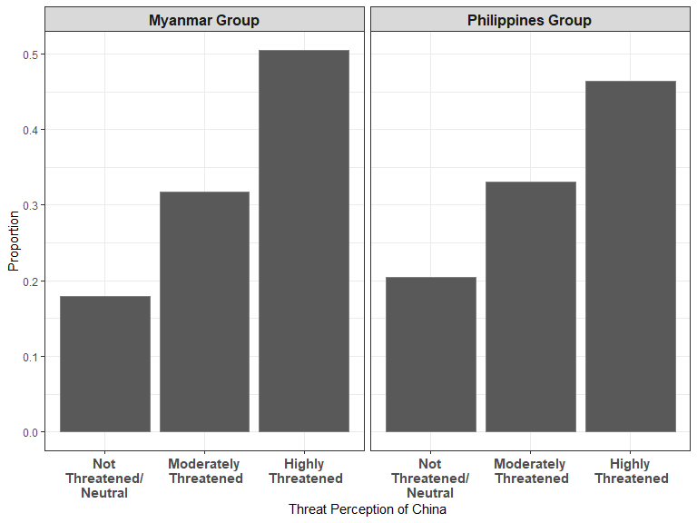

Analysis 1: Descriptive Statistics
================
Gento Kato
November 17, 2019

-   [Preparation](#preparation)
-   [Variable Descriptions](#variable-descriptions)
    -   [Original Treatment Ns (for Table 1)](#original-treatment-ns-for-table-1)
    -   [Ns After NAs are dropped (for Table 1)](#ns-after-nas-are-dropped-for-table-1)
    -   [Outcome Variable Distribution (Figure 2)](#outcome-variable-distribution-figure-2)
    -   [Selected Pre-treatment Covariates Distributions (Extra)](#selected-pre-treatment-covariates-distributions-extra)
    -   [Moderator (China Threat) Distributions (Figure 6)](#moderator-china-threat-distributions-figure-6)
-   [Mediator Distributions (Figure 4)](#mediator-distributions-figure-4)
-   [Relationship b/w Mediator and Outcome (Extra)](#relationship-bw-mediator-and-outcome-extra)
-   [Covariate Balance Between Treatment Groups (Appendix I)](#covariate-balance-between-treatment-groups-appendix-i)

Preparation
===========

``` r
## Clear Workspace
rm(list = ls())

## Set Working Directory (Automatically) ##
require(rprojroot); require(rstudioapi)
if (rstudioapi::isAvailable()==TRUE) {
  setwd(dirname(rstudioapi::getActiveDocumentContext()$path)); 
} 
projdir <- find_root(has_file("thisishome.txt"))
#cat(paste("Working Directory Set to:\n",projdir))
setwd(projdir)

## Required Functions & Packages
source("src/analysis0_functions.R")

## Load Data
do <- readRDS("data/donorexp.rds")
d <- do[do$comply==1,] # only compliers

## Subset Data
# MMR
d.MMR <- d[d$treatment %in% c(1,2),]
d.MMR$threat <- d.MMR$threat.MMR
d.MMR$imp <- d.MMR$imp.MMR
d.MMR$potential <- d.MMR$potential.MMR
d.MMR$out <- d.MMR$cancel_aid
# PHL
d.PHL <- d[d$treatment %in% c(3,5),]
d.PHL$threat <- d.PHL$threat.PHL
d.PHL$imp <- d.PHL$imp.PHL
d.PHL$potential <- d.PHL$potential.PHL
d.PHL$out <- d.PHL$cancel_aid

# Drop Cases with Missing Values in Relevant Variables
vars <- c("out","treat_China","threat","imp","potential",  
          "issint","odaimp","fem","age","ide3","cancel_aid",
          "med_econ","med_secu","med_repu","med_effi")
d.MMR.sub <- na.omit(d.MMR[,vars])
d.PHL.sub <- na.omit(d.PHL[,vars])
```

Variable Descriptions
=====================

Original Treatment Ns (for Table 1)
-----------------------------------

``` r
table(do$treatment)
```

    ## 
    ##    1    2    3    5 
    ## 1078 1059 1048 1137

Ns After NAs are dropped (for Table 1)
--------------------------------------

``` r
table(d.MMR.sub$treat_China) # Myanmar Cases
```

    ## 
    ##   0   1 
    ## 796 769

``` r
table(d.PHL.sub$treat_China) # Philippines Cases
```

    ## 
    ##   0   1 
    ## 846 768

Outcome Variable Distribution (Figure 2)
----------------------------------------

``` r
pd <- data.frame(c = as.factor(rep(c("Myanmar","Philippines"),each=9)),
                 x = as.factor(rep(seq(1,9,1),2)),
                 y = c(table(d.MMR.sub$cancel_aid)/sum(table(d.MMR.sub$cancel_aid)),
                       table(d.PHL.sub$cancel_aid)/sum(table(d.MMR.sub$cancel_aid))))

p <- ggplot(pd, aes(x=x,y=y)) + geom_col() + 
  facet_grid(.~c) + theme_bw() + 
  xlab("Support for Cancelling Aid \n(1=Strongly Oppose, 9=Strongly Favor)") + 
  ylab("Proportion") + theme(strip.text = element_text(size=12,face="bold"))
```

``` r
p
```


``` r
png_save(p, h=400, file="out/outdist.png")
```

Selected Pre-treatment Covariates Distributions (Extra)
-------------------------------------------------------

``` r
pd <- data.frame(c = as.factor(rep(c("Myanmar","Philippines"),each=9)),
                 t = factor(rep(rep(c("Threatening",
                                      "Important",
                                      "Have Potential"),each=3),2),
                            levels=c("Threatening",
                                     "Important",
                                     "Have Potential")),
                 x = factor(rep(c("No","Neither","Yes"),6),
                            levels=c("No","Neither","Yes")),
                 y = c(table(d.MMR.sub$threat)/sum(table(d.MMR.sub$threat)),
                       table(d.MMR.sub$imp)/sum(table(d.MMR.sub$imp)),
                       table(d.MMR.sub$potential)/sum(table(d.MMR.sub$potential)),
                       table(d.PHL.sub$threat)/sum(table(d.PHL.sub$threat)),
                       table(d.PHL.sub$imp)/sum(table(d.PHL.sub$imp)),
                       table(d.PHL.sub$potential)/sum(table(d.PHL.sub$potential)))
                 )

p <- ggplot(pd, aes(x=x,y=y)) + 
  geom_col(aes(fill=c), position = position_dodge(width=1), color="gray50") + 
  facet_grid(.~t) + theme_bw() + 
  scale_fill_brewer(name="Country", type= "qual", palette = 3) +
  xlab("The Perception of Recipient Countries") + 
  ylab("Proportion") + theme(strip.text = element_text(size=12,face="bold"),
                             axis.text.x = element_text(size=11,face="bold"))
```

``` r
p
```


``` r
png_save(p,h=500,file="out/perrecip.png")
```

Moderator (China Threat) Distributions (Figure 6)
-------------------------------------------------

``` r
# Drop Cases with Missing Values in Relevant Variables
vars <- c("out","treat_China","threat","imp","potential",  
          "issint","odaimp","fem","age","ide3","cancel_aid",
          "med_econ","med_secu","med_repu","med_effi","threat.CHN.3cat")
d.MMR.sub.mod <- na.omit(d.MMR[,vars])
d.PHL.sub.mod <- na.omit(d.PHL[,vars])

pd <- data.frame(c = as.factor(rep(c("Myanmar Group","Philippines Group"),each=3)),
                 x = factor(rep(rep(c("Not\nThreatened/\nNeutral",
                                      "Moderately\n Threatened",
                                      "Highly\n Threatened"),each=1),2),
                            levels=c("Not\nThreatened/\nNeutral",
                                     "Moderately\n Threatened",
                                     "Highly\n Threatened")),
                 y = c(table(d.MMR.sub.mod$threat.CHN.3cat)/sum(table(d.MMR.sub.mod$threat.CHN.3cat)),
                       table(d.PHL.sub.mod$threat.CHN.3cat)/sum(table(d.PHL.sub.mod$threat.CHN.3cat)))
)

pd
```

    ##                   c                         x         y
    ## 1     Myanmar Group Not\nThreatened/\nNeutral 0.1789137
    ## 2     Myanmar Group   Moderately\n Threatened 0.3169329
    ## 3     Myanmar Group       Highly\n Threatened 0.5041534
    ## 4 Philippines Group Not\nThreatened/\nNeutral 0.2050805
    ## 5 Philippines Group   Moderately\n Threatened 0.3308550
    ## 6 Philippines Group       Highly\n Threatened 0.4640644

``` r
p <- ggplot(pd, aes(x=x,y=y)) + 
  geom_col(color="gray50") + 
  facet_grid(.~c) + theme_bw() + 
  scale_fill_brewer(name="Country", type= "qual", palette = 3) +
  xlab("Threat Perception of China") + 
  ylab("Proportion") + theme(strip.text = element_text(size=12,face="bold"),
                             axis.text.x = element_text(size=11,face="bold"))
```

``` r
p
```



``` r
png_save(p,h=500,file="out/threatCHN.png")
```

Mediator Distributions (Figure 4)
=================================

``` r
td <- data.frame(c = factor(c(rep("Myanmar",nrow(d.MMR.sub)*4),
                              rep("Philippines",nrow(d.PHL.sub)*4)),
                            levels=c("Myanmar","Philippines")),
                 out = c(rep(as.numeric(d.MMR.sub$out),4),
                         rep(as.numeric(d.PHL.sub$out),4)),
                 medname = factor(c(rep(c("Economy","Security","Reputation","Efficacy"), 
                                        each=nrow(d.MMR.sub)),
                                    rep(c("Economy","Security","Reputation","Efficacy"), 
                                        each=nrow(d.PHL.sub))),
                                  levels=c("Security","Economy","Reputation","Efficacy")),
                 medval = factor(c(d.MMR.sub$med_econ,
                                   d.MMR.sub$med_secu,
                                   d.MMR.sub$med_repu,
                                   d.MMR.sub$med_effi,
                                   d.PHL.sub$med_econ,
                                   d.PHL.sub$med_secu,
                                   d.PHL.sub$med_repu,
                                   d.PHL.sub$med_effi)))

p <- ggplot(td, aes(medval)) + geom_bar(aes(y=..prop.., group=1)) + 
  facet_grid(c~medname) + theme_bw() + 
  ylab("Proportion") + 
  xlab("Perceived Influence of Cancelling Aid on Given Interests\n(1=Positive; 3=Neutral; 5=Negative)") + 
  theme(axis.text.x = element_text(face="bold"),
        strip.text = element_text(face="bold",size=11))
```

``` r
p
```


``` r
png_save(p,h=500,file="out/meddist.png")
```

Relationship b/w Mediator and Outcome (Extra)
=============================================

``` r
td <- data.frame(c = factor(c(rep("Myanmar",nrow(d.MMR.sub)*4),
                              rep("Philippines",nrow(d.PHL.sub)*4)),
                            levels=c("Myanmar","Philippines")),
                 out = c(rep(as.numeric(d.MMR.sub$out),4),
                         rep(as.numeric(d.PHL.sub$out),4)),
                 medname = factor(c(rep(c("Economy","Security","Reputation","Efficacy"), 
                                        each=nrow(d.MMR.sub)),
                                    rep(c("Economy","Security","Reputation","Efficacy"), 
                                        each=nrow(d.PHL.sub))),
                                  levels=c("Security","Economy","Reputation","Efficacy")),
                 medval = factor(
                   c(ifelse(d.MMR.sub$med_econ%in%c(4,5),"Negative","Neutral/\nPositive"),
                     ifelse(d.MMR.sub$med_secu%in%c(4,5),"Negative","Neutral/\nPositive"),
                     ifelse(d.MMR.sub$med_repu%in%c(4,5),"Negative","Neutral/\nPositive"),
                     ifelse(d.MMR.sub$med_effi%in%c(4,5),"Negative","Neutral/\nPositive"),
                     ifelse(d.PHL.sub$med_econ%in%c(4,5),"Negative","Neutral/\nPositive"),
                     ifelse(d.PHL.sub$med_secu%in%c(4,5),"Negative","Neutral/\nPositive"),
                     ifelse(d.PHL.sub$med_repu%in%c(4,5),"Negative","Neutral/\nPositive"),
                     ifelse(d.PHL.sub$med_effi%in%c(4,5),"Negative","Neutral/\nPositive")),
                   levels = c("Neutral/\nPositive","Negative"))
)

p <- ggboxplot(td, x = "medval", y = "out",
               facet.by = c("c","medname")) + theme_bw() + 
  stat_compare_means(method="t.test",label="p.signif",
                     symnum.args = list(cutpoints = c(0, 0.001, 0.01, 0.05, 1), 
                                        symbols = c("p < .001", "p < .01", "p < .05", "p >= .1"))) + 
  ylab("Support for Cancelling Aid") + 
  xlab("Perceived Influence of Cancelling Aid on Given Interests") + 
  theme(axis.text.x = element_text(face="bold"))
```

``` r
p
```


``` r
png_save(p,h=500,file="out/medoutrel.png")
```

Covariate Balance Between Treatment Groups (Appendix I)
=======================================================

``` r
pbal <- checkbal(dtlist =list(d.MMR.sub,d.PHL.sub),
                  dtnames = c("Myanmar","Philippines"))
```

``` r
pbal
```

    ## Warning: position_dodge requires non-overlapping x intervals

    ## Warning: position_dodge requires non-overlapping x intervals

    ## Warning: Removed 40 rows containing missing values (geom_errorbar).

    ## Warning: Removed 1 rows containing missing values (geom_hline).


``` r
png_save(pbal, w=850, h=650, file=c("out/balance_ALL.png"))
```
