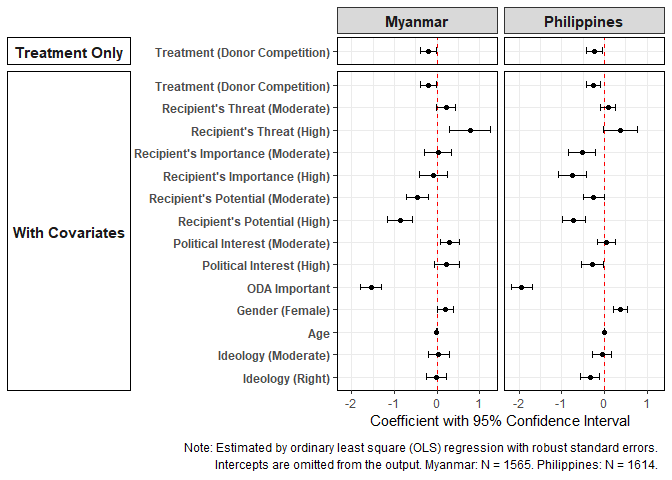
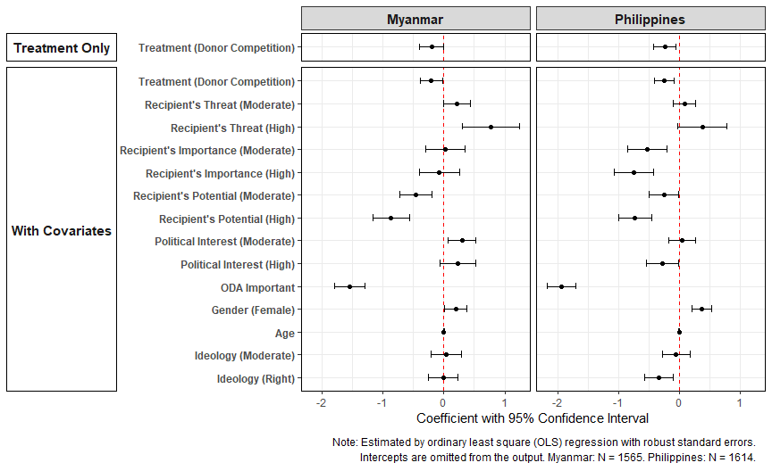
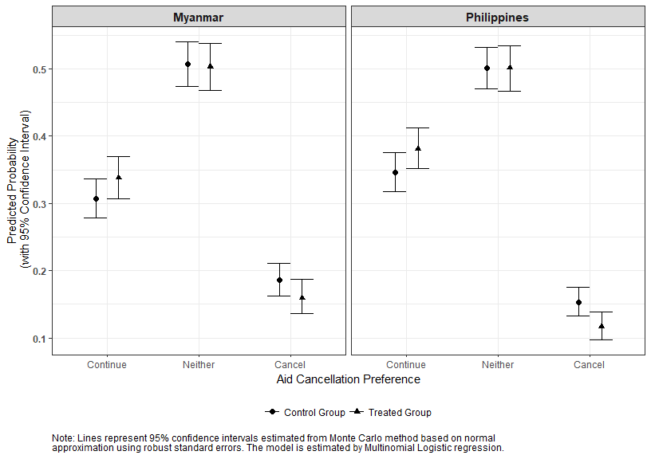

Analysis 2: Average Treatment Effect
================
Gento Kato
November 17, 2019

-   [Preparation](#preparation)
-   [Average Treatment Effect](#average-treatment-effect)
    -   [Simple OLS](#simple-ols)
        -   [Regression Table (Appendix III)](#regression-table-appendix-iii)
        -   [Coefficient Plot without Intercept (Figure 3)](#coefficient-plot-without-intercept-figure-3)
    -   [Multinomial Logit (Appendix II)](#multinomial-logit-appendix-ii)
        -   [Regression Table](#regression-table)
        -   [Table with Only ATE](#table-with-only-ate)
        -   [Simulation of Predicted Probability](#simulation-of-predicted-probability)
        -   [Plot of Predicted Probabilities (Appendix II)](#plot-of-predicted-probabilities-appendix-ii)

Preparation
===========

``` r
## Clear Workspace
rm(list = ls())

## Set Working Directory (Automatically) ##
require(rprojroot); require(rstudioapi)
if (rstudioapi::isAvailable()==TRUE) {
  setwd(dirname(rstudioapi::getActiveDocumentContext()$path)); 
} 
projdir <- find_root(has_file("thisishome.txt"))
#cat(paste("Working Directory Set to:\n",projdir))
setwd(projdir)

## Required Functions & Packages
source("src/analysis0_functions.R")
source("src/cl.mlogit.R")

## Load Data
do <- readRDS("data/donorexp.rds")
d <- do[do$comply==1,] # only compliers

## Subset Data
# MMR
d.MMR <- d[d$treatment %in% c(1,2),]
d.MMR$threat <- d.MMR$threat.MMR
d.MMR$imp <- d.MMR$imp.MMR
d.MMR$potential <- d.MMR$potential.MMR
# PHL
d.PHL <- d[d$treatment %in% c(3,5),]
d.PHL$threat <- d.PHL$threat.PHL
d.PHL$imp <- d.PHL$imp.PHL
d.PHL$potential <- d.PHL$potential.PHL
```

Average Treatment Effect
========================

Simple OLS
----------

``` r
# Define Outcome Variable and Drop Missing Values
d.MMR$out <- d.MMR$cancel_aid
d.PHL$out <- d.PHL$cancel_aid
vars <- c("out","cancel_aid",
          "treat_China",
          "threat","imp","potential",  
          "issint","odaimp","fem","age","ide3",
          "med_econ","med_secu","med_repu","med_effi")
d.MMR.sub <- na.omit(d.MMR[,vars])
d.PHL.sub <- na.omit(d.PHL[,vars])

# Analysis
m0.MMR <- lm(as.numeric(out)~treat_China, data = d.MMR.sub)
m1.MMR <- lm(update(as.numeric(out)~treat_China,fcv), data = d.MMR.sub)
m0.PHL <- lm(as.numeric(out)~treat_China, data = d.PHL.sub)
m1.PHL <- lm(update(as.numeric(out)~treat_China,fcv), data = d.PHL.sub)
```

### Regression Table (Appendix III)

``` r
# Export Table
table_coef(list(m0.MMR,m1.MMR,m0.PHL,m1.PHL), 
           vcov.est = "robust", # Stata HC1 Robust SE
           m.names = rep(c("Myanmar","Philippines"), each=2),
           custom.variable.names = basevn,
           single.row=FALSE,
           caption = "Table 2: Treatment Effect on the Support for Cancelling Aid",
           custom.footnote = "Estimated by ordinary least square (OLS) regression. HC1 robust standard errors in parentheses.",
           format="doc", file.name="out/olsres")
adjpval("out/olsres.doc")
```

<!DOCTYPE HTML PUBLIC "-//W3C//DTD HTML 4.01 Transitional//EN" "http://www.w3.org/TR/html4/loose.dtd">
<html>
<body>
<table cellspacing="0" align="center" style="border: none;">
<caption align="top" style="margin-bottom:0.3em;">
Table 2: Treatment Effect on the Support for Cancelling Aid
</caption>
<tr>
<th style="text-align: left; border-top: 2px solid black; border-bottom: 1px solid black; padding-right: 12px;">
<b></b>
</th>
<th style="text-align: left; border-top: 2px solid black; border-bottom: 1px solid black; padding-right: 12px;">
<b>Myanmar</b>
</th>
<th style="text-align: left; border-top: 2px solid black; border-bottom: 1px solid black; padding-right: 12px;">
<b>Myanmar</b>
</th>
<th style="text-align: left; border-top: 2px solid black; border-bottom: 1px solid black; padding-right: 12px;">
<b>Philippines</b>
</th>
<th style="text-align: left; border-top: 2px solid black; border-bottom: 1px solid black; padding-right: 12px;">
<b>Philippines</b>
</th>
</tr>
<tr>
<td style="padding-right: 12px; border: none;">
(Intercept)
</td>
<td style="padding-right: 12px; border: none;">
4.657<sup style="vertical-align: 0px;">\*\*</sup>
</td>
<td style="padding-right: 12px; border: none;">
6.153<sup style="vertical-align: 0px;">\*\*</sup>
</td>
<td style="padding-right: 12px; border: none;">
4.411<sup style="vertical-align: 0px;">\*\*</sup>
</td>
<td style="padding-right: 12px; border: none;">
6.964<sup style="vertical-align: 0px;">\*\*</sup>
</td>
</tr>
<tr>
<td style="padding-right: 12px; border: none;">
</td>
<td style="padding-right: 12px; border: none;">
(0.072)
</td>
<td style="padding-right: 12px; border: none;">
(0.264)
</td>
<td style="padding-right: 12px; border: none;">
(0.069)
</td>
<td style="padding-right: 12px; border: none;">
(0.262)
</td>
</tr>
<tr>
<td style="padding-right: 12px; border: none;">
Treatment (Donor Competition)
</td>
<td style="padding-right: 12px; border: none;">
-0.202<sup style="vertical-align: 0px;">\*</sup>
</td>
<td style="padding-right: 12px; border: none;">
-0.206<sup style="vertical-align: 0px;">\*</sup>
</td>
<td style="padding-right: 12px; border: none;">
-0.239<sup style="vertical-align: 0px;">\*</sup>
</td>
<td style="padding-right: 12px; border: none;">
-0.253<sup style="vertical-align: 0px;">\*\*</sup>
</td>
</tr>
<tr>
<td style="padding-right: 12px; border: none;">
</td>
<td style="padding-right: 12px; border: none;">
(0.100)
</td>
<td style="padding-right: 12px; border: none;">
(0.093)
</td>
<td style="padding-right: 12px; border: none;">
(0.097)
</td>
<td style="padding-right: 12px; border: none;">
(0.083)
</td>
</tr>
<tr>
<td style="padding-right: 12px; border: none;">
Recipient's Threat (Moderate)
</td>
<td style="padding-right: 12px; border: none;">
</td>
<td style="padding-right: 12px; border: none;">
0.212<sup style="vertical-align: 0px;"><U+0086></sup>
</td>
<td style="padding-right: 12px; border: none;">
</td>
<td style="padding-right: 12px; border: none;">
0.085
</td>
</tr>
<tr>
<td style="padding-right: 12px; border: none;">
</td>
<td style="padding-right: 12px; border: none;">
</td>
<td style="padding-right: 12px; border: none;">
(0.111)
</td>
<td style="padding-right: 12px; border: none;">
</td>
<td style="padding-right: 12px; border: none;">
(0.092)
</td>
</tr>
<tr>
<td style="padding-right: 12px; border: none;">
Recipient's Threat (High)
</td>
<td style="padding-right: 12px; border: none;">
</td>
<td style="padding-right: 12px; border: none;">
0.774<sup style="vertical-align: 0px;">\*\*</sup>
</td>
<td style="padding-right: 12px; border: none;">
</td>
<td style="padding-right: 12px; border: none;">
0.379<sup style="vertical-align: 0px;"><U+0086></sup>
</td>
</tr>
<tr>
<td style="padding-right: 12px; border: none;">
</td>
<td style="padding-right: 12px; border: none;">
</td>
<td style="padding-right: 12px; border: none;">
(0.240)
</td>
<td style="padding-right: 12px; border: none;">
</td>
<td style="padding-right: 12px; border: none;">
(0.204)
</td>
</tr>
<tr>
<td style="padding-right: 12px; border: none;">
Recipient's Importance (Moderate)
</td>
<td style="padding-right: 12px; border: none;">
</td>
<td style="padding-right: 12px; border: none;">
0.024
</td>
<td style="padding-right: 12px; border: none;">
</td>
<td style="padding-right: 12px; border: none;">
-0.525<sup style="vertical-align: 0px;">\*\*</sup>
</td>
</tr>
<tr>
<td style="padding-right: 12px; border: none;">
</td>
<td style="padding-right: 12px; border: none;">
</td>
<td style="padding-right: 12px; border: none;">
(0.165)
</td>
<td style="padding-right: 12px; border: none;">
</td>
<td style="padding-right: 12px; border: none;">
(0.165)
</td>
</tr>
<tr>
<td style="padding-right: 12px; border: none;">
Recipient's Importance (High)
</td>
<td style="padding-right: 12px; border: none;">
</td>
<td style="padding-right: 12px; border: none;">
-0.076
</td>
<td style="padding-right: 12px; border: none;">
</td>
<td style="padding-right: 12px; border: none;">
-0.745<sup style="vertical-align: 0px;">\*\*</sup>
</td>
</tr>
<tr>
<td style="padding-right: 12px; border: none;">
</td>
<td style="padding-right: 12px; border: none;">
</td>
<td style="padding-right: 12px; border: none;">
(0.169)
</td>
<td style="padding-right: 12px; border: none;">
</td>
<td style="padding-right: 12px; border: none;">
(0.166)
</td>
</tr>
<tr>
<td style="padding-right: 12px; border: none;">
Recipient's Potential (Moderate)
</td>
<td style="padding-right: 12px; border: none;">
</td>
<td style="padding-right: 12px; border: none;">
-0.461<sup style="vertical-align: 0px;">\*\*</sup>
</td>
<td style="padding-right: 12px; border: none;">
</td>
<td style="padding-right: 12px; border: none;">
-0.251<sup style="vertical-align: 0px;">\*</sup>
</td>
</tr>
<tr>
<td style="padding-right: 12px; border: none;">
</td>
<td style="padding-right: 12px; border: none;">
</td>
<td style="padding-right: 12px; border: none;">
(0.135)
</td>
<td style="padding-right: 12px; border: none;">
</td>
<td style="padding-right: 12px; border: none;">
(0.123)
</td>
</tr>
<tr>
<td style="padding-right: 12px; border: none;">
Recipient's Potential (High)
</td>
<td style="padding-right: 12px; border: none;">
</td>
<td style="padding-right: 12px; border: none;">
-0.871<sup style="vertical-align: 0px;">\*\*</sup>
</td>
<td style="padding-right: 12px; border: none;">
</td>
<td style="padding-right: 12px; border: none;">
-0.725<sup style="vertical-align: 0px;">\*\*</sup>
</td>
</tr>
<tr>
<td style="padding-right: 12px; border: none;">
</td>
<td style="padding-right: 12px; border: none;">
</td>
<td style="padding-right: 12px; border: none;">
(0.153)
</td>
<td style="padding-right: 12px; border: none;">
</td>
<td style="padding-right: 12px; border: none;">
(0.139)
</td>
</tr>
<tr>
<td style="padding-right: 12px; border: none;">
Political Interest (Moderate)
</td>
<td style="padding-right: 12px; border: none;">
</td>
<td style="padding-right: 12px; border: none;">
0.297<sup style="vertical-align: 0px;">\*\*</sup>
</td>
<td style="padding-right: 12px; border: none;">
</td>
<td style="padding-right: 12px; border: none;">
0.044
</td>
</tr>
<tr>
<td style="padding-right: 12px; border: none;">
</td>
<td style="padding-right: 12px; border: none;">
</td>
<td style="padding-right: 12px; border: none;">
(0.115)
</td>
<td style="padding-right: 12px; border: none;">
</td>
<td style="padding-right: 12px; border: none;">
(0.111)
</td>
</tr>
<tr>
<td style="padding-right: 12px; border: none;">
Political Interest (High)
</td>
<td style="padding-right: 12px; border: none;">
</td>
<td style="padding-right: 12px; border: none;">
0.225
</td>
<td style="padding-right: 12px; border: none;">
</td>
<td style="padding-right: 12px; border: none;">
-0.278<sup style="vertical-align: 0px;">\*</sup>
</td>
</tr>
<tr>
<td style="padding-right: 12px; border: none;">
</td>
<td style="padding-right: 12px; border: none;">
</td>
<td style="padding-right: 12px; border: none;">
(0.148)
</td>
<td style="padding-right: 12px; border: none;">
</td>
<td style="padding-right: 12px; border: none;">
(0.136)
</td>
</tr>
<tr>
<td style="padding-right: 12px; border: none;">
ODA Important
</td>
<td style="padding-right: 12px; border: none;">
</td>
<td style="padding-right: 12px; border: none;">
-1.552<sup style="vertical-align: 0px;">\*\*</sup>
</td>
<td style="padding-right: 12px; border: none;">
</td>
<td style="padding-right: 12px; border: none;">
-1.938<sup style="vertical-align: 0px;">\*\*</sup>
</td>
</tr>
<tr>
<td style="padding-right: 12px; border: none;">
</td>
<td style="padding-right: 12px; border: none;">
</td>
<td style="padding-right: 12px; border: none;">
(0.129)
</td>
<td style="padding-right: 12px; border: none;">
</td>
<td style="padding-right: 12px; border: none;">
(0.121)
</td>
</tr>
<tr>
<td style="padding-right: 12px; border: none;">
Gender (Female)
</td>
<td style="padding-right: 12px; border: none;">
</td>
<td style="padding-right: 12px; border: none;">
0.192<sup style="vertical-align: 0px;">\*</sup>
</td>
<td style="padding-right: 12px; border: none;">
</td>
<td style="padding-right: 12px; border: none;">
0.367<sup style="vertical-align: 0px;">\*\*</sup>
</td>
</tr>
<tr>
<td style="padding-right: 12px; border: none;">
</td>
<td style="padding-right: 12px; border: none;">
</td>
<td style="padding-right: 12px; border: none;">
(0.095)
</td>
<td style="padding-right: 12px; border: none;">
</td>
<td style="padding-right: 12px; border: none;">
(0.084)
</td>
</tr>
<tr>
<td style="padding-right: 12px; border: none;">
Age
</td>
<td style="padding-right: 12px; border: none;">
</td>
<td style="padding-right: 12px; border: none;">
-0.002
</td>
<td style="padding-right: 12px; border: none;">
</td>
<td style="padding-right: 12px; border: none;">
-0.000
</td>
</tr>
<tr>
<td style="padding-right: 12px; border: none;">
</td>
<td style="padding-right: 12px; border: none;">
</td>
<td style="padding-right: 12px; border: none;">
(0.004)
</td>
<td style="padding-right: 12px; border: none;">
</td>
<td style="padding-right: 12px; border: none;">
(0.003)
</td>
</tr>
<tr>
<td style="padding-right: 12px; border: none;">
Ideology (Moderate)
</td>
<td style="padding-right: 12px; border: none;">
</td>
<td style="padding-right: 12px; border: none;">
0.043
</td>
<td style="padding-right: 12px; border: none;">
</td>
<td style="padding-right: 12px; border: none;">
-0.050
</td>
</tr>
<tr>
<td style="padding-right: 12px; border: none;">
</td>
<td style="padding-right: 12px; border: none;">
</td>
<td style="padding-right: 12px; border: none;">
(0.127)
</td>
<td style="padding-right: 12px; border: none;">
</td>
<td style="padding-right: 12px; border: none;">
(0.115)
</td>
</tr>
<tr>
<td style="padding-right: 12px; border: none;">
Ideology (Right)
</td>
<td style="padding-right: 12px; border: none;">
</td>
<td style="padding-right: 12px; border: none;">
-0.012
</td>
<td style="padding-right: 12px; border: none;">
</td>
<td style="padding-right: 12px; border: none;">
-0.335<sup style="vertical-align: 0px;">\*\*</sup>
</td>
</tr>
<tr>
<td style="padding-right: 12px; border: none;">
</td>
<td style="padding-right: 12px; border: none;">
</td>
<td style="padding-right: 12px; border: none;">
(0.123)
</td>
<td style="padding-right: 12px; border: none;">
</td>
<td style="padding-right: 12px; border: none;">
(0.117)
</td>
</tr>
<tr>
<td style="border-top: 1px solid black;">
R<sup style="vertical-align: 0px;">2</sup>
</td>
<td style="border-top: 1px solid black;">
0.003
</td>
<td style="border-top: 1px solid black;">
0.145
</td>
<td style="border-top: 1px solid black;">
0.004
</td>
<td style="border-top: 1px solid black;">
0.272
</td>
</tr>
<tr>
<td style="padding-right: 12px; border: none;">
Adj. R<sup style="vertical-align: 0px;">2</sup>
</td>
<td style="padding-right: 12px; border: none;">
0.002
</td>
<td style="padding-right: 12px; border: none;">
0.137
</td>
<td style="padding-right: 12px; border: none;">
0.003
</td>
<td style="padding-right: 12px; border: none;">
0.266
</td>
</tr>
<tr>
<td style="padding-right: 12px; border: none;">
Num. obs.
</td>
<td style="padding-right: 12px; border: none;">
1565
</td>
<td style="padding-right: 12px; border: none;">
1565
</td>
<td style="padding-right: 12px; border: none;">
1614
</td>
<td style="padding-right: 12px; border: none;">
1614
</td>
</tr>
<tr>
<td style="border-bottom: 2px solid black;">
RMSE
</td>
<td style="border-bottom: 2px solid black;">
1.989
</td>
<td style="border-bottom: 2px solid black;">
1.849
</td>
<td style="border-bottom: 2px solid black;">
1.943
</td>
<td style="border-bottom: 2px solid black;">
1.667
</td>
</tr>
<tr>
<td style="padding-right: 12px; border: none;" colspan="6">
<span style="font-size:0.8em"><sup style="vertical-align: 0px;">\*\*</sup>p &lt; 0.01, <sup style="vertical-align: 0px;">\*</sup>p &lt; 0.05, <sup style="vertical-align: 0px;"><U+0086></sup>p &lt; 0.1 <br> Estimated by ordinary least square (OLS) regression. HC1 robust standard errors in parentheses.</span>
</td>
</tr>
</table>
</body>
</html>
### Coefficient Plot without Intercept (Figure 3)

``` r
ftset <- paste0("Note: Estimated by ordinary least square (OLS) regression with robust standard errors.",
                "\nIntercepts are omitted from the output.",
                " Myanmar: N = ", nobs(m1.MMR), ". Philippines: N = ", nobs(m1.PHL), ".")

tmp0a <- matrix_coefci(m0.MMR, vcov.est="robust")
tmp0a$mod <- "Treatment Only"
tmp0a$country <- "Myanmar"
tmp1a <- matrix_coefci(m1.MMR, vcov.est="robust")
tmp1a$mod <- "With Covariates"
tmp1a$country <- "Myanmar"
tmp0b <- matrix_coefci(m0.PHL, vcov.est="robust")
tmp0b$mod <- "Treatment Only"
tmp0b$country <- "Philippines"
tmp1b <- matrix_coefci(m1.PHL, vcov.est="robust")
tmp1b$mod <- "With Covariates"
tmp1b$country <- "Philippines"
tmp <- rbind(tmp0a,tmp1a,tmp0b,tmp1b)
tmp$mod <- factor(tmp$mod, levels=unique(tmp$mod))
tmp$country <- factor(tmp$country, levels=unique(tmp$country))
tmp$vn <- factor(c(basevn[1:2],basevn,basevn[1:2],basevn),
                 levels=rev(basevn))
tmp <- tmp[tmp$vn!="(Intercept)",]

p <- ggplot(tmp, aes(x=vn, y=CF, ymin=lowerCI, ymax=upperCI)) + 
  geom_hline(aes(yintercept=0), linetype=2, color="red1") + 
  geom_point() + 
  geom_errorbar(width=0.3) + 
  facet_grid(mod~country, scales="free_y", space="free_y", switch = "y") + 
  coord_flip() + 
  ylab("Coefficient with 95% Confidence Interval") + xlab(NULL) +
  #labs(caption=ftset) + 
  theme_bw() + 
  theme(legend.position="bottom", 
        legend.title = element_blank(),
        axis.text.y = element_text(face="bold"),
        strip.text.x = element_text(face="bold", size=11),
        strip.text.y = element_text(face="bold", size=11, angle=180),
        strip.background.y = element_rect(color="black",fill=NA),
        strip.placement = "outside",
        panel.border = element_rect(color="black"),
        plot.caption = element_text(hjust=-1))
p <- plot_footnote(p, ftset, fontsize=9, bottom.expand.rate=7, align="right",
              distance.from.side = 0.02)
```



``` r
grid.draw(p)
```



``` r
png_save(p,w=900,h=550,file="out/olsplot.png")
```

Multinomial Logit (Appendix II)
-------------------------------

``` r
# Define Outcome Variable and Drop Missing Values
d.MMR$out <- d.MMR$cancel_aid_3cat
d.PHL$out <- d.PHL$cancel_aid_3cat
vars <- c("out","treat_China","id",
          "threat","imp","potential",  
          "issint","odaimp","fem","age","ide3",
          "med_econ","med_secu","med_repu","med_effi")
d.MMR.sub <- na.omit(d.MMR[,vars])
d.PHL.sub <- na.omit(d.PHL[,vars])

# Transform to "mlogit" style dagta
d.MMR.sub.mlogit <- mlogit.data(d.MMR.sub,shape="wide",
                                choice="out",
                                id.var="id")
d.PHL.sub.mlogit <- mlogit.data(d.PHL.sub,shape="wide",
                                choice="out",
                                id.var="id")

# Run Multinomial Logit
m0.MMR <- mlogit(out ~ 1 | treat_China, 
             data = d.MMR.sub.mlogit, reflevel="1")
m1.MMR <- mlogit(update(mFormula(out ~ 1 | treat_China), fcvml), 
             data = d.MMR.sub.mlogit, reflevel="1")
m0.PHL <- mlogit(out ~ 1 | treat_China, 
                 data = d.PHL.sub.mlogit, reflevel="1")
m1.PHL <- mlogit(update(mFormula(out ~ 1 | treat_China), fcvml), 
                 data = d.PHL.sub.mlogit, reflevel="1")
```

### Regression Table

``` r
# Variable Names
basevn.mlogit <- paste(c("Neither:","Cancel:"), rep(basevn,each=2))
```

``` r
table_coef(list(m0.MMR,m1.MMR,m0.PHL,m1.PHL), 
           vcov.est = list(cl.mlogit.vcov(m0.MMR,d.MMR.sub$id),
                           cl.mlogit.vcov(m1.MMR,d.MMR.sub$id),
                           cl.mlogit.vcov(m0.PHL,d.PHL.sub$id),
                           cl.mlogit.vcov(m1.PHL,d.PHL.sub$id)), 
           m.names = rep(c("Myanmar","Philippines"), each=2),
           custom.variable.names = basevn.mlogit,
           single.row=TRUE,
           caption = "Treatment Effect on the Support for Cancelling Aid",
           custom.footnote = "Estimated by multinomial logit. Robust standard errors in parentheses.",
           format="doc", file.name="out/mlogitres", show.table=TRUE)
adjpval("out/mlogitres.doc")
```

<!DOCTYPE HTML PUBLIC "-//W3C//DTD HTML 4.01 Transitional//EN" "http://www.w3.org/TR/html4/loose.dtd">
<html>
<body>
<table cellspacing="0" align="center" style="border: none;">
<caption align="top" style="margin-bottom:0.3em;">
Treatment Effect on the Support for Cancelling Aid
</caption>
<tr>
<th style="text-align: left; border-top: 2px solid black; border-bottom: 1px solid black; padding-right: 12px;">
<b></b>
</th>
<th style="text-align: left; border-top: 2px solid black; border-bottom: 1px solid black; padding-right: 12px;">
<b>Myanmar</b>
</th>
<th style="text-align: left; border-top: 2px solid black; border-bottom: 1px solid black; padding-right: 12px;">
<b>Myanmar</b>
</th>
<th style="text-align: left; border-top: 2px solid black; border-bottom: 1px solid black; padding-right: 12px;">
<b>Philippines</b>
</th>
<th style="text-align: left; border-top: 2px solid black; border-bottom: 1px solid black; padding-right: 12px;">
<b>Philippines</b>
</th>
</tr>
<tr>
<td style="padding-right: 12px; border: none;">
Neither: (Intercept)
</td>
<td style="padding-right: 12px; border: none;">
0.496 (0.081)<sup style="vertical-align: 0px;">\*\*</sup>
</td>
<td style="padding-right: 12px; border: none;">
1.997 (0.389)<sup style="vertical-align: 0px;">\*\*</sup>
</td>
<td style="padding-right: 12px; border: none;">
0.357 (0.076)<sup style="vertical-align: 0px;">\*\*</sup>
</td>
<td style="padding-right: 12px; border: none;">
2.569 (0.434)<sup style="vertical-align: 0px;">\*\*</sup>
</td>
</tr>
<tr>
<td style="padding-right: 12px; border: none;">
Cancel: (Intercept)
</td>
<td style="padding-right: 12px; border: none;">
-0.501 (0.104)<sup style="vertical-align: 0px;">\*\*</sup>
</td>
<td style="padding-right: 12px; border: none;">
1.540 (0.476)<sup style="vertical-align: 0px;">\*\*</sup>
</td>
<td style="padding-right: 12px; border: none;">
-0.831 (0.106)<sup style="vertical-align: 0px;">\*\*</sup>
</td>
<td style="padding-right: 12px; border: none;">
2.974 (0.571)<sup style="vertical-align: 0px;">\*\*</sup>
</td>
</tr>
<tr>
<td style="padding-right: 12px; border: none;">
Neither: Treatment (Donor Competition)
</td>
<td style="padding-right: 12px; border: none;">
-0.079 (0.114)
</td>
<td style="padding-right: 12px; border: none;">
-0.118 (0.119)
</td>
<td style="padding-right: 12px; border: none;">
-0.058 (0.108)
</td>
<td style="padding-right: 12px; border: none;">
-0.137 (0.119)
</td>
</tr>
<tr>
<td style="padding-right: 12px; border: none;">
Cancel: Treatment (Donor Competition)
</td>
<td style="padding-right: 12px; border: none;">
-0.268 (0.152)<sup style="vertical-align: 0px;"><U+0086></sup>
</td>
<td style="padding-right: 12px; border: none;">
-0.292 (0.165)<sup style="vertical-align: 0px;"><U+0086></sup>
</td>
<td style="padding-right: 12px; border: none;">
-0.351 (0.161)<sup style="vertical-align: 0px;">\*</sup>
</td>
<td style="padding-right: 12px; border: none;">
-0.485 (0.188)<sup style="vertical-align: 0px;">\*</sup>
</td>
</tr>
<tr>
<td style="padding-right: 12px; border: none;">
Neither: Recipient's Threat (Moderate)
</td>
<td style="padding-right: 12px; border: none;">
</td>
<td style="padding-right: 12px; border: none;">
0.089 (0.144)
</td>
<td style="padding-right: 12px; border: none;">
</td>
<td style="padding-right: 12px; border: none;">
0.178 (0.138)
</td>
</tr>
<tr>
<td style="padding-right: 12px; border: none;">
Cancel: Recipient's Threat (Moderate)
</td>
<td style="padding-right: 12px; border: none;">
</td>
<td style="padding-right: 12px; border: none;">
0.437 (0.190)<sup style="vertical-align: 0px;">\*</sup>
</td>
<td style="padding-right: 12px; border: none;">
</td>
<td style="padding-right: 12px; border: none;">
0.183 (0.206)
</td>
</tr>
<tr>
<td style="padding-right: 12px; border: none;">
Neither: Recipient's Threat (High)
</td>
<td style="padding-right: 12px; border: none;">
</td>
<td style="padding-right: 12px; border: none;">
0.528 (0.297)<sup style="vertical-align: 0px;"><U+0086></sup>
</td>
<td style="padding-right: 12px; border: none;">
</td>
<td style="padding-right: 12px; border: none;">
0.518 (0.313)<sup style="vertical-align: 0px;"><U+0086></sup>
</td>
</tr>
<tr>
<td style="padding-right: 12px; border: none;">
Cancel: Recipient's Threat (High)
</td>
<td style="padding-right: 12px; border: none;">
</td>
<td style="padding-right: 12px; border: none;">
1.231 (0.340)<sup style="vertical-align: 0px;">\*\*</sup>
</td>
<td style="padding-right: 12px; border: none;">
</td>
<td style="padding-right: 12px; border: none;">
0.567 (0.401)
</td>
</tr>
<tr>
<td style="padding-right: 12px; border: none;">
Neither: Recipient's Importance (Moderate)
</td>
<td style="padding-right: 12px; border: none;">
</td>
<td style="padding-right: 12px; border: none;">
0.170 (0.214)
</td>
<td style="padding-right: 12px; border: none;">
</td>
<td style="padding-right: 12px; border: none;">
-0.476 (0.294)
</td>
</tr>
<tr>
<td style="padding-right: 12px; border: none;">
Cancel: Recipient's Importance (Moderate)
</td>
<td style="padding-right: 12px; border: none;">
</td>
<td style="padding-right: 12px; border: none;">
0.047 (0.270)
</td>
<td style="padding-right: 12px; border: none;">
</td>
<td style="padding-right: 12px; border: none;">
-0.993 (0.349)<sup style="vertical-align: 0px;">\*\*</sup>
</td>
</tr>
<tr>
<td style="padding-right: 12px; border: none;">
Neither: Recipient's Importance (High)
</td>
<td style="padding-right: 12px; border: none;">
</td>
<td style="padding-right: 12px; border: none;">
0.155 (0.215)
</td>
<td style="padding-right: 12px; border: none;">
</td>
<td style="padding-right: 12px; border: none;">
-0.890 (0.293)<sup style="vertical-align: 0px;">\*\*</sup>
</td>
</tr>
<tr>
<td style="padding-right: 12px; border: none;">
Cancel: Recipient's Importance (High)
</td>
<td style="padding-right: 12px; border: none;">
</td>
<td style="padding-right: 12px; border: none;">
-0.178 (0.282)
</td>
<td style="padding-right: 12px; border: none;">
</td>
<td style="padding-right: 12px; border: none;">
-1.473 (0.347)<sup style="vertical-align: 0px;">\*\*</sup>
</td>
</tr>
<tr>
<td style="padding-right: 12px; border: none;">
Neither: Recipient's Potential (Moderate)
</td>
<td style="padding-right: 12px; border: none;">
</td>
<td style="padding-right: 12px; border: none;">
-0.019 (0.184)
</td>
<td style="padding-right: 12px; border: none;">
</td>
<td style="padding-right: 12px; border: none;">
0.062 (0.187)
</td>
</tr>
<tr>
<td style="padding-right: 12px; border: none;">
Cancel: Recipient's Potential (Moderate)
</td>
<td style="padding-right: 12px; border: none;">
</td>
<td style="padding-right: 12px; border: none;">
-0.657 (0.229)<sup style="vertical-align: 0px;">\*\*</sup>
</td>
<td style="padding-right: 12px; border: none;">
</td>
<td style="padding-right: 12px; border: none;">
-0.458 (0.245)<sup style="vertical-align: 0px;"><U+0086></sup>
</td>
</tr>
<tr>
<td style="padding-right: 12px; border: none;">
Neither: Recipient's Potential (High)
</td>
<td style="padding-right: 12px; border: none;">
</td>
<td style="padding-right: 12px; border: none;">
-0.689 (0.198)<sup style="vertical-align: 0px;">\*\*</sup>
</td>
<td style="padding-right: 12px; border: none;">
</td>
<td style="padding-right: 12px; border: none;">
-0.612 (0.195)<sup style="vertical-align: 0px;">\*\*</sup>
</td>
</tr>
<tr>
<td style="padding-right: 12px; border: none;">
Cancel: Recipient's Potential (High)
</td>
<td style="padding-right: 12px; border: none;">
</td>
<td style="padding-right: 12px; border: none;">
-1.188 (0.256)<sup style="vertical-align: 0px;">\*\*</sup>
</td>
<td style="padding-right: 12px; border: none;">
</td>
<td style="padding-right: 12px; border: none;">
-0.940 (0.275)<sup style="vertical-align: 0px;">\*\*</sup>
</td>
</tr>
<tr>
<td style="padding-right: 12px; border: none;">
Neither: Political Interest (Moderate)
</td>
<td style="padding-right: 12px; border: none;">
</td>
<td style="padding-right: 12px; border: none;">
-0.197 (0.172)
</td>
<td style="padding-right: 12px; border: none;">
</td>
<td style="padding-right: 12px; border: none;">
-0.133 (0.180)
</td>
</tr>
<tr>
<td style="padding-right: 12px; border: none;">
Cancel: Political Interest (Moderate)
</td>
<td style="padding-right: 12px; border: none;">
</td>
<td style="padding-right: 12px; border: none;">
0.396 (0.255)
</td>
<td style="padding-right: 12px; border: none;">
</td>
<td style="padding-right: 12px; border: none;">
0.015 (0.271)
</td>
</tr>
<tr>
<td style="padding-right: 12px; border: none;">
Neither: Political Interest (High)
</td>
<td style="padding-right: 12px; border: none;">
</td>
<td style="padding-right: 12px; border: none;">
-0.898 (0.195)<sup style="vertical-align: 0px;">\*\*</sup>
</td>
<td style="padding-right: 12px; border: none;">
</td>
<td style="padding-right: 12px; border: none;">
-0.845 (0.198)<sup style="vertical-align: 0px;">\*\*</sup>
</td>
</tr>
<tr>
<td style="padding-right: 12px; border: none;">
Cancel: Political Interest (High)
</td>
<td style="padding-right: 12px; border: none;">
</td>
<td style="padding-right: 12px; border: none;">
0.452 (0.280)
</td>
<td style="padding-right: 12px; border: none;">
</td>
<td style="padding-right: 12px; border: none;">
-0.060 (0.297)
</td>
</tr>
<tr>
<td style="padding-right: 12px; border: none;">
Neither: ODA Important
</td>
<td style="padding-right: 12px; border: none;">
</td>
<td style="padding-right: 12px; border: none;">
-1.145 (0.213)<sup style="vertical-align: 0px;">\*\*</sup>
</td>
<td style="padding-right: 12px; border: none;">
</td>
<td style="padding-right: 12px; border: none;">
-1.389 (0.220)<sup style="vertical-align: 0px;">\*\*</sup>
</td>
</tr>
<tr>
<td style="padding-right: 12px; border: none;">
Cancel: ODA Important
</td>
<td style="padding-right: 12px; border: none;">
</td>
<td style="padding-right: 12px; border: none;">
-2.462 (0.231)<sup style="vertical-align: 0px;">\*\*</sup>
</td>
<td style="padding-right: 12px; border: none;">
</td>
<td style="padding-right: 12px; border: none;">
-3.282 (0.249)<sup style="vertical-align: 0px;">\*\*</sup>
</td>
</tr>
<tr>
<td style="padding-right: 12px; border: none;">
Neither: Gender (Female)
</td>
<td style="padding-right: 12px; border: none;">
</td>
<td style="padding-right: 12px; border: none;">
0.232 (0.122)<sup style="vertical-align: 0px;"><U+0086></sup>
</td>
<td style="padding-right: 12px; border: none;">
</td>
<td style="padding-right: 12px; border: none;">
0.518 (0.121)<sup style="vertical-align: 0px;">\*\*</sup>
</td>
</tr>
<tr>
<td style="padding-right: 12px; border: none;">
Cancel: Gender (Female)
</td>
<td style="padding-right: 12px; border: none;">
</td>
<td style="padding-right: 12px; border: none;">
0.254 (0.168)
</td>
<td style="padding-right: 12px; border: none;">
</td>
<td style="padding-right: 12px; border: none;">
0.530 (0.188)<sup style="vertical-align: 0px;">\*\*</sup>
</td>
</tr>
<tr>
<td style="padding-right: 12px; border: none;">
Neither: Age
</td>
<td style="padding-right: 12px; border: none;">
</td>
<td style="padding-right: 12px; border: none;">
-0.002 (0.005)
</td>
<td style="padding-right: 12px; border: none;">
</td>
<td style="padding-right: 12px; border: none;">
-0.005 (0.004)
</td>
</tr>
<tr>
<td style="padding-right: 12px; border: none;">
Cancel: Age
</td>
<td style="padding-right: 12px; border: none;">
</td>
<td style="padding-right: 12px; border: none;">
0.002 (0.007)
</td>
<td style="padding-right: 12px; border: none;">
</td>
<td style="padding-right: 12px; border: none;">
0.009 (0.007)
</td>
</tr>
<tr>
<td style="padding-right: 12px; border: none;">
Neither: Ideology (Moderate)
</td>
<td style="padding-right: 12px; border: none;">
</td>
<td style="padding-right: 12px; border: none;">
0.107 (0.167)
</td>
<td style="padding-right: 12px; border: none;">
</td>
<td style="padding-right: 12px; border: none;">
0.611 (0.159)<sup style="vertical-align: 0px;">\*\*</sup>
</td>
</tr>
<tr>
<td style="padding-right: 12px; border: none;">
Cancel: Ideology (Moderate)
</td>
<td style="padding-right: 12px; border: none;">
</td>
<td style="padding-right: 12px; border: none;">
-0.047 (0.233)
</td>
<td style="padding-right: 12px; border: none;">
</td>
<td style="padding-right: 12px; border: none;">
-0.180 (0.233)
</td>
</tr>
<tr>
<td style="padding-right: 12px; border: none;">
Neither: Ideology (Right)
</td>
<td style="padding-right: 12px; border: none;">
</td>
<td style="padding-right: 12px; border: none;">
-0.217 (0.152)
</td>
<td style="padding-right: 12px; border: none;">
</td>
<td style="padding-right: 12px; border: none;">
-0.011 (0.151)
</td>
</tr>
<tr>
<td style="padding-right: 12px; border: none;">
Cancel: Ideology (Right)
</td>
<td style="padding-right: 12px; border: none;">
</td>
<td style="padding-right: 12px; border: none;">
-0.046 (0.208)
</td>
<td style="padding-right: 12px; border: none;">
</td>
<td style="padding-right: 12px; border: none;">
-0.649 (0.230)<sup style="vertical-align: 0px;">\*\*</sup>
</td>
</tr>
<tr>
<td style="border-top: 1px solid black;">
AIC
</td>
<td style="border-top: 1px solid black;">
3182.251
</td>
<td style="border-top: 1px solid black;">
2915.815
</td>
<td style="border-top: 1px solid black;">
3185.728
</td>
<td style="border-top: 1px solid black;">
2698.540
</td>
</tr>
<tr>
<td style="padding-right: 12px; border: none;">
Log Likelihood
</td>
<td style="padding-right: 12px; border: none;">
-1587.126
</td>
<td style="padding-right: 12px; border: none;">
-1427.908
</td>
<td style="padding-right: 12px; border: none;">
-1588.864
</td>
<td style="padding-right: 12px; border: none;">
-1319.270
</td>
</tr>
<tr>
<td style="border-bottom: 2px solid black;">
Num. obs.
</td>
<td style="border-bottom: 2px solid black;">
1571
</td>
<td style="border-bottom: 2px solid black;">
1571
</td>
<td style="border-bottom: 2px solid black;">
1618
</td>
<td style="border-bottom: 2px solid black;">
1618
</td>
</tr>
<tr>
<td style="padding-right: 12px; border: none;" colspan="6">
<span style="font-size:0.8em"><sup style="vertical-align: 0px;">\*\*</sup>p &lt; 0.01, <sup style="vertical-align: 0px;">\*</sup>p &lt; 0.05, <sup style="vertical-align: 0px;"><U+0086></sup>p &lt; 0.1 <br> Estimated by multinomial logit. Robust standard errors in parentheses.</span>
</td>
</tr>
</table>
</body>
</html>
### Table with Only ATE

``` r
table_coef(list(m0.MMR,m1.MMR,m0.PHL,m1.PHL), 
           vcov.est = list(cl.mlogit.vcov(m0.MMR,d.MMR.sub$id),
                           cl.mlogit.vcov(m1.MMR,d.MMR.sub$id),
                           cl.mlogit.vcov(m0.PHL,d.PHL.sub$id),
                           cl.mlogit.vcov(m1.PHL,d.PHL.sub$id)), 
           m.names = paste0(rep(c("Myanmar","Philippines"), each=2),
                           rep(c("(Baseline)","(Full)"), 2)),
           drop.variable.names = names(m1.MMR$coefficients)[-c(3,4)],
           custom.variable.names = basevn.mlogit[c(3,4)],
           single.row=FALSE,
           caption = "Treatment Effect on the Support for Cancelling Aid",
           custom.footnote = "Estimated by multinomial logit. Robust standard errors in parentheses. \n",
           format="doc", file.name="out/mlogitres_onlyATE", show.table=TRUE)
adjpval("out/mlogitres_onlyATE.doc")
```

<!DOCTYPE HTML PUBLIC "-//W3C//DTD HTML 4.01 Transitional//EN" "http://www.w3.org/TR/html4/loose.dtd">
<html>
<body>
<table cellspacing="0" align="center" style="border: none;">
<caption align="top" style="margin-bottom:0.3em;">
Treatment Effect on the Support for Cancelling Aid
</caption>
<tr>
<th style="text-align: left; border-top: 2px solid black; border-bottom: 1px solid black; padding-right: 12px;">
<b></b>
</th>
<th style="text-align: left; border-top: 2px solid black; border-bottom: 1px solid black; padding-right: 12px;">
<b>Myanmar(Baseline)</b>
</th>
<th style="text-align: left; border-top: 2px solid black; border-bottom: 1px solid black; padding-right: 12px;">
<b>Myanmar(Full)</b>
</th>
<th style="text-align: left; border-top: 2px solid black; border-bottom: 1px solid black; padding-right: 12px;">
<b>Philippines(Baseline)</b>
</th>
<th style="text-align: left; border-top: 2px solid black; border-bottom: 1px solid black; padding-right: 12px;">
<b>Philippines(Full)</b>
</th>
</tr>
<tr>
<td style="padding-right: 12px; border: none;">
Neither: Treatment (Donor Competition)
</td>
<td style="padding-right: 12px; border: none;">
-0.079
</td>
<td style="padding-right: 12px; border: none;">
-0.118
</td>
<td style="padding-right: 12px; border: none;">
-0.058
</td>
<td style="padding-right: 12px; border: none;">
-0.137
</td>
</tr>
<tr>
<td style="padding-right: 12px; border: none;">
</td>
<td style="padding-right: 12px; border: none;">
(0.114)
</td>
<td style="padding-right: 12px; border: none;">
(0.119)
</td>
<td style="padding-right: 12px; border: none;">
(0.108)
</td>
<td style="padding-right: 12px; border: none;">
(0.119)
</td>
</tr>
<tr>
<td style="padding-right: 12px; border: none;">
Cancel: Treatment (Donor Competition)
</td>
<td style="padding-right: 12px; border: none;">
-0.268<sup style="vertical-align: 0px;"><U+0086></sup>
</td>
<td style="padding-right: 12px; border: none;">
-0.292<sup style="vertical-align: 0px;"><U+0086></sup>
</td>
<td style="padding-right: 12px; border: none;">
-0.351<sup style="vertical-align: 0px;">\*</sup>
</td>
<td style="padding-right: 12px; border: none;">
-0.485<sup style="vertical-align: 0px;">\*</sup>
</td>
</tr>
<tr>
<td style="padding-right: 12px; border: none;">
</td>
<td style="padding-right: 12px; border: none;">
(0.152)
</td>
<td style="padding-right: 12px; border: none;">
(0.165)
</td>
<td style="padding-right: 12px; border: none;">
(0.161)
</td>
<td style="padding-right: 12px; border: none;">
(0.188)
</td>
</tr>
<tr>
<td style="border-top: 1px solid black;">
AIC
</td>
<td style="border-top: 1px solid black;">
3182.251
</td>
<td style="border-top: 1px solid black;">
2915.815
</td>
<td style="border-top: 1px solid black;">
3185.728
</td>
<td style="border-top: 1px solid black;">
2698.540
</td>
</tr>
<tr>
<td style="padding-right: 12px; border: none;">
Log Likelihood
</td>
<td style="padding-right: 12px; border: none;">
-1587.126
</td>
<td style="padding-right: 12px; border: none;">
-1427.908
</td>
<td style="padding-right: 12px; border: none;">
-1588.864
</td>
<td style="padding-right: 12px; border: none;">
-1319.270
</td>
</tr>
<tr>
<td style="border-bottom: 2px solid black;">
Num. obs.
</td>
<td style="border-bottom: 2px solid black;">
1571
</td>
<td style="border-bottom: 2px solid black;">
1571
</td>
<td style="border-bottom: 2px solid black;">
1618
</td>
<td style="border-bottom: 2px solid black;">
1618
</td>
</tr>
<tr>
<td style="padding-right: 12px; border: none;" colspan="6">
<span style="font-size:0.8em"><sup style="vertical-align: 0px;">\*\*</sup>p &lt; 0.01, <sup style="vertical-align: 0px;">\*</sup>p &lt; 0.05, <sup style="vertical-align: 0px;"><U+0086></sup>p &lt; 0.1 <br> Estimated by multinomial logit. Robust standard errors in parentheses. </span>
</td>
</tr>
</table>
</body>
</html>
### Simulation of Predicted Probability

``` r
# This takes a while, so not executed in github output
simu.m1.MMR.mlogit <- 
  simu_mlogit_ate(m1.MMR, cl.mlogit.vcov(m1.MMR,d.MMR.sub$id),
                  d.MMR.sub.mlogit, "treat_China")
simu.m1.PHL.mlogit <- 
  simu_mlogit_ate(m1.PHL, cl.mlogit.vcov(m1.PHL,d.PHL.sub$id),
                  d.PHL.sub.mlogit, "treat_China")
```

``` r
# Combine Data
simu.m1.mlogit <- rbind(simu.m1.MMR.mlogit$summary_control,
                        simu.m1.MMR.mlogit$summary_treated,
                        simu.m1.PHL.mlogit$summary_control,
                        simu.m1.PHL.mlogit$summary_treated)
colnames(simu.m1.mlogit) <- c("Mean", "lowerCI", "upperCI")
simu.m1.mlogit$treat <- factor(rep(rep(c(" Control Group "," Treated Group "),each=3),2))
simu.m1.mlogit$outcat <- 
  factor(rep(c("Continue","Neither","Cancel"),2),
                   levels=c("Continue","Neither","Cancel"))
simu.m1.mlogit$outrec <- 
  factor(rep(c("Myanmar","Philippines"),each=6),
         levels=c("Myanmar","Philippines"))
```

### Plot of Predicted Probabilities (Appendix II)

``` r
# Plot Predicted Probabilities
p <- plot_simu(simu.m1.mlogit, "outcat", 
          type.est="point",
          name.facet.x = "outrec",
          name.color = "treat", name.shape = "treat",
          label.shape = "Treatment",
          label.color = "Treatment",
          label.y = "Predicted Probability\n (with 95% Confidence Interval)",
          label.x = "Aid Cancellation Preference") + 
  scale_color_manual(name="Treatment",values=c("black","black")) + 
  theme_bw() + 
  theme(legend.position="bottom", 
        legend.title = element_blank(),
        axis.text.y = element_text(face="bold"),
        strip.text = element_text(face="bold", size=11),
        plot.caption = element_text(hjust=0)) + 
  labs(caption=
"Note: Lines represent 95% confidence intervals estimated from Monte Carlo method based on normal 
approximation using robust standard errors. The model is estimated by Multinomial Logistic regression.")
```

``` r
grid.draw(p)
```



``` r
png_save(p,w=850,h=600,file="out/mlogitplot.png")
```
