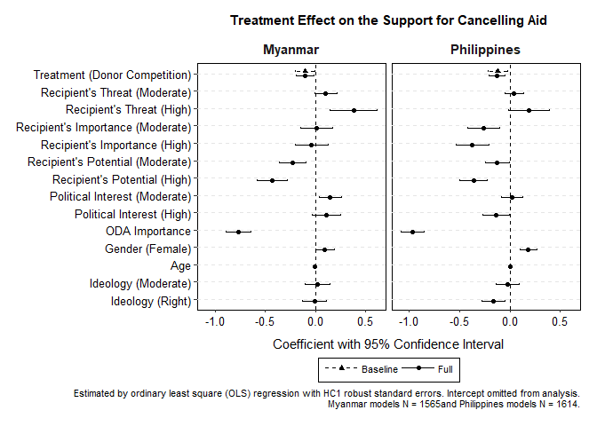
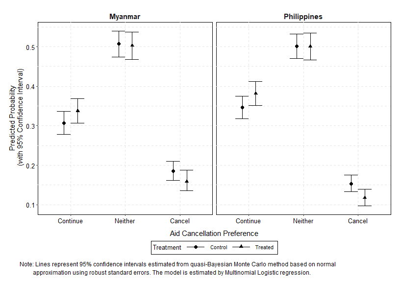
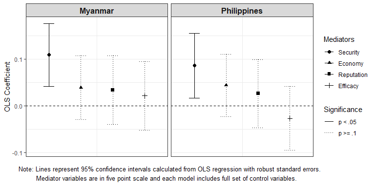
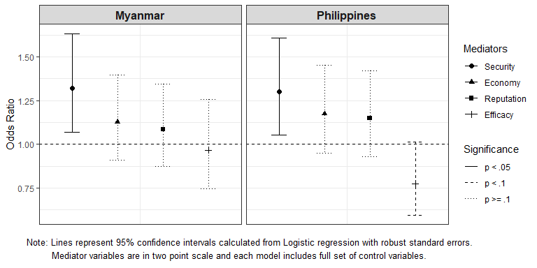

Analysis 2: Average Treatment Effect
================
Gento Kato
April 13, 2019

-   [Preparation](#preparation)
-   [Average Treatment Effect](#average-treatment-effect)
    -   [Simple OLS](#simple-ols)
    -   [Simple OLS (with Standardized DV)](#simple-ols-with-standardized-dv)
    -   [Multinomial Logit](#multinomial-logit)
    -   [The Effect of Treatment on Mediator (OLS)](#the-effect-of-treatment-on-mediator-ols)
        -   [Plot the Treatment Effect on Mediator (OLS)](#plot-the-treatment-effect-on-mediator-ols)
    -   [The Effect of Treatment on Mediator (Logit)](#the-effect-of-treatment-on-mediator-logit)
        -   [Plot the Treatment Effect on Mediator (Logit)](#plot-the-treatment-effect-on-mediator-logit)

Preparation
===========

``` r
## Clear Workspace
rm(list = ls())

## Set Working Directory (Automatically) ##
require(rprojroot); require(rstudioapi)
if (rstudioapi::isAvailable()==TRUE) {
  setwd(dirname(rstudioapi::getActiveDocumentContext()$path)); 
} 
projdir <- find_root(has_file("thisishome.txt"))
#cat(paste("Working Directory Set to:\n",projdir))
setwd(projdir)

## Required Functions & Packages
source("src/analysis0_functions.R")
source("src/cl.mlogit.R")

## Load Data
do <- readRDS("data/donorexp.rds")
d <- do[do$comply==1,] # only compliers

## Subset Data
# MMR
d.MMR <- d[d$treatment %in% c(1,2),]
d.MMR$threat <- d.MMR$threat.MMR
d.MMR$imp <- d.MMR$imp.MMR
d.MMR$potential <- d.MMR$potential.MMR
# PHL
d.PHL <- d[d$treatment %in% c(3,5),]
d.PHL$threat <- d.PHL$threat.PHL
d.PHL$imp <- d.PHL$imp.PHL
d.PHL$potential <- d.PHL$potential.PHL
```

Average Treatment Effect
========================

Simple OLS
----------

``` r
# Define Outcome Variable and Drop Missing Values
d.MMR$out <- d.MMR$cancel_aid
d.PHL$out <- d.PHL$cancel_aid
vars <- c("out","cancel_aid",
          "treat_China",
          "threat","imp","potential",  
          "issint","odaimp","fem","age","ide3",
          "med_econ","med_secu","med_repu","med_effi")
d.MMR.sub <- na.omit(d.MMR[,vars])
d.PHL.sub <- na.omit(d.PHL[,vars])

# Analysis
m0.MMR <- lm(as.numeric(out)~treat_China, data = d.MMR.sub)
m1.MMR <- lm(update(as.numeric(out)~treat_China,fcv), data = d.MMR.sub)
m0.PHL <- lm(as.numeric(out)~treat_China, data = d.PHL.sub)
m1.PHL <- lm(update(as.numeric(out)~treat_China,fcv), data = d.PHL.sub)
```

``` r
# Export Table
table_coef(list(m0.MMR,m1.MMR,m0.PHL,m1.PHL), 
           vcov.est = "robust", # Stata HC1 Robust SE
           m.names = rep(c("Myanmar","Philippines"), each=2),
           custom.variable.names = basevn,
           single.row=FALSE,
           caption = "Table 2: Treatment Effect on the Support for Cancelling Aid",
           custom.footnote = "Estimated by ordinary least square (OLS) regression. HC1 robust standard errors in parentheses.",
           format="doc", file.name="out/olsres")
adjpval("out/olsres.doc")
```

<!DOCTYPE HTML PUBLIC "-//W3C//DTD HTML 4.01 Transitional//EN" "http://www.w3.org/TR/html4/loose.dtd">
<html>
<body>
<table cellspacing="0" align="center" style="border: none;">
<caption align="top" style="margin-bottom:0.3em;">
Table 2: Treatment Effect on the Support for Cancelling Aid
</caption>
<tr>
<th style="text-align: left; border-top: 2px solid black; border-bottom: 1px solid black; padding-right: 12px;">
<b></b>
</th>
<th style="text-align: left; border-top: 2px solid black; border-bottom: 1px solid black; padding-right: 12px;">
<b>Myanmar</b>
</th>
<th style="text-align: left; border-top: 2px solid black; border-bottom: 1px solid black; padding-right: 12px;">
<b>Myanmar</b>
</th>
<th style="text-align: left; border-top: 2px solid black; border-bottom: 1px solid black; padding-right: 12px;">
<b>Philippines</b>
</th>
<th style="text-align: left; border-top: 2px solid black; border-bottom: 1px solid black; padding-right: 12px;">
<b>Philippines</b>
</th>
</tr>
<tr>
<td style="padding-right: 12px; border: none;">
(Intercept)
</td>
<td style="padding-right: 12px; border: none;">
4.657<sup style="vertical-align: 0px;">\*\*</sup>
</td>
<td style="padding-right: 12px; border: none;">
6.153<sup style="vertical-align: 0px;">\*\*</sup>
</td>
<td style="padding-right: 12px; border: none;">
4.411<sup style="vertical-align: 0px;">\*\*</sup>
</td>
<td style="padding-right: 12px; border: none;">
6.964<sup style="vertical-align: 0px;">\*\*</sup>
</td>
</tr>
<tr>
<td style="padding-right: 12px; border: none;">
</td>
<td style="padding-right: 12px; border: none;">
(0.072)
</td>
<td style="padding-right: 12px; border: none;">
(0.264)
</td>
<td style="padding-right: 12px; border: none;">
(0.069)
</td>
<td style="padding-right: 12px; border: none;">
(0.262)
</td>
</tr>
<tr>
<td style="padding-right: 12px; border: none;">
Treatment (Donor Competition)
</td>
<td style="padding-right: 12px; border: none;">
-0.202<sup style="vertical-align: 0px;">\*</sup>
</td>
<td style="padding-right: 12px; border: none;">
-0.206<sup style="vertical-align: 0px;">\*</sup>
</td>
<td style="padding-right: 12px; border: none;">
-0.239<sup style="vertical-align: 0px;">\*</sup>
</td>
<td style="padding-right: 12px; border: none;">
-0.253<sup style="vertical-align: 0px;">\*\*</sup>
</td>
</tr>
<tr>
<td style="padding-right: 12px; border: none;">
</td>
<td style="padding-right: 12px; border: none;">
(0.100)
</td>
<td style="padding-right: 12px; border: none;">
(0.093)
</td>
<td style="padding-right: 12px; border: none;">
(0.097)
</td>
<td style="padding-right: 12px; border: none;">
(0.083)
</td>
</tr>
<tr>
<td style="padding-right: 12px; border: none;">
Recipient's Threat (Moderate)
</td>
<td style="padding-right: 12px; border: none;">
</td>
<td style="padding-right: 12px; border: none;">
0.212<sup style="vertical-align: 0px;"><U+0086></sup>
</td>
<td style="padding-right: 12px; border: none;">
</td>
<td style="padding-right: 12px; border: none;">
0.085
</td>
</tr>
<tr>
<td style="padding-right: 12px; border: none;">
</td>
<td style="padding-right: 12px; border: none;">
</td>
<td style="padding-right: 12px; border: none;">
(0.111)
</td>
<td style="padding-right: 12px; border: none;">
</td>
<td style="padding-right: 12px; border: none;">
(0.092)
</td>
</tr>
<tr>
<td style="padding-right: 12px; border: none;">
Recipient's Threat (High)
</td>
<td style="padding-right: 12px; border: none;">
</td>
<td style="padding-right: 12px; border: none;">
0.774<sup style="vertical-align: 0px;">\*\*</sup>
</td>
<td style="padding-right: 12px; border: none;">
</td>
<td style="padding-right: 12px; border: none;">
0.379<sup style="vertical-align: 0px;"><U+0086></sup>
</td>
</tr>
<tr>
<td style="padding-right: 12px; border: none;">
</td>
<td style="padding-right: 12px; border: none;">
</td>
<td style="padding-right: 12px; border: none;">
(0.240)
</td>
<td style="padding-right: 12px; border: none;">
</td>
<td style="padding-right: 12px; border: none;">
(0.204)
</td>
</tr>
<tr>
<td style="padding-right: 12px; border: none;">
Recipient's Importance (Moderate)
</td>
<td style="padding-right: 12px; border: none;">
</td>
<td style="padding-right: 12px; border: none;">
0.024
</td>
<td style="padding-right: 12px; border: none;">
</td>
<td style="padding-right: 12px; border: none;">
-0.525<sup style="vertical-align: 0px;">\*\*</sup>
</td>
</tr>
<tr>
<td style="padding-right: 12px; border: none;">
</td>
<td style="padding-right: 12px; border: none;">
</td>
<td style="padding-right: 12px; border: none;">
(0.165)
</td>
<td style="padding-right: 12px; border: none;">
</td>
<td style="padding-right: 12px; border: none;">
(0.165)
</td>
</tr>
<tr>
<td style="padding-right: 12px; border: none;">
Recipient's Importance (High)
</td>
<td style="padding-right: 12px; border: none;">
</td>
<td style="padding-right: 12px; border: none;">
-0.076
</td>
<td style="padding-right: 12px; border: none;">
</td>
<td style="padding-right: 12px; border: none;">
-0.745<sup style="vertical-align: 0px;">\*\*</sup>
</td>
</tr>
<tr>
<td style="padding-right: 12px; border: none;">
</td>
<td style="padding-right: 12px; border: none;">
</td>
<td style="padding-right: 12px; border: none;">
(0.169)
</td>
<td style="padding-right: 12px; border: none;">
</td>
<td style="padding-right: 12px; border: none;">
(0.166)
</td>
</tr>
<tr>
<td style="padding-right: 12px; border: none;">
Recipient's Potential (Moderate)
</td>
<td style="padding-right: 12px; border: none;">
</td>
<td style="padding-right: 12px; border: none;">
-0.461<sup style="vertical-align: 0px;">\*\*</sup>
</td>
<td style="padding-right: 12px; border: none;">
</td>
<td style="padding-right: 12px; border: none;">
-0.251<sup style="vertical-align: 0px;">\*</sup>
</td>
</tr>
<tr>
<td style="padding-right: 12px; border: none;">
</td>
<td style="padding-right: 12px; border: none;">
</td>
<td style="padding-right: 12px; border: none;">
(0.135)
</td>
<td style="padding-right: 12px; border: none;">
</td>
<td style="padding-right: 12px; border: none;">
(0.123)
</td>
</tr>
<tr>
<td style="padding-right: 12px; border: none;">
Recipient's Potential (High)
</td>
<td style="padding-right: 12px; border: none;">
</td>
<td style="padding-right: 12px; border: none;">
-0.871<sup style="vertical-align: 0px;">\*\*</sup>
</td>
<td style="padding-right: 12px; border: none;">
</td>
<td style="padding-right: 12px; border: none;">
-0.725<sup style="vertical-align: 0px;">\*\*</sup>
</td>
</tr>
<tr>
<td style="padding-right: 12px; border: none;">
</td>
<td style="padding-right: 12px; border: none;">
</td>
<td style="padding-right: 12px; border: none;">
(0.153)
</td>
<td style="padding-right: 12px; border: none;">
</td>
<td style="padding-right: 12px; border: none;">
(0.139)
</td>
</tr>
<tr>
<td style="padding-right: 12px; border: none;">
Political Interest (Moderate)
</td>
<td style="padding-right: 12px; border: none;">
</td>
<td style="padding-right: 12px; border: none;">
0.297<sup style="vertical-align: 0px;">\*\*</sup>
</td>
<td style="padding-right: 12px; border: none;">
</td>
<td style="padding-right: 12px; border: none;">
0.044
</td>
</tr>
<tr>
<td style="padding-right: 12px; border: none;">
</td>
<td style="padding-right: 12px; border: none;">
</td>
<td style="padding-right: 12px; border: none;">
(0.115)
</td>
<td style="padding-right: 12px; border: none;">
</td>
<td style="padding-right: 12px; border: none;">
(0.111)
</td>
</tr>
<tr>
<td style="padding-right: 12px; border: none;">
Political Interest (High)
</td>
<td style="padding-right: 12px; border: none;">
</td>
<td style="padding-right: 12px; border: none;">
0.225
</td>
<td style="padding-right: 12px; border: none;">
</td>
<td style="padding-right: 12px; border: none;">
-0.278<sup style="vertical-align: 0px;">\*</sup>
</td>
</tr>
<tr>
<td style="padding-right: 12px; border: none;">
</td>
<td style="padding-right: 12px; border: none;">
</td>
<td style="padding-right: 12px; border: none;">
(0.148)
</td>
<td style="padding-right: 12px; border: none;">
</td>
<td style="padding-right: 12px; border: none;">
(0.136)
</td>
</tr>
<tr>
<td style="padding-right: 12px; border: none;">
ODA Importance
</td>
<td style="padding-right: 12px; border: none;">
</td>
<td style="padding-right: 12px; border: none;">
-1.552<sup style="vertical-align: 0px;">\*\*</sup>
</td>
<td style="padding-right: 12px; border: none;">
</td>
<td style="padding-right: 12px; border: none;">
-1.938<sup style="vertical-align: 0px;">\*\*</sup>
</td>
</tr>
<tr>
<td style="padding-right: 12px; border: none;">
</td>
<td style="padding-right: 12px; border: none;">
</td>
<td style="padding-right: 12px; border: none;">
(0.129)
</td>
<td style="padding-right: 12px; border: none;">
</td>
<td style="padding-right: 12px; border: none;">
(0.121)
</td>
</tr>
<tr>
<td style="padding-right: 12px; border: none;">
Gender (Female)
</td>
<td style="padding-right: 12px; border: none;">
</td>
<td style="padding-right: 12px; border: none;">
0.192<sup style="vertical-align: 0px;">\*</sup>
</td>
<td style="padding-right: 12px; border: none;">
</td>
<td style="padding-right: 12px; border: none;">
0.367<sup style="vertical-align: 0px;">\*\*</sup>
</td>
</tr>
<tr>
<td style="padding-right: 12px; border: none;">
</td>
<td style="padding-right: 12px; border: none;">
</td>
<td style="padding-right: 12px; border: none;">
(0.095)
</td>
<td style="padding-right: 12px; border: none;">
</td>
<td style="padding-right: 12px; border: none;">
(0.084)
</td>
</tr>
<tr>
<td style="padding-right: 12px; border: none;">
Age
</td>
<td style="padding-right: 12px; border: none;">
</td>
<td style="padding-right: 12px; border: none;">
-0.002
</td>
<td style="padding-right: 12px; border: none;">
</td>
<td style="padding-right: 12px; border: none;">
-0.000
</td>
</tr>
<tr>
<td style="padding-right: 12px; border: none;">
</td>
<td style="padding-right: 12px; border: none;">
</td>
<td style="padding-right: 12px; border: none;">
(0.004)
</td>
<td style="padding-right: 12px; border: none;">
</td>
<td style="padding-right: 12px; border: none;">
(0.003)
</td>
</tr>
<tr>
<td style="padding-right: 12px; border: none;">
Ideology (Moderate)
</td>
<td style="padding-right: 12px; border: none;">
</td>
<td style="padding-right: 12px; border: none;">
0.043
</td>
<td style="padding-right: 12px; border: none;">
</td>
<td style="padding-right: 12px; border: none;">
-0.050
</td>
</tr>
<tr>
<td style="padding-right: 12px; border: none;">
</td>
<td style="padding-right: 12px; border: none;">
</td>
<td style="padding-right: 12px; border: none;">
(0.127)
</td>
<td style="padding-right: 12px; border: none;">
</td>
<td style="padding-right: 12px; border: none;">
(0.115)
</td>
</tr>
<tr>
<td style="padding-right: 12px; border: none;">
Ideology (Right)
</td>
<td style="padding-right: 12px; border: none;">
</td>
<td style="padding-right: 12px; border: none;">
-0.012
</td>
<td style="padding-right: 12px; border: none;">
</td>
<td style="padding-right: 12px; border: none;">
-0.335<sup style="vertical-align: 0px;">\*\*</sup>
</td>
</tr>
<tr>
<td style="padding-right: 12px; border: none;">
</td>
<td style="padding-right: 12px; border: none;">
</td>
<td style="padding-right: 12px; border: none;">
(0.123)
</td>
<td style="padding-right: 12px; border: none;">
</td>
<td style="padding-right: 12px; border: none;">
(0.117)
</td>
</tr>
<tr>
<td style="border-top: 1px solid black;">
R<sup style="vertical-align: 0px;">2</sup>
</td>
<td style="border-top: 1px solid black;">
0.003
</td>
<td style="border-top: 1px solid black;">
0.145
</td>
<td style="border-top: 1px solid black;">
0.004
</td>
<td style="border-top: 1px solid black;">
0.272
</td>
</tr>
<tr>
<td style="padding-right: 12px; border: none;">
Adj. R<sup style="vertical-align: 0px;">2</sup>
</td>
<td style="padding-right: 12px; border: none;">
0.002
</td>
<td style="padding-right: 12px; border: none;">
0.137
</td>
<td style="padding-right: 12px; border: none;">
0.003
</td>
<td style="padding-right: 12px; border: none;">
0.266
</td>
</tr>
<tr>
<td style="padding-right: 12px; border: none;">
Num. obs.
</td>
<td style="padding-right: 12px; border: none;">
1565
</td>
<td style="padding-right: 12px; border: none;">
1565
</td>
<td style="padding-right: 12px; border: none;">
1614
</td>
<td style="padding-right: 12px; border: none;">
1614
</td>
</tr>
<tr>
<td style="border-bottom: 2px solid black;">
RMSE
</td>
<td style="border-bottom: 2px solid black;">
1.989
</td>
<td style="border-bottom: 2px solid black;">
1.849
</td>
<td style="border-bottom: 2px solid black;">
1.943
</td>
<td style="border-bottom: 2px solid black;">
1.667
</td>
</tr>
<tr>
<td style="padding-right: 12px; border: none;" colspan="6">
<span style="font-size:0.8em"><sup style="vertical-align: 0px;">\*\*</sup>p &lt; 0.01, <sup style="vertical-align: 0px;">\*</sup>p &lt; 0.05, <sup style="vertical-align: 0px;"><U+0086></sup>p &lt; 0.1 <br> Estimated by ordinary least square (OLS) regression. HC1 robust standard errors in parentheses.</span>
</td>
</tr>
</table>
</body>
</html>
``` r
# Export Coefficient Plot (Dropping Intercept)
ftset <- paste0("Estimated by ordinary least square (OLS) regression with HC1 robust standard errors.",
                " Intercept omitted from analysis.",
                "\n Myanmar models N = ", nobs(m1.MMR), "and Philippines models N = ", nobs(m1.PHL), ".")
p <- plot_coef(list(m0.MMR,m1.MMR,m0.PHL,m1.PHL), 
           vcov.est = "robust", # Stata HC1 Robust SE
           overlap.names = rep(c("Baseline","Full"),2),
           overlap.linetype.index = c(2,1),
           overlap.shape.index = c(17,19),
           facet.names = rep(c("Myanmar","Philippines"), each=2),
           drop.intercept = TRUE,
           custom.variable.names = basevn[-1],
           title = "Treatment Effect on the Support for Cancelling Aid",
           custom.footnote = ftset, footnote.caption = TRUE)
```

    ## Variable Manipulations: 
    ##    Category Dropped    Original                             Final
    ##        NA DROPPED (Intercept)                              <NA>
    ##        NA    KEPT treat_China     Treatment (Donor Competition)
    ##        NA    KEPT     threat1     Recipient's Threat (Moderate)
    ##        NA    KEPT     threat2         Recipient's Threat (High)
    ##        NA    KEPT        imp1 Recipient's Importance (Moderate)
    ##        NA    KEPT        imp2     Recipient's Importance (High)
    ##        NA    KEPT  potential1  Recipient's Potential (Moderate)
    ##        NA    KEPT  potential2      Recipient's Potential (High)
    ##        NA    KEPT     issint1     Political Interest (Moderate)
    ##        NA    KEPT     issint2         Political Interest (High)
    ##        NA    KEPT      odaimp                    ODA Importance
    ##        NA    KEPT         fem                   Gender (Female)
    ##        NA    KEPT         age                               Age
    ##        NA    KEPT       ide31               Ideology (Moderate)
    ##        NA    KEPT       ide32                  Ideology (Right)

    ## Warning: position_dodge requires non-overlapping x intervals

    ## Warning: position_dodge requires non-overlapping x intervals

    ## Warning: Removed 26 rows containing missing values (geom_point).

    ## Warning: Removed 26 rows containing missing values (geom_errorbar).


``` r
png_save(p,w=800,h=600,file="out/olsplot.png")
```

Simple OLS (with Standardized DV)
---------------------------------

``` r
# Define Outcome Variable and Drop Missing Values
d.MMR$out <- d.MMR$cancel_aid
d.PHL$out <- d.PHL$cancel_aid
vars <- c("out","treat_China",
          "threat","imp","potential",  
          "issint","odaimp","fem","age","ide3",
          "med_econ","med_secu","med_repu","med_effi")
d.MMR.sub <- na.omit(d.MMR[,vars])
d.PHL.sub <- na.omit(d.PHL[,vars])

## Standardize DV by Control Group SD
d.MMR.sub$out <- as.numeric(d.MMR.sub$out)/
  sd(as.numeric(d.MMR.sub$out)[d.MMR.sub$treat_China==0]) #- 
  #mean(as.numeric(d.MMR.sub$out)[d.MMR.sub$treat_China==0])
d.PHL.sub$out <- as.numeric(d.PHL.sub$out)/
  sd(as.numeric(d.PHL.sub$out)[d.PHL.sub$treat_China==0]) #- 
  #mean(as.numeric(d.PHL.sub$out)[d.MMR.sub$treat_China==0])

# Analysis
m0.MMR <- lm(as.numeric(out)~treat_China, data = d.MMR.sub)
m1.MMR <- lm(update(as.numeric(out)~treat_China,fcv), data = d.MMR.sub)
m0.PHL <- lm(as.numeric(out)~treat_China, data = d.PHL.sub)
m1.PHL <- lm(update(as.numeric(out)~treat_China,fcv), data = d.PHL.sub)
```

``` r
# Export Table
table_coef(list(m0.MMR,m1.MMR,m0.PHL,m1.PHL), 
           vcov.est = "robust", # Stata HC1 Robust SE
           m.names = rep(c("Myanmar","Philippines"), each=2),
           custom.variable.names = basevn,
           single.row=FALSE,
           caption = "Table 2: Treatment Effect on the Support for Cancelling Aid",
           custom.footnote = "Estimated by ordinary least square (OLS) regression. HC1 robust standard errors in parentheses.",
           format="doc", file.name="out/olsres_std", show.table=TRUE)
adjpval("out/olsres_std.doc")
```

<!DOCTYPE HTML PUBLIC "-//W3C//DTD HTML 4.01 Transitional//EN" "http://www.w3.org/TR/html4/loose.dtd">
<html>
<body>
<table cellspacing="0" align="center" style="border: none;">
<caption align="top" style="margin-bottom:0.3em;">
Table 2: Treatment Effect on the Support for Cancelling Aid
</caption>
<tr>
<th style="text-align: left; border-top: 2px solid black; border-bottom: 1px solid black; padding-right: 12px;">
<b></b>
</th>
<th style="text-align: left; border-top: 2px solid black; border-bottom: 1px solid black; padding-right: 12px;">
<b>Myanmar</b>
</th>
<th style="text-align: left; border-top: 2px solid black; border-bottom: 1px solid black; padding-right: 12px;">
<b>Myanmar</b>
</th>
<th style="text-align: left; border-top: 2px solid black; border-bottom: 1px solid black; padding-right: 12px;">
<b>Philippines</b>
</th>
<th style="text-align: left; border-top: 2px solid black; border-bottom: 1px solid black; padding-right: 12px;">
<b>Philippines</b>
</th>
</tr>
<tr>
<td style="padding-right: 12px; border: none;">
(Intercept)
</td>
<td style="padding-right: 12px; border: none;">
2.299<sup style="vertical-align: 0px;">\*\*</sup>
</td>
<td style="padding-right: 12px; border: none;">
3.038<sup style="vertical-align: 0px;">\*\*</sup>
</td>
<td style="padding-right: 12px; border: none;">
2.206<sup style="vertical-align: 0px;">\*\*</sup>
</td>
<td style="padding-right: 12px; border: none;">
3.482<sup style="vertical-align: 0px;">\*\*</sup>
</td>
</tr>
<tr>
<td style="padding-right: 12px; border: none;">
</td>
<td style="padding-right: 12px; border: none;">
(0.035)
</td>
<td style="padding-right: 12px; border: none;">
(0.130)
</td>
<td style="padding-right: 12px; border: none;">
(0.034)
</td>
<td style="padding-right: 12px; border: none;">
(0.131)
</td>
</tr>
<tr>
<td style="padding-right: 12px; border: none;">
Treatment (Donor Competition)
</td>
<td style="padding-right: 12px; border: none;">
-0.100<sup style="vertical-align: 0px;">\*</sup>
</td>
<td style="padding-right: 12px; border: none;">
-0.102<sup style="vertical-align: 0px;">\*</sup>
</td>
<td style="padding-right: 12px; border: none;">
-0.120<sup style="vertical-align: 0px;">\*</sup>
</td>
<td style="padding-right: 12px; border: none;">
-0.127<sup style="vertical-align: 0px;">\*\*</sup>
</td>
</tr>
<tr>
<td style="padding-right: 12px; border: none;">
</td>
<td style="padding-right: 12px; border: none;">
(0.050)
</td>
<td style="padding-right: 12px; border: none;">
(0.046)
</td>
<td style="padding-right: 12px; border: none;">
(0.048)
</td>
<td style="padding-right: 12px; border: none;">
(0.041)
</td>
</tr>
<tr>
<td style="padding-right: 12px; border: none;">
Recipient's Threat (Moderate)
</td>
<td style="padding-right: 12px; border: none;">
</td>
<td style="padding-right: 12px; border: none;">
0.105<sup style="vertical-align: 0px;"><U+0086></sup>
</td>
<td style="padding-right: 12px; border: none;">
</td>
<td style="padding-right: 12px; border: none;">
0.042
</td>
</tr>
<tr>
<td style="padding-right: 12px; border: none;">
</td>
<td style="padding-right: 12px; border: none;">
</td>
<td style="padding-right: 12px; border: none;">
(0.055)
</td>
<td style="padding-right: 12px; border: none;">
</td>
<td style="padding-right: 12px; border: none;">
(0.046)
</td>
</tr>
<tr>
<td style="padding-right: 12px; border: none;">
Recipient's Threat (High)
</td>
<td style="padding-right: 12px; border: none;">
</td>
<td style="padding-right: 12px; border: none;">
0.382<sup style="vertical-align: 0px;">\*\*</sup>
</td>
<td style="padding-right: 12px; border: none;">
</td>
<td style="padding-right: 12px; border: none;">
0.189<sup style="vertical-align: 0px;"><U+0086></sup>
</td>
</tr>
<tr>
<td style="padding-right: 12px; border: none;">
</td>
<td style="padding-right: 12px; border: none;">
</td>
<td style="padding-right: 12px; border: none;">
(0.118)
</td>
<td style="padding-right: 12px; border: none;">
</td>
<td style="padding-right: 12px; border: none;">
(0.102)
</td>
</tr>
<tr>
<td style="padding-right: 12px; border: none;">
Recipient's Importance (Moderate)
</td>
<td style="padding-right: 12px; border: none;">
</td>
<td style="padding-right: 12px; border: none;">
0.012
</td>
<td style="padding-right: 12px; border: none;">
</td>
<td style="padding-right: 12px; border: none;">
-0.262<sup style="vertical-align: 0px;">\*\*</sup>
</td>
</tr>
<tr>
<td style="padding-right: 12px; border: none;">
</td>
<td style="padding-right: 12px; border: none;">
</td>
<td style="padding-right: 12px; border: none;">
(0.081)
</td>
<td style="padding-right: 12px; border: none;">
</td>
<td style="padding-right: 12px; border: none;">
(0.082)
</td>
</tr>
<tr>
<td style="padding-right: 12px; border: none;">
Recipient's Importance (High)
</td>
<td style="padding-right: 12px; border: none;">
</td>
<td style="padding-right: 12px; border: none;">
-0.037
</td>
<td style="padding-right: 12px; border: none;">
</td>
<td style="padding-right: 12px; border: none;">
-0.373<sup style="vertical-align: 0px;">\*\*</sup>
</td>
</tr>
<tr>
<td style="padding-right: 12px; border: none;">
</td>
<td style="padding-right: 12px; border: none;">
</td>
<td style="padding-right: 12px; border: none;">
(0.083)
</td>
<td style="padding-right: 12px; border: none;">
</td>
<td style="padding-right: 12px; border: none;">
(0.083)
</td>
</tr>
<tr>
<td style="padding-right: 12px; border: none;">
Recipient's Potential (Moderate)
</td>
<td style="padding-right: 12px; border: none;">
</td>
<td style="padding-right: 12px; border: none;">
-0.228<sup style="vertical-align: 0px;">\*\*</sup>
</td>
<td style="padding-right: 12px; border: none;">
</td>
<td style="padding-right: 12px; border: none;">
-0.125<sup style="vertical-align: 0px;">\*</sup>
</td>
</tr>
<tr>
<td style="padding-right: 12px; border: none;">
</td>
<td style="padding-right: 12px; border: none;">
</td>
<td style="padding-right: 12px; border: none;">
(0.067)
</td>
<td style="padding-right: 12px; border: none;">
</td>
<td style="padding-right: 12px; border: none;">
(0.062)
</td>
</tr>
<tr>
<td style="padding-right: 12px; border: none;">
Recipient's Potential (High)
</td>
<td style="padding-right: 12px; border: none;">
</td>
<td style="padding-right: 12px; border: none;">
-0.430<sup style="vertical-align: 0px;">\*\*</sup>
</td>
<td style="padding-right: 12px; border: none;">
</td>
<td style="padding-right: 12px; border: none;">
-0.363<sup style="vertical-align: 0px;">\*\*</sup>
</td>
</tr>
<tr>
<td style="padding-right: 12px; border: none;">
</td>
<td style="padding-right: 12px; border: none;">
</td>
<td style="padding-right: 12px; border: none;">
(0.075)
</td>
<td style="padding-right: 12px; border: none;">
</td>
<td style="padding-right: 12px; border: none;">
(0.069)
</td>
</tr>
<tr>
<td style="padding-right: 12px; border: none;">
Political Interest (Moderate)
</td>
<td style="padding-right: 12px; border: none;">
</td>
<td style="padding-right: 12px; border: none;">
0.147<sup style="vertical-align: 0px;">\*\*</sup>
</td>
<td style="padding-right: 12px; border: none;">
</td>
<td style="padding-right: 12px; border: none;">
0.022
</td>
</tr>
<tr>
<td style="padding-right: 12px; border: none;">
</td>
<td style="padding-right: 12px; border: none;">
</td>
<td style="padding-right: 12px; border: none;">
(0.057)
</td>
<td style="padding-right: 12px; border: none;">
</td>
<td style="padding-right: 12px; border: none;">
(0.055)
</td>
</tr>
<tr>
<td style="padding-right: 12px; border: none;">
Political Interest (High)
</td>
<td style="padding-right: 12px; border: none;">
</td>
<td style="padding-right: 12px; border: none;">
0.111
</td>
<td style="padding-right: 12px; border: none;">
</td>
<td style="padding-right: 12px; border: none;">
-0.139<sup style="vertical-align: 0px;">\*</sup>
</td>
</tr>
<tr>
<td style="padding-right: 12px; border: none;">
</td>
<td style="padding-right: 12px; border: none;">
</td>
<td style="padding-right: 12px; border: none;">
(0.073)
</td>
<td style="padding-right: 12px; border: none;">
</td>
<td style="padding-right: 12px; border: none;">
(0.068)
</td>
</tr>
<tr>
<td style="padding-right: 12px; border: none;">
ODA Importance
</td>
<td style="padding-right: 12px; border: none;">
</td>
<td style="padding-right: 12px; border: none;">
-0.766<sup style="vertical-align: 0px;">\*\*</sup>
</td>
<td style="padding-right: 12px; border: none;">
</td>
<td style="padding-right: 12px; border: none;">
-0.969<sup style="vertical-align: 0px;">\*\*</sup>
</td>
</tr>
<tr>
<td style="padding-right: 12px; border: none;">
</td>
<td style="padding-right: 12px; border: none;">
</td>
<td style="padding-right: 12px; border: none;">
(0.064)
</td>
<td style="padding-right: 12px; border: none;">
</td>
<td style="padding-right: 12px; border: none;">
(0.061)
</td>
</tr>
<tr>
<td style="padding-right: 12px; border: none;">
Gender (Female)
</td>
<td style="padding-right: 12px; border: none;">
</td>
<td style="padding-right: 12px; border: none;">
0.095<sup style="vertical-align: 0px;">\*</sup>
</td>
<td style="padding-right: 12px; border: none;">
</td>
<td style="padding-right: 12px; border: none;">
0.183<sup style="vertical-align: 0px;">\*\*</sup>
</td>
</tr>
<tr>
<td style="padding-right: 12px; border: none;">
</td>
<td style="padding-right: 12px; border: none;">
</td>
<td style="padding-right: 12px; border: none;">
(0.047)
</td>
<td style="padding-right: 12px; border: none;">
</td>
<td style="padding-right: 12px; border: none;">
(0.042)
</td>
</tr>
<tr>
<td style="padding-right: 12px; border: none;">
Age
</td>
<td style="padding-right: 12px; border: none;">
</td>
<td style="padding-right: 12px; border: none;">
-0.001
</td>
<td style="padding-right: 12px; border: none;">
</td>
<td style="padding-right: 12px; border: none;">
-0.000
</td>
</tr>
<tr>
<td style="padding-right: 12px; border: none;">
</td>
<td style="padding-right: 12px; border: none;">
</td>
<td style="padding-right: 12px; border: none;">
(0.002)
</td>
<td style="padding-right: 12px; border: none;">
</td>
<td style="padding-right: 12px; border: none;">
(0.002)
</td>
</tr>
<tr>
<td style="padding-right: 12px; border: none;">
Ideology (Moderate)
</td>
<td style="padding-right: 12px; border: none;">
</td>
<td style="padding-right: 12px; border: none;">
0.021
</td>
<td style="padding-right: 12px; border: none;">
</td>
<td style="padding-right: 12px; border: none;">
-0.025
</td>
</tr>
<tr>
<td style="padding-right: 12px; border: none;">
</td>
<td style="padding-right: 12px; border: none;">
</td>
<td style="padding-right: 12px; border: none;">
(0.063)
</td>
<td style="padding-right: 12px; border: none;">
</td>
<td style="padding-right: 12px; border: none;">
(0.058)
</td>
</tr>
<tr>
<td style="padding-right: 12px; border: none;">
Ideology (Right)
</td>
<td style="padding-right: 12px; border: none;">
</td>
<td style="padding-right: 12px; border: none;">
-0.006
</td>
<td style="padding-right: 12px; border: none;">
</td>
<td style="padding-right: 12px; border: none;">
-0.168<sup style="vertical-align: 0px;">\*\*</sup>
</td>
</tr>
<tr>
<td style="padding-right: 12px; border: none;">
</td>
<td style="padding-right: 12px; border: none;">
</td>
<td style="padding-right: 12px; border: none;">
(0.061)
</td>
<td style="padding-right: 12px; border: none;">
</td>
<td style="padding-right: 12px; border: none;">
(0.059)
</td>
</tr>
<tr>
<td style="border-top: 1px solid black;">
R<sup style="vertical-align: 0px;">2</sup>
</td>
<td style="border-top: 1px solid black;">
0.003
</td>
<td style="border-top: 1px solid black;">
0.145
</td>
<td style="border-top: 1px solid black;">
0.004
</td>
<td style="border-top: 1px solid black;">
0.272
</td>
</tr>
<tr>
<td style="padding-right: 12px; border: none;">
Adj. R<sup style="vertical-align: 0px;">2</sup>
</td>
<td style="padding-right: 12px; border: none;">
0.002
</td>
<td style="padding-right: 12px; border: none;">
0.137
</td>
<td style="padding-right: 12px; border: none;">
0.003
</td>
<td style="padding-right: 12px; border: none;">
0.266
</td>
</tr>
<tr>
<td style="padding-right: 12px; border: none;">
Num. obs.
</td>
<td style="padding-right: 12px; border: none;">
1565
</td>
<td style="padding-right: 12px; border: none;">
1565
</td>
<td style="padding-right: 12px; border: none;">
1614
</td>
<td style="padding-right: 12px; border: none;">
1614
</td>
</tr>
<tr>
<td style="border-bottom: 2px solid black;">
RMSE
</td>
<td style="border-bottom: 2px solid black;">
0.982
</td>
<td style="border-bottom: 2px solid black;">
0.913
</td>
<td style="border-bottom: 2px solid black;">
0.972
</td>
<td style="border-bottom: 2px solid black;">
0.834
</td>
</tr>
<tr>
<td style="padding-right: 12px; border: none;" colspan="6">
<span style="font-size:0.8em"><sup style="vertical-align: 0px;">\*\*</sup>p &lt; 0.01, <sup style="vertical-align: 0px;">\*</sup>p &lt; 0.05, <sup style="vertical-align: 0px;"><U+0086></sup>p &lt; 0.1 <br> Estimated by ordinary least square (OLS) regression. HC1 robust standard errors in parentheses.</span>
</td>
</tr>
</table>
</body>
</html>
``` r
# Export Coefficient Plot (Dropping Intercept)
ftset <- paste0("Estimated by ordinary least square (OLS) regression with HC1 robust standard errors.",
                " Intercept omitted from analysis.",
                "\n Myanmar models N = ", nobs(m1.MMR), "and Philippines models N = ", nobs(m1.PHL), ".")
p <- plot_coef(list(m0.MMR,m1.MMR,m0.PHL,m1.PHL), 
               vcov.est = "robust", # Stata HC1 Robust SE
               overlap.names = rep(c("Baseline","Full"),2),
               overlap.linetype.index = c(2,1),
               overlap.shape.index = c(17,19),
               facet.names = rep(c("Myanmar","Philippines"), each=2),
               drop.intercept = TRUE,
               custom.variable.names = basevn[-1],
               title = "Treatment Effect on the Support for Cancelling Aid",
               custom.footnote = ftset, footnote.caption = TRUE)
```

    ## Variable Manipulations: 
    ##    Category Dropped    Original                             Final
    ##        NA DROPPED (Intercept)                              <NA>
    ##        NA    KEPT treat_China     Treatment (Donor Competition)
    ##        NA    KEPT     threat1     Recipient's Threat (Moderate)
    ##        NA    KEPT     threat2         Recipient's Threat (High)
    ##        NA    KEPT        imp1 Recipient's Importance (Moderate)
    ##        NA    KEPT        imp2     Recipient's Importance (High)
    ##        NA    KEPT  potential1  Recipient's Potential (Moderate)
    ##        NA    KEPT  potential2      Recipient's Potential (High)
    ##        NA    KEPT     issint1     Political Interest (Moderate)
    ##        NA    KEPT     issint2         Political Interest (High)
    ##        NA    KEPT      odaimp                    ODA Importance
    ##        NA    KEPT         fem                   Gender (Female)
    ##        NA    KEPT         age                               Age
    ##        NA    KEPT       ide31               Ideology (Moderate)
    ##        NA    KEPT       ide32                  Ideology (Right)

    ## Warning: position_dodge requires non-overlapping x intervals

    ## Warning: position_dodge requires non-overlapping x intervals

    ## Warning: Removed 26 rows containing missing values (geom_point).

    ## Warning: Removed 26 rows containing missing values (geom_errorbar).



``` r
png_save(p,w=800,h=600,file="out/olsplot_std.png")
```

Multinomial Logit
-----------------

``` r
# Define Outcome Variable and Drop Missing Values
d.MMR$out <- d.MMR$cancel_aid_3cat
d.PHL$out <- d.PHL$cancel_aid_3cat
vars <- c("out","treat_China","id",
          "threat","imp","potential",  
          "issint","odaimp","fem","age","ide3",
          "med_econ","med_secu","med_repu","med_effi")
d.MMR.sub <- na.omit(d.MMR[,vars])
d.PHL.sub <- na.omit(d.PHL[,vars])

# Transform to "mlogit" style dagta
d.MMR.sub.mlogit <- mlogit.data(d.MMR.sub,shape="wide",
                                choice="out",
                                id.var="id")
d.PHL.sub.mlogit <- mlogit.data(d.PHL.sub,shape="wide",
                                choice="out",
                                id.var="id")

# Run Multinomial Logit
m0.MMR <- mlogit(out ~ 1 | treat_China, 
             data = d.MMR.sub.mlogit, reflevel="1")
m1.MMR <- mlogit(update(mFormula(out ~ 1 | treat_China), fcvml), 
             data = d.MMR.sub.mlogit, reflevel="1")
m0.PHL <- mlogit(out ~ 1 | treat_China, 
                 data = d.PHL.sub.mlogit, reflevel="1")
m1.PHL <- mlogit(update(mFormula(out ~ 1 | treat_China), fcvml), 
                 data = d.PHL.sub.mlogit, reflevel="1")

# Variable Names
basevn.mlogit <- paste(c("Neither:","Cancel:"), rep(basevn,each=2))
```

``` r
table_coef(list(m0.MMR,m1.MMR,m0.PHL,m1.PHL), 
           vcov.est = list(cl.mlogit.vcov(m0.MMR,d.MMR.sub$id),
                           cl.mlogit.vcov(m1.MMR,d.MMR.sub$id),
                           cl.mlogit.vcov(m0.PHL,d.PHL.sub$id),
                           cl.mlogit.vcov(m1.PHL,d.PHL.sub$id)), 
           m.names = rep(c("Myanmar","Philippines"), each=2),
           custom.variable.names = basevn.mlogit,
           single.row=FALSE,
           caption = "Table 2: Treatment Effect on the Support for Cancelling Aid",
           custom.footnote = "Estimated by ordinary least square (OLS) regression. Robust standard errors in parentheses.",
           format="doc", file.name="out/mlogitres", show.table=TRUE)
adjpval("out/mlogitres.doc")
```

<!DOCTYPE HTML PUBLIC "-//W3C//DTD HTML 4.01 Transitional//EN" "http://www.w3.org/TR/html4/loose.dtd">
<html>
<body>
<table cellspacing="0" align="center" style="border: none;">
<caption align="top" style="margin-bottom:0.3em;">
Table 2: Treatment Effect on the Support for Cancelling Aid
</caption>
<tr>
<th style="text-align: left; border-top: 2px solid black; border-bottom: 1px solid black; padding-right: 12px;">
<b></b>
</th>
<th style="text-align: left; border-top: 2px solid black; border-bottom: 1px solid black; padding-right: 12px;">
<b>Myanmar</b>
</th>
<th style="text-align: left; border-top: 2px solid black; border-bottom: 1px solid black; padding-right: 12px;">
<b>Myanmar</b>
</th>
<th style="text-align: left; border-top: 2px solid black; border-bottom: 1px solid black; padding-right: 12px;">
<b>Philippines</b>
</th>
<th style="text-align: left; border-top: 2px solid black; border-bottom: 1px solid black; padding-right: 12px;">
<b>Philippines</b>
</th>
</tr>
<tr>
<td style="padding-right: 12px; border: none;">
Neither: (Intercept)
</td>
<td style="padding-right: 12px; border: none;">
0.496<sup style="vertical-align: 0px;">\*\*</sup>
</td>
<td style="padding-right: 12px; border: none;">
1.997<sup style="vertical-align: 0px;">\*\*</sup>
</td>
<td style="padding-right: 12px; border: none;">
0.357<sup style="vertical-align: 0px;">\*\*</sup>
</td>
<td style="padding-right: 12px; border: none;">
2.569<sup style="vertical-align: 0px;">\*\*</sup>
</td>
</tr>
<tr>
<td style="padding-right: 12px; border: none;">
</td>
<td style="padding-right: 12px; border: none;">
(0.081)
</td>
<td style="padding-right: 12px; border: none;">
(0.389)
</td>
<td style="padding-right: 12px; border: none;">
(0.076)
</td>
<td style="padding-right: 12px; border: none;">
(0.434)
</td>
</tr>
<tr>
<td style="padding-right: 12px; border: none;">
Cancel: (Intercept)
</td>
<td style="padding-right: 12px; border: none;">
-0.501<sup style="vertical-align: 0px;">\*\*</sup>
</td>
<td style="padding-right: 12px; border: none;">
1.540<sup style="vertical-align: 0px;">\*\*</sup>
</td>
<td style="padding-right: 12px; border: none;">
-0.831<sup style="vertical-align: 0px;">\*\*</sup>
</td>
<td style="padding-right: 12px; border: none;">
2.974<sup style="vertical-align: 0px;">\*\*</sup>
</td>
</tr>
<tr>
<td style="padding-right: 12px; border: none;">
</td>
<td style="padding-right: 12px; border: none;">
(0.104)
</td>
<td style="padding-right: 12px; border: none;">
(0.476)
</td>
<td style="padding-right: 12px; border: none;">
(0.106)
</td>
<td style="padding-right: 12px; border: none;">
(0.571)
</td>
</tr>
<tr>
<td style="padding-right: 12px; border: none;">
Neither: Treatment (Donor Competition)
</td>
<td style="padding-right: 12px; border: none;">
-0.079
</td>
<td style="padding-right: 12px; border: none;">
-0.118
</td>
<td style="padding-right: 12px; border: none;">
-0.058
</td>
<td style="padding-right: 12px; border: none;">
-0.137
</td>
</tr>
<tr>
<td style="padding-right: 12px; border: none;">
</td>
<td style="padding-right: 12px; border: none;">
(0.114)
</td>
<td style="padding-right: 12px; border: none;">
(0.119)
</td>
<td style="padding-right: 12px; border: none;">
(0.108)
</td>
<td style="padding-right: 12px; border: none;">
(0.119)
</td>
</tr>
<tr>
<td style="padding-right: 12px; border: none;">
Cancel: Treatment (Donor Competition)
</td>
<td style="padding-right: 12px; border: none;">
-0.268<sup style="vertical-align: 0px;"><U+0086></sup>
</td>
<td style="padding-right: 12px; border: none;">
-0.292<sup style="vertical-align: 0px;"><U+0086></sup>
</td>
<td style="padding-right: 12px; border: none;">
-0.351<sup style="vertical-align: 0px;">\*</sup>
</td>
<td style="padding-right: 12px; border: none;">
-0.485<sup style="vertical-align: 0px;">\*</sup>
</td>
</tr>
<tr>
<td style="padding-right: 12px; border: none;">
</td>
<td style="padding-right: 12px; border: none;">
(0.152)
</td>
<td style="padding-right: 12px; border: none;">
(0.165)
</td>
<td style="padding-right: 12px; border: none;">
(0.161)
</td>
<td style="padding-right: 12px; border: none;">
(0.188)
</td>
</tr>
<tr>
<td style="padding-right: 12px; border: none;">
Neither: Recipient's Threat (Moderate)
</td>
<td style="padding-right: 12px; border: none;">
</td>
<td style="padding-right: 12px; border: none;">
0.089
</td>
<td style="padding-right: 12px; border: none;">
</td>
<td style="padding-right: 12px; border: none;">
0.178
</td>
</tr>
<tr>
<td style="padding-right: 12px; border: none;">
</td>
<td style="padding-right: 12px; border: none;">
</td>
<td style="padding-right: 12px; border: none;">
(0.144)
</td>
<td style="padding-right: 12px; border: none;">
</td>
<td style="padding-right: 12px; border: none;">
(0.138)
</td>
</tr>
<tr>
<td style="padding-right: 12px; border: none;">
Cancel: Recipient's Threat (Moderate)
</td>
<td style="padding-right: 12px; border: none;">
</td>
<td style="padding-right: 12px; border: none;">
0.437<sup style="vertical-align: 0px;">\*</sup>
</td>
<td style="padding-right: 12px; border: none;">
</td>
<td style="padding-right: 12px; border: none;">
0.183
</td>
</tr>
<tr>
<td style="padding-right: 12px; border: none;">
</td>
<td style="padding-right: 12px; border: none;">
</td>
<td style="padding-right: 12px; border: none;">
(0.190)
</td>
<td style="padding-right: 12px; border: none;">
</td>
<td style="padding-right: 12px; border: none;">
(0.206)
</td>
</tr>
<tr>
<td style="padding-right: 12px; border: none;">
Neither: Recipient's Threat (High)
</td>
<td style="padding-right: 12px; border: none;">
</td>
<td style="padding-right: 12px; border: none;">
0.528<sup style="vertical-align: 0px;"><U+0086></sup>
</td>
<td style="padding-right: 12px; border: none;">
</td>
<td style="padding-right: 12px; border: none;">
0.518<sup style="vertical-align: 0px;"><U+0086></sup>
</td>
</tr>
<tr>
<td style="padding-right: 12px; border: none;">
</td>
<td style="padding-right: 12px; border: none;">
</td>
<td style="padding-right: 12px; border: none;">
(0.297)
</td>
<td style="padding-right: 12px; border: none;">
</td>
<td style="padding-right: 12px; border: none;">
(0.313)
</td>
</tr>
<tr>
<td style="padding-right: 12px; border: none;">
Cancel: Recipient's Threat (High)
</td>
<td style="padding-right: 12px; border: none;">
</td>
<td style="padding-right: 12px; border: none;">
1.231<sup style="vertical-align: 0px;">\*\*</sup>
</td>
<td style="padding-right: 12px; border: none;">
</td>
<td style="padding-right: 12px; border: none;">
0.567
</td>
</tr>
<tr>
<td style="padding-right: 12px; border: none;">
</td>
<td style="padding-right: 12px; border: none;">
</td>
<td style="padding-right: 12px; border: none;">
(0.340)
</td>
<td style="padding-right: 12px; border: none;">
</td>
<td style="padding-right: 12px; border: none;">
(0.401)
</td>
</tr>
<tr>
<td style="padding-right: 12px; border: none;">
Neither: Recipient's Importance (Moderate)
</td>
<td style="padding-right: 12px; border: none;">
</td>
<td style="padding-right: 12px; border: none;">
0.170
</td>
<td style="padding-right: 12px; border: none;">
</td>
<td style="padding-right: 12px; border: none;">
-0.476
</td>
</tr>
<tr>
<td style="padding-right: 12px; border: none;">
</td>
<td style="padding-right: 12px; border: none;">
</td>
<td style="padding-right: 12px; border: none;">
(0.214)
</td>
<td style="padding-right: 12px; border: none;">
</td>
<td style="padding-right: 12px; border: none;">
(0.294)
</td>
</tr>
<tr>
<td style="padding-right: 12px; border: none;">
Cancel: Recipient's Importance (Moderate)
</td>
<td style="padding-right: 12px; border: none;">
</td>
<td style="padding-right: 12px; border: none;">
0.047
</td>
<td style="padding-right: 12px; border: none;">
</td>
<td style="padding-right: 12px; border: none;">
-0.993<sup style="vertical-align: 0px;">\*\*</sup>
</td>
</tr>
<tr>
<td style="padding-right: 12px; border: none;">
</td>
<td style="padding-right: 12px; border: none;">
</td>
<td style="padding-right: 12px; border: none;">
(0.270)
</td>
<td style="padding-right: 12px; border: none;">
</td>
<td style="padding-right: 12px; border: none;">
(0.349)
</td>
</tr>
<tr>
<td style="padding-right: 12px; border: none;">
Neither: Recipient's Importance (High)
</td>
<td style="padding-right: 12px; border: none;">
</td>
<td style="padding-right: 12px; border: none;">
0.155
</td>
<td style="padding-right: 12px; border: none;">
</td>
<td style="padding-right: 12px; border: none;">
-0.890<sup style="vertical-align: 0px;">\*\*</sup>
</td>
</tr>
<tr>
<td style="padding-right: 12px; border: none;">
</td>
<td style="padding-right: 12px; border: none;">
</td>
<td style="padding-right: 12px; border: none;">
(0.215)
</td>
<td style="padding-right: 12px; border: none;">
</td>
<td style="padding-right: 12px; border: none;">
(0.293)
</td>
</tr>
<tr>
<td style="padding-right: 12px; border: none;">
Cancel: Recipient's Importance (High)
</td>
<td style="padding-right: 12px; border: none;">
</td>
<td style="padding-right: 12px; border: none;">
-0.178
</td>
<td style="padding-right: 12px; border: none;">
</td>
<td style="padding-right: 12px; border: none;">
-1.473<sup style="vertical-align: 0px;">\*\*</sup>
</td>
</tr>
<tr>
<td style="padding-right: 12px; border: none;">
</td>
<td style="padding-right: 12px; border: none;">
</td>
<td style="padding-right: 12px; border: none;">
(0.282)
</td>
<td style="padding-right: 12px; border: none;">
</td>
<td style="padding-right: 12px; border: none;">
(0.347)
</td>
</tr>
<tr>
<td style="padding-right: 12px; border: none;">
Neither: Recipient's Potential (Moderate)
</td>
<td style="padding-right: 12px; border: none;">
</td>
<td style="padding-right: 12px; border: none;">
-0.019
</td>
<td style="padding-right: 12px; border: none;">
</td>
<td style="padding-right: 12px; border: none;">
0.062
</td>
</tr>
<tr>
<td style="padding-right: 12px; border: none;">
</td>
<td style="padding-right: 12px; border: none;">
</td>
<td style="padding-right: 12px; border: none;">
(0.184)
</td>
<td style="padding-right: 12px; border: none;">
</td>
<td style="padding-right: 12px; border: none;">
(0.187)
</td>
</tr>
<tr>
<td style="padding-right: 12px; border: none;">
Cancel: Recipient's Potential (Moderate)
</td>
<td style="padding-right: 12px; border: none;">
</td>
<td style="padding-right: 12px; border: none;">
-0.657<sup style="vertical-align: 0px;">\*\*</sup>
</td>
<td style="padding-right: 12px; border: none;">
</td>
<td style="padding-right: 12px; border: none;">
-0.458<sup style="vertical-align: 0px;"><U+0086></sup>
</td>
</tr>
<tr>
<td style="padding-right: 12px; border: none;">
</td>
<td style="padding-right: 12px; border: none;">
</td>
<td style="padding-right: 12px; border: none;">
(0.229)
</td>
<td style="padding-right: 12px; border: none;">
</td>
<td style="padding-right: 12px; border: none;">
(0.245)
</td>
</tr>
<tr>
<td style="padding-right: 12px; border: none;">
Neither: Recipient's Potential (High)
</td>
<td style="padding-right: 12px; border: none;">
</td>
<td style="padding-right: 12px; border: none;">
-0.689<sup style="vertical-align: 0px;">\*\*</sup>
</td>
<td style="padding-right: 12px; border: none;">
</td>
<td style="padding-right: 12px; border: none;">
-0.612<sup style="vertical-align: 0px;">\*\*</sup>
</td>
</tr>
<tr>
<td style="padding-right: 12px; border: none;">
</td>
<td style="padding-right: 12px; border: none;">
</td>
<td style="padding-right: 12px; border: none;">
(0.198)
</td>
<td style="padding-right: 12px; border: none;">
</td>
<td style="padding-right: 12px; border: none;">
(0.195)
</td>
</tr>
<tr>
<td style="padding-right: 12px; border: none;">
Cancel: Recipient's Potential (High)
</td>
<td style="padding-right: 12px; border: none;">
</td>
<td style="padding-right: 12px; border: none;">
-1.188<sup style="vertical-align: 0px;">\*\*</sup>
</td>
<td style="padding-right: 12px; border: none;">
</td>
<td style="padding-right: 12px; border: none;">
-0.940<sup style="vertical-align: 0px;">\*\*</sup>
</td>
</tr>
<tr>
<td style="padding-right: 12px; border: none;">
</td>
<td style="padding-right: 12px; border: none;">
</td>
<td style="padding-right: 12px; border: none;">
(0.256)
</td>
<td style="padding-right: 12px; border: none;">
</td>
<td style="padding-right: 12px; border: none;">
(0.275)
</td>
</tr>
<tr>
<td style="padding-right: 12px; border: none;">
Neither: Political Interest (Moderate)
</td>
<td style="padding-right: 12px; border: none;">
</td>
<td style="padding-right: 12px; border: none;">
-0.197
</td>
<td style="padding-right: 12px; border: none;">
</td>
<td style="padding-right: 12px; border: none;">
-0.133
</td>
</tr>
<tr>
<td style="padding-right: 12px; border: none;">
</td>
<td style="padding-right: 12px; border: none;">
</td>
<td style="padding-right: 12px; border: none;">
(0.172)
</td>
<td style="padding-right: 12px; border: none;">
</td>
<td style="padding-right: 12px; border: none;">
(0.180)
</td>
</tr>
<tr>
<td style="padding-right: 12px; border: none;">
Cancel: Political Interest (Moderate)
</td>
<td style="padding-right: 12px; border: none;">
</td>
<td style="padding-right: 12px; border: none;">
0.396
</td>
<td style="padding-right: 12px; border: none;">
</td>
<td style="padding-right: 12px; border: none;">
0.015
</td>
</tr>
<tr>
<td style="padding-right: 12px; border: none;">
</td>
<td style="padding-right: 12px; border: none;">
</td>
<td style="padding-right: 12px; border: none;">
(0.255)
</td>
<td style="padding-right: 12px; border: none;">
</td>
<td style="padding-right: 12px; border: none;">
(0.271)
</td>
</tr>
<tr>
<td style="padding-right: 12px; border: none;">
Neither: Political Interest (High)
</td>
<td style="padding-right: 12px; border: none;">
</td>
<td style="padding-right: 12px; border: none;">
-0.898<sup style="vertical-align: 0px;">\*\*</sup>
</td>
<td style="padding-right: 12px; border: none;">
</td>
<td style="padding-right: 12px; border: none;">
-0.845<sup style="vertical-align: 0px;">\*\*</sup>
</td>
</tr>
<tr>
<td style="padding-right: 12px; border: none;">
</td>
<td style="padding-right: 12px; border: none;">
</td>
<td style="padding-right: 12px; border: none;">
(0.195)
</td>
<td style="padding-right: 12px; border: none;">
</td>
<td style="padding-right: 12px; border: none;">
(0.198)
</td>
</tr>
<tr>
<td style="padding-right: 12px; border: none;">
Cancel: Political Interest (High)
</td>
<td style="padding-right: 12px; border: none;">
</td>
<td style="padding-right: 12px; border: none;">
0.452
</td>
<td style="padding-right: 12px; border: none;">
</td>
<td style="padding-right: 12px; border: none;">
-0.060
</td>
</tr>
<tr>
<td style="padding-right: 12px; border: none;">
</td>
<td style="padding-right: 12px; border: none;">
</td>
<td style="padding-right: 12px; border: none;">
(0.280)
</td>
<td style="padding-right: 12px; border: none;">
</td>
<td style="padding-right: 12px; border: none;">
(0.297)
</td>
</tr>
<tr>
<td style="padding-right: 12px; border: none;">
Neither: ODA Importance
</td>
<td style="padding-right: 12px; border: none;">
</td>
<td style="padding-right: 12px; border: none;">
-1.145<sup style="vertical-align: 0px;">\*\*</sup>
</td>
<td style="padding-right: 12px; border: none;">
</td>
<td style="padding-right: 12px; border: none;">
-1.389<sup style="vertical-align: 0px;">\*\*</sup>
</td>
</tr>
<tr>
<td style="padding-right: 12px; border: none;">
</td>
<td style="padding-right: 12px; border: none;">
</td>
<td style="padding-right: 12px; border: none;">
(0.213)
</td>
<td style="padding-right: 12px; border: none;">
</td>
<td style="padding-right: 12px; border: none;">
(0.220)
</td>
</tr>
<tr>
<td style="padding-right: 12px; border: none;">
Cancel: ODA Importance
</td>
<td style="padding-right: 12px; border: none;">
</td>
<td style="padding-right: 12px; border: none;">
-2.462<sup style="vertical-align: 0px;">\*\*</sup>
</td>
<td style="padding-right: 12px; border: none;">
</td>
<td style="padding-right: 12px; border: none;">
-3.282<sup style="vertical-align: 0px;">\*\*</sup>
</td>
</tr>
<tr>
<td style="padding-right: 12px; border: none;">
</td>
<td style="padding-right: 12px; border: none;">
</td>
<td style="padding-right: 12px; border: none;">
(0.231)
</td>
<td style="padding-right: 12px; border: none;">
</td>
<td style="padding-right: 12px; border: none;">
(0.249)
</td>
</tr>
<tr>
<td style="padding-right: 12px; border: none;">
Neither: Gender (Female)
</td>
<td style="padding-right: 12px; border: none;">
</td>
<td style="padding-right: 12px; border: none;">
0.232<sup style="vertical-align: 0px;"><U+0086></sup>
</td>
<td style="padding-right: 12px; border: none;">
</td>
<td style="padding-right: 12px; border: none;">
0.518<sup style="vertical-align: 0px;">\*\*</sup>
</td>
</tr>
<tr>
<td style="padding-right: 12px; border: none;">
</td>
<td style="padding-right: 12px; border: none;">
</td>
<td style="padding-right: 12px; border: none;">
(0.122)
</td>
<td style="padding-right: 12px; border: none;">
</td>
<td style="padding-right: 12px; border: none;">
(0.121)
</td>
</tr>
<tr>
<td style="padding-right: 12px; border: none;">
Cancel: Gender (Female)
</td>
<td style="padding-right: 12px; border: none;">
</td>
<td style="padding-right: 12px; border: none;">
0.254
</td>
<td style="padding-right: 12px; border: none;">
</td>
<td style="padding-right: 12px; border: none;">
0.530<sup style="vertical-align: 0px;">\*\*</sup>
</td>
</tr>
<tr>
<td style="padding-right: 12px; border: none;">
</td>
<td style="padding-right: 12px; border: none;">
</td>
<td style="padding-right: 12px; border: none;">
(0.168)
</td>
<td style="padding-right: 12px; border: none;">
</td>
<td style="padding-right: 12px; border: none;">
(0.188)
</td>
</tr>
<tr>
<td style="padding-right: 12px; border: none;">
Neither: Age
</td>
<td style="padding-right: 12px; border: none;">
</td>
<td style="padding-right: 12px; border: none;">
-0.002
</td>
<td style="padding-right: 12px; border: none;">
</td>
<td style="padding-right: 12px; border: none;">
-0.005
</td>
</tr>
<tr>
<td style="padding-right: 12px; border: none;">
</td>
<td style="padding-right: 12px; border: none;">
</td>
<td style="padding-right: 12px; border: none;">
(0.005)
</td>
<td style="padding-right: 12px; border: none;">
</td>
<td style="padding-right: 12px; border: none;">
(0.004)
</td>
</tr>
<tr>
<td style="padding-right: 12px; border: none;">
Cancel: Age
</td>
<td style="padding-right: 12px; border: none;">
</td>
<td style="padding-right: 12px; border: none;">
0.002
</td>
<td style="padding-right: 12px; border: none;">
</td>
<td style="padding-right: 12px; border: none;">
0.009
</td>
</tr>
<tr>
<td style="padding-right: 12px; border: none;">
</td>
<td style="padding-right: 12px; border: none;">
</td>
<td style="padding-right: 12px; border: none;">
(0.007)
</td>
<td style="padding-right: 12px; border: none;">
</td>
<td style="padding-right: 12px; border: none;">
(0.007)
</td>
</tr>
<tr>
<td style="padding-right: 12px; border: none;">
Neither: Ideology (Moderate)
</td>
<td style="padding-right: 12px; border: none;">
</td>
<td style="padding-right: 12px; border: none;">
0.107
</td>
<td style="padding-right: 12px; border: none;">
</td>
<td style="padding-right: 12px; border: none;">
0.611<sup style="vertical-align: 0px;">\*\*</sup>
</td>
</tr>
<tr>
<td style="padding-right: 12px; border: none;">
</td>
<td style="padding-right: 12px; border: none;">
</td>
<td style="padding-right: 12px; border: none;">
(0.167)
</td>
<td style="padding-right: 12px; border: none;">
</td>
<td style="padding-right: 12px; border: none;">
(0.159)
</td>
</tr>
<tr>
<td style="padding-right: 12px; border: none;">
Cancel: Ideology (Moderate)
</td>
<td style="padding-right: 12px; border: none;">
</td>
<td style="padding-right: 12px; border: none;">
-0.047
</td>
<td style="padding-right: 12px; border: none;">
</td>
<td style="padding-right: 12px; border: none;">
-0.180
</td>
</tr>
<tr>
<td style="padding-right: 12px; border: none;">
</td>
<td style="padding-right: 12px; border: none;">
</td>
<td style="padding-right: 12px; border: none;">
(0.233)
</td>
<td style="padding-right: 12px; border: none;">
</td>
<td style="padding-right: 12px; border: none;">
(0.233)
</td>
</tr>
<tr>
<td style="padding-right: 12px; border: none;">
Neither: Ideology (Right)
</td>
<td style="padding-right: 12px; border: none;">
</td>
<td style="padding-right: 12px; border: none;">
-0.217
</td>
<td style="padding-right: 12px; border: none;">
</td>
<td style="padding-right: 12px; border: none;">
-0.011
</td>
</tr>
<tr>
<td style="padding-right: 12px; border: none;">
</td>
<td style="padding-right: 12px; border: none;">
</td>
<td style="padding-right: 12px; border: none;">
(0.152)
</td>
<td style="padding-right: 12px; border: none;">
</td>
<td style="padding-right: 12px; border: none;">
(0.151)
</td>
</tr>
<tr>
<td style="padding-right: 12px; border: none;">
Cancel: Ideology (Right)
</td>
<td style="padding-right: 12px; border: none;">
</td>
<td style="padding-right: 12px; border: none;">
-0.046
</td>
<td style="padding-right: 12px; border: none;">
</td>
<td style="padding-right: 12px; border: none;">
-0.649<sup style="vertical-align: 0px;">\*\*</sup>
</td>
</tr>
<tr>
<td style="padding-right: 12px; border: none;">
</td>
<td style="padding-right: 12px; border: none;">
</td>
<td style="padding-right: 12px; border: none;">
(0.208)
</td>
<td style="padding-right: 12px; border: none;">
</td>
<td style="padding-right: 12px; border: none;">
(0.230)
</td>
</tr>
<tr>
<td style="border-top: 1px solid black;">
AIC
</td>
<td style="border-top: 1px solid black;">
3182.251
</td>
<td style="border-top: 1px solid black;">
2915.815
</td>
<td style="border-top: 1px solid black;">
3185.728
</td>
<td style="border-top: 1px solid black;">
2698.540
</td>
</tr>
<tr>
<td style="padding-right: 12px; border: none;">
Log Likelihood
</td>
<td style="padding-right: 12px; border: none;">
-1587.126
</td>
<td style="padding-right: 12px; border: none;">
-1427.908
</td>
<td style="padding-right: 12px; border: none;">
-1588.864
</td>
<td style="padding-right: 12px; border: none;">
-1319.270
</td>
</tr>
<tr>
<td style="border-bottom: 2px solid black;">
Num. obs.
</td>
<td style="border-bottom: 2px solid black;">
1571
</td>
<td style="border-bottom: 2px solid black;">
1571
</td>
<td style="border-bottom: 2px solid black;">
1618
</td>
<td style="border-bottom: 2px solid black;">
1618
</td>
</tr>
<tr>
<td style="padding-right: 12px; border: none;" colspan="6">
<span style="font-size:0.8em"><sup style="vertical-align: 0px;">\*\*</sup>p &lt; 0.01, <sup style="vertical-align: 0px;">\*</sup>p &lt; 0.05, <sup style="vertical-align: 0px;"><U+0086></sup>p &lt; 0.1 <br> Estimated by ordinary least square (OLS) regression. Robust standard errors in parentheses.</span>
</td>
</tr>
</table>
</body>
</html>
``` r
table_coef(list(m0.MMR,m1.MMR,m0.PHL,m1.PHL), 
           vcov.est = list(cl.mlogit.vcov(m0.MMR,d.MMR.sub$id),
                           cl.mlogit.vcov(m1.MMR,d.MMR.sub$id),
                           cl.mlogit.vcov(m0.PHL,d.PHL.sub$id),
                           cl.mlogit.vcov(m1.PHL,d.PHL.sub$id)), 
           m.names = paste0(rep(c("Myanmar","Philippines"), each=2),
                           rep(c("(Baseline)","(Full)"), 2)),
           drop.variable.names = names(m1.MMR$coefficients)[-c(3,4)],
           custom.variable.names = basevn.mlogit[c(3,4)],
           single.row=FALSE,
           caption = "Table 2: Treatment Effect on the Support for Cancelling Aid",
           custom.footnote = "Estimated by ordinary least square (OLS) regression. Robust standard errors in parentheses. \n",
           format="doc", file.name="out/mlogitres_onlyATE", show.table=TRUE)
adjpval("out/mlogitres_onlyATE.doc")
```

<!DOCTYPE HTML PUBLIC "-//W3C//DTD HTML 4.01 Transitional//EN" "http://www.w3.org/TR/html4/loose.dtd">
<html>
<body>
<table cellspacing="0" align="center" style="border: none;">
<caption align="top" style="margin-bottom:0.3em;">
Table 2: Treatment Effect on the Support for Cancelling Aid
</caption>
<tr>
<th style="text-align: left; border-top: 2px solid black; border-bottom: 1px solid black; padding-right: 12px;">
<b></b>
</th>
<th style="text-align: left; border-top: 2px solid black; border-bottom: 1px solid black; padding-right: 12px;">
<b>Myanmar(Baseline)</b>
</th>
<th style="text-align: left; border-top: 2px solid black; border-bottom: 1px solid black; padding-right: 12px;">
<b>Myanmar(Full)</b>
</th>
<th style="text-align: left; border-top: 2px solid black; border-bottom: 1px solid black; padding-right: 12px;">
<b>Philippines(Baseline)</b>
</th>
<th style="text-align: left; border-top: 2px solid black; border-bottom: 1px solid black; padding-right: 12px;">
<b>Philippines(Full)</b>
</th>
</tr>
<tr>
<td style="padding-right: 12px; border: none;">
Neither: Treatment (Donor Competition)
</td>
<td style="padding-right: 12px; border: none;">
-0.079
</td>
<td style="padding-right: 12px; border: none;">
-0.118
</td>
<td style="padding-right: 12px; border: none;">
-0.058
</td>
<td style="padding-right: 12px; border: none;">
-0.137
</td>
</tr>
<tr>
<td style="padding-right: 12px; border: none;">
</td>
<td style="padding-right: 12px; border: none;">
(0.114)
</td>
<td style="padding-right: 12px; border: none;">
(0.119)
</td>
<td style="padding-right: 12px; border: none;">
(0.108)
</td>
<td style="padding-right: 12px; border: none;">
(0.119)
</td>
</tr>
<tr>
<td style="padding-right: 12px; border: none;">
Cancel: Treatment (Donor Competition)
</td>
<td style="padding-right: 12px; border: none;">
-0.268<sup style="vertical-align: 0px;"><U+0086></sup>
</td>
<td style="padding-right: 12px; border: none;">
-0.292<sup style="vertical-align: 0px;"><U+0086></sup>
</td>
<td style="padding-right: 12px; border: none;">
-0.351<sup style="vertical-align: 0px;">\*</sup>
</td>
<td style="padding-right: 12px; border: none;">
-0.485<sup style="vertical-align: 0px;">\*</sup>
</td>
</tr>
<tr>
<td style="padding-right: 12px; border: none;">
</td>
<td style="padding-right: 12px; border: none;">
(0.152)
</td>
<td style="padding-right: 12px; border: none;">
(0.165)
</td>
<td style="padding-right: 12px; border: none;">
(0.161)
</td>
<td style="padding-right: 12px; border: none;">
(0.188)
</td>
</tr>
<tr>
<td style="border-top: 1px solid black;">
AIC
</td>
<td style="border-top: 1px solid black;">
3182.251
</td>
<td style="border-top: 1px solid black;">
2915.815
</td>
<td style="border-top: 1px solid black;">
3185.728
</td>
<td style="border-top: 1px solid black;">
2698.540
</td>
</tr>
<tr>
<td style="padding-right: 12px; border: none;">
Log Likelihood
</td>
<td style="padding-right: 12px; border: none;">
-1587.126
</td>
<td style="padding-right: 12px; border: none;">
-1427.908
</td>
<td style="padding-right: 12px; border: none;">
-1588.864
</td>
<td style="padding-right: 12px; border: none;">
-1319.270
</td>
</tr>
<tr>
<td style="border-bottom: 2px solid black;">
Num. obs.
</td>
<td style="border-bottom: 2px solid black;">
1571
</td>
<td style="border-bottom: 2px solid black;">
1571
</td>
<td style="border-bottom: 2px solid black;">
1618
</td>
<td style="border-bottom: 2px solid black;">
1618
</td>
</tr>
<tr>
<td style="padding-right: 12px; border: none;" colspan="6">
<span style="font-size:0.8em"><sup style="vertical-align: 0px;">\*\*</sup>p &lt; 0.01, <sup style="vertical-align: 0px;">\*</sup>p &lt; 0.05, <sup style="vertical-align: 0px;"><U+0086></sup>p &lt; 0.1 <br> Estimated by ordinary least square (OLS) regression. Robust standard errors in parentheses. </span>
</td>
</tr>
</table>
</body>
</html>
``` r
# This takes a while, so not executed in github output
simu.m1.MMR.mlogit <- 
  simu_mlogit_ate(m1.MMR, cl.mlogit.vcov(m1.MMR,d.MMR.sub$id),
                  d.MMR.sub.mlogit, "treat_China")
simu.m1.PHL.mlogit <- 
  simu_mlogit_ate(m1.PHL, cl.mlogit.vcov(m1.PHL,d.PHL.sub$id),
                  d.PHL.sub.mlogit, "treat_China")
```

``` r
# Combine Data
simu.m1.mlogit <- rbind(simu.m1.MMR.mlogit$summary_control,
                        simu.m1.MMR.mlogit$summary_treated,
                        simu.m1.PHL.mlogit$summary_control,
                        simu.m1.PHL.mlogit$summary_treated)
colnames(simu.m1.mlogit) <- c("Mean", "lowerCI", "upperCI")
simu.m1.mlogit$treat <- factor(rep(rep(c("Control","Treated"),each=3),2))
simu.m1.mlogit$outcat <- 
  factor(rep(c("Continue","Neither","Cancel"),2),
                   levels=c("Continue","Neither","Cancel"))
simu.m1.mlogit$outrec <- 
  factor(rep(c("Myanmar","Philippines"),each=6),
         levels=c("Myanmar","Philippines"))

# Plot Predicted Probabilities
p <- plot_simu(simu.m1.mlogit, "outcat", 
          type.est="point",
          name.facet.x = "outrec",
          name.color = "treat", name.shape = "treat",
          label.shape = "Treatment",
          label.color = "Treatment",
          label.y = "Predicted Probability\n (with 95% Confidence Interval)",
          label.x = "Aid Cancellation Preference") + 
  scale_color_manual(name="Treatment",values=c("black","black"))
p <- plot_footnote(p, "Note: Lines represent 95% confidence intervals estimated from quasi-Bayesian Monte Carlo method based on normal \n         approximation using robust standard errors. The model is estimated by Multinomial Logistic regression.",
                   bottom.expand.rate = 3, align="left", caption=FALSE, show.plot = FALSE)
```

``` r
grid.draw(p)
```



``` r
png_save(p,w=850,h=600,file="out/mlogitplot.png")
```

The Effect of Treatment on Mediator (OLS)
-----------------------------------------

``` r
# Define Outcome Variable and Drop Missing Values
d.MMR$out <- d.MMR$cancel_aid
d.PHL$out <- d.PHL$cancel_aid
vars <- c("out","cancel_aid",
          "treat_China",
          "threat","imp","potential",  
          "issint","odaimp","fem","age","ide3",
          "med_econ","med_secu","med_repu","med_effi")
d.MMR.sub <- na.omit(d.MMR[,vars])
d.PHL.sub <- na.omit(d.PHL[,vars])

# Analysis (secu)
m0.MMR.secu <- lm(as.numeric(med_secu)~treat_China, data = d.MMR.sub)
m1.MMR.secu <- lm(update(as.numeric(med_secu)~treat_China,fcv), data = d.MMR.sub)
m0.PHL.secu <- lm(as.numeric(med_secu)~treat_China, data = d.PHL.sub)
m1.PHL.secu <- lm(update(as.numeric(med_secu)~treat_China,fcv), data = d.PHL.sub)
```

``` r
# Export Table (secu)
table_coef(list(m0.MMR.secu,m1.MMR.secu,m0.PHL.secu,m1.PHL.secu), 
           vcov.est = "robust", # Stata HC1 Robust SE
           m.names = rep(c("Myanmar","Philippines"), each=2),
           custom.variable.names = basevn,
           single.row=FALSE,
           caption = "Treatment Effect on Mediator (Damage to Security Interests)",
           custom.footnote = "Estimated by ordinary least square (OLS) regression. HC1 robust standard errors in parentheses.",
           format="doc", file.name="out/olsres_secu")
adjpval("out/olsres_secu.doc")
```

<!DOCTYPE HTML PUBLIC "-//W3C//DTD HTML 4.01 Transitional//EN" "http://www.w3.org/TR/html4/loose.dtd">
<html>
<body>
<table cellspacing="0" align="center" style="border: none;">
<caption align="top" style="margin-bottom:0.3em;">
Treatment Effect on Mediator (Damage to Security Interests)
</caption>
<tr>
<th style="text-align: left; border-top: 2px solid black; border-bottom: 1px solid black; padding-right: 12px;">
<b></b>
</th>
<th style="text-align: left; border-top: 2px solid black; border-bottom: 1px solid black; padding-right: 12px;">
<b>Myanmar</b>
</th>
<th style="text-align: left; border-top: 2px solid black; border-bottom: 1px solid black; padding-right: 12px;">
<b>Myanmar</b>
</th>
<th style="text-align: left; border-top: 2px solid black; border-bottom: 1px solid black; padding-right: 12px;">
<b>Philippines</b>
</th>
<th style="text-align: left; border-top: 2px solid black; border-bottom: 1px solid black; padding-right: 12px;">
<b>Philippines</b>
</th>
</tr>
<tr>
<td style="padding-right: 12px; border: none;">
(Intercept)
</td>
<td style="padding-right: 12px; border: none;">
3.378<sup style="vertical-align: 0px;">\*\*</sup>
</td>
<td style="padding-right: 12px; border: none;">
2.535<sup style="vertical-align: 0px;">\*\*</sup>
</td>
<td style="padding-right: 12px; border: none;">
3.533<sup style="vertical-align: 0px;">\*\*</sup>
</td>
<td style="padding-right: 12px; border: none;">
2.389<sup style="vertical-align: 0px;">\*\*</sup>
</td>
</tr>
<tr>
<td style="padding-right: 12px; border: none;">
</td>
<td style="padding-right: 12px; border: none;">
(0.025)
</td>
<td style="padding-right: 12px; border: none;">
(0.106)
</td>
<td style="padding-right: 12px; border: none;">
(0.026)
</td>
<td style="padding-right: 12px; border: none;">
(0.109)
</td>
</tr>
<tr>
<td style="padding-right: 12px; border: none;">
Treatment (Donor Competition)
</td>
<td style="padding-right: 12px; border: none;">
0.113<sup style="vertical-align: 0px;">\*\*</sup>
</td>
<td style="padding-right: 12px; border: none;">
0.109<sup style="vertical-align: 0px;">\*\*</sup>
</td>
<td style="padding-right: 12px; border: none;">
0.071<sup style="vertical-align: 0px;"><U+0086></sup>
</td>
<td style="padding-right: 12px; border: none;">
0.086<sup style="vertical-align: 0px;">\*</sup>
</td>
</tr>
<tr>
<td style="padding-right: 12px; border: none;">
</td>
<td style="padding-right: 12px; border: none;">
(0.037)
</td>
<td style="padding-right: 12px; border: none;">
(0.034)
</td>
<td style="padding-right: 12px; border: none;">
(0.038)
</td>
<td style="padding-right: 12px; border: none;">
(0.035)
</td>
</tr>
<tr>
<td style="padding-right: 12px; border: none;">
Recipient's Threat (Moderate)
</td>
<td style="padding-right: 12px; border: none;">
</td>
<td style="padding-right: 12px; border: none;">
0.000
</td>
<td style="padding-right: 12px; border: none;">
</td>
<td style="padding-right: 12px; border: none;">
0.058
</td>
</tr>
<tr>
<td style="padding-right: 12px; border: none;">
</td>
<td style="padding-right: 12px; border: none;">
</td>
<td style="padding-right: 12px; border: none;">
(0.039)
</td>
<td style="padding-right: 12px; border: none;">
</td>
<td style="padding-right: 12px; border: none;">
(0.039)
</td>
</tr>
<tr>
<td style="padding-right: 12px; border: none;">
Recipient's Threat (High)
</td>
<td style="padding-right: 12px; border: none;">
</td>
<td style="padding-right: 12px; border: none;">
-0.077
</td>
<td style="padding-right: 12px; border: none;">
</td>
<td style="padding-right: 12px; border: none;">
0.034
</td>
</tr>
<tr>
<td style="padding-right: 12px; border: none;">
</td>
<td style="padding-right: 12px; border: none;">
</td>
<td style="padding-right: 12px; border: none;">
(0.101)
</td>
<td style="padding-right: 12px; border: none;">
</td>
<td style="padding-right: 12px; border: none;">
(0.108)
</td>
</tr>
<tr>
<td style="padding-right: 12px; border: none;">
Recipient's Importance (Moderate)
</td>
<td style="padding-right: 12px; border: none;">
</td>
<td style="padding-right: 12px; border: none;">
0.057
</td>
<td style="padding-right: 12px; border: none;">
</td>
<td style="padding-right: 12px; border: none;">
0.158<sup style="vertical-align: 0px;">\*</sup>
</td>
</tr>
<tr>
<td style="padding-right: 12px; border: none;">
</td>
<td style="padding-right: 12px; border: none;">
</td>
<td style="padding-right: 12px; border: none;">
(0.060)
</td>
<td style="padding-right: 12px; border: none;">
</td>
<td style="padding-right: 12px; border: none;">
(0.065)
</td>
</tr>
<tr>
<td style="padding-right: 12px; border: none;">
Recipient's Importance (High)
</td>
<td style="padding-right: 12px; border: none;">
</td>
<td style="padding-right: 12px; border: none;">
0.162<sup style="vertical-align: 0px;">\*\*</sup>
</td>
<td style="padding-right: 12px; border: none;">
</td>
<td style="padding-right: 12px; border: none;">
0.250<sup style="vertical-align: 0px;">\*\*</sup>
</td>
</tr>
<tr>
<td style="padding-right: 12px; border: none;">
</td>
<td style="padding-right: 12px; border: none;">
</td>
<td style="padding-right: 12px; border: none;">
(0.063)
</td>
<td style="padding-right: 12px; border: none;">
</td>
<td style="padding-right: 12px; border: none;">
(0.065)
</td>
</tr>
<tr>
<td style="padding-right: 12px; border: none;">
Recipient's Potential (Moderate)
</td>
<td style="padding-right: 12px; border: none;">
</td>
<td style="padding-right: 12px; border: none;">
0.077
</td>
<td style="padding-right: 12px; border: none;">
</td>
<td style="padding-right: 12px; border: none;">
0.126<sup style="vertical-align: 0px;">\*\*</sup>
</td>
</tr>
<tr>
<td style="padding-right: 12px; border: none;">
</td>
<td style="padding-right: 12px; border: none;">
</td>
<td style="padding-right: 12px; border: none;">
(0.047)
</td>
<td style="padding-right: 12px; border: none;">
</td>
<td style="padding-right: 12px; border: none;">
(0.047)
</td>
</tr>
<tr>
<td style="padding-right: 12px; border: none;">
Recipient's Potential (High)
</td>
<td style="padding-right: 12px; border: none;">
</td>
<td style="padding-right: 12px; border: none;">
0.196<sup style="vertical-align: 0px;">\*\*</sup>
</td>
<td style="padding-right: 12px; border: none;">
</td>
<td style="padding-right: 12px; border: none;">
0.241<sup style="vertical-align: 0px;">\*\*</sup>
</td>
</tr>
<tr>
<td style="padding-right: 12px; border: none;">
</td>
<td style="padding-right: 12px; border: none;">
</td>
<td style="padding-right: 12px; border: none;">
(0.056)
</td>
<td style="padding-right: 12px; border: none;">
</td>
<td style="padding-right: 12px; border: none;">
(0.055)
</td>
</tr>
<tr>
<td style="padding-right: 12px; border: none;">
Political Interest (Moderate)
</td>
<td style="padding-right: 12px; border: none;">
</td>
<td style="padding-right: 12px; border: none;">
0.136<sup style="vertical-align: 0px;">\*\*</sup>
</td>
<td style="padding-right: 12px; border: none;">
</td>
<td style="padding-right: 12px; border: none;">
0.139<sup style="vertical-align: 0px;">\*\*</sup>
</td>
</tr>
<tr>
<td style="padding-right: 12px; border: none;">
</td>
<td style="padding-right: 12px; border: none;">
</td>
<td style="padding-right: 12px; border: none;">
(0.046)
</td>
<td style="padding-right: 12px; border: none;">
</td>
<td style="padding-right: 12px; border: none;">
(0.047)
</td>
</tr>
<tr>
<td style="padding-right: 12px; border: none;">
Political Interest (High)
</td>
<td style="padding-right: 12px; border: none;">
</td>
<td style="padding-right: 12px; border: none;">
0.271<sup style="vertical-align: 0px;">\*\*</sup>
</td>
<td style="padding-right: 12px; border: none;">
</td>
<td style="padding-right: 12px; border: none;">
0.302<sup style="vertical-align: 0px;">\*\*</sup>
</td>
</tr>
<tr>
<td style="padding-right: 12px; border: none;">
</td>
<td style="padding-right: 12px; border: none;">
</td>
<td style="padding-right: 12px; border: none;">
(0.057)
</td>
<td style="padding-right: 12px; border: none;">
</td>
<td style="padding-right: 12px; border: none;">
(0.057)
</td>
</tr>
<tr>
<td style="padding-right: 12px; border: none;">
ODA Importance
</td>
<td style="padding-right: 12px; border: none;">
</td>
<td style="padding-right: 12px; border: none;">
0.321<sup style="vertical-align: 0px;">\*\*</sup>
</td>
<td style="padding-right: 12px; border: none;">
</td>
<td style="padding-right: 12px; border: none;">
0.319<sup style="vertical-align: 0px;">\*\*</sup>
</td>
</tr>
<tr>
<td style="padding-right: 12px; border: none;">
</td>
<td style="padding-right: 12px; border: none;">
</td>
<td style="padding-right: 12px; border: none;">
(0.045)
</td>
<td style="padding-right: 12px; border: none;">
</td>
<td style="padding-right: 12px; border: none;">
(0.045)
</td>
</tr>
<tr>
<td style="padding-right: 12px; border: none;">
Gender (Female)
</td>
<td style="padding-right: 12px; border: none;">
</td>
<td style="padding-right: 12px; border: none;">
-0.055
</td>
<td style="padding-right: 12px; border: none;">
</td>
<td style="padding-right: 12px; border: none;">
-0.087<sup style="vertical-align: 0px;">\*</sup>
</td>
</tr>
<tr>
<td style="padding-right: 12px; border: none;">
</td>
<td style="padding-right: 12px; border: none;">
</td>
<td style="padding-right: 12px; border: none;">
(0.035)
</td>
<td style="padding-right: 12px; border: none;">
</td>
<td style="padding-right: 12px; border: none;">
(0.036)
</td>
</tr>
<tr>
<td style="padding-right: 12px; border: none;">
Age
</td>
<td style="padding-right: 12px; border: none;">
</td>
<td style="padding-right: 12px; border: none;">
0.004<sup style="vertical-align: 0px;">\*\*</sup>
</td>
<td style="padding-right: 12px; border: none;">
</td>
<td style="padding-right: 12px; border: none;">
0.008<sup style="vertical-align: 0px;">\*\*</sup>
</td>
</tr>
<tr>
<td style="padding-right: 12px; border: none;">
</td>
<td style="padding-right: 12px; border: none;">
</td>
<td style="padding-right: 12px; border: none;">
(0.001)
</td>
<td style="padding-right: 12px; border: none;">
</td>
<td style="padding-right: 12px; border: none;">
(0.001)
</td>
</tr>
<tr>
<td style="padding-right: 12px; border: none;">
Ideology (Moderate)
</td>
<td style="padding-right: 12px; border: none;">
</td>
<td style="padding-right: 12px; border: none;">
0.039
</td>
<td style="padding-right: 12px; border: none;">
</td>
<td style="padding-right: 12px; border: none;">
-0.026
</td>
</tr>
<tr>
<td style="padding-right: 12px; border: none;">
</td>
<td style="padding-right: 12px; border: none;">
</td>
<td style="padding-right: 12px; border: none;">
(0.048)
</td>
<td style="padding-right: 12px; border: none;">
</td>
<td style="padding-right: 12px; border: none;">
(0.048)
</td>
</tr>
<tr>
<td style="padding-right: 12px; border: none;">
Ideology (Right)
</td>
<td style="padding-right: 12px; border: none;">
</td>
<td style="padding-right: 12px; border: none;">
0.102<sup style="vertical-align: 0px;">\*</sup>
</td>
<td style="padding-right: 12px; border: none;">
</td>
<td style="padding-right: 12px; border: none;">
0.135<sup style="vertical-align: 0px;">\*\*</sup>
</td>
</tr>
<tr>
<td style="padding-right: 12px; border: none;">
</td>
<td style="padding-right: 12px; border: none;">
</td>
<td style="padding-right: 12px; border: none;">
(0.044)
</td>
<td style="padding-right: 12px; border: none;">
</td>
<td style="padding-right: 12px; border: none;">
(0.047)
</td>
</tr>
<tr>
<td style="border-top: 1px solid black;">
R<sup style="vertical-align: 0px;">2</sup>
</td>
<td style="border-top: 1px solid black;">
0.006
</td>
<td style="border-top: 1px solid black;">
0.123
</td>
<td style="border-top: 1px solid black;">
0.002
</td>
<td style="border-top: 1px solid black;">
0.152
</td>
</tr>
<tr>
<td style="padding-right: 12px; border: none;">
Adj. R<sup style="vertical-align: 0px;">2</sup>
</td>
<td style="padding-right: 12px; border: none;">
0.005
</td>
<td style="padding-right: 12px; border: none;">
0.115
</td>
<td style="padding-right: 12px; border: none;">
0.002
</td>
<td style="padding-right: 12px; border: none;">
0.145
</td>
</tr>
<tr>
<td style="padding-right: 12px; border: none;">
Num. obs.
</td>
<td style="padding-right: 12px; border: none;">
1565
</td>
<td style="padding-right: 12px; border: none;">
1565
</td>
<td style="padding-right: 12px; border: none;">
1614
</td>
<td style="padding-right: 12px; border: none;">
1614
</td>
</tr>
<tr>
<td style="border-bottom: 2px solid black;">
RMSE
</td>
<td style="border-bottom: 2px solid black;">
0.723
</td>
<td style="border-bottom: 2px solid black;">
0.682
</td>
<td style="border-bottom: 2px solid black;">
0.764
</td>
<td style="border-bottom: 2px solid black;">
0.707
</td>
</tr>
<tr>
<td style="padding-right: 12px; border: none;" colspan="6">
<span style="font-size:0.8em"><sup style="vertical-align: 0px;">\*\*</sup>p &lt; 0.01, <sup style="vertical-align: 0px;">\*</sup>p &lt; 0.05, <sup style="vertical-align: 0px;"><U+0086></sup>p &lt; 0.1 <br> Estimated by ordinary least square (OLS) regression. HC1 robust standard errors in parentheses.</span>
</td>
</tr>
</table>
</body>
</html>
``` r
# Analysis (econ)
m0.MMR.econ <- lm(as.numeric(med_econ)~treat_China, data = d.MMR.sub)
m1.MMR.econ <- lm(update(as.numeric(med_econ)~treat_China,fcv), data = d.MMR.sub)
m0.PHL.econ <- lm(as.numeric(med_econ)~treat_China, data = d.PHL.sub)
m1.PHL.econ <- lm(update(as.numeric(med_econ)~treat_China,fcv), data = d.PHL.sub)
```

``` r
# Export Table (econ)
table_coef(list(m0.MMR.econ,m1.MMR.econ,m0.PHL.econ,m1.PHL.econ), 
           vcov.est = "robust", # Stata HC1 Robust SE
           m.names = rep(c("Myanmar","Philippines"), each=2),
           custom.variable.names = basevn,
           single.row=FALSE,
           caption = "Treatment Effect on Mediator (Damage to Economic Interests)",
           custom.footnote = "Estimated by ordinary least square (OLS) regression. HC1 robust standard errors in parentheses.",
           format="doc", file.name="out/olsres_econ")
adjpval("out/olsres_econ.doc")
```

<!DOCTYPE HTML PUBLIC "-//W3C//DTD HTML 4.01 Transitional//EN" "http://www.w3.org/TR/html4/loose.dtd">
<html>
<body>
<table cellspacing="0" align="center" style="border: none;">
<caption align="top" style="margin-bottom:0.3em;">
Treatment Effect on Mediator (Damage to Economic Interests)
</caption>
<tr>
<th style="text-align: left; border-top: 2px solid black; border-bottom: 1px solid black; padding-right: 12px;">
<b></b>
</th>
<th style="text-align: left; border-top: 2px solid black; border-bottom: 1px solid black; padding-right: 12px;">
<b>Myanmar</b>
</th>
<th style="text-align: left; border-top: 2px solid black; border-bottom: 1px solid black; padding-right: 12px;">
<b>Myanmar</b>
</th>
<th style="text-align: left; border-top: 2px solid black; border-bottom: 1px solid black; padding-right: 12px;">
<b>Philippines</b>
</th>
<th style="text-align: left; border-top: 2px solid black; border-bottom: 1px solid black; padding-right: 12px;">
<b>Philippines</b>
</th>
</tr>
<tr>
<td style="padding-right: 12px; border: none;">
(Intercept)
</td>
<td style="padding-right: 12px; border: none;">
3.528<sup style="vertical-align: 0px;">\*\*</sup>
</td>
<td style="padding-right: 12px; border: none;">
2.719<sup style="vertical-align: 0px;">\*\*</sup>
</td>
<td style="padding-right: 12px; border: none;">
3.612<sup style="vertical-align: 0px;">\*\*</sup>
</td>
<td style="padding-right: 12px; border: none;">
2.890<sup style="vertical-align: 0px;">\*\*</sup>
</td>
</tr>
<tr>
<td style="padding-right: 12px; border: none;">
</td>
<td style="padding-right: 12px; border: none;">
(0.027)
</td>
<td style="padding-right: 12px; border: none;">
(0.103)
</td>
<td style="padding-right: 12px; border: none;">
(0.025)
</td>
<td style="padding-right: 12px; border: none;">
(0.101)
</td>
</tr>
<tr>
<td style="padding-right: 12px; border: none;">
Treatment (Donor Competition)
</td>
<td style="padding-right: 12px; border: none;">
0.039
</td>
<td style="padding-right: 12px; border: none;">
0.039
</td>
<td style="padding-right: 12px; border: none;">
0.039
</td>
<td style="padding-right: 12px; border: none;">
0.044
</td>
</tr>
<tr>
<td style="padding-right: 12px; border: none;">
</td>
<td style="padding-right: 12px; border: none;">
(0.037)
</td>
<td style="padding-right: 12px; border: none;">
(0.035)
</td>
<td style="padding-right: 12px; border: none;">
(0.036)
</td>
<td style="padding-right: 12px; border: none;">
(0.034)
</td>
</tr>
<tr>
<td style="padding-right: 12px; border: none;">
Recipient's Threat (Moderate)
</td>
<td style="padding-right: 12px; border: none;">
</td>
<td style="padding-right: 12px; border: none;">
-0.016
</td>
<td style="padding-right: 12px; border: none;">
</td>
<td style="padding-right: 12px; border: none;">
0.048
</td>
</tr>
<tr>
<td style="padding-right: 12px; border: none;">
</td>
<td style="padding-right: 12px; border: none;">
</td>
<td style="padding-right: 12px; border: none;">
(0.041)
</td>
<td style="padding-right: 12px; border: none;">
</td>
<td style="padding-right: 12px; border: none;">
(0.039)
</td>
</tr>
<tr>
<td style="padding-right: 12px; border: none;">
Recipient's Threat (High)
</td>
<td style="padding-right: 12px; border: none;">
</td>
<td style="padding-right: 12px; border: none;">
-0.026
</td>
<td style="padding-right: 12px; border: none;">
</td>
<td style="padding-right: 12px; border: none;">
0.007
</td>
</tr>
<tr>
<td style="padding-right: 12px; border: none;">
</td>
<td style="padding-right: 12px; border: none;">
</td>
<td style="padding-right: 12px; border: none;">
(0.107)
</td>
<td style="padding-right: 12px; border: none;">
</td>
<td style="padding-right: 12px; border: none;">
(0.111)
</td>
</tr>
<tr>
<td style="padding-right: 12px; border: none;">
Recipient's Importance (Moderate)
</td>
<td style="padding-right: 12px; border: none;">
</td>
<td style="padding-right: 12px; border: none;">
-0.035
</td>
<td style="padding-right: 12px; border: none;">
</td>
<td style="padding-right: 12px; border: none;">
0.027
</td>
</tr>
<tr>
<td style="padding-right: 12px; border: none;">
</td>
<td style="padding-right: 12px; border: none;">
</td>
<td style="padding-right: 12px; border: none;">
(0.058)
</td>
<td style="padding-right: 12px; border: none;">
</td>
<td style="padding-right: 12px; border: none;">
(0.065)
</td>
</tr>
<tr>
<td style="padding-right: 12px; border: none;">
Recipient's Importance (High)
</td>
<td style="padding-right: 12px; border: none;">
</td>
<td style="padding-right: 12px; border: none;">
0.087
</td>
<td style="padding-right: 12px; border: none;">
</td>
<td style="padding-right: 12px; border: none;">
0.110<sup style="vertical-align: 0px;"><U+0086></sup>
</td>
</tr>
<tr>
<td style="padding-right: 12px; border: none;">
</td>
<td style="padding-right: 12px; border: none;">
</td>
<td style="padding-right: 12px; border: none;">
(0.060)
</td>
<td style="padding-right: 12px; border: none;">
</td>
<td style="padding-right: 12px; border: none;">
(0.066)
</td>
</tr>
<tr>
<td style="padding-right: 12px; border: none;">
Recipient's Potential (Moderate)
</td>
<td style="padding-right: 12px; border: none;">
</td>
<td style="padding-right: 12px; border: none;">
0.156<sup style="vertical-align: 0px;">\*\*</sup>
</td>
<td style="padding-right: 12px; border: none;">
</td>
<td style="padding-right: 12px; border: none;">
0.067
</td>
</tr>
<tr>
<td style="padding-right: 12px; border: none;">
</td>
<td style="padding-right: 12px; border: none;">
</td>
<td style="padding-right: 12px; border: none;">
(0.049)
</td>
<td style="padding-right: 12px; border: none;">
</td>
<td style="padding-right: 12px; border: none;">
(0.047)
</td>
</tr>
<tr>
<td style="padding-right: 12px; border: none;">
Recipient's Potential (High)
</td>
<td style="padding-right: 12px; border: none;">
</td>
<td style="padding-right: 12px; border: none;">
0.370<sup style="vertical-align: 0px;">\*\*</sup>
</td>
<td style="padding-right: 12px; border: none;">
</td>
<td style="padding-right: 12px; border: none;">
0.241<sup style="vertical-align: 0px;">\*\*</sup>
</td>
</tr>
<tr>
<td style="padding-right: 12px; border: none;">
</td>
<td style="padding-right: 12px; border: none;">
</td>
<td style="padding-right: 12px; border: none;">
(0.054)
</td>
<td style="padding-right: 12px; border: none;">
</td>
<td style="padding-right: 12px; border: none;">
(0.054)
</td>
</tr>
<tr>
<td style="padding-right: 12px; border: none;">
Political Interest (Moderate)
</td>
<td style="padding-right: 12px; border: none;">
</td>
<td style="padding-right: 12px; border: none;">
0.156<sup style="vertical-align: 0px;">\*\*</sup>
</td>
<td style="padding-right: 12px; border: none;">
</td>
<td style="padding-right: 12px; border: none;">
0.100<sup style="vertical-align: 0px;">\*</sup>
</td>
</tr>
<tr>
<td style="padding-right: 12px; border: none;">
</td>
<td style="padding-right: 12px; border: none;">
</td>
<td style="padding-right: 12px; border: none;">
(0.047)
</td>
<td style="padding-right: 12px; border: none;">
</td>
<td style="padding-right: 12px; border: none;">
(0.048)
</td>
</tr>
<tr>
<td style="padding-right: 12px; border: none;">
Political Interest (High)
</td>
<td style="padding-right: 12px; border: none;">
</td>
<td style="padding-right: 12px; border: none;">
0.215<sup style="vertical-align: 0px;">\*\*</sup>
</td>
<td style="padding-right: 12px; border: none;">
</td>
<td style="padding-right: 12px; border: none;">
0.181<sup style="vertical-align: 0px;">\*\*</sup>
</td>
</tr>
<tr>
<td style="padding-right: 12px; border: none;">
</td>
<td style="padding-right: 12px; border: none;">
</td>
<td style="padding-right: 12px; border: none;">
(0.058)
</td>
<td style="padding-right: 12px; border: none;">
</td>
<td style="padding-right: 12px; border: none;">
(0.058)
</td>
</tr>
<tr>
<td style="padding-right: 12px; border: none;">
ODA Importance
</td>
<td style="padding-right: 12px; border: none;">
</td>
<td style="padding-right: 12px; border: none;">
0.323<sup style="vertical-align: 0px;">\*\*</sup>
</td>
<td style="padding-right: 12px; border: none;">
</td>
<td style="padding-right: 12px; border: none;">
0.402<sup style="vertical-align: 0px;">\*\*</sup>
</td>
</tr>
<tr>
<td style="padding-right: 12px; border: none;">
</td>
<td style="padding-right: 12px; border: none;">
</td>
<td style="padding-right: 12px; border: none;">
(0.045)
</td>
<td style="padding-right: 12px; border: none;">
</td>
<td style="padding-right: 12px; border: none;">
(0.047)
</td>
</tr>
<tr>
<td style="padding-right: 12px; border: none;">
Gender (Female)
</td>
<td style="padding-right: 12px; border: none;">
</td>
<td style="padding-right: 12px; border: none;">
-0.074<sup style="vertical-align: 0px;">\*</sup>
</td>
<td style="padding-right: 12px; border: none;">
</td>
<td style="padding-right: 12px; border: none;">
-0.048
</td>
</tr>
<tr>
<td style="padding-right: 12px; border: none;">
</td>
<td style="padding-right: 12px; border: none;">
</td>
<td style="padding-right: 12px; border: none;">
(0.036)
</td>
<td style="padding-right: 12px; border: none;">
</td>
<td style="padding-right: 12px; border: none;">
(0.034)
</td>
</tr>
<tr>
<td style="padding-right: 12px; border: none;">
Age
</td>
<td style="padding-right: 12px; border: none;">
</td>
<td style="padding-right: 12px; border: none;">
0.004<sup style="vertical-align: 0px;">\*\*</sup>
</td>
<td style="padding-right: 12px; border: none;">
</td>
<td style="padding-right: 12px; border: none;">
0.002<sup style="vertical-align: 0px;"><U+0086></sup>
</td>
</tr>
<tr>
<td style="padding-right: 12px; border: none;">
</td>
<td style="padding-right: 12px; border: none;">
</td>
<td style="padding-right: 12px; border: none;">
(0.001)
</td>
<td style="padding-right: 12px; border: none;">
</td>
<td style="padding-right: 12px; border: none;">
(0.001)
</td>
</tr>
<tr>
<td style="padding-right: 12px; border: none;">
Ideology (Moderate)
</td>
<td style="padding-right: 12px; border: none;">
</td>
<td style="padding-right: 12px; border: none;">
0.001
</td>
<td style="padding-right: 12px; border: none;">
</td>
<td style="padding-right: 12px; border: none;">
-0.061
</td>
</tr>
<tr>
<td style="padding-right: 12px; border: none;">
</td>
<td style="padding-right: 12px; border: none;">
</td>
<td style="padding-right: 12px; border: none;">
(0.048)
</td>
<td style="padding-right: 12px; border: none;">
</td>
<td style="padding-right: 12px; border: none;">
(0.046)
</td>
</tr>
<tr>
<td style="padding-right: 12px; border: none;">
Ideology (Right)
</td>
<td style="padding-right: 12px; border: none;">
</td>
<td style="padding-right: 12px; border: none;">
0.039
</td>
<td style="padding-right: 12px; border: none;">
</td>
<td style="padding-right: 12px; border: none;">
0.058
</td>
</tr>
<tr>
<td style="padding-right: 12px; border: none;">
</td>
<td style="padding-right: 12px; border: none;">
</td>
<td style="padding-right: 12px; border: none;">
(0.045)
</td>
<td style="padding-right: 12px; border: none;">
</td>
<td style="padding-right: 12px; border: none;">
(0.045)
</td>
</tr>
<tr>
<td style="border-top: 1px solid black;">
R<sup style="vertical-align: 0px;">2</sup>
</td>
<td style="border-top: 1px solid black;">
0.001
</td>
<td style="border-top: 1px solid black;">
0.134
</td>
<td style="border-top: 1px solid black;">
0.001
</td>
<td style="border-top: 1px solid black;">
0.124
</td>
</tr>
<tr>
<td style="padding-right: 12px; border: none;">
Adj. R<sup style="vertical-align: 0px;">2</sup>
</td>
<td style="padding-right: 12px; border: none;">
0.000
</td>
<td style="padding-right: 12px; border: none;">
0.127
</td>
<td style="padding-right: 12px; border: none;">
0.000
</td>
<td style="padding-right: 12px; border: none;">
0.116
</td>
</tr>
<tr>
<td style="padding-right: 12px; border: none;">
Num. obs.
</td>
<td style="padding-right: 12px; border: none;">
1565
</td>
<td style="padding-right: 12px; border: none;">
1565
</td>
<td style="padding-right: 12px; border: none;">
1614
</td>
<td style="padding-right: 12px; border: none;">
1614
</td>
</tr>
<tr>
<td style="border-bottom: 2px solid black;">
RMSE
</td>
<td style="border-bottom: 2px solid black;">
0.741
</td>
<td style="border-bottom: 2px solid black;">
0.692
</td>
<td style="border-bottom: 2px solid black;">
0.726
</td>
<td style="border-bottom: 2px solid black;">
0.682
</td>
</tr>
<tr>
<td style="padding-right: 12px; border: none;" colspan="6">
<span style="font-size:0.8em"><sup style="vertical-align: 0px;">\*\*</sup>p &lt; 0.01, <sup style="vertical-align: 0px;">\*</sup>p &lt; 0.05, <sup style="vertical-align: 0px;"><U+0086></sup>p &lt; 0.1 <br> Estimated by ordinary least square (OLS) regression. HC1 robust standard errors in parentheses.</span>
</td>
</tr>
</table>
</body>
</html>
``` r
# Analysis (repu)
m0.MMR.repu <- lm(as.numeric(med_repu)~treat_China, data = d.MMR.sub)
m1.MMR.repu <- lm(update(as.numeric(med_repu)~treat_China,fcv), data = d.MMR.sub)
m0.PHL.repu <- lm(as.numeric(med_repu)~treat_China, data = d.PHL.sub)
m1.PHL.repu <- lm(update(as.numeric(med_repu)~treat_China,fcv), data = d.PHL.sub)
```

``` r
# Export Table (repu)
table_coef(list(m0.MMR.repu,m1.MMR.repu,m0.PHL.repu,m1.PHL.repu), 
           vcov.est = "robust", # Stata HC1 Robust SE
           m.names = rep(c("Myanmar","Philippines"), each=2),
           custom.variable.names = basevn,
           single.row=FALSE,
           caption = "Treatment Effect on Mediator (Damage to International Reputation)",
           custom.footnote = "Estimated by ordinary least square (OLS) regression. HC1 robust standard errors in parentheses.",
           format="doc", file.name="out/olsres_repu")
adjpval("out/olsres_repu.doc")
```

<!DOCTYPE HTML PUBLIC "-//W3C//DTD HTML 4.01 Transitional//EN" "http://www.w3.org/TR/html4/loose.dtd">
<html>
<body>
<table cellspacing="0" align="center" style="border: none;">
<caption align="top" style="margin-bottom:0.3em;">
Treatment Effect on Mediator (Damage to International Reputation)
</caption>
<tr>
<th style="text-align: left; border-top: 2px solid black; border-bottom: 1px solid black; padding-right: 12px;">
<b></b>
</th>
<th style="text-align: left; border-top: 2px solid black; border-bottom: 1px solid black; padding-right: 12px;">
<b>Myanmar</b>
</th>
<th style="text-align: left; border-top: 2px solid black; border-bottom: 1px solid black; padding-right: 12px;">
<b>Myanmar</b>
</th>
<th style="text-align: left; border-top: 2px solid black; border-bottom: 1px solid black; padding-right: 12px;">
<b>Philippines</b>
</th>
<th style="text-align: left; border-top: 2px solid black; border-bottom: 1px solid black; padding-right: 12px;">
<b>Philippines</b>
</th>
</tr>
<tr>
<td style="padding-right: 12px; border: none;">
(Intercept)
</td>
<td style="padding-right: 12px; border: none;">
3.253<sup style="vertical-align: 0px;">\*\*</sup>
</td>
<td style="padding-right: 12px; border: none;">
3.181<sup style="vertical-align: 0px;">\*\*</sup>
</td>
<td style="padding-right: 12px; border: none;">
3.293<sup style="vertical-align: 0px;">\*\*</sup>
</td>
<td style="padding-right: 12px; border: none;">
2.851<sup style="vertical-align: 0px;">\*\*</sup>
</td>
</tr>
<tr>
<td style="padding-right: 12px; border: none;">
</td>
<td style="padding-right: 12px; border: none;">
(0.027)
</td>
<td style="padding-right: 12px; border: none;">
(0.110)
</td>
<td style="padding-right: 12px; border: none;">
(0.026)
</td>
<td style="padding-right: 12px; border: none;">
(0.106)
</td>
</tr>
<tr>
<td style="padding-right: 12px; border: none;">
Treatment (Donor Competition)
</td>
<td style="padding-right: 12px; border: none;">
0.037
</td>
<td style="padding-right: 12px; border: none;">
0.034
</td>
<td style="padding-right: 12px; border: none;">
0.030
</td>
<td style="padding-right: 12px; border: none;">
0.026
</td>
</tr>
<tr>
<td style="padding-right: 12px; border: none;">
</td>
<td style="padding-right: 12px; border: none;">
(0.038)
</td>
<td style="padding-right: 12px; border: none;">
(0.038)
</td>
<td style="padding-right: 12px; border: none;">
(0.038)
</td>
<td style="padding-right: 12px; border: none;">
(0.037)
</td>
</tr>
<tr>
<td style="padding-right: 12px; border: none;">
Recipient's Threat (Moderate)
</td>
<td style="padding-right: 12px; border: none;">
</td>
<td style="padding-right: 12px; border: none;">
0.055
</td>
<td style="padding-right: 12px; border: none;">
</td>
<td style="padding-right: 12px; border: none;">
0.099<sup style="vertical-align: 0px;">\*</sup>
</td>
</tr>
<tr>
<td style="padding-right: 12px; border: none;">
</td>
<td style="padding-right: 12px; border: none;">
</td>
<td style="padding-right: 12px; border: none;">
(0.044)
</td>
<td style="padding-right: 12px; border: none;">
</td>
<td style="padding-right: 12px; border: none;">
(0.042)
</td>
</tr>
<tr>
<td style="padding-right: 12px; border: none;">
Recipient's Threat (High)
</td>
<td style="padding-right: 12px; border: none;">
</td>
<td style="padding-right: 12px; border: none;">
0.099
</td>
<td style="padding-right: 12px; border: none;">
</td>
<td style="padding-right: 12px; border: none;">
0.057
</td>
</tr>
<tr>
<td style="padding-right: 12px; border: none;">
</td>
<td style="padding-right: 12px; border: none;">
</td>
<td style="padding-right: 12px; border: none;">
(0.106)
</td>
<td style="padding-right: 12px; border: none;">
</td>
<td style="padding-right: 12px; border: none;">
(0.105)
</td>
</tr>
<tr>
<td style="padding-right: 12px; border: none;">
Recipient's Importance (Moderate)
</td>
<td style="padding-right: 12px; border: none;">
</td>
<td style="padding-right: 12px; border: none;">
-0.149<sup style="vertical-align: 0px;">\*</sup>
</td>
<td style="padding-right: 12px; border: none;">
</td>
<td style="padding-right: 12px; border: none;">
0.049
</td>
</tr>
<tr>
<td style="padding-right: 12px; border: none;">
</td>
<td style="padding-right: 12px; border: none;">
</td>
<td style="padding-right: 12px; border: none;">
(0.067)
</td>
<td style="padding-right: 12px; border: none;">
</td>
<td style="padding-right: 12px; border: none;">
(0.067)
</td>
</tr>
<tr>
<td style="padding-right: 12px; border: none;">
Recipient's Importance (High)
</td>
<td style="padding-right: 12px; border: none;">
</td>
<td style="padding-right: 12px; border: none;">
-0.057
</td>
<td style="padding-right: 12px; border: none;">
</td>
<td style="padding-right: 12px; border: none;">
0.118<sup style="vertical-align: 0px;"><U+0086></sup>
</td>
</tr>
<tr>
<td style="padding-right: 12px; border: none;">
</td>
<td style="padding-right: 12px; border: none;">
</td>
<td style="padding-right: 12px; border: none;">
(0.070)
</td>
<td style="padding-right: 12px; border: none;">
</td>
<td style="padding-right: 12px; border: none;">
(0.068)
</td>
</tr>
<tr>
<td style="padding-right: 12px; border: none;">
Recipient's Potential (Moderate)
</td>
<td style="padding-right: 12px; border: none;">
</td>
<td style="padding-right: 12px; border: none;">
0.067
</td>
<td style="padding-right: 12px; border: none;">
</td>
<td style="padding-right: 12px; border: none;">
0.038
</td>
</tr>
<tr>
<td style="padding-right: 12px; border: none;">
</td>
<td style="padding-right: 12px; border: none;">
</td>
<td style="padding-right: 12px; border: none;">
(0.052)
</td>
<td style="padding-right: 12px; border: none;">
</td>
<td style="padding-right: 12px; border: none;">
(0.052)
</td>
</tr>
<tr>
<td style="padding-right: 12px; border: none;">
Recipient's Potential (High)
</td>
<td style="padding-right: 12px; border: none;">
</td>
<td style="padding-right: 12px; border: none;">
0.076
</td>
<td style="padding-right: 12px; border: none;">
</td>
<td style="padding-right: 12px; border: none;">
0.083
</td>
</tr>
<tr>
<td style="padding-right: 12px; border: none;">
</td>
<td style="padding-right: 12px; border: none;">
</td>
<td style="padding-right: 12px; border: none;">
(0.061)
</td>
<td style="padding-right: 12px; border: none;">
</td>
<td style="padding-right: 12px; border: none;">
(0.060)
</td>
</tr>
<tr>
<td style="padding-right: 12px; border: none;">
Political Interest (Moderate)
</td>
<td style="padding-right: 12px; border: none;">
</td>
<td style="padding-right: 12px; border: none;">
0.005
</td>
<td style="padding-right: 12px; border: none;">
</td>
<td style="padding-right: 12px; border: none;">
-0.037
</td>
</tr>
<tr>
<td style="padding-right: 12px; border: none;">
</td>
<td style="padding-right: 12px; border: none;">
</td>
<td style="padding-right: 12px; border: none;">
(0.049)
</td>
<td style="padding-right: 12px; border: none;">
</td>
<td style="padding-right: 12px; border: none;">
(0.052)
</td>
</tr>
<tr>
<td style="padding-right: 12px; border: none;">
Political Interest (High)
</td>
<td style="padding-right: 12px; border: none;">
</td>
<td style="padding-right: 12px; border: none;">
-0.063
</td>
<td style="padding-right: 12px; border: none;">
</td>
<td style="padding-right: 12px; border: none;">
-0.041
</td>
</tr>
<tr>
<td style="padding-right: 12px; border: none;">
</td>
<td style="padding-right: 12px; border: none;">
</td>
<td style="padding-right: 12px; border: none;">
(0.060)
</td>
<td style="padding-right: 12px; border: none;">
</td>
<td style="padding-right: 12px; border: none;">
(0.063)
</td>
</tr>
<tr>
<td style="padding-right: 12px; border: none;">
ODA Importance
</td>
<td style="padding-right: 12px; border: none;">
</td>
<td style="padding-right: 12px; border: none;">
0.211<sup style="vertical-align: 0px;">\*\*</sup>
</td>
<td style="padding-right: 12px; border: none;">
</td>
<td style="padding-right: 12px; border: none;">
0.258<sup style="vertical-align: 0px;">\*\*</sup>
</td>
</tr>
<tr>
<td style="padding-right: 12px; border: none;">
</td>
<td style="padding-right: 12px; border: none;">
</td>
<td style="padding-right: 12px; border: none;">
(0.048)
</td>
<td style="padding-right: 12px; border: none;">
</td>
<td style="padding-right: 12px; border: none;">
(0.045)
</td>
</tr>
<tr>
<td style="padding-right: 12px; border: none;">
Gender (Female)
</td>
<td style="padding-right: 12px; border: none;">
</td>
<td style="padding-right: 12px; border: none;">
0.026
</td>
<td style="padding-right: 12px; border: none;">
</td>
<td style="padding-right: 12px; border: none;">
0.029
</td>
</tr>
<tr>
<td style="padding-right: 12px; border: none;">
</td>
<td style="padding-right: 12px; border: none;">
</td>
<td style="padding-right: 12px; border: none;">
(0.038)
</td>
<td style="padding-right: 12px; border: none;">
</td>
<td style="padding-right: 12px; border: none;">
(0.038)
</td>
</tr>
<tr>
<td style="padding-right: 12px; border: none;">
Age
</td>
<td style="padding-right: 12px; border: none;">
</td>
<td style="padding-right: 12px; border: none;">
-0.003<sup style="vertical-align: 0px;"><U+0086></sup>
</td>
<td style="padding-right: 12px; border: none;">
</td>
<td style="padding-right: 12px; border: none;">
0.001
</td>
</tr>
<tr>
<td style="padding-right: 12px; border: none;">
</td>
<td style="padding-right: 12px; border: none;">
</td>
<td style="padding-right: 12px; border: none;">
(0.001)
</td>
<td style="padding-right: 12px; border: none;">
</td>
<td style="padding-right: 12px; border: none;">
(0.001)
</td>
</tr>
<tr>
<td style="padding-right: 12px; border: none;">
Ideology (Moderate)
</td>
<td style="padding-right: 12px; border: none;">
</td>
<td style="padding-right: 12px; border: none;">
0.075
</td>
<td style="padding-right: 12px; border: none;">
</td>
<td style="padding-right: 12px; border: none;">
0.056
</td>
</tr>
<tr>
<td style="padding-right: 12px; border: none;">
</td>
<td style="padding-right: 12px; border: none;">
</td>
<td style="padding-right: 12px; border: none;">
(0.052)
</td>
<td style="padding-right: 12px; border: none;">
</td>
<td style="padding-right: 12px; border: none;">
(0.050)
</td>
</tr>
<tr>
<td style="padding-right: 12px; border: none;">
Ideology (Right)
</td>
<td style="padding-right: 12px; border: none;">
</td>
<td style="padding-right: 12px; border: none;">
0.030
</td>
<td style="padding-right: 12px; border: none;">
</td>
<td style="padding-right: 12px; border: none;">
0.050
</td>
</tr>
<tr>
<td style="padding-right: 12px; border: none;">
</td>
<td style="padding-right: 12px; border: none;">
</td>
<td style="padding-right: 12px; border: none;">
(0.049)
</td>
<td style="padding-right: 12px; border: none;">
</td>
<td style="padding-right: 12px; border: none;">
(0.050)
</td>
</tr>
<tr>
<td style="border-top: 1px solid black;">
R<sup style="vertical-align: 0px;">2</sup>
</td>
<td style="border-top: 1px solid black;">
0.001
</td>
<td style="border-top: 1px solid black;">
0.026
</td>
<td style="border-top: 1px solid black;">
0.000
</td>
<td style="border-top: 1px solid black;">
0.033
</td>
</tr>
<tr>
<td style="padding-right: 12px; border: none;">
Adj. R<sup style="vertical-align: 0px;">2</sup>
</td>
<td style="padding-right: 12px; border: none;">
-0.000
</td>
<td style="padding-right: 12px; border: none;">
0.017
</td>
<td style="padding-right: 12px; border: none;">
-0.000
</td>
<td style="padding-right: 12px; border: none;">
0.025
</td>
</tr>
<tr>
<td style="padding-right: 12px; border: none;">
Num. obs.
</td>
<td style="padding-right: 12px; border: none;">
1565
</td>
<td style="padding-right: 12px; border: none;">
1565
</td>
<td style="padding-right: 12px; border: none;">
1614
</td>
<td style="padding-right: 12px; border: none;">
1614
</td>
</tr>
<tr>
<td style="border-bottom: 2px solid black;">
RMSE
</td>
<td style="border-bottom: 2px solid black;">
0.751
</td>
<td style="border-bottom: 2px solid black;">
0.744
</td>
<td style="border-bottom: 2px solid black;">
0.757
</td>
<td style="border-bottom: 2px solid black;">
0.747
</td>
</tr>
<tr>
<td style="padding-right: 12px; border: none;" colspan="6">
<span style="font-size:0.8em"><sup style="vertical-align: 0px;">\*\*</sup>p &lt; 0.01, <sup style="vertical-align: 0px;">\*</sup>p &lt; 0.05, <sup style="vertical-align: 0px;"><U+0086></sup>p &lt; 0.1 <br> Estimated by ordinary least square (OLS) regression. HC1 robust standard errors in parentheses.</span>
</td>
</tr>
</table>
</body>
</html>
``` r
# Analysis (effi)
m0.MMR.effi <- lm(as.numeric(med_effi)~treat_China, data = d.MMR.sub)
m1.MMR.effi <- lm(update(as.numeric(med_effi)~treat_China,fcv), data = d.MMR.sub)
m0.PHL.effi <- lm(as.numeric(med_effi)~treat_China, data = d.PHL.sub)
m1.PHL.effi <- lm(update(as.numeric(med_effi)~treat_China,fcv), data = d.PHL.sub)
```

``` r
# Export Table (effi)
table_coef(list(m0.MMR.effi,m1.MMR.effi,m0.PHL.effi,m1.PHL.effi), 
           vcov.est = "robust", # Stata HC1 Robust SE
           m.names = rep(c("Myanmar","Philippines"), each=2),
           custom.variable.names = basevn,
           single.row=FALSE,
           caption = "Treatment Effect on Mediator (Effecitiveness of Cancelling Aid)",
           custom.footnote = "Estimated by ordinary least square (OLS) regression. HC1 robust standard errors in parentheses.",
           format="doc", file.name="out/olsres_effi")
adjpval("out/olsres_effi.doc")
```

<!DOCTYPE HTML PUBLIC "-//W3C//DTD HTML 4.01 Transitional//EN" "http://www.w3.org/TR/html4/loose.dtd">
<html>
<body>
<table cellspacing="0" align="center" style="border: none;">
<caption align="top" style="margin-bottom:0.3em;">
Treatment Effect on Mediator (Effecitiveness of Cancelling Aid)
</caption>
<tr>
<th style="text-align: left; border-top: 2px solid black; border-bottom: 1px solid black; padding-right: 12px;">
<b></b>
</th>
<th style="text-align: left; border-top: 2px solid black; border-bottom: 1px solid black; padding-right: 12px;">
<b>Myanmar</b>
</th>
<th style="text-align: left; border-top: 2px solid black; border-bottom: 1px solid black; padding-right: 12px;">
<b>Myanmar</b>
</th>
<th style="text-align: left; border-top: 2px solid black; border-bottom: 1px solid black; padding-right: 12px;">
<b>Philippines</b>
</th>
<th style="text-align: left; border-top: 2px solid black; border-bottom: 1px solid black; padding-right: 12px;">
<b>Philippines</b>
</th>
</tr>
<tr>
<td style="padding-right: 12px; border: none;">
(Intercept)
</td>
<td style="padding-right: 12px; border: none;">
2.990<sup style="vertical-align: 0px;">\*\*</sup>
</td>
<td style="padding-right: 12px; border: none;">
3.079<sup style="vertical-align: 0px;">\*\*</sup>
</td>
<td style="padding-right: 12px; border: none;">
3.053<sup style="vertical-align: 0px;">\*\*</sup>
</td>
<td style="padding-right: 12px; border: none;">
2.887<sup style="vertical-align: 0px;">\*\*</sup>
</td>
</tr>
<tr>
<td style="padding-right: 12px; border: none;">
</td>
<td style="padding-right: 12px; border: none;">
(0.027)
</td>
<td style="padding-right: 12px; border: none;">
(0.101)
</td>
<td style="padding-right: 12px; border: none;">
(0.024)
</td>
<td style="padding-right: 12px; border: none;">
(0.099)
</td>
</tr>
<tr>
<td style="padding-right: 12px; border: none;">
Treatment (Donor Competition)
</td>
<td style="padding-right: 12px; border: none;">
0.024
</td>
<td style="padding-right: 12px; border: none;">
0.021
</td>
<td style="padding-right: 12px; border: none;">
-0.023
</td>
<td style="padding-right: 12px; border: none;">
-0.027
</td>
</tr>
<tr>
<td style="padding-right: 12px; border: none;">
</td>
<td style="padding-right: 12px; border: none;">
(0.038)
</td>
<td style="padding-right: 12px; border: none;">
(0.038)
</td>
<td style="padding-right: 12px; border: none;">
(0.035)
</td>
<td style="padding-right: 12px; border: none;">
(0.035)
</td>
</tr>
<tr>
<td style="padding-right: 12px; border: none;">
Recipient's Threat (Moderate)
</td>
<td style="padding-right: 12px; border: none;">
</td>
<td style="padding-right: 12px; border: none;">
0.024
</td>
<td style="padding-right: 12px; border: none;">
</td>
<td style="padding-right: 12px; border: none;">
-0.012
</td>
</tr>
<tr>
<td style="padding-right: 12px; border: none;">
</td>
<td style="padding-right: 12px; border: none;">
</td>
<td style="padding-right: 12px; border: none;">
(0.045)
</td>
<td style="padding-right: 12px; border: none;">
</td>
<td style="padding-right: 12px; border: none;">
(0.039)
</td>
</tr>
<tr>
<td style="padding-right: 12px; border: none;">
Recipient's Threat (High)
</td>
<td style="padding-right: 12px; border: none;">
</td>
<td style="padding-right: 12px; border: none;">
0.013
</td>
<td style="padding-right: 12px; border: none;">
</td>
<td style="padding-right: 12px; border: none;">
0.025
</td>
</tr>
<tr>
<td style="padding-right: 12px; border: none;">
</td>
<td style="padding-right: 12px; border: none;">
</td>
<td style="padding-right: 12px; border: none;">
(0.101)
</td>
<td style="padding-right: 12px; border: none;">
</td>
<td style="padding-right: 12px; border: none;">
(0.104)
</td>
</tr>
<tr>
<td style="padding-right: 12px; border: none;">
Recipient's Importance (Moderate)
</td>
<td style="padding-right: 12px; border: none;">
</td>
<td style="padding-right: 12px; border: none;">
-0.050
</td>
<td style="padding-right: 12px; border: none;">
</td>
<td style="padding-right: 12px; border: none;">
0.014
</td>
</tr>
<tr>
<td style="padding-right: 12px; border: none;">
</td>
<td style="padding-right: 12px; border: none;">
</td>
<td style="padding-right: 12px; border: none;">
(0.062)
</td>
<td style="padding-right: 12px; border: none;">
</td>
<td style="padding-right: 12px; border: none;">
(0.061)
</td>
</tr>
<tr>
<td style="padding-right: 12px; border: none;">
Recipient's Importance (High)
</td>
<td style="padding-right: 12px; border: none;">
</td>
<td style="padding-right: 12px; border: none;">
0.021
</td>
<td style="padding-right: 12px; border: none;">
</td>
<td style="padding-right: 12px; border: none;">
0.021
</td>
</tr>
<tr>
<td style="padding-right: 12px; border: none;">
</td>
<td style="padding-right: 12px; border: none;">
</td>
<td style="padding-right: 12px; border: none;">
(0.065)
</td>
<td style="padding-right: 12px; border: none;">
</td>
<td style="padding-right: 12px; border: none;">
(0.062)
</td>
</tr>
<tr>
<td style="padding-right: 12px; border: none;">
Recipient's Potential (Moderate)
</td>
<td style="padding-right: 12px; border: none;">
</td>
<td style="padding-right: 12px; border: none;">
-0.133<sup style="vertical-align: 0px;">\*</sup>
</td>
<td style="padding-right: 12px; border: none;">
</td>
<td style="padding-right: 12px; border: none;">
-0.002
</td>
</tr>
<tr>
<td style="padding-right: 12px; border: none;">
</td>
<td style="padding-right: 12px; border: none;">
</td>
<td style="padding-right: 12px; border: none;">
(0.053)
</td>
<td style="padding-right: 12px; border: none;">
</td>
<td style="padding-right: 12px; border: none;">
(0.048)
</td>
</tr>
<tr>
<td style="padding-right: 12px; border: none;">
Recipient's Potential (High)
</td>
<td style="padding-right: 12px; border: none;">
</td>
<td style="padding-right: 12px; border: none;">
-0.056
</td>
<td style="padding-right: 12px; border: none;">
</td>
<td style="padding-right: 12px; border: none;">
0.030
</td>
</tr>
<tr>
<td style="padding-right: 12px; border: none;">
</td>
<td style="padding-right: 12px; border: none;">
</td>
<td style="padding-right: 12px; border: none;">
(0.060)
</td>
<td style="padding-right: 12px; border: none;">
</td>
<td style="padding-right: 12px; border: none;">
(0.055)
</td>
</tr>
<tr>
<td style="padding-right: 12px; border: none;">
Political Interest (Moderate)
</td>
<td style="padding-right: 12px; border: none;">
</td>
<td style="padding-right: 12px; border: none;">
-0.062
</td>
<td style="padding-right: 12px; border: none;">
</td>
<td style="padding-right: 12px; border: none;">
-0.041
</td>
</tr>
<tr>
<td style="padding-right: 12px; border: none;">
</td>
<td style="padding-right: 12px; border: none;">
</td>
<td style="padding-right: 12px; border: none;">
(0.049)
</td>
<td style="padding-right: 12px; border: none;">
</td>
<td style="padding-right: 12px; border: none;">
(0.048)
</td>
</tr>
<tr>
<td style="padding-right: 12px; border: none;">
Political Interest (High)
</td>
<td style="padding-right: 12px; border: none;">
</td>
<td style="padding-right: 12px; border: none;">
-0.086
</td>
<td style="padding-right: 12px; border: none;">
</td>
<td style="padding-right: 12px; border: none;">
-0.112<sup style="vertical-align: 0px;">\*</sup>
</td>
</tr>
<tr>
<td style="padding-right: 12px; border: none;">
</td>
<td style="padding-right: 12px; border: none;">
</td>
<td style="padding-right: 12px; border: none;">
(0.061)
</td>
<td style="padding-right: 12px; border: none;">
</td>
<td style="padding-right: 12px; border: none;">
(0.055)
</td>
</tr>
<tr>
<td style="padding-right: 12px; border: none;">
ODA Importance
</td>
<td style="padding-right: 12px; border: none;">
</td>
<td style="padding-right: 12px; border: none;">
0.063
</td>
<td style="padding-right: 12px; border: none;">
</td>
<td style="padding-right: 12px; border: none;">
0.014
</td>
</tr>
<tr>
<td style="padding-right: 12px; border: none;">
</td>
<td style="padding-right: 12px; border: none;">
</td>
<td style="padding-right: 12px; border: none;">
(0.043)
</td>
<td style="padding-right: 12px; border: none;">
</td>
<td style="padding-right: 12px; border: none;">
(0.038)
</td>
</tr>
<tr>
<td style="padding-right: 12px; border: none;">
Gender (Female)
</td>
<td style="padding-right: 12px; border: none;">
</td>
<td style="padding-right: 12px; border: none;">
0.044
</td>
<td style="padding-right: 12px; border: none;">
</td>
<td style="padding-right: 12px; border: none;">
-0.015
</td>
</tr>
<tr>
<td style="padding-right: 12px; border: none;">
</td>
<td style="padding-right: 12px; border: none;">
</td>
<td style="padding-right: 12px; border: none;">
(0.039)
</td>
<td style="padding-right: 12px; border: none;">
</td>
<td style="padding-right: 12px; border: none;">
(0.035)
</td>
</tr>
<tr>
<td style="padding-right: 12px; border: none;">
Age
</td>
<td style="padding-right: 12px; border: none;">
</td>
<td style="padding-right: 12px; border: none;">
-0.001
</td>
<td style="padding-right: 12px; border: none;">
</td>
<td style="padding-right: 12px; border: none;">
0.003<sup style="vertical-align: 0px;">\*</sup>
</td>
</tr>
<tr>
<td style="padding-right: 12px; border: none;">
</td>
<td style="padding-right: 12px; border: none;">
</td>
<td style="padding-right: 12px; border: none;">
(0.001)
</td>
<td style="padding-right: 12px; border: none;">
</td>
<td style="padding-right: 12px; border: none;">
(0.001)
</td>
</tr>
<tr>
<td style="padding-right: 12px; border: none;">
Ideology (Moderate)
</td>
<td style="padding-right: 12px; border: none;">
</td>
<td style="padding-right: 12px; border: none;">
0.050
</td>
<td style="padding-right: 12px; border: none;">
</td>
<td style="padding-right: 12px; border: none;">
0.002
</td>
</tr>
<tr>
<td style="padding-right: 12px; border: none;">
</td>
<td style="padding-right: 12px; border: none;">
</td>
<td style="padding-right: 12px; border: none;">
(0.054)
</td>
<td style="padding-right: 12px; border: none;">
</td>
<td style="padding-right: 12px; border: none;">
(0.046)
</td>
</tr>
<tr>
<td style="padding-right: 12px; border: none;">
Ideology (Right)
</td>
<td style="padding-right: 12px; border: none;">
</td>
<td style="padding-right: 12px; border: none;">
-0.004
</td>
<td style="padding-right: 12px; border: none;">
</td>
<td style="padding-right: 12px; border: none;">
0.081<sup style="vertical-align: 0px;"><U+0086></sup>
</td>
</tr>
<tr>
<td style="padding-right: 12px; border: none;">
</td>
<td style="padding-right: 12px; border: none;">
</td>
<td style="padding-right: 12px; border: none;">
(0.050)
</td>
<td style="padding-right: 12px; border: none;">
</td>
<td style="padding-right: 12px; border: none;">
(0.047)
</td>
</tr>
<tr>
<td style="border-top: 1px solid black;">
R<sup style="vertical-align: 0px;">2</sup>
</td>
<td style="border-top: 1px solid black;">
0.000
</td>
<td style="border-top: 1px solid black;">
0.012
</td>
<td style="border-top: 1px solid black;">
0.000
</td>
<td style="border-top: 1px solid black;">
0.010
</td>
</tr>
<tr>
<td style="padding-right: 12px; border: none;">
Adj. R<sup style="vertical-align: 0px;">2</sup>
</td>
<td style="padding-right: 12px; border: none;">
-0.000
</td>
<td style="padding-right: 12px; border: none;">
0.003
</td>
<td style="padding-right: 12px; border: none;">
-0.000
</td>
<td style="padding-right: 12px; border: none;">
0.001
</td>
</tr>
<tr>
<td style="padding-right: 12px; border: none;">
Num. obs.
</td>
<td style="padding-right: 12px; border: none;">
1565
</td>
<td style="padding-right: 12px; border: none;">
1565
</td>
<td style="padding-right: 12px; border: none;">
1614
</td>
<td style="padding-right: 12px; border: none;">
1614
</td>
</tr>
<tr>
<td style="border-bottom: 2px solid black;">
RMSE
</td>
<td style="border-bottom: 2px solid black;">
0.748
</td>
<td style="border-bottom: 2px solid black;">
0.747
</td>
<td style="border-bottom: 2px solid black;">
0.696
</td>
<td style="border-bottom: 2px solid black;">
0.695
</td>
</tr>
<tr>
<td style="padding-right: 12px; border: none;" colspan="6">
<span style="font-size:0.8em"><sup style="vertical-align: 0px;">\*\*</sup>p &lt; 0.01, <sup style="vertical-align: 0px;">\*</sup>p &lt; 0.05, <sup style="vertical-align: 0px;"><U+0086></sup>p &lt; 0.1 <br> Estimated by ordinary least square (OLS) regression. HC1 robust standard errors in parentheses.</span>
</td>
</tr>
</table>
</body>
</html>
### Plot the Treatment Effect on Mediator (OLS)

``` r
# Data for Plotting
estlist <- list(m1.MMR.secu,m1.MMR.econ,m1.MMR.repu,m1.MMR.effi,
                m1.PHL.secu,m1.PHL.econ,m1.PHL.repu,m1.PHL.effi)
dOLS <- as.data.frame(t(sapply(estlist, estrow, meth="asis")))
dOLS$pcat <- ifelse(dOLS$p10==0,"p >= .1", ifelse(dOLS$p05==0,"p < .1","p < .05"))
dOLS$pcat <- factor(dOLS$pcat,levels=c("p < .05","p < .1", "p >= .1"))
dOLS$med <- rep(c("Security","Economy","Reputation","Efficacy"),2)
dOLS$med <- factor(dOLS$med, levels=unique(dOLS$med))
dOLS$eff <- "OLS (5p)"
dOLS$country <- rep(c("Myanmar","Philippines"), each=4)

p <- 
  genplot(dOLS, "", include.eff = c("OLS (5p)")) + 
  ylab("OLS Coefficient") + ggtitle(NULL) + xlab(NULL) + 
  theme(axis.text.x = element_blank(),
        axis.ticks.x = element_blank(),
        strip.text.x = element_text(size=12, face="bold"))
p <- plot_footnote(p, "Note: Lines represent 95% confidence intervals calculated from OLS regression with robust standard errors. \n         Mediator variables are in five point scale and each model includes full set of control variables.",
                   bottom.expand.rate = 8, align="left", caption=FALSE, show.plot = FALSE)
```

``` r
grid.draw(p)
```



``` r
png_save(p, w=850, h=500, file=c("out/dvmedplot_ols.png"))
```

The Effect of Treatment on Mediator (Logit)
-------------------------------------------

``` r
# Define Outcome Variable and Drop Missing Values
d.MMR$out <- d.MMR$cancel_aid
d.PHL$out <- d.PHL$cancel_aid
vars <- c("out","cancel_aid",
          "treat_China",
          "threat","imp","potential",  
          "issint","odaimp","fem","age","ide3",
          "med_econ","med_secu","med_repu","med_effi")
d.MMR.sub <- na.omit(d.MMR[,vars])
d.PHL.sub <- na.omit(d.PHL[,vars])

# Analysis (secu)
m0.MMR.secu <- glm(as.numeric(med_secu)>3~treat_China, data = d.MMR.sub, family=binomial("logit"))
m1.MMR.secu <- glm(update(as.numeric(med_secu)>3~treat_China,fcv), data = d.MMR.sub, family=binomial("logit"))
m0.PHL.secu <- glm(as.numeric(med_secu)>3~treat_China, data = d.PHL.sub, family=binomial("logit"))
m1.PHL.secu <- glm(update(as.numeric(med_secu)>3~treat_China,fcv), data = d.PHL.sub, family=binomial("logit"))
```

``` r
# Export Table (secu)
table_coef(list(m0.MMR.secu,m1.MMR.secu,m0.PHL.secu,m1.PHL.secu), 
           vcov.est = "robust", # Stata HC1 Robust SE
           m.names = rep(c("Myanmar","Philippines"), each=2),
           custom.variable.names = basevn,
           single.row=FALSE, 
           caption = "Treatment Effect on Mediator (Damage to Security Interests)",
           custom.footnote = "Estimated by Logitstic regression. HC1 robust standard errors in parentheses.",
           format="doc", file.name="out/logitres_secu")
adjpval("out/logitres_secu.doc")
```

<!DOCTYPE HTML PUBLIC "-//W3C//DTD HTML 4.01 Transitional//EN" "http://www.w3.org/TR/html4/loose.dtd">
<html>
<body>
<table cellspacing="0" align="center" style="border: none;">
<caption align="top" style="margin-bottom:0.3em;">
Treatment Effect on Mediator (Damage to Security Interests)
</caption>
<tr>
<th style="text-align: left; border-top: 2px solid black; border-bottom: 1px solid black; padding-right: 12px;">
<b></b>
</th>
<th style="text-align: left; border-top: 2px solid black; border-bottom: 1px solid black; padding-right: 12px;">
<b>Myanmar</b>
</th>
<th style="text-align: left; border-top: 2px solid black; border-bottom: 1px solid black; padding-right: 12px;">
<b>Myanmar</b>
</th>
<th style="text-align: left; border-top: 2px solid black; border-bottom: 1px solid black; padding-right: 12px;">
<b>Philippines</b>
</th>
<th style="text-align: left; border-top: 2px solid black; border-bottom: 1px solid black; padding-right: 12px;">
<b>Philippines</b>
</th>
</tr>
<tr>
<td style="padding-right: 12px; border: none;">
(Intercept)
</td>
<td style="padding-right: 12px; border: none;">
-0.466<sup style="vertical-align: 0px;">\*\*</sup>
</td>
<td style="padding-right: 12px; border: none;">
-3.034<sup style="vertical-align: 0px;">\*\*</sup>
</td>
<td style="padding-right: 12px; border: none;">
-0.071
</td>
<td style="padding-right: 12px; border: none;">
-3.078<sup style="vertical-align: 0px;">\*\*</sup>
</td>
</tr>
<tr>
<td style="padding-right: 12px; border: none;">
</td>
<td style="padding-right: 12px; border: none;">
(0.073)
</td>
<td style="padding-right: 12px; border: none;">
(0.355)
</td>
<td style="padding-right: 12px; border: none;">
(0.069)
</td>
<td style="padding-right: 12px; border: none;">
(0.341)
</td>
</tr>
<tr>
<td style="padding-right: 12px; border: none;">
Treatment (Donor Competition)
</td>
<td style="padding-right: 12px; border: none;">
0.265<sup style="vertical-align: 0px;">\*</sup>
</td>
<td style="padding-right: 12px; border: none;">
0.278<sup style="vertical-align: 0px;">\*</sup>
</td>
<td style="padding-right: 12px; border: none;">
0.186<sup style="vertical-align: 0px;"><U+0086></sup>
</td>
<td style="padding-right: 12px; border: none;">
0.264<sup style="vertical-align: 0px;">\*</sup>
</td>
</tr>
<tr>
<td style="padding-right: 12px; border: none;">
</td>
<td style="padding-right: 12px; border: none;">
(0.103)
</td>
<td style="padding-right: 12px; border: none;">
(0.109)
</td>
<td style="padding-right: 12px; border: none;">
(0.100)
</td>
<td style="padding-right: 12px; border: none;">
(0.108)
</td>
</tr>
<tr>
<td style="padding-right: 12px; border: none;">
Recipient's Threat (Moderate)
</td>
<td style="padding-right: 12px; border: none;">
</td>
<td style="padding-right: 12px; border: none;">
0.028
</td>
<td style="padding-right: 12px; border: none;">
</td>
<td style="padding-right: 12px; border: none;">
0.138
</td>
</tr>
<tr>
<td style="padding-right: 12px; border: none;">
</td>
<td style="padding-right: 12px; border: none;">
</td>
<td style="padding-right: 12px; border: none;">
(0.127)
</td>
<td style="padding-right: 12px; border: none;">
</td>
<td style="padding-right: 12px; border: none;">
(0.126)
</td>
</tr>
<tr>
<td style="padding-right: 12px; border: none;">
Recipient's Threat (High)
</td>
<td style="padding-right: 12px; border: none;">
</td>
<td style="padding-right: 12px; border: none;">
-0.160
</td>
<td style="padding-right: 12px; border: none;">
</td>
<td style="padding-right: 12px; border: none;">
0.080
</td>
</tr>
<tr>
<td style="padding-right: 12px; border: none;">
</td>
<td style="padding-right: 12px; border: none;">
</td>
<td style="padding-right: 12px; border: none;">
(0.254)
</td>
<td style="padding-right: 12px; border: none;">
</td>
<td style="padding-right: 12px; border: none;">
(0.270)
</td>
</tr>
<tr>
<td style="padding-right: 12px; border: none;">
Recipient's Importance (Moderate)
</td>
<td style="padding-right: 12px; border: none;">
</td>
<td style="padding-right: 12px; border: none;">
0.153
</td>
<td style="padding-right: 12px; border: none;">
</td>
<td style="padding-right: 12px; border: none;">
0.348
</td>
</tr>
<tr>
<td style="padding-right: 12px; border: none;">
</td>
<td style="padding-right: 12px; border: none;">
</td>
<td style="padding-right: 12px; border: none;">
(0.198)
</td>
<td style="padding-right: 12px; border: none;">
</td>
<td style="padding-right: 12px; border: none;">
(0.220)
</td>
</tr>
<tr>
<td style="padding-right: 12px; border: none;">
Recipient's Importance (High)
</td>
<td style="padding-right: 12px; border: none;">
</td>
<td style="padding-right: 12px; border: none;">
0.463<sup style="vertical-align: 0px;">\*</sup>
</td>
<td style="padding-right: 12px; border: none;">
</td>
<td style="padding-right: 12px; border: none;">
0.622<sup style="vertical-align: 0px;">\*\*</sup>
</td>
</tr>
<tr>
<td style="padding-right: 12px; border: none;">
</td>
<td style="padding-right: 12px; border: none;">
</td>
<td style="padding-right: 12px; border: none;">
(0.199)
</td>
<td style="padding-right: 12px; border: none;">
</td>
<td style="padding-right: 12px; border: none;">
(0.219)
</td>
</tr>
<tr>
<td style="padding-right: 12px; border: none;">
Recipient's Potential (Moderate)
</td>
<td style="padding-right: 12px; border: none;">
</td>
<td style="padding-right: 12px; border: none;">
0.318<sup style="vertical-align: 0px;"><U+0086></sup>
</td>
<td style="padding-right: 12px; border: none;">
</td>
<td style="padding-right: 12px; border: none;">
0.324<sup style="vertical-align: 0px;">\*</sup>
</td>
</tr>
<tr>
<td style="padding-right: 12px; border: none;">
</td>
<td style="padding-right: 12px; border: none;">
</td>
<td style="padding-right: 12px; border: none;">
(0.166)
</td>
<td style="padding-right: 12px; border: none;">
</td>
<td style="padding-right: 12px; border: none;">
(0.158)
</td>
</tr>
<tr>
<td style="padding-right: 12px; border: none;">
Recipient's Potential (High)
</td>
<td style="padding-right: 12px; border: none;">
</td>
<td style="padding-right: 12px; border: none;">
0.516<sup style="vertical-align: 0px;">\*\*</sup>
</td>
<td style="padding-right: 12px; border: none;">
</td>
<td style="padding-right: 12px; border: none;">
0.543<sup style="vertical-align: 0px;">\*\*</sup>
</td>
</tr>
<tr>
<td style="padding-right: 12px; border: none;">
</td>
<td style="padding-right: 12px; border: none;">
</td>
<td style="padding-right: 12px; border: none;">
(0.179)
</td>
<td style="padding-right: 12px; border: none;">
</td>
<td style="padding-right: 12px; border: none;">
(0.170)
</td>
</tr>
<tr>
<td style="padding-right: 12px; border: none;">
Political Interest (Moderate)
</td>
<td style="padding-right: 12px; border: none;">
</td>
<td style="padding-right: 12px; border: none;">
0.538<sup style="vertical-align: 0px;">\*\*</sup>
</td>
<td style="padding-right: 12px; border: none;">
</td>
<td style="padding-right: 12px; border: none;">
0.559<sup style="vertical-align: 0px;">\*\*</sup>
</td>
</tr>
<tr>
<td style="padding-right: 12px; border: none;">
</td>
<td style="padding-right: 12px; border: none;">
</td>
<td style="padding-right: 12px; border: none;">
(0.162)
</td>
<td style="padding-right: 12px; border: none;">
</td>
<td style="padding-right: 12px; border: none;">
(0.154)
</td>
</tr>
<tr>
<td style="padding-right: 12px; border: none;">
Political Interest (High)
</td>
<td style="padding-right: 12px; border: none;">
</td>
<td style="padding-right: 12px; border: none;">
0.755<sup style="vertical-align: 0px;">\*\*</sup>
</td>
<td style="padding-right: 12px; border: none;">
</td>
<td style="padding-right: 12px; border: none;">
1.040<sup style="vertical-align: 0px;">\*\*</sup>
</td>
</tr>
<tr>
<td style="padding-right: 12px; border: none;">
</td>
<td style="padding-right: 12px; border: none;">
</td>
<td style="padding-right: 12px; border: none;">
(0.181)
</td>
<td style="padding-right: 12px; border: none;">
</td>
<td style="padding-right: 12px; border: none;">
(0.173)
</td>
</tr>
<tr>
<td style="padding-right: 12px; border: none;">
ODA Importance
</td>
<td style="padding-right: 12px; border: none;">
</td>
<td style="padding-right: 12px; border: none;">
1.048<sup style="vertical-align: 0px;">\*\*</sup>
</td>
<td style="padding-right: 12px; border: none;">
</td>
<td style="padding-right: 12px; border: none;">
0.930<sup style="vertical-align: 0px;">\*\*</sup>
</td>
</tr>
<tr>
<td style="padding-right: 12px; border: none;">
</td>
<td style="padding-right: 12px; border: none;">
</td>
<td style="padding-right: 12px; border: none;">
(0.162)
</td>
<td style="padding-right: 12px; border: none;">
</td>
<td style="padding-right: 12px; border: none;">
(0.147)
</td>
</tr>
<tr>
<td style="padding-right: 12px; border: none;">
Gender (Female)
</td>
<td style="padding-right: 12px; border: none;">
</td>
<td style="padding-right: 12px; border: none;">
-0.175
</td>
<td style="padding-right: 12px; border: none;">
</td>
<td style="padding-right: 12px; border: none;">
-0.213<sup style="vertical-align: 0px;"><U+0086></sup>
</td>
</tr>
<tr>
<td style="padding-right: 12px; border: none;">
</td>
<td style="padding-right: 12px; border: none;">
</td>
<td style="padding-right: 12px; border: none;">
(0.112)
</td>
<td style="padding-right: 12px; border: none;">
</td>
<td style="padding-right: 12px; border: none;">
(0.110)
</td>
</tr>
<tr>
<td style="padding-right: 12px; border: none;">
Age
</td>
<td style="padding-right: 12px; border: none;">
</td>
<td style="padding-right: 12px; border: none;">
0.010<sup style="vertical-align: 0px;">\*</sup>
</td>
<td style="padding-right: 12px; border: none;">
</td>
<td style="padding-right: 12px; border: none;">
0.018<sup style="vertical-align: 0px;">\*\*</sup>
</td>
</tr>
<tr>
<td style="padding-right: 12px; border: none;">
</td>
<td style="padding-right: 12px; border: none;">
</td>
<td style="padding-right: 12px; border: none;">
(0.004)
</td>
<td style="padding-right: 12px; border: none;">
</td>
<td style="padding-right: 12px; border: none;">
(0.004)
</td>
</tr>
<tr>
<td style="padding-right: 12px; border: none;">
Ideology (Moderate)
</td>
<td style="padding-right: 12px; border: none;">
</td>
<td style="padding-right: 12px; border: none;">
0.098
</td>
<td style="padding-right: 12px; border: none;">
</td>
<td style="padding-right: 12px; border: none;">
-0.212
</td>
</tr>
<tr>
<td style="padding-right: 12px; border: none;">
</td>
<td style="padding-right: 12px; border: none;">
</td>
<td style="padding-right: 12px; border: none;">
(0.152)
</td>
<td style="padding-right: 12px; border: none;">
</td>
<td style="padding-right: 12px; border: none;">
(0.144)
</td>
</tr>
<tr>
<td style="padding-right: 12px; border: none;">
Ideology (Right)
</td>
<td style="padding-right: 12px; border: none;">
</td>
<td style="padding-right: 12px; border: none;">
0.328<sup style="vertical-align: 0px;">\*</sup>
</td>
<td style="padding-right: 12px; border: none;">
</td>
<td style="padding-right: 12px; border: none;">
0.261<sup style="vertical-align: 0px;"><U+0086></sup>
</td>
</tr>
<tr>
<td style="padding-right: 12px; border: none;">
</td>
<td style="padding-right: 12px; border: none;">
</td>
<td style="padding-right: 12px; border: none;">
(0.139)
</td>
<td style="padding-right: 12px; border: none;">
</td>
<td style="padding-right: 12px; border: none;">
(0.140)
</td>
</tr>
<tr>
<td style="border-top: 1px solid black;">
AIC
</td>
<td style="border-top: 1px solid black;">
2123.844
</td>
<td style="border-top: 1px solid black;">
1991.597
</td>
<td style="border-top: 1px solid black;">
2237.893
</td>
<td style="border-top: 1px solid black;">
2039.039
</td>
</tr>
<tr>
<td style="padding-right: 12px; border: none;">
BIC
</td>
<td style="padding-right: 12px; border: none;">
2134.556
</td>
<td style="padding-right: 12px; border: none;">
2071.931
</td>
<td style="padding-right: 12px; border: none;">
2248.666
</td>
<td style="padding-right: 12px; border: none;">
2119.836
</td>
</tr>
<tr>
<td style="padding-right: 12px; border: none;">
Log Likelihood
</td>
<td style="padding-right: 12px; border: none;">
-1059.922
</td>
<td style="padding-right: 12px; border: none;">
-980.798
</td>
<td style="padding-right: 12px; border: none;">
-1116.946
</td>
<td style="padding-right: 12px; border: none;">
-1004.519
</td>
</tr>
<tr>
<td style="border-bottom: 2px solid black;">
Num. obs.
</td>
<td style="border-bottom: 2px solid black;">
1565
</td>
<td style="border-bottom: 2px solid black;">
1565
</td>
<td style="border-bottom: 2px solid black;">
1614
</td>
<td style="border-bottom: 2px solid black;">
1614
</td>
</tr>
<tr>
<td style="padding-right: 12px; border: none;" colspan="6">
<span style="font-size:0.8em"><sup style="vertical-align: 0px;">\*\*</sup>p &lt; 0.01, <sup style="vertical-align: 0px;">\*</sup>p &lt; 0.05, <sup style="vertical-align: 0px;"><U+0086></sup>p &lt; 0.1 <br> Estimated by Logitstic regression. HC1 robust standard errors in parentheses.</span>
</td>
</tr>
</table>
</body>
</html>
``` r
# Analysis (econ)
m0.MMR.econ <- glm(as.numeric(med_econ)>3~treat_China, data = d.MMR.sub, family=binomial("logit"))
m1.MMR.econ <- glm(update(as.numeric(med_econ)>3~treat_China,fcv), data = d.MMR.sub, family=binomial("logit"))
m0.PHL.econ <- glm(as.numeric(med_econ)>3~treat_China, data = d.PHL.sub, family=binomial("logit"))
m1.PHL.econ <- glm(update(as.numeric(med_econ)>3~treat_China,fcv), data = d.PHL.sub, family=binomial("logit"))
```

``` r
# Export Table (econ)
table_coef(list(m0.MMR.econ,m1.MMR.econ,m0.PHL.econ,m1.PHL.econ), 
           vcov.est = "robust", # Stata HC1 Robust SE
           m.names = rep(c("Myanmar","Philippines"), each=2),
           custom.variable.names = basevn,
           single.row=FALSE, 
           caption = "Treatment Effect on Mediator (Damage to Economic Interests)",
           custom.footnote = "Estimated by Logitstic regression. HC1 robust standard errors in parentheses.",
           format="doc", file.name="out/logitres_econ")
adjpval("out/logitres_econ.doc")
```

<!DOCTYPE HTML PUBLIC "-//W3C//DTD HTML 4.01 Transitional//EN" "http://www.w3.org/TR/html4/loose.dtd">
<html>
<body>
<table cellspacing="0" align="center" style="border: none;">
<caption align="top" style="margin-bottom:0.3em;">
Treatment Effect on Mediator (Damage to Economic Interests)
</caption>
<tr>
<th style="text-align: left; border-top: 2px solid black; border-bottom: 1px solid black; padding-right: 12px;">
<b></b>
</th>
<th style="text-align: left; border-top: 2px solid black; border-bottom: 1px solid black; padding-right: 12px;">
<b>Myanmar</b>
</th>
<th style="text-align: left; border-top: 2px solid black; border-bottom: 1px solid black; padding-right: 12px;">
<b>Myanmar</b>
</th>
<th style="text-align: left; border-top: 2px solid black; border-bottom: 1px solid black; padding-right: 12px;">
<b>Philippines</b>
</th>
<th style="text-align: left; border-top: 2px solid black; border-bottom: 1px solid black; padding-right: 12px;">
<b>Philippines</b>
</th>
</tr>
<tr>
<td style="padding-right: 12px; border: none;">
(Intercept)
</td>
<td style="padding-right: 12px; border: none;">
0.060
</td>
<td style="padding-right: 12px; border: none;">
-2.131<sup style="vertical-align: 0px;">\*\*</sup>
</td>
<td style="padding-right: 12px; border: none;">
0.290<sup style="vertical-align: 0px;">\*\*</sup>
</td>
<td style="padding-right: 12px; border: none;">
-1.836<sup style="vertical-align: 0px;">\*\*</sup>
</td>
</tr>
<tr>
<td style="padding-right: 12px; border: none;">
</td>
<td style="padding-right: 12px; border: none;">
(0.071)
</td>
<td style="padding-right: 12px; border: none;">
(0.319)
</td>
<td style="padding-right: 12px; border: none;">
(0.070)
</td>
<td style="padding-right: 12px; border: none;">
(0.329)
</td>
</tr>
<tr>
<td style="padding-right: 12px; border: none;">
Treatment (Donor Competition)
</td>
<td style="padding-right: 12px; border: none;">
0.104
</td>
<td style="padding-right: 12px; border: none;">
0.119
</td>
<td style="padding-right: 12px; border: none;">
0.127
</td>
<td style="padding-right: 12px; border: none;">
0.160
</td>
</tr>
<tr>
<td style="padding-right: 12px; border: none;">
</td>
<td style="padding-right: 12px; border: none;">
(0.101)
</td>
<td style="padding-right: 12px; border: none;">
(0.109)
</td>
<td style="padding-right: 12px; border: none;">
(0.101)
</td>
<td style="padding-right: 12px; border: none;">
(0.109)
</td>
</tr>
<tr>
<td style="padding-right: 12px; border: none;">
Recipient's Threat (Moderate)
</td>
<td style="padding-right: 12px; border: none;">
</td>
<td style="padding-right: 12px; border: none;">
-0.024
</td>
<td style="padding-right: 12px; border: none;">
</td>
<td style="padding-right: 12px; border: none;">
0.050
</td>
</tr>
<tr>
<td style="padding-right: 12px; border: none;">
</td>
<td style="padding-right: 12px; border: none;">
</td>
<td style="padding-right: 12px; border: none;">
(0.128)
</td>
<td style="padding-right: 12px; border: none;">
</td>
<td style="padding-right: 12px; border: none;">
(0.126)
</td>
</tr>
<tr>
<td style="padding-right: 12px; border: none;">
Recipient's Threat (High)
</td>
<td style="padding-right: 12px; border: none;">
</td>
<td style="padding-right: 12px; border: none;">
-0.038
</td>
<td style="padding-right: 12px; border: none;">
</td>
<td style="padding-right: 12px; border: none;">
-0.107
</td>
</tr>
<tr>
<td style="padding-right: 12px; border: none;">
</td>
<td style="padding-right: 12px; border: none;">
</td>
<td style="padding-right: 12px; border: none;">
(0.256)
</td>
<td style="padding-right: 12px; border: none;">
</td>
<td style="padding-right: 12px; border: none;">
(0.286)
</td>
</tr>
<tr>
<td style="padding-right: 12px; border: none;">
Recipient's Importance (Moderate)
</td>
<td style="padding-right: 12px; border: none;">
</td>
<td style="padding-right: 12px; border: none;">
-0.177
</td>
<td style="padding-right: 12px; border: none;">
</td>
<td style="padding-right: 12px; border: none;">
0.291
</td>
</tr>
<tr>
<td style="padding-right: 12px; border: none;">
</td>
<td style="padding-right: 12px; border: none;">
</td>
<td style="padding-right: 12px; border: none;">
(0.181)
</td>
<td style="padding-right: 12px; border: none;">
</td>
<td style="padding-right: 12px; border: none;">
(0.219)
</td>
</tr>
<tr>
<td style="padding-right: 12px; border: none;">
Recipient's Importance (High)
</td>
<td style="padding-right: 12px; border: none;">
</td>
<td style="padding-right: 12px; border: none;">
0.208
</td>
<td style="padding-right: 12px; border: none;">
</td>
<td style="padding-right: 12px; border: none;">
0.476<sup style="vertical-align: 0px;">\*</sup>
</td>
</tr>
<tr>
<td style="padding-right: 12px; border: none;">
</td>
<td style="padding-right: 12px; border: none;">
</td>
<td style="padding-right: 12px; border: none;">
(0.183)
</td>
<td style="padding-right: 12px; border: none;">
</td>
<td style="padding-right: 12px; border: none;">
(0.221)
</td>
</tr>
<tr>
<td style="padding-right: 12px; border: none;">
Recipient's Potential (Moderate)
</td>
<td style="padding-right: 12px; border: none;">
</td>
<td style="padding-right: 12px; border: none;">
0.533<sup style="vertical-align: 0px;">\*\*</sup>
</td>
<td style="padding-right: 12px; border: none;">
</td>
<td style="padding-right: 12px; border: none;">
0.106
</td>
</tr>
<tr>
<td style="padding-right: 12px; border: none;">
</td>
<td style="padding-right: 12px; border: none;">
</td>
<td style="padding-right: 12px; border: none;">
(0.157)
</td>
<td style="padding-right: 12px; border: none;">
</td>
<td style="padding-right: 12px; border: none;">
(0.156)
</td>
</tr>
<tr>
<td style="padding-right: 12px; border: none;">
Recipient's Potential (High)
</td>
<td style="padding-right: 12px; border: none;">
</td>
<td style="padding-right: 12px; border: none;">
1.009<sup style="vertical-align: 0px;">\*\*</sup>
</td>
<td style="padding-right: 12px; border: none;">
</td>
<td style="padding-right: 12px; border: none;">
0.654<sup style="vertical-align: 0px;">\*\*</sup>
</td>
</tr>
<tr>
<td style="padding-right: 12px; border: none;">
</td>
<td style="padding-right: 12px; border: none;">
</td>
<td style="padding-right: 12px; border: none;">
(0.174)
</td>
<td style="padding-right: 12px; border: none;">
</td>
<td style="padding-right: 12px; border: none;">
(0.173)
</td>
</tr>
<tr>
<td style="padding-right: 12px; border: none;">
Political Interest (Moderate)
</td>
<td style="padding-right: 12px; border: none;">
</td>
<td style="padding-right: 12px; border: none;">
0.526<sup style="vertical-align: 0px;">\*\*</sup>
</td>
<td style="padding-right: 12px; border: none;">
</td>
<td style="padding-right: 12px; border: none;">
0.420<sup style="vertical-align: 0px;">\*\*</sup>
</td>
</tr>
<tr>
<td style="padding-right: 12px; border: none;">
</td>
<td style="padding-right: 12px; border: none;">
</td>
<td style="padding-right: 12px; border: none;">
(0.154)
</td>
<td style="padding-right: 12px; border: none;">
</td>
<td style="padding-right: 12px; border: none;">
(0.150)
</td>
</tr>
<tr>
<td style="padding-right: 12px; border: none;">
Political Interest (High)
</td>
<td style="padding-right: 12px; border: none;">
</td>
<td style="padding-right: 12px; border: none;">
0.594<sup style="vertical-align: 0px;">\*\*</sup>
</td>
<td style="padding-right: 12px; border: none;">
</td>
<td style="padding-right: 12px; border: none;">
0.596<sup style="vertical-align: 0px;">\*\*</sup>
</td>
</tr>
<tr>
<td style="padding-right: 12px; border: none;">
</td>
<td style="padding-right: 12px; border: none;">
</td>
<td style="padding-right: 12px; border: none;">
(0.177)
</td>
<td style="padding-right: 12px; border: none;">
</td>
<td style="padding-right: 12px; border: none;">
(0.173)
</td>
</tr>
<tr>
<td style="padding-right: 12px; border: none;">
ODA Importance
</td>
<td style="padding-right: 12px; border: none;">
</td>
<td style="padding-right: 12px; border: none;">
1.076<sup style="vertical-align: 0px;">\*\*</sup>
</td>
<td style="padding-right: 12px; border: none;">
</td>
<td style="padding-right: 12px; border: none;">
1.142<sup style="vertical-align: 0px;">\*\*</sup>
</td>
</tr>
<tr>
<td style="padding-right: 12px; border: none;">
</td>
<td style="padding-right: 12px; border: none;">
</td>
<td style="padding-right: 12px; border: none;">
(0.151)
</td>
<td style="padding-right: 12px; border: none;">
</td>
<td style="padding-right: 12px; border: none;">
(0.140)
</td>
</tr>
<tr>
<td style="padding-right: 12px; border: none;">
Gender (Female)
</td>
<td style="padding-right: 12px; border: none;">
</td>
<td style="padding-right: 12px; border: none;">
-0.272<sup style="vertical-align: 0px;">\*</sup>
</td>
<td style="padding-right: 12px; border: none;">
</td>
<td style="padding-right: 12px; border: none;">
0.039
</td>
</tr>
<tr>
<td style="padding-right: 12px; border: none;">
</td>
<td style="padding-right: 12px; border: none;">
</td>
<td style="padding-right: 12px; border: none;">
(0.113)
</td>
<td style="padding-right: 12px; border: none;">
</td>
<td style="padding-right: 12px; border: none;">
(0.111)
</td>
</tr>
<tr>
<td style="padding-right: 12px; border: none;">
Age
</td>
<td style="padding-right: 12px; border: none;">
</td>
<td style="padding-right: 12px; border: none;">
0.008<sup style="vertical-align: 0px;"><U+0086></sup>
</td>
<td style="padding-right: 12px; border: none;">
</td>
<td style="padding-right: 12px; border: none;">
0.003
</td>
</tr>
<tr>
<td style="padding-right: 12px; border: none;">
</td>
<td style="padding-right: 12px; border: none;">
</td>
<td style="padding-right: 12px; border: none;">
(0.004)
</td>
<td style="padding-right: 12px; border: none;">
</td>
<td style="padding-right: 12px; border: none;">
(0.004)
</td>
</tr>
<tr>
<td style="padding-right: 12px; border: none;">
Ideology (Moderate)
</td>
<td style="padding-right: 12px; border: none;">
</td>
<td style="padding-right: 12px; border: none;">
-0.121
</td>
<td style="padding-right: 12px; border: none;">
</td>
<td style="padding-right: 12px; border: none;">
-0.194
</td>
</tr>
<tr>
<td style="padding-right: 12px; border: none;">
</td>
<td style="padding-right: 12px; border: none;">
</td>
<td style="padding-right: 12px; border: none;">
(0.149)
</td>
<td style="padding-right: 12px; border: none;">
</td>
<td style="padding-right: 12px; border: none;">
(0.143)
</td>
</tr>
<tr>
<td style="padding-right: 12px; border: none;">
Ideology (Right)
</td>
<td style="padding-right: 12px; border: none;">
</td>
<td style="padding-right: 12px; border: none;">
0.082
</td>
<td style="padding-right: 12px; border: none;">
</td>
<td style="padding-right: 12px; border: none;">
0.161
</td>
</tr>
<tr>
<td style="padding-right: 12px; border: none;">
</td>
<td style="padding-right: 12px; border: none;">
</td>
<td style="padding-right: 12px; border: none;">
(0.139)
</td>
<td style="padding-right: 12px; border: none;">
</td>
<td style="padding-right: 12px; border: none;">
(0.141)
</td>
</tr>
<tr>
<td style="border-top: 1px solid black;">
AIC
</td>
<td style="border-top: 1px solid black;">
2167.660
</td>
<td style="border-top: 1px solid black;">
1988.444
</td>
<td style="border-top: 1px solid black;">
2191.086
</td>
<td style="border-top: 1px solid black;">
2030.295
</td>
</tr>
<tr>
<td style="padding-right: 12px; border: none;">
BIC
</td>
<td style="padding-right: 12px; border: none;">
2178.371
</td>
<td style="padding-right: 12px; border: none;">
2068.779
</td>
<td style="padding-right: 12px; border: none;">
2201.859
</td>
<td style="padding-right: 12px; border: none;">
2111.092
</td>
</tr>
<tr>
<td style="padding-right: 12px; border: none;">
Log Likelihood
</td>
<td style="padding-right: 12px; border: none;">
-1081.830
</td>
<td style="padding-right: 12px; border: none;">
-979.222
</td>
<td style="padding-right: 12px; border: none;">
-1093.543
</td>
<td style="padding-right: 12px; border: none;">
-1000.148
</td>
</tr>
<tr>
<td style="border-bottom: 2px solid black;">
Num. obs.
</td>
<td style="border-bottom: 2px solid black;">
1565
</td>
<td style="border-bottom: 2px solid black;">
1565
</td>
<td style="border-bottom: 2px solid black;">
1614
</td>
<td style="border-bottom: 2px solid black;">
1614
</td>
</tr>
<tr>
<td style="padding-right: 12px; border: none;" colspan="6">
<span style="font-size:0.8em"><sup style="vertical-align: 0px;">\*\*</sup>p &lt; 0.01, <sup style="vertical-align: 0px;">\*</sup>p &lt; 0.05, <sup style="vertical-align: 0px;"><U+0086></sup>p &lt; 0.1 <br> Estimated by Logitstic regression. HC1 robust standard errors in parentheses.</span>
</td>
</tr>
</table>
</body>
</html>
``` r
# Analysis (repu)
m0.MMR.repu <- glm(as.numeric(med_repu)>3~treat_China, data = d.MMR.sub, family=binomial("logit"))
m1.MMR.repu <- glm(update(as.numeric(med_repu)>3~treat_China,fcv), data = d.MMR.sub, family=binomial("logit"))
m0.PHL.repu <- glm(as.numeric(med_repu)>3~treat_China, data = d.PHL.sub, family=binomial("logit"))
m1.PHL.repu <- glm(update(as.numeric(med_repu)>3~treat_China,fcv), data = d.PHL.sub, family=binomial("logit"))
```

``` r
# Export Table (repu)
table_coef(list(m0.MMR.repu,m1.MMR.repu,m0.PHL.repu,m1.PHL.repu), 
           vcov.est = "robust", # Stata HC1 Robust SE
           m.names = rep(c("Myanmar","Philippines"), each=2),
           custom.variable.names = basevn,
           single.row=FALSE, 
           caption = "Treatment Effect on Mediator (Damage to International Reputation)",
           custom.footnote = "Estimated by Logitstic regression. HC1 robust standard errors in parentheses.",
           format="doc", file.name="out/logitres_repu")
adjpval("out/logitres_repu.doc")
```

<!DOCTYPE HTML PUBLIC "-//W3C//DTD HTML 4.01 Transitional//EN" "http://www.w3.org/TR/html4/loose.dtd">
<html>
<body>
<table cellspacing="0" align="center" style="border: none;">
<caption align="top" style="margin-bottom:0.3em;">
Treatment Effect on Mediator (Damage to International Reputation)
</caption>
<tr>
<th style="text-align: left; border-top: 2px solid black; border-bottom: 1px solid black; padding-right: 12px;">
<b></b>
</th>
<th style="text-align: left; border-top: 2px solid black; border-bottom: 1px solid black; padding-right: 12px;">
<b>Myanmar</b>
</th>
<th style="text-align: left; border-top: 2px solid black; border-bottom: 1px solid black; padding-right: 12px;">
<b>Myanmar</b>
</th>
<th style="text-align: left; border-top: 2px solid black; border-bottom: 1px solid black; padding-right: 12px;">
<b>Philippines</b>
</th>
<th style="text-align: left; border-top: 2px solid black; border-bottom: 1px solid black; padding-right: 12px;">
<b>Philippines</b>
</th>
</tr>
<tr>
<td style="padding-right: 12px; border: none;">
(Intercept)
</td>
<td style="padding-right: 12px; border: none;">
-0.718<sup style="vertical-align: 0px;">\*\*</sup>
</td>
<td style="padding-right: 12px; border: none;">
-1.140<sup style="vertical-align: 0px;">\*\*</sup>
</td>
<td style="padding-right: 12px; border: none;">
-0.677<sup style="vertical-align: 0px;">\*\*</sup>
</td>
<td style="padding-right: 12px; border: none;">
-2.042<sup style="vertical-align: 0px;">\*\*</sup>
</td>
</tr>
<tr>
<td style="padding-right: 12px; border: none;">
</td>
<td style="padding-right: 12px; border: none;">
(0.076)
</td>
<td style="padding-right: 12px; border: none;">
(0.309)
</td>
<td style="padding-right: 12px; border: none;">
(0.073)
</td>
<td style="padding-right: 12px; border: none;">
(0.343)
</td>
</tr>
<tr>
<td style="padding-right: 12px; border: none;">
Treatment (Donor Competition)
</td>
<td style="padding-right: 12px; border: none;">
0.086
</td>
<td style="padding-right: 12px; border: none;">
0.082
</td>
<td style="padding-right: 12px; border: none;">
0.144
</td>
<td style="padding-right: 12px; border: none;">
0.139
</td>
</tr>
<tr>
<td style="padding-right: 12px; border: none;">
</td>
<td style="padding-right: 12px; border: none;">
(0.107)
</td>
<td style="padding-right: 12px; border: none;">
(0.110)
</td>
<td style="padding-right: 12px; border: none;">
(0.104)
</td>
<td style="padding-right: 12px; border: none;">
(0.107)
</td>
</tr>
<tr>
<td style="padding-right: 12px; border: none;">
Recipient's Threat (Moderate)
</td>
<td style="padding-right: 12px; border: none;">
</td>
<td style="padding-right: 12px; border: none;">
0.166
</td>
<td style="padding-right: 12px; border: none;">
</td>
<td style="padding-right: 12px; border: none;">
0.179
</td>
</tr>
<tr>
<td style="padding-right: 12px; border: none;">
</td>
<td style="padding-right: 12px; border: none;">
</td>
<td style="padding-right: 12px; border: none;">
(0.131)
</td>
<td style="padding-right: 12px; border: none;">
</td>
<td style="padding-right: 12px; border: none;">
(0.123)
</td>
</tr>
<tr>
<td style="padding-right: 12px; border: none;">
Recipient's Threat (High)
</td>
<td style="padding-right: 12px; border: none;">
</td>
<td style="padding-right: 12px; border: none;">
0.299
</td>
<td style="padding-right: 12px; border: none;">
</td>
<td style="padding-right: 12px; border: none;">
0.035
</td>
</tr>
<tr>
<td style="padding-right: 12px; border: none;">
</td>
<td style="padding-right: 12px; border: none;">
</td>
<td style="padding-right: 12px; border: none;">
(0.236)
</td>
<td style="padding-right: 12px; border: none;">
</td>
<td style="padding-right: 12px; border: none;">
(0.265)
</td>
</tr>
<tr>
<td style="padding-right: 12px; border: none;">
Recipient's Importance (Moderate)
</td>
<td style="padding-right: 12px; border: none;">
</td>
<td style="padding-right: 12px; border: none;">
-0.413<sup style="vertical-align: 0px;">\*</sup>
</td>
<td style="padding-right: 12px; border: none;">
</td>
<td style="padding-right: 12px; border: none;">
0.289
</td>
</tr>
<tr>
<td style="padding-right: 12px; border: none;">
</td>
<td style="padding-right: 12px; border: none;">
</td>
<td style="padding-right: 12px; border: none;">
(0.189)
</td>
<td style="padding-right: 12px; border: none;">
</td>
<td style="padding-right: 12px; border: none;">
(0.230)
</td>
</tr>
<tr>
<td style="padding-right: 12px; border: none;">
Recipient's Importance (High)
</td>
<td style="padding-right: 12px; border: none;">
</td>
<td style="padding-right: 12px; border: none;">
-0.218
</td>
<td style="padding-right: 12px; border: none;">
</td>
<td style="padding-right: 12px; border: none;">
0.333
</td>
</tr>
<tr>
<td style="padding-right: 12px; border: none;">
</td>
<td style="padding-right: 12px; border: none;">
</td>
<td style="padding-right: 12px; border: none;">
(0.192)
</td>
<td style="padding-right: 12px; border: none;">
</td>
<td style="padding-right: 12px; border: none;">
(0.234)
</td>
</tr>
<tr>
<td style="padding-right: 12px; border: none;">
Recipient's Potential (Moderate)
</td>
<td style="padding-right: 12px; border: none;">
</td>
<td style="padding-right: 12px; border: none;">
0.083
</td>
<td style="padding-right: 12px; border: none;">
</td>
<td style="padding-right: 12px; border: none;">
0.022
</td>
</tr>
<tr>
<td style="padding-right: 12px; border: none;">
</td>
<td style="padding-right: 12px; border: none;">
</td>
<td style="padding-right: 12px; border: none;">
(0.164)
</td>
<td style="padding-right: 12px; border: none;">
</td>
<td style="padding-right: 12px; border: none;">
(0.164)
</td>
</tr>
<tr>
<td style="padding-right: 12px; border: none;">
Recipient's Potential (High)
</td>
<td style="padding-right: 12px; border: none;">
</td>
<td style="padding-right: 12px; border: none;">
0.194
</td>
<td style="padding-right: 12px; border: none;">
</td>
<td style="padding-right: 12px; border: none;">
0.199
</td>
</tr>
<tr>
<td style="padding-right: 12px; border: none;">
</td>
<td style="padding-right: 12px; border: none;">
</td>
<td style="padding-right: 12px; border: none;">
(0.180)
</td>
<td style="padding-right: 12px; border: none;">
</td>
<td style="padding-right: 12px; border: none;">
(0.176)
</td>
</tr>
<tr>
<td style="padding-right: 12px; border: none;">
Political Interest (Moderate)
</td>
<td style="padding-right: 12px; border: none;">
</td>
<td style="padding-right: 12px; border: none;">
0.101
</td>
<td style="padding-right: 12px; border: none;">
</td>
<td style="padding-right: 12px; border: none;">
-0.096
</td>
</tr>
<tr>
<td style="padding-right: 12px; border: none;">
</td>
<td style="padding-right: 12px; border: none;">
</td>
<td style="padding-right: 12px; border: none;">
(0.152)
</td>
<td style="padding-right: 12px; border: none;">
</td>
<td style="padding-right: 12px; border: none;">
(0.152)
</td>
</tr>
<tr>
<td style="padding-right: 12px; border: none;">
Political Interest (High)
</td>
<td style="padding-right: 12px; border: none;">
</td>
<td style="padding-right: 12px; border: none;">
-0.001
</td>
<td style="padding-right: 12px; border: none;">
</td>
<td style="padding-right: 12px; border: none;">
-0.027
</td>
</tr>
<tr>
<td style="padding-right: 12px; border: none;">
</td>
<td style="padding-right: 12px; border: none;">
</td>
<td style="padding-right: 12px; border: none;">
(0.176)
</td>
<td style="padding-right: 12px; border: none;">
</td>
<td style="padding-right: 12px; border: none;">
(0.174)
</td>
</tr>
<tr>
<td style="padding-right: 12px; border: none;">
ODA Importance
</td>
<td style="padding-right: 12px; border: none;">
</td>
<td style="padding-right: 12px; border: none;">
0.932<sup style="vertical-align: 0px;">\*\*</sup>
</td>
<td style="padding-right: 12px; border: none;">
</td>
<td style="padding-right: 12px; border: none;">
0.967<sup style="vertical-align: 0px;">\*\*</sup>
</td>
</tr>
<tr>
<td style="padding-right: 12px; border: none;">
</td>
<td style="padding-right: 12px; border: none;">
</td>
<td style="padding-right: 12px; border: none;">
(0.165)
</td>
<td style="padding-right: 12px; border: none;">
</td>
<td style="padding-right: 12px; border: none;">
(0.160)
</td>
</tr>
<tr>
<td style="padding-right: 12px; border: none;">
Gender (Female)
</td>
<td style="padding-right: 12px; border: none;">
</td>
<td style="padding-right: 12px; border: none;">
0.134
</td>
<td style="padding-right: 12px; border: none;">
</td>
<td style="padding-right: 12px; border: none;">
0.229<sup style="vertical-align: 0px;">\*</sup>
</td>
</tr>
<tr>
<td style="padding-right: 12px; border: none;">
</td>
<td style="padding-right: 12px; border: none;">
</td>
<td style="padding-right: 12px; border: none;">
(0.113)
</td>
<td style="padding-right: 12px; border: none;">
</td>
<td style="padding-right: 12px; border: none;">
(0.110)
</td>
</tr>
<tr>
<td style="padding-right: 12px; border: none;">
Age
</td>
<td style="padding-right: 12px; border: none;">
</td>
<td style="padding-right: 12px; border: none;">
-0.009<sup style="vertical-align: 0px;">\*</sup>
</td>
<td style="padding-right: 12px; border: none;">
</td>
<td style="padding-right: 12px; border: none;">
0.001
</td>
</tr>
<tr>
<td style="padding-right: 12px; border: none;">
</td>
<td style="padding-right: 12px; border: none;">
</td>
<td style="padding-right: 12px; border: none;">
(0.004)
</td>
<td style="padding-right: 12px; border: none;">
</td>
<td style="padding-right: 12px; border: none;">
(0.004)
</td>
</tr>
<tr>
<td style="padding-right: 12px; border: none;">
Ideology (Moderate)
</td>
<td style="padding-right: 12px; border: none;">
</td>
<td style="padding-right: 12px; border: none;">
0.177
</td>
<td style="padding-right: 12px; border: none;">
</td>
<td style="padding-right: 12px; border: none;">
0.070
</td>
</tr>
<tr>
<td style="padding-right: 12px; border: none;">
</td>
<td style="padding-right: 12px; border: none;">
</td>
<td style="padding-right: 12px; border: none;">
(0.149)
</td>
<td style="padding-right: 12px; border: none;">
</td>
<td style="padding-right: 12px; border: none;">
(0.143)
</td>
</tr>
<tr>
<td style="padding-right: 12px; border: none;">
Ideology (Right)
</td>
<td style="padding-right: 12px; border: none;">
</td>
<td style="padding-right: 12px; border: none;">
-0.083
</td>
<td style="padding-right: 12px; border: none;">
</td>
<td style="padding-right: 12px; border: none;">
0.030
</td>
</tr>
<tr>
<td style="padding-right: 12px; border: none;">
</td>
<td style="padding-right: 12px; border: none;">
</td>
<td style="padding-right: 12px; border: none;">
(0.141)
</td>
<td style="padding-right: 12px; border: none;">
</td>
<td style="padding-right: 12px; border: none;">
(0.139)
</td>
</tr>
<tr>
<td style="border-top: 1px solid black;">
AIC
</td>
<td style="border-top: 1px solid black;">
2004.301
</td>
<td style="border-top: 1px solid black;">
1972.455
</td>
<td style="border-top: 1px solid black;">
2097.079
</td>
<td style="border-top: 1px solid black;">
2058.965
</td>
</tr>
<tr>
<td style="padding-right: 12px; border: none;">
BIC
</td>
<td style="padding-right: 12px; border: none;">
2015.013
</td>
<td style="padding-right: 12px; border: none;">
2052.790
</td>
<td style="padding-right: 12px; border: none;">
2107.851
</td>
<td style="padding-right: 12px; border: none;">
2139.762
</td>
</tr>
<tr>
<td style="padding-right: 12px; border: none;">
Log Likelihood
</td>
<td style="padding-right: 12px; border: none;">
-1000.151
</td>
<td style="padding-right: 12px; border: none;">
-971.228
</td>
<td style="padding-right: 12px; border: none;">
-1046.539
</td>
<td style="padding-right: 12px; border: none;">
-1014.482
</td>
</tr>
<tr>
<td style="border-bottom: 2px solid black;">
Num. obs.
</td>
<td style="border-bottom: 2px solid black;">
1565
</td>
<td style="border-bottom: 2px solid black;">
1565
</td>
<td style="border-bottom: 2px solid black;">
1614
</td>
<td style="border-bottom: 2px solid black;">
1614
</td>
</tr>
<tr>
<td style="padding-right: 12px; border: none;" colspan="6">
<span style="font-size:0.8em"><sup style="vertical-align: 0px;">\*\*</sup>p &lt; 0.01, <sup style="vertical-align: 0px;">\*</sup>p &lt; 0.05, <sup style="vertical-align: 0px;"><U+0086></sup>p &lt; 0.1 <br> Estimated by Logitstic regression. HC1 robust standard errors in parentheses.</span>
</td>
</tr>
</table>
</body>
</html>
``` r
# Analysis (effi)
m0.MMR.effi <- glm(as.numeric(med_effi)>3~treat_China, data = d.MMR.sub, family=binomial("logit"))
m1.MMR.effi <- glm(update(as.numeric(med_effi)>3~treat_China,fcv), data = d.MMR.sub, family=binomial("logit"))
m0.PHL.effi <- glm(as.numeric(med_effi)>3~treat_China, data = d.PHL.sub, family=binomial("logit"))
m1.PHL.effi <- glm(update(as.numeric(med_effi)>3~treat_China,fcv), data = d.PHL.sub, family=binomial("logit"))
```

``` r
# Export Table (effi)
table_coef(list(m0.MMR.effi,m1.MMR.effi,m0.PHL.effi,m1.PHL.effi), 
           vcov.est = "robust", # Stata HC1 Robust SE
           m.names = rep(c("Myanmar","Philippines"), each=2),
           custom.variable.names = basevn,
           single.row=FALSE, 
           caption = "Treatment Effect on Mediator (Effecitiveness of Cancelling Aid)",
           custom.footnote = "Estimated by Logitstic regression. HC1 robust standard errors in parentheses.",
           format="doc", file.name="out/logitres_effi")
adjpval("out/logitres_effi.doc")
```

<!DOCTYPE HTML PUBLIC "-//W3C//DTD HTML 4.01 Transitional//EN" "http://www.w3.org/TR/html4/loose.dtd">
<html>
<body>
<table cellspacing="0" align="center" style="border: none;">
<caption align="top" style="margin-bottom:0.3em;">
Treatment Effect on Mediator (Effecitiveness of Cancelling Aid)
</caption>
<tr>
<th style="text-align: left; border-top: 2px solid black; border-bottom: 1px solid black; padding-right: 12px;">
<b></b>
</th>
<th style="text-align: left; border-top: 2px solid black; border-bottom: 1px solid black; padding-right: 12px;">
<b>Myanmar</b>
</th>
<th style="text-align: left; border-top: 2px solid black; border-bottom: 1px solid black; padding-right: 12px;">
<b>Myanmar</b>
</th>
<th style="text-align: left; border-top: 2px solid black; border-bottom: 1px solid black; padding-right: 12px;">
<b>Philippines</b>
</th>
<th style="text-align: left; border-top: 2px solid black; border-bottom: 1px solid black; padding-right: 12px;">
<b>Philippines</b>
</th>
</tr>
<tr>
<td style="padding-right: 12px; border: none;">
(Intercept)
</td>
<td style="padding-right: 12px; border: none;">
-1.502<sup style="vertical-align: 0px;">\*\*</sup>
</td>
<td style="padding-right: 12px; border: none;">
-2.024<sup style="vertical-align: 0px;">\*\*</sup>
</td>
<td style="padding-right: 12px; border: none;">
-1.495<sup style="vertical-align: 0px;">\*\*</sup>
</td>
<td style="padding-right: 12px; border: none;">
-2.654<sup style="vertical-align: 0px;">\*\*</sup>
</td>
</tr>
<tr>
<td style="padding-right: 12px; border: none;">
</td>
<td style="padding-right: 12px; border: none;">
(0.092)
</td>
<td style="padding-right: 12px; border: none;">
(0.389)
</td>
<td style="padding-right: 12px; border: none;">
(0.089)
</td>
<td style="padding-right: 12px; border: none;">
(0.422)
</td>
</tr>
<tr>
<td style="padding-right: 12px; border: none;">
Treatment (Donor Competition)
</td>
<td style="padding-right: 12px; border: none;">
-0.018
</td>
<td style="padding-right: 12px; border: none;">
-0.034
</td>
<td style="padding-right: 12px; border: none;">
-0.222<sup style="vertical-align: 0px;"><U+0086></sup>
</td>
<td style="padding-right: 12px; border: none;">
-0.255<sup style="vertical-align: 0px;"><U+0086></sup>
</td>
</tr>
<tr>
<td style="padding-right: 12px; border: none;">
</td>
<td style="padding-right: 12px; border: none;">
(0.131)
</td>
<td style="padding-right: 12px; border: none;">
(0.133)
</td>
<td style="padding-right: 12px; border: none;">
(0.134)
</td>
<td style="padding-right: 12px; border: none;">
(0.137)
</td>
</tr>
<tr>
<td style="padding-right: 12px; border: none;">
Recipient's Threat (Moderate)
</td>
<td style="padding-right: 12px; border: none;">
</td>
<td style="padding-right: 12px; border: none;">
0.069
</td>
<td style="padding-right: 12px; border: none;">
</td>
<td style="padding-right: 12px; border: none;">
0.120
</td>
</tr>
<tr>
<td style="padding-right: 12px; border: none;">
</td>
<td style="padding-right: 12px; border: none;">
</td>
<td style="padding-right: 12px; border: none;">
(0.162)
</td>
<td style="padding-right: 12px; border: none;">
</td>
<td style="padding-right: 12px; border: none;">
(0.157)
</td>
</tr>
<tr>
<td style="padding-right: 12px; border: none;">
Recipient's Threat (High)
</td>
<td style="padding-right: 12px; border: none;">
</td>
<td style="padding-right: 12px; border: none;">
0.230
</td>
<td style="padding-right: 12px; border: none;">
</td>
<td style="padding-right: 12px; border: none;">
0.346
</td>
</tr>
<tr>
<td style="padding-right: 12px; border: none;">
</td>
<td style="padding-right: 12px; border: none;">
</td>
<td style="padding-right: 12px; border: none;">
(0.284)
</td>
<td style="padding-right: 12px; border: none;">
</td>
<td style="padding-right: 12px; border: none;">
(0.309)
</td>
</tr>
<tr>
<td style="padding-right: 12px; border: none;">
Recipient's Importance (Moderate)
</td>
<td style="padding-right: 12px; border: none;">
</td>
<td style="padding-right: 12px; border: none;">
-0.276
</td>
<td style="padding-right: 12px; border: none;">
</td>
<td style="padding-right: 12px; border: none;">
0.174
</td>
</tr>
<tr>
<td style="padding-right: 12px; border: none;">
</td>
<td style="padding-right: 12px; border: none;">
</td>
<td style="padding-right: 12px; border: none;">
(0.232)
</td>
<td style="padding-right: 12px; border: none;">
</td>
<td style="padding-right: 12px; border: none;">
(0.302)
</td>
</tr>
<tr>
<td style="padding-right: 12px; border: none;">
Recipient's Importance (High)
</td>
<td style="padding-right: 12px; border: none;">
</td>
<td style="padding-right: 12px; border: none;">
-0.021
</td>
<td style="padding-right: 12px; border: none;">
</td>
<td style="padding-right: 12px; border: none;">
0.135
</td>
</tr>
<tr>
<td style="padding-right: 12px; border: none;">
</td>
<td style="padding-right: 12px; border: none;">
</td>
<td style="padding-right: 12px; border: none;">
(0.232)
</td>
<td style="padding-right: 12px; border: none;">
</td>
<td style="padding-right: 12px; border: none;">
(0.307)
</td>
</tr>
<tr>
<td style="padding-right: 12px; border: none;">
Recipient's Potential (Moderate)
</td>
<td style="padding-right: 12px; border: none;">
</td>
<td style="padding-right: 12px; border: none;">
-0.264
</td>
<td style="padding-right: 12px; border: none;">
</td>
<td style="padding-right: 12px; border: none;">
-0.149
</td>
</tr>
<tr>
<td style="padding-right: 12px; border: none;">
</td>
<td style="padding-right: 12px; border: none;">
</td>
<td style="padding-right: 12px; border: none;">
(0.197)
</td>
<td style="padding-right: 12px; border: none;">
</td>
<td style="padding-right: 12px; border: none;">
(0.204)
</td>
</tr>
<tr>
<td style="padding-right: 12px; border: none;">
Recipient's Potential (High)
</td>
<td style="padding-right: 12px; border: none;">
</td>
<td style="padding-right: 12px; border: none;">
-0.022
</td>
<td style="padding-right: 12px; border: none;">
</td>
<td style="padding-right: 12px; border: none;">
0.088
</td>
</tr>
<tr>
<td style="padding-right: 12px; border: none;">
</td>
<td style="padding-right: 12px; border: none;">
</td>
<td style="padding-right: 12px; border: none;">
(0.214)
</td>
<td style="padding-right: 12px; border: none;">
</td>
<td style="padding-right: 12px; border: none;">
(0.215)
</td>
</tr>
<tr>
<td style="padding-right: 12px; border: none;">
Political Interest (Moderate)
</td>
<td style="padding-right: 12px; border: none;">
</td>
<td style="padding-right: 12px; border: none;">
0.223
</td>
<td style="padding-right: 12px; border: none;">
</td>
<td style="padding-right: 12px; border: none;">
-0.154
</td>
</tr>
<tr>
<td style="padding-right: 12px; border: none;">
</td>
<td style="padding-right: 12px; border: none;">
</td>
<td style="padding-right: 12px; border: none;">
(0.196)
</td>
<td style="padding-right: 12px; border: none;">
</td>
<td style="padding-right: 12px; border: none;">
(0.188)
</td>
</tr>
<tr>
<td style="padding-right: 12px; border: none;">
Political Interest (High)
</td>
<td style="padding-right: 12px; border: none;">
</td>
<td style="padding-right: 12px; border: none;">
0.168
</td>
<td style="padding-right: 12px; border: none;">
</td>
<td style="padding-right: 12px; border: none;">
-0.459<sup style="vertical-align: 0px;">\*</sup>
</td>
</tr>
<tr>
<td style="padding-right: 12px; border: none;">
</td>
<td style="padding-right: 12px; border: none;">
</td>
<td style="padding-right: 12px; border: none;">
(0.229)
</td>
<td style="padding-right: 12px; border: none;">
</td>
<td style="padding-right: 12px; border: none;">
(0.220)
</td>
</tr>
<tr>
<td style="padding-right: 12px; border: none;">
ODA Importance
</td>
<td style="padding-right: 12px; border: none;">
</td>
<td style="padding-right: 12px; border: none;">
0.661<sup style="vertical-align: 0px;">\*\*</sup>
</td>
<td style="padding-right: 12px; border: none;">
</td>
<td style="padding-right: 12px; border: none;">
0.564<sup style="vertical-align: 0px;">\*\*</sup>
</td>
</tr>
<tr>
<td style="padding-right: 12px; border: none;">
</td>
<td style="padding-right: 12px; border: none;">
</td>
<td style="padding-right: 12px; border: none;">
(0.206)
</td>
<td style="padding-right: 12px; border: none;">
</td>
<td style="padding-right: 12px; border: none;">
(0.199)
</td>
</tr>
<tr>
<td style="padding-right: 12px; border: none;">
Gender (Female)
</td>
<td style="padding-right: 12px; border: none;">
</td>
<td style="padding-right: 12px; border: none;">
0.312<sup style="vertical-align: 0px;">\*</sup>
</td>
<td style="padding-right: 12px; border: none;">
</td>
<td style="padding-right: 12px; border: none;">
0.321<sup style="vertical-align: 0px;">\*</sup>
</td>
</tr>
<tr>
<td style="padding-right: 12px; border: none;">
</td>
<td style="padding-right: 12px; border: none;">
</td>
<td style="padding-right: 12px; border: none;">
(0.140)
</td>
<td style="padding-right: 12px; border: none;">
</td>
<td style="padding-right: 12px; border: none;">
(0.137)
</td>
</tr>
<tr>
<td style="padding-right: 12px; border: none;">
Age
</td>
<td style="padding-right: 12px; border: none;">
</td>
<td style="padding-right: 12px; border: none;">
-0.001
</td>
<td style="padding-right: 12px; border: none;">
</td>
<td style="padding-right: 12px; border: none;">
0.012<sup style="vertical-align: 0px;">\*</sup>
</td>
</tr>
<tr>
<td style="padding-right: 12px; border: none;">
</td>
<td style="padding-right: 12px; border: none;">
</td>
<td style="padding-right: 12px; border: none;">
(0.005)
</td>
<td style="padding-right: 12px; border: none;">
</td>
<td style="padding-right: 12px; border: none;">
(0.005)
</td>
</tr>
<tr>
<td style="padding-right: 12px; border: none;">
Ideology (Moderate)
</td>
<td style="padding-right: 12px; border: none;">
</td>
<td style="padding-right: 12px; border: none;">
-0.018
</td>
<td style="padding-right: 12px; border: none;">
</td>
<td style="padding-right: 12px; border: none;">
-0.278
</td>
</tr>
<tr>
<td style="padding-right: 12px; border: none;">
</td>
<td style="padding-right: 12px; border: none;">
</td>
<td style="padding-right: 12px; border: none;">
(0.180)
</td>
<td style="padding-right: 12px; border: none;">
</td>
<td style="padding-right: 12px; border: none;">
(0.188)
</td>
</tr>
<tr>
<td style="padding-right: 12px; border: none;">
Ideology (Right)
</td>
<td style="padding-right: 12px; border: none;">
</td>
<td style="padding-right: 12px; border: none;">
-0.220
</td>
<td style="padding-right: 12px; border: none;">
</td>
<td style="padding-right: 12px; border: none;">
0.271
</td>
</tr>
<tr>
<td style="padding-right: 12px; border: none;">
</td>
<td style="padding-right: 12px; border: none;">
</td>
<td style="padding-right: 12px; border: none;">
(0.169)
</td>
<td style="padding-right: 12px; border: none;">
</td>
<td style="padding-right: 12px; border: none;">
(0.174)
</td>
</tr>
<tr>
<td style="border-top: 1px solid black;">
AIC
</td>
<td style="border-top: 1px solid black;">
1483.377
</td>
<td style="border-top: 1px solid black;">
1478.916
</td>
<td style="border-top: 1px solid black;">
1465.281
</td>
<td style="border-top: 1px solid black;">
1451.463
</td>
</tr>
<tr>
<td style="padding-right: 12px; border: none;">
BIC
</td>
<td style="padding-right: 12px; border: none;">
1494.089
</td>
<td style="padding-right: 12px; border: none;">
1559.251
</td>
<td style="padding-right: 12px; border: none;">
1476.053
</td>
<td style="padding-right: 12px; border: none;">
1532.260
</td>
</tr>
<tr>
<td style="padding-right: 12px; border: none;">
Log Likelihood
</td>
<td style="padding-right: 12px; border: none;">
-739.689
</td>
<td style="padding-right: 12px; border: none;">
-724.458
</td>
<td style="padding-right: 12px; border: none;">
-730.640
</td>
<td style="padding-right: 12px; border: none;">
-710.731
</td>
</tr>
<tr>
<td style="border-bottom: 2px solid black;">
Num. obs.
</td>
<td style="border-bottom: 2px solid black;">
1565
</td>
<td style="border-bottom: 2px solid black;">
1565
</td>
<td style="border-bottom: 2px solid black;">
1614
</td>
<td style="border-bottom: 2px solid black;">
1614
</td>
</tr>
<tr>
<td style="padding-right: 12px; border: none;" colspan="6">
<span style="font-size:0.8em"><sup style="vertical-align: 0px;">\*\*</sup>p &lt; 0.01, <sup style="vertical-align: 0px;">\*</sup>p &lt; 0.05, <sup style="vertical-align: 0px;"><U+0086></sup>p &lt; 0.1 <br> Estimated by Logitstic regression. HC1 robust standard errors in parentheses.</span>
</td>
</tr>
</table>
</body>
</html>
### Plot the Treatment Effect on Mediator (Logit)

``` r
# Data for Plotting
estlist <- list(m1.MMR.secu,m1.MMR.econ,m1.MMR.repu,m1.MMR.effi,
                m1.PHL.secu,m1.PHL.econ,m1.PHL.repu,m1.PHL.effi)
dLogit <- as.data.frame(t(sapply(estlist, estrow, meth="odds")))
dLogit$pcat <- ifelse(dLogit$p10==0,"p >= .1", ifelse(dLogit$p05==0,"p < .1","p < .05"))
dLogit$pcat <- factor(dLogit$pcat,levels=c("p < .05","p < .1", "p >= .1"))
dLogit$med <- rep(c("Security","Economy","Reputation","Efficacy"),2)
dLogit$med <- factor(dLogit$med, levels=unique(dLogit$med))
dLogit$eff <- "Logit (2p)"
dLogit$country <- rep(c("Myanmar","Philippines"), each=4)

p <- 
  genplot(dLogit, "", include.eff = c("Logit (2p)"), odds = TRUE) + 
  ylab("Odds Ratio") + ggtitle(NULL) + xlab(NULL) + 
  theme(axis.text.x = element_blank(),
        axis.ticks.x = element_blank(),
        strip.text.x = element_text(size=12, face="bold"))
p <- plot_footnote(p, "Note: Lines represent 95% confidence intervals calculated from Logistic regression with robust standard errors. \n         Mediator variables are in two point scale and each model includes full set of control variables.",
                   bottom.expand.rate = 8, align="left", caption=FALSE, show.plot = FALSE)
```

``` r
grid.draw(p)
```



``` r
png_save(p, w=850, h=500, file=c("out/dvmedplot_logit.png"))
```
