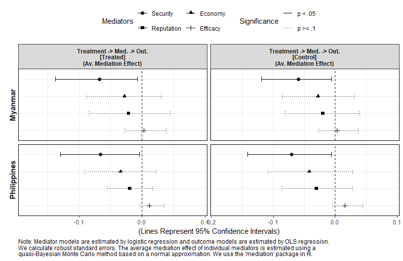
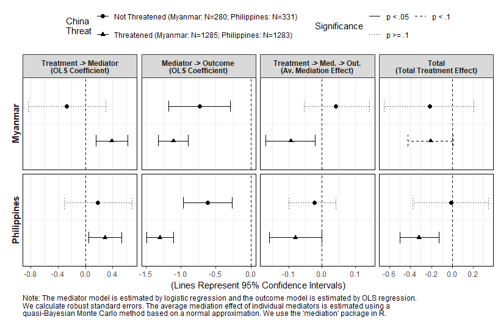
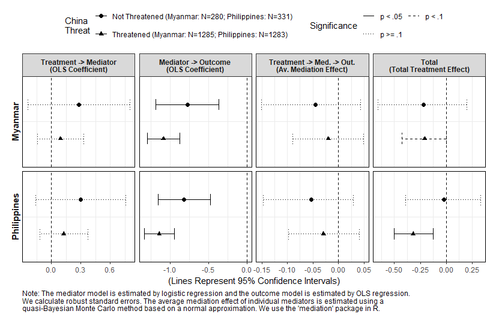
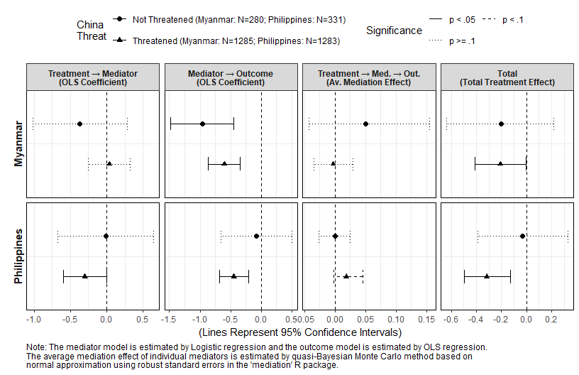
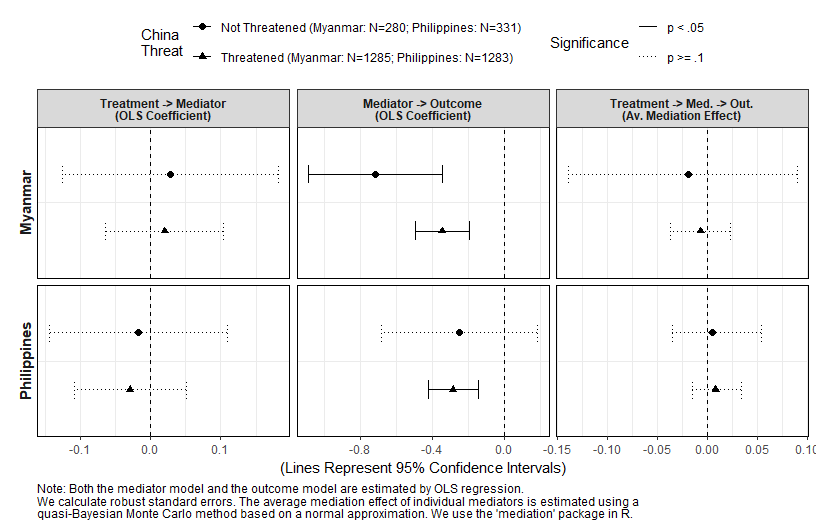
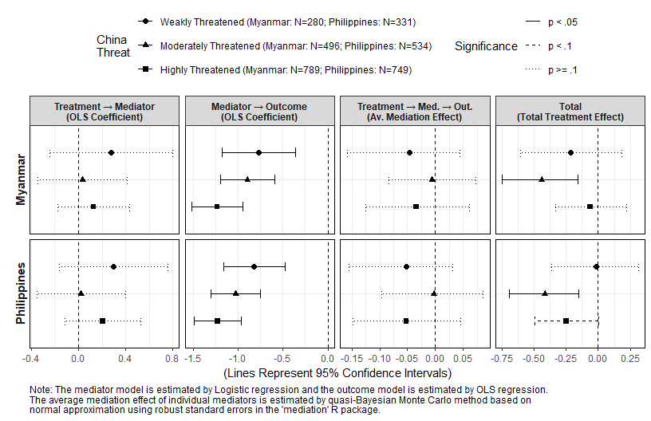
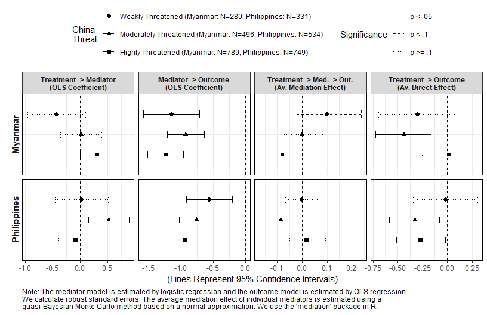

Analysis 3: Causal Mediation Analysis
================
Gento Kato
June 21, 2019

-   [Preparation](#preparation)
-   [Modeling Strategy for Causal Mediation Analysis](#modeling-strategy-for-causal-mediation-analysis)
    -   [Simple Mediation with Binary Mediators (Mediation Model is Logit)](#simple-mediation-with-binary-mediators-mediation-model-is-logit)
    -   [Simple Mediation with 5-cat Mediators (Mediation Model is OLS)](#simple-mediation-with-5-cat-mediators-mediation-model-is-ols)
    -   [Moderated Mediation with Binary Mediators (Mediation Model is Logit) and Binary Moderator (China Threat)](#moderated-mediation-with-binary-mediators-mediation-model-is-logit-and-binary-moderator-china-threat)
    -   [Moderated Mediation with 5-cat Mediators (Mediation Model is OLS) and Binary Moderator (China Threat)](#moderated-mediation-with-5-cat-mediators-mediation-model-is-ols-and-binary-moderator-china-threat)
    -   [Moderated Mediation with Binary Mediators (Mediation Model is Logit) and 3-cat Moderator (China Threat)](#moderated-mediation-with-binary-mediators-mediation-model-is-logit-and-3-cat-moderator-china-threat)
    -   [Moderated Mediation with 5-cat Mediators (Mediation Model is OLS) and 3-cat Moderator (China Threat)](#moderated-mediation-with-5-cat-mediators-mediation-model-is-ols-and-3-cat-moderator-china-threat)
    -   [JOINT Mediation Effect by medflex package](#joint-mediation-effect-by-medflex-package)
        -   [Preparation](#preparation-1)
        -   [2p Mediator and 9p Outcome](#p-mediator-and-9p-outcome)
        -   [5p Mediator and 9p Outcome](#p-mediator-and-9p-outcome-1)
-   [Visualizing Mediation Analysis Results](#visualizing-mediation-analysis-results)
    -   [Mediation Analysis (mediator model is Logit, outcome model is OLS)](#mediation-analysis-mediator-model-is-logit-outcome-model-is-ols)
    -   [Mediation Analysis (mediator model is OLS, outcome model is OLS)](#mediation-analysis-mediator-model-is-ols-outcome-model-is-ols)
-   [Moderated Mediation](#moderated-mediation)
    -   [2p Moderator with 2p Mediator (Logit) and 9p Outcome (OLS)](#p-moderator-with-2p-mediator-logit-and-9p-outcome-ols)
        -   [Only with Security Mediator](#only-with-security-mediator)
        -   [Only with Economy Mediator](#only-with-economy-mediator)
        -   [Only with Reputation Mediator](#only-with-reputation-mediator)
        -   [Only with Efficacy Mediator](#only-with-efficacy-mediator)
    -   [2p Moderator with 5p Mediator (OLS) and 9p Outcome (OLS)](#p-moderator-with-5p-mediator-ols-and-9p-outcome-ols)
        -   [Only with Security Mediator](#only-with-security-mediator-1)
        -   [Only with Economy Mediator](#only-with-economy-mediator-1)
        -   [Only with Reputation Mediator](#only-with-reputation-mediator-1)
        -   [Only with Efficacy Mediator](#only-with-efficacy-mediator-1)
    -   [3p Moderator with 2p Mediator (Logit) and 9p Outcome (OLS)](#p-moderator-with-2p-mediator-logit-and-9p-outcome-ols-1)
        -   [Only with Security Mediator](#only-with-security-mediator-2)
        -   [Only with Economy Mediator](#only-with-economy-mediator-2)
        -   [Only with Reputation Mediator](#only-with-reputation-mediator-2)
        -   [Only with Efficacy Mediator](#only-with-efficacy-mediator-2)
    -   [3p Moderator with 5p Mediator (OLS) and 9p Outcome (OLS)](#p-moderator-with-5p-mediator-ols-and-9p-outcome-ols-1)
        -   [Only with Security Mediator](#only-with-security-mediator-3)
        -   [Only with Economy Mediator](#only-with-economy-mediator-3)
        -   [Only with Reputation Mediator](#only-with-reputation-mediator-3)
        -   [Only with Efficacy Mediator](#only-with-efficacy-mediator-3)

Preparation
===========

``` r
## Clear Workspace
rm(list = ls())

## Set Working Directory (Automatically) ##
require(rprojroot); require(rstudioapi)
if (rstudioapi::isAvailable()==TRUE) {
  setwd(dirname(rstudioapi::getActiveDocumentContext()$path)); 
} 
projdir <- find_root(has_file("thisishome.txt"))
#cat(paste("Working Directory Set to:\n",projdir))
setwd(projdir)

## Required Functions & Packages
source("src/analysis0_functions.R", encoding = "CP932")
source("src/cl.mlogit.R")

## Load Data
do <- readRDS("data/donorexp.rds")
d <- do[do$comply==1,] # only compliers

## Subset Data
# MMR
d.MMR <- d[d$treatment %in% c(1,2),]
d.MMR$threat <- d.MMR$threat.MMR
d.MMR$imp <- d.MMR$imp.MMR
d.MMR$potential <- d.MMR$potential.MMR
# PHL
d.PHL <- d[d$treatment %in% c(3,5),]
d.PHL$threat <- d.PHL$threat.PHL
d.PHL$imp <- d.PHL$imp.PHL
d.PHL$potential <- d.PHL$potential.PHL
```

Modeling Strategy for Causal Mediation Analysis
===============================================

Add following covariates to the original model to reduce variance and justify the assumption that there are no unmeasured pre-treatment confounders that potentially causes both mediator and outcome. Additionally, the following analysis assume that there are no post-treatment confounders (no causal relationships between mediators).

-   Threat from MMR/PHL
-   Importance of MMR/PHL
-   Potential of MMR/PHL
-   International Issue Interests
-   ODA Importance
-   Gender
-   Age
-   Ideology

Estimated Models

-   Logit (Mediator/2cats) + OLS (Outcome/9cats)
-   OLS (Mediator/5cats) + OLS (Outcome/9cats)

Simple Mediation with Binary Mediators (Mediation Model is Logit)
-----------------------------------------------------------------

``` r
med.out.MMR.main <- gen.med.out(d.MMR,"cancel_aid",1000,
                                "src/processing/med.out.MMR.main.RData",
                                models=c("logit","gaussian"),
                                medcats=2)
med.out.PHL.main <- gen.med.out(d.PHL,"cancel_aid",1000,
                                "src/processing/med.out.PHL.main.RData",
                                models=c("logit","gaussian"),
                                medcats=2)
```

Simple Mediation with 5-cat Mediators (Mediation Model is OLS)
--------------------------------------------------------------

``` r
med.out.MMR.sub <- gen.med.out(d.MMR,"cancel_aid",1000,
                              "src/processing/med.out.MMR.sub.RData",
                              models=c("gaussian","gaussian"))
med.out.PHL.sub <- gen.med.out(d.PHL,"cancel_aid",1000,
                              "src/processing/med.out.PHL.sub.RData",
                              models=c("gaussian","gaussian"))
```

Moderated Mediation with Binary Mediators (Mediation Model is Logit) and Binary Moderator (China Threat)
--------------------------------------------------------------------------------------------------------

``` r
# When Moderator = 0
med.mod0.out.MMR.main.1 <- gen.med.out(d.MMR,"cancel_aid",1000,
                                     "src/processing/med.mod0.out.MMR.main.1.RData",
                                     models=c("logit","gaussian"),
                                     medcats = 2,
                                     moderated=TRUE,
                                     modvar="threat.CHN",
                                     modfix=0)
med.mod0.out.PHL.main.1 <- gen.med.out(d.PHL,"cancel_aid",1000,
                                       "src/processing/med.mod0.out.PHL.main.1.RData",
                                       models=c("logit","gaussian"),
                                       medcats = 2,
                                       moderated=TRUE, 
                                       modvar="threat.CHN",
                                       modfix=0)

# When Moderator = 1
med.mod1.out.MMR.main.1 <- gen.med.out(d.MMR,"cancel_aid",1000,
                                     "src/processing/med.mod1.out.MMR.main.1.RData",
                                     models=c("logit","gaussian"),
                                     medcats = 2,
                                     moderated=TRUE,
                                     modvar="threat.CHN",
                                     modfix=1)
med.mod1.out.PHL.main.1 <- gen.med.out(d.PHL,"cancel_aid",1000,
                                     "src/processing/med.mod1.out.PHL.main.1.RData",
                                     models=c("logit","gaussian"),
                                     medcats = 2,
                                     moderated=TRUE, 
                                     modvar="threat.CHN",
                                     modfix=1)
```

Moderated Mediation with 5-cat Mediators (Mediation Model is OLS) and Binary Moderator (China Threat)
-----------------------------------------------------------------------------------------------------

``` r
# When Moderator = 0
med.mod0.out.MMR.sub.1 <- gen.med.out(d.MMR,"cancel_aid",1000,
                              "src/processing/med.mod0.out.MMR.sub.1.RData",
                              models=c("gaussian","gaussian"),
                              moderated=TRUE, 
                              modvar="threat.CHN",
                              modfix=0)
med.mod0.out.PHL.sub.1 <- gen.med.out(d.PHL,"cancel_aid",1000,
                                      "src/processing/med.mod0.out.PHL.sub.1.RData",
                                      models=c("gaussian","gaussian"),
                                      moderated=TRUE, 
                                      modvar="threat.CHN",
                                      modfix=0)
# When Moderator = 1
med.mod1.out.MMR.sub.1 <- gen.med.out(d.MMR,"cancel_aid",1000,
                                  "src/processing/med.mod1.out.MMR.sub.1.RData",
                                  models=c("gaussian","gaussian"),
                                  moderated=TRUE, 
                                  modvar="threat.CHN",
                                  modfix=1)
med.mod1.out.PHL.sub.1 <- gen.med.out(d.PHL,"cancel_aid",1000,
                                   "src/processing/med.mod1.out.PHL.sub.1.RData",
                                   models=c("gaussian","gaussian"),
                                   moderated=TRUE, 
                                   modvar="threat.CHN",
                                   modfix=1)
```

Moderated Mediation with Binary Mediators (Mediation Model is Logit) and 3-cat Moderator (China Threat)
-------------------------------------------------------------------------------------------------------

``` r
# Moderator = 0
med.mod0.out.MMR.main.3 <- gen.med.out(d.MMR,"cancel_aid",1000,
                                       "src/processing/med.mod0.out.MMR.main.3.RData",
                                       models=c("logit","gaussian"),
                                       medcats = 2,
                                       moderated=TRUE,
                                       modvar="threat.CHN.3cat",
                                       modfix=0)
med.mod0.out.PHL.main.3 <- gen.med.out(d.PHL,"cancel_aid",1000,
                                       "src/processing/med.mod0.out.PHL.main.3.RData",
                                       models=c("logit","gaussian"),
                                       medcats = 2,
                                       moderated=TRUE, 
                                       modvar="threat.CHN.3cat",
                                       modfix=0)
# Moderator = 1
med.mod1.out.MMR.main.3 <- gen.med.out(d.MMR,"cancel_aid",1000,
                                       "src/processing/med.mod1.out.MMR.main.3.RData",
                                       models=c("logit","gaussian"),
                                       medcats = 2,
                                       moderated=TRUE,
                                       modvar="threat.CHN.3cat",
                                       modfix=1)
med.mod1.out.PHL.main.3 <- gen.med.out(d.PHL,"cancel_aid",1000,
                                       "src/processing/med.mod1.out.PHL.main.3.RData",
                                       models=c("logit","gaussian"),
                                       medcats = 2,
                                       moderated=TRUE, 
                                       modvar="threat.CHN.3cat",
                                       modfix=1)
# Moderator = 2
med.mod2.out.MMR.main.3 <- gen.med.out(d.MMR,"cancel_aid",1000,
                                       "src/processing/med.mod2.out.MMR.main.3.RData",
                                       models=c("logit","gaussian"),
                                       medcats = 2,
                                       moderated=TRUE,
                                       modvar="threat.CHN.3cat",
                                       modfix=2)
med.mod2.out.PHL.main.3 <- gen.med.out(d.PHL,"cancel_aid",1000,
                                       "src/processing/med.mod2.out.PHL.main.3.RData",
                                       models=c("logit","gaussian"),
                                       medcats = 2,
                                       moderated=TRUE, 
                                       modvar="threat.CHN.3cat",
                                       modfix=2)
```

Moderated Mediation with 5-cat Mediators (Mediation Model is OLS) and 3-cat Moderator (China Threat)
----------------------------------------------------------------------------------------------------

``` r
# Moderator = 0
med.mod0.out.MMR.sub.3 <- gen.med.out(d.MMR,"cancel_aid",1000,
                                      "src/processing/med.mod0.out.MMR.sub.3.RData",
                                      models=c("gaussian","gaussian"),
                                      moderated=TRUE, 
                                      modvar="threat.CHN.3cat",
                                      modfix=0)
med.mod0.out.PHL.sub.3 <- gen.med.out(d.PHL,"cancel_aid",1000,
                                      "src/processing/med.mod0.out.PHL.sub.3.RData",
                                      models=c("gaussian","gaussian"),
                                      moderated=TRUE, 
                                      modvar="threat.CHN.3cat",
                                      modfix=0)
# Moderator = 1
med.mod1.out.MMR.sub.3 <- gen.med.out(d.MMR,"cancel_aid",1000,
                                      "src/processing/med.mod1.out.MMR.sub.3.RData",
                                      models=c("gaussian","gaussian"),
                                      moderated=TRUE, 
                                      modvar="threat.CHN.3cat",
                                      modfix=1)
med.mod1.out.PHL.sub.3 <- gen.med.out(d.PHL,"cancel_aid",1000,
                                      "src/processing/med.mod1.out.PHL.sub.3.RData",
                                      models=c("gaussian","gaussian"),
                                      moderated=TRUE, 
                                      modvar="threat.CHN.3cat",
                                      modfix=1)
# Moderator = 2
med.mod2.out.MMR.sub.3 <- gen.med.out(d.MMR,"cancel_aid",1000,
                                      "src/processing/med.mod2.out.MMR.sub.3.RData",
                                      models=c("gaussian","gaussian"),
                                      moderated=TRUE, 
                                      modvar="threat.CHN.3cat",
                                      modfix=2)
med.mod2.out.PHL.sub.3 <- gen.med.out(d.PHL,"cancel_aid",1000,
                                      "src/processing/med.mod2.out.PHL.sub.3.RData",
                                      models=c("gaussian","gaussian"),
                                      moderated=TRUE, 
                                      modvar="threat.CHN.3cat",
                                      modfix=2)
```

JOINT Mediation Effect by medflex package
-----------------------------------------

``` r
require(medflex)
```

### Preparation

``` r
# Add New Variables
d$cancel_aid <- as.numeric(d$cancel_aid)
d$med_econ <- as.numeric(d$med_econ)
d$med_secu <- as.numeric(d$med_secu)
d$med_repu <- as.numeric(d$med_repu)
d$med_effi <- as.numeric(d$med_effi)
d$med_econ_2cat <- ifelse(d$med_econ>3,1,0)
d$med_secu_2cat <- ifelse(d$med_secu>3,1,0)
d$med_repu_2cat <- ifelse(d$med_repu>3,1,0)
d$med_effi_2cat <- ifelse(d$med_effi>3,1,0)
## Subset Data
# MMR
d.MMR <- d[d$treatment %in% c(1,2),]
d.MMR$threat <- d.MMR$threat.MMR
d.MMR$imp <- d.MMR$imp.MMR
d.MMR$potential <- d.MMR$potential.MMR
# PHL
d.PHL <- d[d$treatment %in% c(3,5),]
d.PHL$threat <- d.PHL$threat.PHL
d.PHL$imp <- d.PHL$imp.PHL
d.PHL$potential <- d.PHL$potential.PHL
# Drop Cases with Missing Values in Relevant Variables
vars <- c("cancel_aid","treat_China","threat","imp","potential",  
          "issint","odaimp","fem","age","ide3",
          "med_econ","med_secu","med_repu","med_effi",
          "med_econ_2cat","med_secu_2cat","med_repu_2cat","med_effi_2cat")
d.MMR.sub <- na.omit(d.MMR[,vars])
d.PHL.sub <- na.omit(d.PHL[,vars])
```

### 2p Mediator and 9p Outcome

``` r
# Myanmar
di.MMR.main <- neImpute(update(cancel_aid ~ treat_China + med_secu_2cat * med_econ_2cat * med_repu_2cat * med_effi_2cat, fcv),
                        family = "gaussian", nMed = 4, data = d.MMR.sub)
m.MMR.main <- neModel(update(cancel_aid ~ treat_China0 + treat_China1, fcv), 
                      family = "gaussian", expData = di.MMR.main, se = "robust")
summary(m.MMR.main)
```

    ## Natural effect model
    ## with robust standard errors based on the sandwich estimator
    ## ---
    ## Exposure: treat_China 
    ## Mediator(s): med_secu_2cat, med_econ_2cat, med_repu_2cat, med_effi_2cat 
    ## ---
    ## Parameter estimates:
    ##               Estimate Std. Error z value Pr(>|z|)    
    ## (Intercept)   6.152765   0.262325  23.455  < 2e-16 ***
    ## treat_China0 -0.135989   0.086944  -1.564 0.117796    
    ## treat_China1 -0.069861   0.037646  -1.856 0.063492 .  
    ## threat1       0.212244   0.110901   1.914 0.055644 .  
    ## threat2       0.773750   0.238740   3.241 0.001191 ** 
    ## imp1          0.024301   0.164059   0.148 0.882246    
    ## imp2         -0.075785   0.168267  -0.450 0.652430    
    ## potential1   -0.461288   0.134787  -3.422 0.000621 ***
    ## potential2   -0.870683   0.151896  -5.732 9.92e-09 ***
    ## issint1       0.297408   0.114528   2.597 0.009409 ** 
    ## issint2       0.225472   0.147374   1.530 0.126033    
    ## odaimp       -1.551608   0.128434 -12.081  < 2e-16 ***
    ## fem           0.192450   0.094792   2.030 0.042333 *  
    ## age          -0.002140   0.003582  -0.597 0.550185    
    ## ide31         0.042923   0.126122   0.340 0.733611    
    ## ide32        -0.011803   0.122375  -0.096 0.923162    
    ## ---
    ## Signif. codes:  0 '***' 0.001 '**' 0.01 '*' 0.05 '.' 0.1 ' ' 1

``` r
# Philippines
di.PHL.main <- neImpute(update(cancel_aid ~ treat_China + med_secu_2cat * med_econ_2cat * med_repu_2cat * med_effi_2cat, fcv),
                        family = "gaussian", nMed = 4, data = d.PHL.sub)
m.PHL.main <- neModel(update(cancel_aid ~ treat_China0 + treat_China1, fcv), 
                      family = "gaussian", expData = di.PHL.main, se = "robust")
summary(m.PHL.main)
```

    ## Natural effect model
    ## with robust standard errors based on the sandwich estimator
    ## ---
    ## Exposure: treat_China 
    ## Mediator(s): med_secu_2cat, med_econ_2cat, med_repu_2cat, med_effi_2cat 
    ## ---
    ## Parameter estimates:
    ##                Estimate Std. Error z value Pr(>|z|)    
    ## (Intercept)   6.9637357  0.2605957  26.722  < 2e-16 ***
    ## treat_China0 -0.1713836  0.0760625  -2.253  0.02425 *  
    ## treat_China1 -0.0817775  0.0350074  -2.336  0.01949 *  
    ## threat1       0.0845391  0.0914884   0.924  0.35546    
    ## threat2       0.3788588  0.2035054   1.862  0.06265 .  
    ## imp1         -0.5248020  0.1641095  -3.198  0.00138 ** 
    ## imp2         -0.7454103  0.1653875  -4.507 6.57e-06 ***
    ## potential1   -0.2507919  0.1228637  -2.041  0.04123 *  
    ## potential2   -0.7251806  0.1382005  -5.247 1.54e-07 ***
    ## issint1       0.0442658  0.1100714   0.402  0.68757    
    ## issint2      -0.2777884  0.1353675  -2.052  0.04016 *  
    ## odaimp       -1.9379068  0.1205487 -16.076  < 2e-16 ***
    ## fem           0.3668479  0.0835904   4.389 1.14e-05 ***
    ## age          -0.0001221  0.0031429  -0.039  0.96901    
    ## ide31        -0.0498186  0.1149400  -0.433  0.66470    
    ## ide32        -0.3353907  0.1164616  -2.880  0.00398 ** 
    ## ---
    ## Signif. codes:  0 '***' 0.001 '**' 0.01 '*' 0.05 '.' 0.1 ' ' 1

``` r
# Convert Results Into Data
tmp <- as.data.frame(rbind(estrow2(m.MMR.main, at=3),estrow2(m.MMR.main, at=2),
                           estrow2(m.PHL.main, at=3),estrow2(m.PHL.main, at=2)))
tmp$pcat <- "p >= .1"
tmp$pcat[tmp$p10==1] <- "p < .1"
tmp$pcat[tmp$p05==1] <- "p < .05"
tmp$pcat <- factor(tmp$pcat,levels=c("p < .05","p < .1", "p >= .1"))
tmp$eff <- factor(rep(c("Treatment → Med. → Out.","Treatment → Outcome"),2),
                  levels=c("Treatment → Med. → Out.","Treatment → Outcome"))
tmp$country <- factor(rep(c("Myanmar","Philippines"),each=2),levels=c("Myanmar","Philippines"))
tmp$med <- as.factor("JOINT")
med.out.main.JOINT.data <- tmp[,c("est","loCI","upCI","p","med","eff","p05","p10","pcat","country")]
```

### 5p Mediator and 9p Outcome

``` r
# Myanmar
di.MMR.sub <- neImpute(update(cancel_aid ~ treat_China + med_secu * med_econ * med_repu * med_effi, fcv),
                       family = "gaussian", nMed = 4, data = d.MMR.sub)
m.MMR.sub <- neModel(update(cancel_aid ~ treat_China0 + treat_China1, fcv), 
                     family = "gaussian", expData = di.MMR.sub, se = "robust")
summary(m.MMR.sub)
```

    ## Natural effect model
    ## with robust standard errors based on the sandwich estimator
    ## ---
    ## Exposure: treat_China 
    ## Mediator(s): med_secu, med_econ, med_repu, med_effi 
    ## ---
    ## Parameter estimates:
    ##               Estimate Std. Error z value Pr(>|z|)    
    ## (Intercept)   6.152765   0.262325  23.455  < 2e-16 ***
    ## treat_China0 -0.094787   0.082852  -1.144 0.252600    
    ## treat_China1 -0.111063   0.044423  -2.500 0.012414 *  
    ## threat1       0.212244   0.110901   1.914 0.055644 .  
    ## threat2       0.773750   0.238740   3.241 0.001191 ** 
    ## imp1          0.024301   0.164059   0.148 0.882246    
    ## imp2         -0.075785   0.168267  -0.450 0.652430    
    ## potential1   -0.461288   0.134787  -3.422 0.000621 ***
    ## potential2   -0.870683   0.151896  -5.732 9.92e-09 ***
    ## issint1       0.297408   0.114528   2.597 0.009409 ** 
    ## issint2       0.225472   0.147374   1.530 0.126033    
    ## odaimp       -1.551608   0.128434 -12.081  < 2e-16 ***
    ## fem           0.192450   0.094792   2.030 0.042333 *  
    ## age          -0.002140   0.003582  -0.597 0.550185    
    ## ide31         0.042923   0.126122   0.340 0.733611    
    ## ide32        -0.011803   0.122375  -0.096 0.923162    
    ## ---
    ## Signif. codes:  0 '***' 0.001 '**' 0.01 '*' 0.05 '.' 0.1 ' ' 1

``` r
# Philippines
di.PHL.sub <- neImpute(update(cancel_aid ~ treat_China + med_secu * med_econ * med_repu * med_effi, fcv),
                       family = "gaussian", nMed = 4, data = d.PHL.sub)
m.PHL.sub <- neModel(update(cancel_aid ~ treat_China0 + treat_China1, fcv), 
                     family = "gaussian", expData = di.PHL.sub, se = "robust")

# Convert Results Into Data
tmp <- as.data.frame(rbind(estrow2(m.MMR.sub, at=3),estrow2(m.MMR.sub, at=2),
                           estrow2(m.PHL.sub, at=3),estrow2(m.PHL.sub, at=2)))
tmp$pcat <- "p >= .1"
tmp$pcat[tmp$p10==1] <- "p < .1"
tmp$pcat[tmp$p05==1] <- "p < .05"
tmp$pcat <- factor(tmp$pcat,levels=c("p < .05","p < .1", "p >= .1"))
tmp$eff <- factor(rep(c("Treatment → Med. → Out.","Treatment → Outcome"),2),
                  levels=c("Treatment → Med. → Out.","Treatment → Outcome"))
tmp$country <- factor(rep(c("Myanmar","Philippines"),each=2),levels=c("Myanmar","Philippines"))
tmp$med <- as.factor("JOINT")
med.out.sub.JOINT.data <- tmp[,c("est","loCI","upCI","p","med","eff","p05","p10","pcat","country")]
```

Visualizing Mediation Analysis Results
======================================

Mediation Analysis (mediator model is Logit, outcome model is OLS)
------------------------------------------------------------------

``` r
# Plotting Data
med.out.main.data <- gendata(med.out.MMR.sub,med.out.PHL.sub,mod=FALSE)
med.out.main.data <- rbind(med.out.main.JOINT.data,med.out.main.data)

# Prepare Caption
captiontxt <- 
"Note: Mediator models are estimated by Logistic regression and outcome models are estimated by OLS regression.
The average mediation effect of individual mediators is estimated by quasi-Bayesian Monte Carlo method based on 
normal approximation using robust standard errors in the 'mediation' R package. 'JOINT' is the joint mediation effect of 
all mediators estimated by imputation-based approach used in the 'medflex' R package."

# W/O Direct Effect
p <- genplot(med.out.main.data,
             captiontxt=captiontxt,
             include.eff = c("Treatment → Mediator",
                             "Mediator → Outcome",
                             "Treatment → Med. → Out."),
             est.type = c("Logit Coefficient",
                          "OLS Coefficient",
                          "Av. Mediation Effect")) 
```

``` r
p
```


``` r
png_save(p, w=850, h=550, file=c("out/med.out.main.plot.woDE.png"))

# W/ Direct Effect
p <- genplot(med.out.main.data,
             captiontxt=captiontxt,
             include.eff = c("Treatment → Mediator",
                             "Mediator → Outcome",
                             "Treatment → Med. → Out.",
                             "Treatment → Outcome"),
             est.type = c("Logit Coefficient",
                          "OLS Coefficient",
                          "Av. Mediation Effect",
                          "Av. Direct Effect")) 
```

``` r
p
```


``` r
png_save(p, w=850, h=550, file=c("out/med.out.main.plot.wDE.png"))
```

Mediation Analysis (mediator model is OLS, outcome model is OLS)
----------------------------------------------------------------

``` r
# Plotting Data
med.out.sub.data <- gendata(med.out.MMR.sub,med.out.PHL.sub, mod=FALSE)
med.out.sub.data <- rbind(med.out.sub.JOINT.data,med.out.sub.data)

# Prepare Caption
captiontxt <- 
"Note: Both mediator models and outcome models are estimated by OLS regression. 
The average mediation effect of individual mediators is estimated by quasi-Bayesian Monte Carlo method based on 
normal approximation using robust standard errors in the 'mediation' R package. 'JOINT' is the joint mediation effect of 
all mediators estimated by imputation-based approach used in the 'medflex' R package."

# W/O Direct Effect
p <- genplot(med.out.sub.data,
             captiontxt=captiontxt,
             include.eff = c("Treatment → Mediator",
                             "Mediator → Outcome",
                             "Treatment → Med. → Out."),
             est.type = c("Logit Coefficient",
                          "OLS Coefficient",
                          "Av. Mediation Effect")) 
```

``` r
p
```


``` r
png_save(p, w=850, h=550, file=c("out/med.out.sub.plot.woDE.png"))

# W/ Direct Effect
p <- genplot(med.out.sub.data,
             captiontxt=captiontxt,
             include.eff = c("Treatment → Mediator",
                             "Mediator → Outcome",
                             "Treatment → Med. → Out.",
                             "Treatment → Outcome"),
             est.type = c("Logit Coefficient",
                          "OLS Coefficient",
                          "Av. Mediation Effect",
                          "Av. Direct Effect")) 
```

``` r
p
```


``` r
png_save(p, w=850, h=550, file=c("out/med.out.sub.plot.wDE.png"))
```

Moderated Mediation
===================

Assess moderation by threat perception to China

2p Moderator with 2p Mediator (Logit) and 9p Outcome (OLS)
----------------------------------------------------------

``` r
# Prepare Data
med.mod1.out.main.1.data <- gendata(med.mod1.out.MMR.main.1,med.mod1.out.PHL.main.1,mod=TRUE,modN=2,modval=1)
med.mod1.out.main.1.data$tcond <- paste("Threatened (Myanmar: N=", 1285, "; Philippines: N=", 1283, ")",sep="")
med.mod0.out.main.1.data <- gendata(med.mod0.out.MMR.main.1,med.mod0.out.PHL.main.1,mod=TRUE,modN=2,modval=0)
med.mod0.out.main.1.data$tcond <- paste("Not Threatened (Myanmar: N=", 280, "; Philippines: N=", 331, ")",sep="")
med.mod.out.main.1.data <- rbind(med.mod1.out.main.1.data,med.mod0.out.main.1.data)
med.mod.out.main.1.data$tcond <- factor(med.mod.out.main.1.data$tcond, 
                                        levels=unique(med.mod.out.main.1.data$tcond))

# Prepare Caption
captiontxt <- 
  "Note: The mediator model is estimated by Logistic regression and the outcome model is estimated by OLS regression.
The average mediation effect of individual mediators is estimated by quasi-Bayesian Monte Carlo method based on 
normal approximation using robust standard errors in the 'mediation' R package."
```

### Only with Security Mediator

``` r
# Plot W/O Direct Effect
p <- genplot2(med.mod.out.main.1.data[med.mod.out.main.1.data$med=="Security",],
              captiontxt = captiontxt,
              include.eff = c("Treatment → Mediator",
                              "Mediator → Outcome",
                              "Treatment → Med. → Out."),
              est.type = c("OLS Coefficient",
                           "OLS Coefficient",
                           "Av. Mediation Effect"))
```

``` r
p
```



``` r
png_save(p, w=850, h=550, file=c("out/med.mod.out.main.1.secu.plot.woDE.png"))

# Plot W/ Direct Effect
p <- genplot2(med.mod.out.main.1.data[med.mod.out.main.1.data$med=="Security",],
              captiontxt = captiontxt,
              include.eff = c("Treatment → Mediator",
                              "Mediator → Outcome",
                              "Treatment → Med. → Out.",
                              "Treatment → Outcome"),
              est.type = c("OLS Coefficient",
                           "OLS Coefficient",
                           "Av. Mediation Effect",
                           "Av. Direct Effect"))
```

``` r
p
```


``` r
png_save(p, w=850, h=550, file=c("out/med.mod.out.main.1.secu.plot.wDE.png"))

# Plot W/ Total Effect
p <- genplot2(med.mod.out.main.1.data[med.mod.out.main.1.data$med=="Security",],
              captiontxt = captiontxt,
              include.eff = c("Treatment → Mediator",
                              "Mediator → Outcome",
                              "Treatment → Med. → Out.",
                              "Total"),
              est.type = c("OLS Coefficient",
                           "OLS Coefficient",
                           "Av. Mediation Effect",
                           "Total Treatment Effect"))
```

``` r
p
```


``` r
png_save(p, w=850, h=550, file=c("out/med.mod.out.main.1.secu.plot.wTE.png"))
```

### Only with Economy Mediator

``` r
# Plot W/O Direct Effect
p <- genplot2(med.mod.out.main.1.data[med.mod.out.main.1.data$med=="Economy",],
              captiontxt = captiontxt,
              include.eff = c("Treatment → Mediator",
                              "Mediator → Outcome",
                              "Treatment → Med. → Out."),
              est.type = c("OLS Coefficient",
                           "OLS Coefficient",
                           "Av. Mediation Effect"))
```

``` r
p
```


``` r
png_save(p, w=850, h=550, file=c("out/med.mod.out.main.1.econ.plot.woDE.png"))

# Plot W/ Direct Effect
p <- genplot2(med.mod.out.main.1.data[med.mod.out.main.1.data$med=="Economy",],
              captiontxt = captiontxt,
              include.eff = c("Treatment → Mediator",
                              "Mediator → Outcome",
                              "Treatment → Med. → Out.",
                              "Treatment → Outcome"),
              est.type = c("OLS Coefficient",
                           "OLS Coefficient",
                           "Av. Mediation Effect",
                           "Av. Direct Effect"))
```

``` r
p
```


``` r
png_save(p, w=850, h=550, file=c("out/med.mod.out.main.1.econ.plot.wDE.png"))

# Plot W/ Total Effect
p <- genplot2(med.mod.out.main.1.data[med.mod.out.main.1.data$med=="Economy",],
              captiontxt = captiontxt,
              include.eff = c("Treatment → Mediator",
                              "Mediator → Outcome",
                              "Treatment → Med. → Out.",
                              "Total"),
              est.type = c("OLS Coefficient",
                           "OLS Coefficient",
                           "Av. Mediation Effect",
                           "Total Treatment Effect"))
```

``` r
p
```


``` r
png_save(p, w=850, h=550, file=c("out/med.mod.out.main.1.econ.plot.wTE.png"))
```

### Only with Reputation Mediator

``` r
# Plot W/O Direct Effect
p <- genplot2(med.mod.out.main.1.data[med.mod.out.main.1.data$med=="Reputation",],
              captiontxt = captiontxt,
              include.eff = c("Treatment → Mediator",
                              "Mediator → Outcome",
                              "Treatment → Med. → Out."),
              est.type = c("OLS Coefficient",
                           "OLS Coefficient",
                           "Av. Mediation Effect"))
```

``` r
p
```



``` r
png_save(p, w=850, h=550, file=c("out/med.mod.out.main.1.repu.plot.woDE.png"))

# Plot W/ Direct Effect
p <- genplot2(med.mod.out.main.1.data[med.mod.out.main.1.data$med=="Reputation",],
              captiontxt = captiontxt,
              include.eff = c("Treatment → Mediator",
                              "Mediator → Outcome",
                              "Treatment → Med. → Out.",
                              "Treatment → Outcome"),
              est.type = c("OLS Coefficient",
                           "OLS Coefficient",
                           "Av. Mediation Effect",
                           "Av. Direct Effect"))
```

``` r
p
```


``` r
png_save(p, w=850, h=550, file=c("out/med.mod.out.main.1.repu.plot.wDE.png"))

# Plot W/ Total Effect
p <- genplot2(med.mod.out.main.1.data[med.mod.out.main.1.data$med=="Reputation",],
              captiontxt = captiontxt,
              include.eff = c("Treatment → Mediator",
                              "Mediator → Outcome",
                              "Treatment → Med. → Out.",
                              "Total"),
              est.type = c("OLS Coefficient",
                           "OLS Coefficient",
                           "Av. Mediation Effect",
                           "Total Treatment Effect"))
```

``` r
p
```


``` r
png_save(p, w=850, h=550, file=c("out/med.mod.out.main.1.repu.plot.wTE.png"))
```

### Only with Efficacy Mediator

``` r
# Plot W/O Direct Effect
p <- genplot2(med.mod.out.main.1.data[med.mod.out.main.1.data$med=="Efficacy",],
              captiontxt = captiontxt,
              include.eff = c("Treatment → Mediator",
                              "Mediator → Outcome",
                              "Treatment → Med. → Out."),
              est.type = c("OLS Coefficient",
                           "OLS Coefficient",
                           "Av. Mediation Effect"))
```

``` r
p
```


``` r
png_save(p, w=850, h=550, file=c("out/med.mod.out.main.1.effi.plot.woDE.png"))

# Plot W/ Direct Effect
p <- genplot2(med.mod.out.main.1.data[med.mod.out.main.1.data$med=="Efficacy",],
              captiontxt = captiontxt,
              include.eff = c("Treatment → Mediator",
                              "Mediator → Outcome",
                              "Treatment → Med. → Out.",
                              "Treatment → Outcome"),
              est.type = c("OLS Coefficient",
                           "OLS Coefficient",
                           "Av. Mediation Effect",
                           "Av. Direct Effect"))
```

``` r
p
```



``` r
png_save(p, w=850, h=550, file=c("out/med.mod.out.main.1.effi.plot.wDE.png"))

# Plot W/ Total Effect
p <- genplot2(med.mod.out.main.1.data[med.mod.out.main.1.data$med=="Efficacy",],
              captiontxt = captiontxt,
              include.eff = c("Treatment → Mediator",
                              "Mediator → Outcome",
                              "Treatment → Med. → Out.",
                              "Total"),
              est.type = c("OLS Coefficient",
                           "OLS Coefficient",
                           "Av. Mediation Effect",
                           "Total Treatment Effect"))
```

``` r
p
```


``` r
png_save(p, w=850, h=550, file=c("out/med.mod.out.main.1.effi.plot.wTE.png"))
```

2p Moderator with 5p Mediator (OLS) and 9p Outcome (OLS)
--------------------------------------------------------

``` r
# Prepare Data
med.mod1.out.sub.1.data <- gendata(med.mod1.out.MMR.sub.1,med.mod1.out.PHL.sub.1,mod=TRUE,modN=2,modval=1)
med.mod1.out.sub.1.data$tcond <- paste("Threatened (Myanmar: N=", 1285, "; Philippines: N=", 1283, ")",sep="")
med.mod0.out.sub.1.data <- gendata(med.mod0.out.MMR.sub.1,med.mod0.out.PHL.sub.1,mod=TRUE,modN=2,modval=0)
med.mod0.out.sub.1.data$tcond <- paste("Not Threatened (Myanmar: N=", 280, "; Philippines: N=", 331, ")",sep="")
med.mod.out.sub.1.data <- rbind(med.mod1.out.sub.1.data,med.mod0.out.sub.1.data)
med.mod.out.sub.1.data$tcond <- factor(med.mod.out.sub.1.data$tcond, 
                                        levels=unique(med.mod.out.sub.1.data$tcond))

# Prepare Caption
captiontxt <- 
  "Note: Both the mediator model and the outcome model are estimated by OLS regression. 
The average mediation effect of individual mediators is estimated by quasi-Bayesian Monte Carlo method based on 
normal approximation using robust standard errors in the 'mediation' R package."
```

### Only with Security Mediator

``` r
# Plot W/O Direct Effect
p <- genplot2(med.mod.out.sub.1.data[med.mod.out.sub.1.data$med=="Security",],
              captiontxt = captiontxt,
              include.eff = c("Treatment → Mediator",
                              "Mediator → Outcome",
                              "Treatment → Med. → Out."),
              est.type = c("OLS Coefficient",
                           "OLS Coefficient",
                           "Av. Mediation Effect"))
```

``` r
p
```


``` r
png_save(p, w=850, h=550, file=c("out/med.mod.out.sub.1.secu.plot.woDE.png"))

# Plot W/ Direct Effect
p <- genplot2(med.mod.out.sub.1.data[med.mod.out.sub.1.data$med=="Security",],
              captiontxt = captiontxt,
              include.eff = c("Treatment → Mediator",
                              "Mediator → Outcome",
                              "Treatment → Med. → Out.",
                              "Treatment → Outcome"),
              est.type = c("OLS Coefficient",
                           "OLS Coefficient",
                           "Av. Mediation Effect",
                           "Av. Direct Effect"))
```

``` r
p
```



``` r
png_save(p, w=850, h=550, file=c("out/med.mod.out.sub.1.secu.plot.wDE.png"))

# Plot W/ Total Effect
p <- genplot2(med.mod.out.sub.1.data[med.mod.out.sub.1.data$med=="Security",],
              captiontxt = captiontxt,
              include.eff = c("Treatment → Mediator",
                              "Mediator → Outcome",
                              "Treatment → Med. → Out.",
                              "Total"),
              est.type = c("OLS Coefficient",
                           "OLS Coefficient",
                           "Av. Mediation Effect",
                           "Total Treatment Effect"))
```

``` r
p
```


``` r
png_save(p, w=850, h=550, file=c("out/med.mod.out.sub.1.secu.plot.wTE.png"))
```

### Only with Economy Mediator

``` r
# Plot W/O Direct Effect
p <- genplot2(med.mod.out.sub.1.data[med.mod.out.sub.1.data$med=="Economy",],
              captiontxt = captiontxt,
              include.eff = c("Treatment → Mediator",
                              "Mediator → Outcome",
                              "Treatment → Med. → Out."),
              est.type = c("OLS Coefficient",
                           "OLS Coefficient",
                           "Av. Mediation Effect"))
```

``` r
p
```


``` r
png_save(p, w=850, h=550, file=c("out/med.mod.out.sub.1.econ.plot.woDE.png"))

# Plot W/ Direct Effect
p <- genplot2(med.mod.out.sub.1.data[med.mod.out.sub.1.data$med=="Economy",],
              captiontxt = captiontxt,
              include.eff = c("Treatment → Mediator",
                              "Mediator → Outcome",
                              "Treatment → Med. → Out.",
                              "Treatment → Outcome"),
              est.type = c("OLS Coefficient",
                           "OLS Coefficient",
                           "Av. Mediation Effect",
                           "Av. Direct Effect"))
```

``` r
p
```


``` r
png_save(p, w=850, h=550, file=c("out/med.mod.out.sub.1.econ.plot.wDE.png"))

# Plot W/ Total Effect
p <- genplot2(med.mod.out.sub.1.data[med.mod.out.sub.1.data$med=="Economy",],
              captiontxt = captiontxt,
              include.eff = c("Treatment → Mediator",
                              "Mediator → Outcome",
                              "Treatment → Med. → Out.",
                              "Total"),
              est.type = c("OLS Coefficient",
                           "OLS Coefficient",
                           "Av. Mediation Effect",
                           "Total Treatment Effect"))
```

``` r
p
```


``` r
png_save(p, w=850, h=550, file=c("out/med.mod.out.sub.1.econ.plot.wTE.png"))
```

### Only with Reputation Mediator

``` r
# Plot W/O Direct Effect
p <- genplot2(med.mod.out.sub.1.data[med.mod.out.sub.1.data$med=="Reputation",],
              captiontxt = captiontxt,
              include.eff = c("Treatment → Mediator",
                              "Mediator → Outcome",
                              "Treatment → Med. → Out."),
              est.type = c("OLS Coefficient",
                           "OLS Coefficient",
                           "Av. Mediation Effect"))
```

``` r
p
```


``` r
png_save(p, w=850, h=550, file=c("out/med.mod.out.sub.1.repu.plot.woDE.png"))

# Plot W/ Direct Effect
p <- genplot2(med.mod.out.sub.1.data[med.mod.out.sub.1.data$med=="Reputation",],
              captiontxt = captiontxt,
              include.eff = c("Treatment → Mediator",
                              "Mediator → Outcome",
                              "Treatment → Med. → Out.",
                              "Treatment → Outcome"),
              est.type = c("OLS Coefficient",
                           "OLS Coefficient",
                           "Av. Mediation Effect",
                           "Av. Direct Effect"))
```

``` r
p
```


``` r
png_save(p, w=850, h=550, file=c("out/med.mod.out.sub.1.repu.plot.wDE.png"))

# Plot W/ Total Effect
p <- genplot2(med.mod.out.sub.1.data[med.mod.out.sub.1.data$med=="Reputation",],
              captiontxt = captiontxt,
              include.eff = c("Treatment → Mediator",
                              "Mediator → Outcome",
                              "Treatment → Med. → Out.",
                              "Total"),
              est.type = c("OLS Coefficient",
                           "OLS Coefficient",
                           "Av. Mediation Effect",
                           "Total Treatment Effect"))
```

``` r
p
```


``` r
png_save(p, w=850, h=550, file=c("out/med.mod.out.sub.1.repu.plot.wTE.png"))
```

### Only with Efficacy Mediator

``` r
# Plot W/O Direct Effect
p <- genplot2(med.mod.out.sub.1.data[med.mod.out.sub.1.data$med=="Efficacy",],
              captiontxt = captiontxt,
              include.eff = c("Treatment → Mediator",
                              "Mediator → Outcome",
                              "Treatment → Med. → Out."),
              est.type = c("OLS Coefficient",
                           "OLS Coefficient",
                           "Av. Mediation Effect"))
```

``` r
p
```


``` r
png_save(p, w=850, h=550, file=c("out/med.mod.out.sub.1.effi.plot.woDE.png"))

# Plot W/ Direct Effect
p <- genplot2(med.mod.out.sub.1.data[med.mod.out.sub.1.data$med=="Efficacy",],
              captiontxt = captiontxt,
              include.eff = c("Treatment → Mediator",
                              "Mediator → Outcome",
                              "Treatment → Med. → Out.",
                              "Treatment → Outcome"),
              est.type = c("OLS Coefficient",
                           "OLS Coefficient",
                           "Av. Mediation Effect",
                           "Av. Direct Effect"))
```

``` r
p
```


``` r
png_save(p, w=850, h=550, file=c("out/med.mod.out.sub.1.effi.plot.wDE.png"))

# Plot W/ Total Effect
p <- genplot2(med.mod.out.sub.1.data[med.mod.out.sub.1.data$med=="Efficacy",],
              captiontxt = captiontxt,
              include.eff = c("Treatment → Mediator",
                              "Mediator → Outcome",
                              "Treatment → Med. → Out.",
                              "Total"),
              est.type = c("OLS Coefficient",
                           "OLS Coefficient",
                           "Av. Mediation Effect",
                           "Total Treatment Effect"))
```

``` r
p
```


``` r
png_save(p, w=850, h=550, file=c("out/med.mod.out.sub.1.effi.plot.wTE.png"))
```

3p Moderator with 2p Mediator (Logit) and 9p Outcome (OLS)
----------------------------------------------------------

``` r
# Prepare Data
med.mod2.out.main.3.data <- gendata(med.mod2.out.MMR.main.3,med.mod2.out.PHL.main.3,mod=TRUE,modN=3,modval=2)
med.mod2.out.main.3.data$tcond <- paste("Highly Threatened (Myanmar: N=", 789, "; Philippines: N=", 749, ")",sep="")
med.mod1.out.main.3.data <- gendata(med.mod1.out.MMR.main.3,med.mod1.out.PHL.main.3,mod=TRUE,modN=3,modval=1)
med.mod1.out.main.3.data$tcond <- paste("Moderately Threatened (Myanmar: N=", 496, "; Philippines: N=", 534, ")",sep="")
med.mod0.out.main.3.data <- gendata(med.mod0.out.MMR.main.3,med.mod0.out.PHL.main.3,mod=TRUE,modN=3,modval=0)
med.mod0.out.main.3.data$tcond <- paste("Weakly Threatened (Myanmar: N=", 280, "; Philippines: N=", 331, ")",sep="")
med.mod.out.main.3.data <- rbind(med.mod2.out.main.3.data,
                                 med.mod1.out.main.3.data,
                                 med.mod0.out.main.3.data)
med.mod.out.main.3.data$tcond <- factor(med.mod.out.main.3.data$tcond, 
                                        levels=unique(med.mod.out.main.3.data$tcond))

# Prepare Caption
captiontxt <- 
  "Note: The mediator model is estimated by Logistic regression and the outcome model is estimated by OLS regression.
The average mediation effect of individual mediators is estimated by quasi-Bayesian Monte Carlo method based on 
normal approximation using robust standard errors in the 'mediation' R package."
```

### Only with Security Mediator

``` r
# Plot W/O Direct Effect
p <- genplot2(med.mod.out.main.3.data[med.mod.out.main.3.data$med=="Security",],
              captiontxt = captiontxt, legendrow=3,
              include.eff = c("Treatment → Mediator",
                              "Mediator → Outcome",
                              "Treatment → Med. → Out."),
              est.type = c("OLS Coefficient",
                           "OLS Coefficient",
                           "Av. Mediation Effect"))
```

``` r
p
```


``` r
png_save(p, w=850, h=550, file=c("out/med.mod.out.main.3.secu.plot.woDE.png"))

# Plot W/ Direct Effect
p <- genplot2(med.mod.out.main.3.data[med.mod.out.main.3.data$med=="Security",],
              captiontxt = captiontxt, legendrow=3,
              include.eff = c("Treatment → Mediator",
                              "Mediator → Outcome",
                              "Treatment → Med. → Out.",
                              "Treatment → Outcome"),
              est.type = c("OLS Coefficient",
                           "OLS Coefficient",
                           "Av. Mediation Effect",
                           "Av. Direct Effect"))
```

``` r
p
```


``` r
png_save(p, w=850, h=550, file=c("out/med.mod.out.main.3.secu.plot.wDE.png"))

# Plot W/ Total Effect
p <- genplot2(med.mod.out.main.3.data[med.mod.out.main.3.data$med=="Security",],
              captiontxt = captiontxt, legendrow=3,
              include.eff = c("Treatment → Mediator",
                              "Mediator → Outcome",
                              "Treatment → Med. → Out.",
                              "Total"),
              est.type = c("OLS Coefficient",
                           "OLS Coefficient",
                           "Av. Mediation Effect",
                           "Total Treatment Effect"))
```

``` r
p
```


``` r
png_save(p, w=850, h=550, file=c("out/med.mod.out.main.3.secu.plot.wTE.png"))
```

### Only with Economy Mediator

``` r
# Plot W/O Direct Effect
p <- genplot2(med.mod.out.main.3.data[med.mod.out.main.3.data$med=="Economy",],
              captiontxt = captiontxt, legendrow=3,
              include.eff = c("Treatment → Mediator",
                              "Mediator → Outcome",
                              "Treatment → Med. → Out."),
              est.type = c("OLS Coefficient",
                           "OLS Coefficient",
                           "Av. Mediation Effect"))
```

``` r
p
```


``` r
png_save(p, w=850, h=550, file=c("out/med.mod.out.main.3.econ.plot.woDE.png"))

# Plot W/ Direct Effect
p <- genplot2(med.mod.out.main.3.data[med.mod.out.main.3.data$med=="Economy",],
              captiontxt = captiontxt, legendrow=3,
              include.eff = c("Treatment → Mediator",
                              "Mediator → Outcome",
                              "Treatment → Med. → Out.",
                              "Treatment → Outcome"),
              est.type = c("OLS Coefficient",
                           "OLS Coefficient",
                           "Av. Mediation Effect",
                           "Av. Direct Effect"))
```

``` r
p
```


``` r
png_save(p, w=850, h=550, file=c("out/med.mod.out.main.3.econ.plot.wDE.png"))

# Plot W/ Total Effect
p <- genplot2(med.mod.out.main.3.data[med.mod.out.main.3.data$med=="Economy",],
              captiontxt = captiontxt, legendrow=3,
              include.eff = c("Treatment → Mediator",
                              "Mediator → Outcome",
                              "Treatment → Med. → Out.",
                              "Total"),
              est.type = c("OLS Coefficient",
                           "OLS Coefficient",
                           "Av. Mediation Effect",
                           "Total Treatment Effect"))
```

``` r
p
```


``` r
png_save(p, w=850, h=550, file=c("out/med.mod.out.main.3.econ.plot.wTE.png"))
```

### Only with Reputation Mediator

``` r
# Plot W/O Direct Effect
p <- genplot2(med.mod.out.main.3.data[med.mod.out.main.3.data$med=="Reputation",],
              captiontxt = captiontxt, legendrow=3,
              include.eff = c("Treatment → Mediator",
                              "Mediator → Outcome",
                              "Treatment → Med. → Out."),
              est.type = c("OLS Coefficient",
                           "OLS Coefficient",
                           "Av. Mediation Effect"))
```

``` r
p
```



``` r
png_save(p, w=850, h=550, file=c("out/med.mod.out.main.3.repu.plot.woDE.png"))

# Plot W/ Direct Effect
p <- genplot2(med.mod.out.main.3.data[med.mod.out.main.3.data$med=="Reputation",],
              captiontxt = captiontxt, legendrow=3,
              include.eff = c("Treatment → Mediator",
                              "Mediator → Outcome",
                              "Treatment → Med. → Out.",
                              "Treatment → Outcome"),
              est.type = c("OLS Coefficient",
                           "OLS Coefficient",
                           "Av. Mediation Effect",
                           "Av. Direct Effect"))
```

``` r
p
```


``` r
png_save(p, w=850, h=550, file=c("out/med.mod.out.main.3.repu.plot.wDE.png"))

# Plot W/ Total Effect
p <- genplot2(med.mod.out.main.3.data[med.mod.out.main.3.data$med=="Reputation",],
              captiontxt = captiontxt, legendrow=3,
              include.eff = c("Treatment → Mediator",
                              "Mediator → Outcome",
                              "Treatment → Med. → Out.",
                              "Total"),
              est.type = c("OLS Coefficient",
                           "OLS Coefficient",
                           "Av. Mediation Effect",
                           "Total Treatment Effect"))
```

``` r
p
```


``` r
png_save(p, w=850, h=550, file=c("out/med.mod.out.main.3.repu.plot.wTE.png"))
```

### Only with Efficacy Mediator

``` r
# Plot W/O Direct Effect
p <- genplot2(med.mod.out.main.3.data[med.mod.out.main.3.data$med=="Efficacy",],
              captiontxt = captiontxt, legendrow=3,
              include.eff = c("Treatment → Mediator",
                              "Mediator → Outcome",
                              "Treatment → Med. → Out."),
              est.type = c("OLS Coefficient",
                           "OLS Coefficient",
                           "Av. Mediation Effect"))
```

``` r
p
```


``` r
png_save(p, w=850, h=550, file=c("out/med.mod.out.main.3.effi.plot.woDE.png"))

# Plot W/ Direct Effect
p <- genplot2(med.mod.out.main.3.data[med.mod.out.main.3.data$med=="Efficacy",],
              captiontxt = captiontxt, legendrow=3,
              include.eff = c("Treatment → Mediator",
                              "Mediator → Outcome",
                              "Treatment → Med. → Out.",
                              "Treatment → Outcome"),
              est.type = c("OLS Coefficient",
                           "OLS Coefficient",
                           "Av. Mediation Effect",
                           "Av. Direct Effect"))
```

``` r
p
```


``` r
png_save(p, w=850, h=550, file=c("out/med.mod.out.main.3.effi.plot.wDE.png"))

# Plot W/ Total Effect
p <- genplot2(med.mod.out.main.3.data[med.mod.out.main.3.data$med=="Efficacy",],
              captiontxt = captiontxt, legendrow=3,
              include.eff = c("Treatment → Mediator",
                              "Mediator → Outcome",
                              "Treatment → Med. → Out.",
                              "Total"),
              est.type = c("OLS Coefficient",
                           "OLS Coefficient",
                           "Av. Mediation Effect",
                           "Total Treatment Effect"))
```

``` r
p
```


``` r
png_save(p, w=850, h=550, file=c("out/med.mod.out.main.3.effi.plot.wTE.png"))
```

3p Moderator with 5p Mediator (OLS) and 9p Outcome (OLS)
--------------------------------------------------------

``` r
# Prepare Data
med.mod2.out.sub.3.data <- gendata(med.mod2.out.MMR.sub.3,med.mod2.out.PHL.sub.3,mod=TRUE,modN=3,modval=2)
med.mod2.out.sub.3.data$tcond <- paste("Highly Threatened (Myanmar: N=", 789, "; Philippines: N=", 749, ")",sep="")
med.mod1.out.sub.3.data <- gendata(med.mod1.out.MMR.sub.3,med.mod1.out.PHL.sub.3,mod=TRUE,modN=3,modval=1)
med.mod1.out.sub.3.data$tcond <- paste("Moderately Threatened (Myanmar: N=", 496, "; Philippines: N=", 534, ")",sep="")
med.mod0.out.sub.3.data <- gendata(med.mod0.out.MMR.sub.3,med.mod0.out.PHL.sub.3,mod=TRUE,modN=3,modval=0)
med.mod0.out.sub.3.data$tcond <- paste("Weakly Threatened (Myanmar: N=", 280, "; Philippines: N=", 331, ")",sep="")
med.mod.out.sub.3.data <- rbind(med.mod2.out.sub.3.data,
                                 med.mod1.out.sub.3.data,
                                 med.mod0.out.sub.3.data)
med.mod.out.sub.3.data$tcond <- factor(med.mod.out.sub.3.data$tcond, 
                                        levels=unique(med.mod.out.sub.3.data$tcond))

# Prepare Caption
captiontxt <- 
  "Note: Both the mediator model and the outcome model are estimated by OLS regression. 
The average mediation effect of individual mediators is estimated by quasi-Bayesian Monte Carlo method based on 
normal approximation using robust standard errors in the 'mediation' R package."
```

### Only with Security Mediator

``` r
# Plot W/O Direct Effect
p <- genplot2(med.mod.out.sub.3.data[med.mod.out.sub.3.data$med=="Security",],
              captiontxt = captiontxt, legendrow=3,
              include.eff = c("Treatment → Mediator",
                              "Mediator → Outcome",
                              "Treatment → Med. → Out."),
              est.type = c("OLS Coefficient",
                           "OLS Coefficient",
                           "Av. Mediation Effect"))
```

``` r
p
```



``` r
png_save(p, w=850, h=550, file=c("out/med.mod.out.sub.3.secu.plot.woDE.png"))

# Plot W/ Direct Effect
p <- genplot2(med.mod.out.sub.3.data[med.mod.out.sub.3.data$med=="Security",],
              captiontxt = captiontxt, legendrow=3,
              include.eff = c("Treatment → Mediator",
                              "Mediator → Outcome",
                              "Treatment → Med. → Out.",
                              "Treatment → Outcome"),
              est.type = c("OLS Coefficient",
                           "OLS Coefficient",
                           "Av. Mediation Effect",
                           "Av. Direct Effect"))
```

``` r
p
```


``` r
png_save(p, w=850, h=550, file=c("out/med.mod.out.sub.3.secu.plot.wDE.png"))

# Plot W/ Total Effect
p <- genplot2(med.mod.out.sub.3.data[med.mod.out.sub.3.data$med=="Security",],
              captiontxt = captiontxt, legendrow=3,
              include.eff = c("Treatment → Mediator",
                              "Mediator → Outcome",
                              "Treatment → Med. → Out.",
                              "Total"),
              est.type = c("OLS Coefficient",
                           "OLS Coefficient",
                           "Av. Mediation Effect",
                           "Total Treatment Effect"))
```

``` r
p
```


``` r
png_save(p, w=850, h=550, file=c("out/med.mod.out.sub.3.secu.plot.wTE.png"))
```

### Only with Economy Mediator

``` r
# Plot W/O Direct Effect
p <- genplot2(med.mod.out.sub.3.data[med.mod.out.sub.3.data$med=="Economy",],
              captiontxt = captiontxt, legendrow=3,
              include.eff = c("Treatment → Mediator",
                              "Mediator → Outcome",
                              "Treatment → Med. → Out."),
              est.type = c("OLS Coefficient",
                           "OLS Coefficient",
                           "Av. Mediation Effect"))
```

``` r
p
```


``` r
png_save(p, w=850, h=550, file=c("out/med.mod.out.sub.3.econ.plot.woDE.png"))

# Plot W/ Direct Effect
p <- genplot2(med.mod.out.sub.3.data[med.mod.out.sub.3.data$med=="Economy",],
              captiontxt = captiontxt, legendrow=3,
              include.eff = c("Treatment → Mediator",
                              "Mediator → Outcome",
                              "Treatment → Med. → Out.",
                              "Treatment → Outcome"),
              est.type = c("OLS Coefficient",
                           "OLS Coefficient",
                           "Av. Mediation Effect",
                           "Av. Direct Effect"))
```

``` r
p
```


``` r
png_save(p, w=850, h=550, file=c("out/med.mod.out.sub.3.econ.plot.wDE.png"))

# Plot W/ Total Effect
p <- genplot2(med.mod.out.sub.3.data[med.mod.out.sub.3.data$med=="Economy",],
              captiontxt = captiontxt, legendrow=3,
              include.eff = c("Treatment → Mediator",
                              "Mediator → Outcome",
                              "Treatment → Med. → Out.",
                              "Total"),
              est.type = c("OLS Coefficient",
                           "OLS Coefficient",
                           "Av. Mediation Effect",
                           "Total Treatment Effect"))
```

``` r
p
```


``` r
png_save(p, w=850, h=550, file=c("out/med.mod.out.sub.3.econ.plot.wTE.png"))
```

### Only with Reputation Mediator

``` r
# Plot W/O Direct Effect
p <- genplot2(med.mod.out.sub.3.data[med.mod.out.sub.3.data$med=="Reputation",],
              captiontxt = captiontxt, legendrow=3,
              include.eff = c("Treatment → Mediator",
                              "Mediator → Outcome",
                              "Treatment → Med. → Out."),
              est.type = c("OLS Coefficient",
                           "OLS Coefficient",
                           "Av. Mediation Effect"))
```

``` r
p
```


``` r
png_save(p, w=850, h=550, file=c("out/med.mod.out.sub.3.repu.plot.woDE.png"))

# Plot W/ Direct Effect
p <- genplot2(med.mod.out.sub.3.data[med.mod.out.sub.3.data$med=="Reputation",],
              captiontxt = captiontxt, legendrow=3,
              include.eff = c("Treatment → Mediator",
                              "Mediator → Outcome",
                              "Treatment → Med. → Out.",
                              "Treatment → Outcome"),
              est.type = c("OLS Coefficient",
                           "OLS Coefficient",
                           "Av. Mediation Effect",
                           "Av. Direct Effect"))
```

``` r
p
```



``` r
png_save(p, w=850, h=550, file=c("out/med.mod.out.sub.3.repu.plot.wDE.png"))

# Plot W/ Total Effect
p <- genplot2(med.mod.out.sub.3.data[med.mod.out.sub.3.data$med=="Reputation",],
              captiontxt = captiontxt, legendrow=3,
              include.eff = c("Treatment → Mediator",
                              "Mediator → Outcome",
                              "Treatment → Med. → Out.",
                              "Total"),
              est.type = c("OLS Coefficient",
                           "OLS Coefficient",
                           "Av. Mediation Effect",
                           "Total Treatment Effect"))
```

``` r
p
```


``` r
png_save(p, w=850, h=550, file=c("out/med.mod.out.sub.3.repu.plot.wTE.png"))
```

### Only with Efficacy Mediator

``` r
# Plot W/O Direct Effect
p <- genplot2(med.mod.out.sub.3.data[med.mod.out.sub.3.data$med=="Efficacy",],
              captiontxt = captiontxt, legendrow=3,
              include.eff = c("Treatment → Mediator",
                              "Mediator → Outcome",
                              "Treatment → Med. → Out."),
              est.type = c("OLS Coefficient",
                           "OLS Coefficient",
                           "Av. Mediation Effect"))
```

``` r
p
```


``` r
png_save(p, w=850, h=550, file=c("out/med.mod.out.sub.3.effi.plot.woDE.png"))

# Plot W/ Direct Effect
p <- genplot2(med.mod.out.sub.3.data[med.mod.out.sub.3.data$med=="Efficacy",],
              captiontxt = captiontxt, legendrow=3,
              include.eff = c("Treatment → Mediator",
                              "Mediator → Outcome",
                              "Treatment → Med. → Out.",
                              "Treatment → Outcome"),
              est.type = c("OLS Coefficient",
                           "OLS Coefficient",
                           "Av. Mediation Effect",
                           "Av. Direct Effect"))
```

``` r
p
```


``` r
png_save(p, w=850, h=550, file=c("out/med.mod.out.sub.3.effi.plot.wDE.png"))

# Plot W/ Total Effect
p <- genplot2(med.mod.out.sub.3.data[med.mod.out.sub.3.data$med=="Efficacy",],
              captiontxt = captiontxt, legendrow=3,
              include.eff = c("Treatment → Mediator",
                              "Mediator → Outcome",
                              "Treatment → Med. → Out.",
                              "Total"),
              est.type = c("OLS Coefficient",
                           "OLS Coefficient",
                           "Av. Mediation Effect",
                           "Total Treatment Effect"))
```

``` r
p
```


``` r
png_save(p, w=850, h=550, file=c("out/med.mod.out.sub.3.effi.plot.wTE.png"))
```
