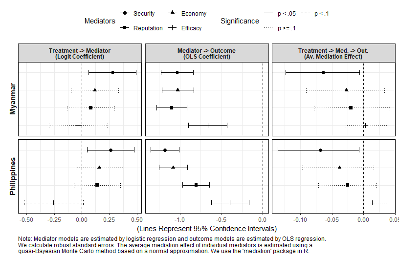
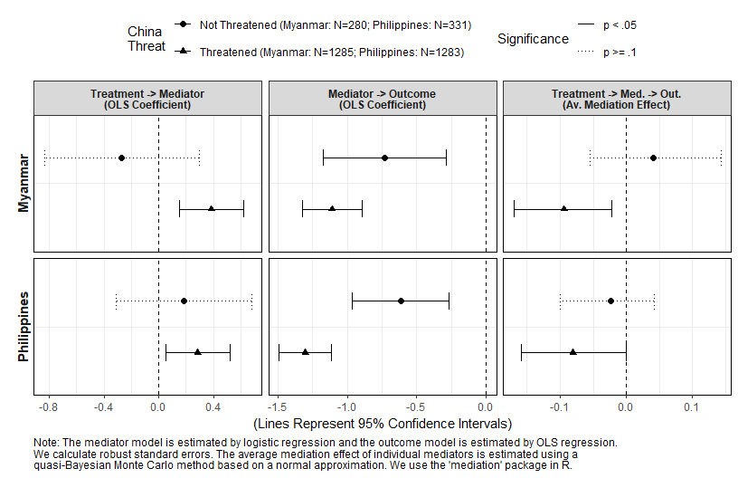
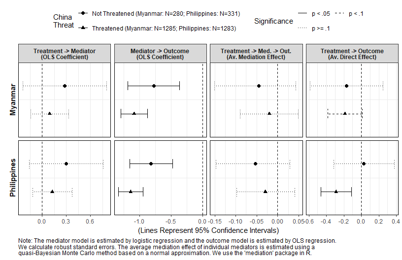

Analysis 3: Causal Mediation Analysis
================
Gento Kato
November 17, 2019

-   [Preparation](#preparation)
-   [Modeling Strategy for Causal Mediation Analysis](#modeling-strategy-for-causal-mediation-analysis)
    -   [Simple Mediation with Binary Mediators (Mediation Model is Logit) (Figure 5)](#simple-mediation-with-binary-mediators-mediation-model-is-logit-figure-5)
    -   [Simple Mediation with 5-cat Mediators (Mediation Model is OLS) (Appendix V)](#simple-mediation-with-5-cat-mediators-mediation-model-is-ols-appendix-v)
    -   [Simple Mediation with Binary Mediators with Treatment Mediator Interaction (Extra)](#simple-mediation-with-binary-mediators-with-treatment-mediator-interaction-extra)
    -   [Simple Mediation with 5-cat Mediators with Treatment Mediator Interaction (Extra)](#simple-mediation-with-5-cat-mediators-with-treatment-mediator-interaction-extra)
    -   [Moderated Mediation with Binary Mediators (Mediation Model is Logit) and Binary Moderator (China Threat) (Extra)](#moderated-mediation-with-binary-mediators-mediation-model-is-logit-and-binary-moderator-china-threat-extra)
    -   [Moderated Mediation with 5-cat Mediators (Mediation Model is OLS) and Binary Moderator (China Threat) (Extra)](#moderated-mediation-with-5-cat-mediators-mediation-model-is-ols-and-binary-moderator-china-threat-extra)
    -   [Moderated Mediation with Binary Mediators (Mediation Model is Logit) and 3-cat Moderator (China Threat) (Figure 7)](#moderated-mediation-with-binary-mediators-mediation-model-is-logit-and-3-cat-moderator-china-threat-figure-7)
    -   [Moderated Mediation with 5-cat Mediators (Mediation Model is OLS) and 3-cat Moderator (China Threat) (Appendix VII)](#moderated-mediation-with-5-cat-mediators-mediation-model-is-ols-and-3-cat-moderator-china-threat-appendix-vii)
-   [Visualizing Mediation Analysis Results](#visualizing-mediation-analysis-results)
    -   [Mediation Analysis (mediator model is Logit, outcome model is OLS) (Figure 5)](#mediation-analysis-mediator-model-is-logit-outcome-model-is-ols-figure-5)
    -   [Mediation Analysis (mediator model is OLS, outcome model is OLS) (Appendix V)](#mediation-analysis-mediator-model-is-ols-outcome-model-is-ols-appendix-v)
    -   [Treatment-Mediator Interaction (mediator model is Logit, outcome model is OLS) (Extra)](#treatment-mediator-interaction-mediator-model-is-logit-outcome-model-is-ols-extra)
    -   [Treatment-Mediator Interaction (mediator model is OLS, outcome model is OLS) (Extra)](#treatment-mediator-interaction-mediator-model-is-ols-outcome-model-is-ols-extra)
-   [Moderated Mediation](#moderated-mediation)
    -   [2p Moderator with 2p Mediator (Logit) and 9p Outcome (OLS) (Extra)](#p-moderator-with-2p-mediator-logit-and-9p-outcome-ols-extra)
        -   [Only with Security Mediator (Extra)](#only-with-security-mediator-extra)
        -   [Only with Economy Mediator (Extra)](#only-with-economy-mediator-extra)
        -   [Only with Reputation Mediator (Extra)](#only-with-reputation-mediator-extra)
        -   [Only with Efficacy Mediator (Extra)](#only-with-efficacy-mediator-extra)
    -   [2p Moderator with 5p Mediator (OLS) and 9p Outcome (OLS) (Extra)](#p-moderator-with-5p-mediator-ols-and-9p-outcome-ols-extra)
        -   [Only with Security Mediator (Extra)](#only-with-security-mediator-extra-1)
        -   [Only with Economy Mediator (Extra)](#only-with-economy-mediator-extra-1)
        -   [Only with Reputation Mediator (Extra)](#only-with-reputation-mediator-extra-1)
        -   [Only with Efficacy Mediator (Extra)](#only-with-efficacy-mediator-extra-1)
    -   [3p Moderator with 2p Mediator (Logit) and 9p Outcome (OLS) (Figure 7)](#p-moderator-with-2p-mediator-logit-and-9p-outcome-ols-figure-7)
        -   [Only with Security Mediator (Figure 7)](#only-with-security-mediator-figure-7)
        -   [Only with Economy Mediator (Extra)](#only-with-economy-mediator-extra-2)
        -   [Only with Reputation Mediator (Extra)](#only-with-reputation-mediator-extra-2)
        -   [Only with Efficacy Mediator (Extra)](#only-with-efficacy-mediator-extra-2)
    -   [3p Moderator with 5p Mediator (OLS) and 9p Outcome (OLS) (Appendix VII)](#p-moderator-with-5p-mediator-ols-and-9p-outcome-ols-appendix-vii)
        -   [Only with Security Mediator (Appendix VII)](#only-with-security-mediator-appendix-vii)
        -   [Only with Economy Mediator (Extra)](#only-with-economy-mediator-extra-3)
        -   [Only with Reputation Mediator (Extra)](#only-with-reputation-mediator-extra-3)
        -   [Only with Efficacy Mediator (Extra)](#only-with-efficacy-mediator-extra-3)

Preparation
===========

``` r
## Clear Workspace
rm(list = ls())

## Set Working Directory (Automatically) ##
require(rprojroot); require(rstudioapi)
if (rstudioapi::isAvailable()==TRUE) {
  setwd(dirname(rstudioapi::getActiveDocumentContext()$path)); 
} 
projdir <- find_root(has_file("thisishome.txt"))
#cat(paste("Working Directory Set to:\n",projdir))
setwd(projdir)

## Required Functions & Packages
source("src/analysis0_functions.R", encoding = "CP932")
source("src/cl.mlogit.R")

## Load Data
do <- readRDS("data/donorexp.rds")
d <- do[do$comply==1,] # only compliers

## Subset Data
# MMR
d.MMR <- d[d$treatment %in% c(1,2),]
d.MMR$threat <- d.MMR$threat.MMR
d.MMR$imp <- d.MMR$imp.MMR
d.MMR$potential <- d.MMR$potential.MMR
# PHL
d.PHL <- d[d$treatment %in% c(3,5),]
d.PHL$threat <- d.PHL$threat.PHL
d.PHL$imp <- d.PHL$imp.PHL
d.PHL$potential <- d.PHL$potential.PHL
```

Modeling Strategy for Causal Mediation Analysis
===============================================

Add following covariates to the original model to reduce variance and justify the assumption that there are no unmeasured pre-treatment confounders that potentially causes both mediator and outcome. Additionally, the following analysis assume that there are no post-treatment confounders (no causal relationships between mediators).

-   Threat from MMR/PHL
-   Importance of MMR/PHL
-   Potential of MMR/PHL
-   International Issue Interests
-   ODA Importance
-   Gender
-   Age
-   Ideology

Estimated Models

-   Logit (Mediator/2cats) + OLS (Outcome/9cats)
-   OLS (Mediator/5cats) + OLS (Outcome/9cats)

Simple Mediation with Binary Mediators (Mediation Model is Logit) (Figure 5)
----------------------------------------------------------------------------

``` r
med.out.MMR.main <- gen.med.out(d.MMR,"cancel_aid",1000,
                                "src/processing/med.out.MMR.main.RData",
                                models=c("logit","gaussian"),
                                medcats=2)
med.out.PHL.main <- gen.med.out(d.PHL,"cancel_aid",1000,
                                "src/processing/med.out.PHL.main.RData",
                                models=c("logit","gaussian"),
                                medcats=2)
```

Simple Mediation with 5-cat Mediators (Mediation Model is OLS) (Appendix V)
---------------------------------------------------------------------------

``` r
med.out.MMR.sub <- gen.med.out(d.MMR,"cancel_aid",1000,
                              "src/processing/med.out.MMR.sub.RData",
                              models=c("gaussian","gaussian"))
med.out.PHL.sub <- gen.med.out(d.PHL,"cancel_aid",1000,
                              "src/processing/med.out.PHL.sub.RData",
                              models=c("gaussian","gaussian"))
```

Simple Mediation with Binary Mediators with Treatment Mediator Interaction (Extra)
----------------------------------------------------------------------------------

``` r
med.out.MMR.main.interacted <- gen.med.out(d.MMR,"cancel_aid",1000,
                                "src/processing/med.out.MMR.main.interacted.RData",
                                models=c("logit","gaussian"),
                                medcats=2,
                                interaction = TRUE)
med.out.PHL.main.interacted <- gen.med.out(d.PHL,"cancel_aid",1000,
                                "src/processing/med.out.PHL.main.interacted.RData",
                                models=c("logit","gaussian"),
                                medcats=2, 
                                interaction = TRUE)
```

Simple Mediation with 5-cat Mediators with Treatment Mediator Interaction (Extra)
---------------------------------------------------------------------------------

``` r
med.out.MMR.sub.interacted <- gen.med.out(d.MMR,"cancel_aid",1000,
                               "src/processing/med.out.MMR.sub.interacted.RData",
                               models=c("gaussian","gaussian"), 
                               interaction = TRUE)
med.out.PHL.sub.interacted <- gen.med.out(d.PHL,"cancel_aid",1000,
                               "src/processing/med.out.PHL.sub.interacted.RData",
                               models=c("gaussian","gaussian"), 
                               interaction = TRUE)
```

Moderated Mediation with Binary Mediators (Mediation Model is Logit) and Binary Moderator (China Threat) (Extra)
----------------------------------------------------------------------------------------------------------------

``` r
# When Moderator = 0
med.mod0.out.MMR.main.1 <- gen.med.out(d.MMR,"cancel_aid",1000,
                                     "src/processing/med.mod0.out.MMR.main.1.RData",
                                     models=c("logit","gaussian"),
                                     medcats = 2,
                                     moderated=TRUE,
                                     modvar="threat.CHN",
                                     modfix=0)
med.mod0.out.PHL.main.1 <- gen.med.out(d.PHL,"cancel_aid",1000,
                                       "src/processing/med.mod0.out.PHL.main.1.RData",
                                       models=c("logit","gaussian"),
                                       medcats = 2,
                                       moderated=TRUE, 
                                       modvar="threat.CHN",
                                       modfix=0)

# When Moderator = 1
med.mod1.out.MMR.main.1 <- gen.med.out(d.MMR,"cancel_aid",1000,
                                     "src/processing/med.mod1.out.MMR.main.1.RData",
                                     models=c("logit","gaussian"),
                                     medcats = 2,
                                     moderated=TRUE,
                                     modvar="threat.CHN",
                                     modfix=1)
med.mod1.out.PHL.main.1 <- gen.med.out(d.PHL,"cancel_aid",1000,
                                     "src/processing/med.mod1.out.PHL.main.1.RData",
                                     models=c("logit","gaussian"),
                                     medcats = 2,
                                     moderated=TRUE, 
                                     modvar="threat.CHN",
                                     modfix=1)
```

Moderated Mediation with 5-cat Mediators (Mediation Model is OLS) and Binary Moderator (China Threat) (Extra)
-------------------------------------------------------------------------------------------------------------

``` r
# When Moderator = 0
med.mod0.out.MMR.sub.1 <- gen.med.out(d.MMR,"cancel_aid",1000,
                              "src/processing/med.mod0.out.MMR.sub.1.RData",
                              models=c("gaussian","gaussian"),
                              moderated=TRUE, 
                              modvar="threat.CHN",
                              modfix=0)
med.mod0.out.PHL.sub.1 <- gen.med.out(d.PHL,"cancel_aid",1000,
                                      "src/processing/med.mod0.out.PHL.sub.1.RData",
                                      models=c("gaussian","gaussian"),
                                      moderated=TRUE, 
                                      modvar="threat.CHN",
                                      modfix=0)
# When Moderator = 1
med.mod1.out.MMR.sub.1 <- gen.med.out(d.MMR,"cancel_aid",1000,
                                  "src/processing/med.mod1.out.MMR.sub.1.RData",
                                  models=c("gaussian","gaussian"),
                                  moderated=TRUE, 
                                  modvar="threat.CHN",
                                  modfix=1)
med.mod1.out.PHL.sub.1 <- gen.med.out(d.PHL,"cancel_aid",1000,
                                   "src/processing/med.mod1.out.PHL.sub.1.RData",
                                   models=c("gaussian","gaussian"),
                                   moderated=TRUE, 
                                   modvar="threat.CHN",
                                   modfix=1)
```

Moderated Mediation with Binary Mediators (Mediation Model is Logit) and 3-cat Moderator (China Threat) (Figure 7)
------------------------------------------------------------------------------------------------------------------

``` r
# Moderator = 0
med.mod0.out.MMR.main.3 <- gen.med.out(d.MMR,"cancel_aid",1000,
                                       "src/processing/med.mod0.out.MMR.main.3.RData",
                                       models=c("logit","gaussian"),
                                       medcats = 2,
                                       moderated=TRUE,
                                       modvar="threat.CHN.3cat",
                                       modfix=0)
med.mod0.out.PHL.main.3 <- gen.med.out(d.PHL,"cancel_aid",1000,
                                       "src/processing/med.mod0.out.PHL.main.3.RData",
                                       models=c("logit","gaussian"),
                                       medcats = 2,
                                       moderated=TRUE, 
                                       modvar="threat.CHN.3cat",
                                       modfix=0)
# Moderator = 1
med.mod1.out.MMR.main.3 <- gen.med.out(d.MMR,"cancel_aid",1000,
                                       "src/processing/med.mod1.out.MMR.main.3.RData",
                                       models=c("logit","gaussian"),
                                       medcats = 2,
                                       moderated=TRUE,
                                       modvar="threat.CHN.3cat",
                                       modfix=1)
med.mod1.out.PHL.main.3 <- gen.med.out(d.PHL,"cancel_aid",1000,
                                       "src/processing/med.mod1.out.PHL.main.3.RData",
                                       models=c("logit","gaussian"),
                                       medcats = 2,
                                       moderated=TRUE, 
                                       modvar="threat.CHN.3cat",
                                       modfix=1)
# Moderator = 2
med.mod2.out.MMR.main.3 <- gen.med.out(d.MMR,"cancel_aid",1000,
                                       "src/processing/med.mod2.out.MMR.main.3.RData",
                                       models=c("logit","gaussian"),
                                       medcats = 2,
                                       moderated=TRUE,
                                       modvar="threat.CHN.3cat",
                                       modfix=2)
med.mod2.out.PHL.main.3 <- gen.med.out(d.PHL,"cancel_aid",1000,
                                       "src/processing/med.mod2.out.PHL.main.3.RData",
                                       models=c("logit","gaussian"),
                                       medcats = 2,
                                       moderated=TRUE, 
                                       modvar="threat.CHN.3cat",
                                       modfix=2)
```

Moderated Mediation with 5-cat Mediators (Mediation Model is OLS) and 3-cat Moderator (China Threat) (Appendix VII)
-------------------------------------------------------------------------------------------------------------------

``` r
# Moderator = 0
med.mod0.out.MMR.sub.3 <- gen.med.out(d.MMR,"cancel_aid",1000,
                                      "src/processing/med.mod0.out.MMR.sub.3.RData",
                                      models=c("gaussian","gaussian"),
                                      moderated=TRUE, 
                                      modvar="threat.CHN.3cat",
                                      modfix=0)
med.mod0.out.PHL.sub.3 <- gen.med.out(d.PHL,"cancel_aid",1000,
                                      "src/processing/med.mod0.out.PHL.sub.3.RData",
                                      models=c("gaussian","gaussian"),
                                      moderated=TRUE, 
                                      modvar="threat.CHN.3cat",
                                      modfix=0)
# Moderator = 1
med.mod1.out.MMR.sub.3 <- gen.med.out(d.MMR,"cancel_aid",1000,
                                      "src/processing/med.mod1.out.MMR.sub.3.RData",
                                      models=c("gaussian","gaussian"),
                                      moderated=TRUE, 
                                      modvar="threat.CHN.3cat",
                                      modfix=1)
med.mod1.out.PHL.sub.3 <- gen.med.out(d.PHL,"cancel_aid",1000,
                                      "src/processing/med.mod1.out.PHL.sub.3.RData",
                                      models=c("gaussian","gaussian"),
                                      moderated=TRUE, 
                                      modvar="threat.CHN.3cat",
                                      modfix=1)
# Moderator = 2
med.mod2.out.MMR.sub.3 <- gen.med.out(d.MMR,"cancel_aid",1000,
                                      "src/processing/med.mod2.out.MMR.sub.3.RData",
                                      models=c("gaussian","gaussian"),
                                      moderated=TRUE, 
                                      modvar="threat.CHN.3cat",
                                      modfix=2)
med.mod2.out.PHL.sub.3 <- gen.med.out(d.PHL,"cancel_aid",1000,
                                      "src/processing/med.mod2.out.PHL.sub.3.RData",
                                      models=c("gaussian","gaussian"),
                                      moderated=TRUE, 
                                      modvar="threat.CHN.3cat",
                                      modfix=2)
```

Visualizing Mediation Analysis Results
======================================

Mediation Analysis (mediator model is Logit, outcome model is OLS) (Figure 5)
-----------------------------------------------------------------------------

``` r
# Plotting Data
med.out.main.data <- gendata(med.out.MMR.main,med.out.PHL.main,mod=FALSE)
#med.out.main.data <- rbind(med.out.main.JOINT.data,med.out.main.data)

# Prepare Caption
captiontxt <- 
"Note: Mediator models are estimated by logistic regression and outcome models are estimated by OLS regression.
We calculate robust standard errors. The average mediation effect of individual mediators is estimated using a 
quasi-Bayesian Monte Carlo method based on a normal approximation. We use the 'mediation' package in R."
# "Note: Mediator models are estimated by Logistic regression and outcome models are estimated by OLS regression.
# The average mediation effect of individual mediators is estimated by quasi-Bayesian Monte Carlo method based on 
# normal approximation using robust standard errors in the 'mediation' R package."

# W/O Direct Effect
p <- genplot(med.out.main.data,
             captiontxt=captiontxt,
             include.eff = c("Treatment → Mediator",
                             "Mediator → Outcome",
                             "Treatment → Med. → Out."),
             est.type = c("Logit Coefficient",
                          "OLS Coefficient",
                          "Av. Mediation Effect")) 
```

``` r
p
```



``` r
png_save(p, w=850, h=550, file=c("out/med.out.main.plot.woDE.png"))
```

``` r
# W/ Direct Effect
p <- genplot(med.out.main.data,
             captiontxt=captiontxt,
             include.eff = c("Treatment → Mediator",
                             "Mediator → Outcome",
                             "Treatment → Med. → Out.",
                             "Treatment → Outcome"),
             est.type = c("Logit Coefficient",
                          "OLS Coefficient",
                          "Av. Mediation Effect",
                          "Av. Direct Effect")) 
```

``` r
p
```


``` r
png_save(p, w=850, h=550, file=c("out/med.out.main.plot.wDE.png"))
```

Mediation Analysis (mediator model is OLS, outcome model is OLS) (Appendix V)
-----------------------------------------------------------------------------

``` r
# Plotting Data
med.out.sub.data <- gendata(med.out.MMR.sub,med.out.PHL.sub, mod=FALSE)
#med.out.sub.data <- rbind(med.out.sub.JOINT.data,med.out.sub.data)

# Prepare Caption
captiontxt <- 
  "Note: Both mediator models and outcome models are estimated by OLS regression. 
We calculate robust standard errors. The average mediation effect of individual mediators is estimated using a 
quasi-Bayesian Monte Carlo method based on a normal approximation. We use the 'mediation' package in R."
# captiontxt <- 
# "Note: Both mediator models and outcome models are estimated by OLS regression. 
# The average mediation effect of individual mediators is estimated by quasi-Bayesian Monte Carlo method based on 
# normal approximation using robust standard errors in the 'mediation' R package. 'JOINT' is the joint mediation effect of 
# all mediators estimated by imputation-based approach used in the 'medflex' R package."

# W/O Direct Effect
p <- genplot(med.out.sub.data,
             captiontxt=captiontxt,
             include.eff = c("Treatment → Mediator",
                             "Mediator → Outcome",
                             "Treatment → Med. → Out."),
             est.type = c("Logit Coefficient",
                          "OLS Coefficient",
                          "Av. Mediation Effect")) 
```

``` r
p
```


``` r
png_save(p, w=850, h=550, file=c("out/med.out.sub.plot.woDE.png"))
```

``` r
# W/ Direct Effect
p <- genplot(med.out.sub.data,
             captiontxt=captiontxt,
             include.eff = c("Treatment → Mediator",
                             "Mediator → Outcome",
                             "Treatment → Med. → Out.",
                             "Treatment → Outcome"),
             est.type = c("Logit Coefficient",
                          "OLS Coefficient",
                          "Av. Mediation Effect",
                          "Av. Direct Effect")) 
```

``` r
p
```


``` r
png_save(p, w=850, h=550, file=c("out/med.out.sub.plot.wDE.png"))
```

Treatment-Mediator Interaction (mediator model is Logit, outcome model is OLS) (Extra)
--------------------------------------------------------------------------------------

``` r
# Plotting Data
med.out.main.data.treated <- gendata(med.out.MMR.main.interacted,
                                     med.out.PHL.main.interacted,
                                     mod=FALSE,treated=TRUE)
med.out.main.data.treated$eff <- as.character(med.out.main.data.treated$eff)
med.out.main.data.treated$eff[med.out.main.data.treated$eff=="Treatment → Med. → Out."] <- 
  "Treatment → Med. → Out.\n[Treated]"
med.out.main.data.control <- gendata(med.out.MMR.main.interacted,
                                     med.out.PHL.main.interacted,
                                     mod=FALSE,treated=FALSE)
med.out.main.data.control$eff <- as.character(med.out.main.data.control$eff)
med.out.main.data.control$eff[med.out.main.data.control$eff=="Treatment → Med. → Out."] <- 
  "Treatment → Med. → Out.\n[Control]"
med.out.main.data.interacted <- 
  rbind(med.out.main.data.treated,
        med.out.main.data.control[med.out.main.data.control$eff=="Treatment → Med. → Out.\n[Control]",])
med.out.main.data.interacted$eff <- factor(med.out.main.data.interacted$eff,
                                           levels=unique(med.out.main.data.interacted$eff))

# Prepare Caption
captiontxt <- 
"Note: Mediator models are estimated by logistic regression and outcome models are estimated by OLS regression.
We calculate robust standard errors. The average mediation effect of individual mediators is estimated using a 
quasi-Bayesian Monte Carlo method based on a normal approximation. We use the 'mediation' package in R."
```

``` r
# W/O Direct Effect
p <- genplot(med.out.main.data.interacted,
             captiontxt=captiontxt,
             include.eff = c("Treatment → Med. → Out.\n[Treated]",
                             "Treatment → Med. → Out.\n[Control]"),
             est.type = c("Av. Mediation Effect",
                          "Av. Mediation Effect")) + 
  scale_y_continuous(expand = c(0.05,0.05))
```

``` r
p
```


``` r
png_save(p, w=850, h=550, file=c("out/med.out.main.interacted.plot.woDE.png"))
```

Treatment-Mediator Interaction (mediator model is OLS, outcome model is OLS) (Extra)
------------------------------------------------------------------------------------

``` r
# Plotting Data
med.out.sub.data.treated <- gendata(med.out.MMR.sub.interacted,
                                     med.out.PHL.sub.interacted,
                                     mod=FALSE,treated=TRUE)
med.out.sub.data.treated$eff <- as.character(med.out.sub.data.treated$eff)
med.out.sub.data.treated$eff[med.out.sub.data.treated$eff=="Treatment → Med. → Out."] <- 
  "Treatment → Med. → Out.\n[Treated]"
med.out.sub.data.control <- gendata(med.out.MMR.sub.interacted,
                                     med.out.PHL.sub.interacted,
                                     mod=FALSE,treated=FALSE)
med.out.sub.data.control$eff <- as.character(med.out.sub.data.control$eff)
med.out.sub.data.control$eff[med.out.sub.data.control$eff=="Treatment → Med. → Out."] <- 
  "Treatment → Med. → Out.\n[Control]"
med.out.sub.data.interacted <- 
  rbind(med.out.sub.data.treated,
        med.out.sub.data.control[med.out.sub.data.control$eff=="Treatment → Med. → Out.\n[Control]",])
med.out.sub.data.interacted$eff <- factor(med.out.sub.data.interacted$eff,
                                           levels=unique(med.out.sub.data.interacted$eff))

# Prepare Caption
captiontxt <- 
  "Note: Both mediator models and outcome models are estimated by OLS regression. 
We calculate robust standard errors. The average mediation effect of individual mediators is estimated using a 
quasi-Bayesian Monte Carlo method based on a normal approximation. We use the 'mediation' package in R."
```

``` r
# W/O Direct Effect
p <- genplot(med.out.sub.data.interacted,
             captiontxt=captiontxt,
             include.eff = c("Treatment → Med. → Out.\n[Treated]",
                             "Treatment → Med. → Out.\n[Control]"),
             est.type = c("Av. Mediation Effect",
                          "Av. Mediation Effect")) + 
  scale_y_continuous(expand = c(0.05,0.05))
```

``` r
p
```


``` r
png_save(p, w=850, h=550, file=c("out/med.out.sub.interacted.plot.woDE.png"))
```

Moderated Mediation
===================

Assess moderation by threat perception to China

2p Moderator with 2p Mediator (Logit) and 9p Outcome (OLS) (Extra)
------------------------------------------------------------------

``` r
# Prepare Data
med.mod1.out.main.1.data <- gendata(med.mod1.out.MMR.main.1,med.mod1.out.PHL.main.1,mod=TRUE,modN=2,modval=1)
med.mod1.out.main.1.data$tcond <- paste("Threatened (Myanmar: N=", 1285, "; Philippines: N=", 1283, ")",sep="")
med.mod0.out.main.1.data <- gendata(med.mod0.out.MMR.main.1,med.mod0.out.PHL.main.1,mod=TRUE,modN=2,modval=0)
med.mod0.out.main.1.data$tcond <- paste("Not Threatened (Myanmar: N=", 280, "; Philippines: N=", 331, ")",sep="")
med.mod.out.main.1.data <- rbind(med.mod1.out.main.1.data,med.mod0.out.main.1.data)
med.mod.out.main.1.data$tcond <- factor(med.mod.out.main.1.data$tcond, 
                                        levels=unique(med.mod.out.main.1.data$tcond))

# Prepare Caption
captiontxt <- 
"Note: The mediator model is estimated by logistic regression and the outcome model is estimated by OLS regression.
We calculate robust standard errors. The average mediation effect of individual mediators is estimated using a 
quasi-Bayesian Monte Carlo method based on a normal approximation. We use the 'mediation' package in R."
```

### Only with Security Mediator (Extra)

``` r
# Plot W/O Direct Effect
p <- genplot2(med.mod.out.main.1.data[med.mod.out.main.1.data$med=="Security",],
              captiontxt = captiontxt,
              include.eff = c("Treatment → Mediator",
                              "Mediator → Outcome",
                              "Treatment → Med. → Out."),
              est.type = c("OLS Coefficient",
                           "OLS Coefficient",
                           "Av. Mediation Effect"))
```

``` r
p
```



``` r
png_save(p, w=850, h=550, file=c("out/med.mod.out.main.1.secu.plot.woDE.png"))
```

``` r
# Plot W/ Direct Effect
p <- genplot2(med.mod.out.main.1.data[med.mod.out.main.1.data$med=="Security",],
              captiontxt = captiontxt,
              include.eff = c("Treatment → Mediator",
                              "Mediator → Outcome",
                              "Treatment → Med. → Out.",
                              "Treatment → Outcome"),
              est.type = c("OLS Coefficient",
                           "OLS Coefficient",
                           "Av. Mediation Effect",
                           "Av. Direct Effect"))
```

``` r
p
```


``` r
png_save(p, w=850, h=550, file=c("out/med.mod.out.main.1.secu.plot.wDE.png"))
```

``` r
# Plot W/ Total Effect
p <- genplot2(med.mod.out.main.1.data[med.mod.out.main.1.data$med=="Security",],
              captiontxt = captiontxt,
              include.eff = c("Treatment → Mediator",
                              "Mediator → Outcome",
                              "Treatment → Med. → Out.",
                              "Total"),
              est.type = c("OLS Coefficient",
                           "OLS Coefficient",
                           "Av. Mediation Effect",
                           "Total Treatment Effect"))
```

``` r
p
```


``` r
png_save(p, w=850, h=550, file=c("out/med.mod.out.main.1.secu.plot.wTE.png"))
```

### Only with Economy Mediator (Extra)

``` r
# Plot W/O Direct Effect
p <- genplot2(med.mod.out.main.1.data[med.mod.out.main.1.data$med=="Economy",],
              captiontxt = captiontxt,
              include.eff = c("Treatment → Mediator",
                              "Mediator → Outcome",
                              "Treatment → Med. → Out."),
              est.type = c("OLS Coefficient",
                           "OLS Coefficient",
                           "Av. Mediation Effect"))
```

``` r
p
```


``` r
png_save(p, w=850, h=550, file=c("out/med.mod.out.main.1.econ.plot.woDE.png"))
```

``` r
# Plot W/ Direct Effect
p <- genplot2(med.mod.out.main.1.data[med.mod.out.main.1.data$med=="Economy",],
              captiontxt = captiontxt,
              include.eff = c("Treatment → Mediator",
                              "Mediator → Outcome",
                              "Treatment → Med. → Out.",
                              "Treatment → Outcome"),
              est.type = c("OLS Coefficient",
                           "OLS Coefficient",
                           "Av. Mediation Effect",
                           "Av. Direct Effect"))
```

``` r
p
```



``` r
png_save(p, w=850, h=550, file=c("out/med.mod.out.main.1.econ.plot.wDE.png"))
```

``` r
# Plot W/ Total Effect
p <- genplot2(med.mod.out.main.1.data[med.mod.out.main.1.data$med=="Economy",],
              captiontxt = captiontxt,
              include.eff = c("Treatment → Mediator",
                              "Mediator → Outcome",
                              "Treatment → Med. → Out.",
                              "Total"),
              est.type = c("OLS Coefficient",
                           "OLS Coefficient",
                           "Av. Mediation Effect",
                           "Total Treatment Effect"))
```

``` r
p
```


``` r
png_save(p, w=850, h=550, file=c("out/med.mod.out.main.1.econ.plot.wTE.png"))
```

### Only with Reputation Mediator (Extra)

``` r
# Plot W/O Direct Effect
p <- genplot2(med.mod.out.main.1.data[med.mod.out.main.1.data$med=="Reputation",],
              captiontxt = captiontxt,
              include.eff = c("Treatment → Mediator",
                              "Mediator → Outcome",
                              "Treatment → Med. → Out."),
              est.type = c("OLS Coefficient",
                           "OLS Coefficient",
                           "Av. Mediation Effect"))
```

``` r
p
```


``` r
png_save(p, w=850, h=550, file=c("out/med.mod.out.main.1.repu.plot.woDE.png"))
```

``` r
# Plot W/ Direct Effect
p <- genplot2(med.mod.out.main.1.data[med.mod.out.main.1.data$med=="Reputation",],
              captiontxt = captiontxt,
              include.eff = c("Treatment → Mediator",
                              "Mediator → Outcome",
                              "Treatment → Med. → Out.",
                              "Treatment → Outcome"),
              est.type = c("OLS Coefficient",
                           "OLS Coefficient",
                           "Av. Mediation Effect",
                           "Av. Direct Effect"))
```

``` r
p
```


``` r
png_save(p, w=850, h=550, file=c("out/med.mod.out.main.1.repu.plot.wDE.png"))
```

``` r
# Plot W/ Total Effect
p <- genplot2(med.mod.out.main.1.data[med.mod.out.main.1.data$med=="Reputation",],
              captiontxt = captiontxt,
              include.eff = c("Treatment → Mediator",
                              "Mediator → Outcome",
                              "Treatment → Med. → Out.",
                              "Total"),
              est.type = c("OLS Coefficient",
                           "OLS Coefficient",
                           "Av. Mediation Effect",
                           "Total Treatment Effect"))
```

``` r
p
```


``` r
png_save(p, w=850, h=550, file=c("out/med.mod.out.main.1.repu.plot.wTE.png"))
```

### Only with Efficacy Mediator (Extra)

``` r
# Plot W/O Direct Effect
p <- genplot2(med.mod.out.main.1.data[med.mod.out.main.1.data$med=="Efficacy",],
              captiontxt = captiontxt,
              include.eff = c("Treatment → Mediator",
                              "Mediator → Outcome",
                              "Treatment → Med. → Out."),
              est.type = c("OLS Coefficient",
                           "OLS Coefficient",
                           "Av. Mediation Effect"))
```

``` r
p
```


``` r
png_save(p, w=850, h=550, file=c("out/med.mod.out.main.1.effi.plot.woDE.png"))
```

``` r
# Plot W/ Direct Effect
p <- genplot2(med.mod.out.main.1.data[med.mod.out.main.1.data$med=="Efficacy",],
              captiontxt = captiontxt,
              include.eff = c("Treatment → Mediator",
                              "Mediator → Outcome",
                              "Treatment → Med. → Out.",
                              "Treatment → Outcome"),
              est.type = c("OLS Coefficient",
                           "OLS Coefficient",
                           "Av. Mediation Effect",
                           "Av. Direct Effect"))
```

``` r
p
```


``` r
png_save(p, w=850, h=550, file=c("out/med.mod.out.main.1.effi.plot.wDE.png"))
```

``` r
# Plot W/ Total Effect
p <- genplot2(med.mod.out.main.1.data[med.mod.out.main.1.data$med=="Efficacy",],
              captiontxt = captiontxt,
              include.eff = c("Treatment → Mediator",
                              "Mediator → Outcome",
                              "Treatment → Med. → Out.",
                              "Total"),
              est.type = c("OLS Coefficient",
                           "OLS Coefficient",
                           "Av. Mediation Effect",
                           "Total Treatment Effect"))
```

``` r
p
```


``` r
png_save(p, w=850, h=550, file=c("out/med.mod.out.main.1.effi.plot.wTE.png"))
```

2p Moderator with 5p Mediator (OLS) and 9p Outcome (OLS) (Extra)
----------------------------------------------------------------

``` r
# Prepare Data
med.mod1.out.sub.1.data <- gendata(med.mod1.out.MMR.sub.1,med.mod1.out.PHL.sub.1,mod=TRUE,modN=2,modval=1)
med.mod1.out.sub.1.data$tcond <- paste("Threatened (Myanmar: N=", 1285, "; Philippines: N=", 1283, ")",sep="")
med.mod0.out.sub.1.data <- gendata(med.mod0.out.MMR.sub.1,med.mod0.out.PHL.sub.1,mod=TRUE,modN=2,modval=0)
med.mod0.out.sub.1.data$tcond <- paste("Not Threatened (Myanmar: N=", 280, "; Philippines: N=", 331, ")",sep="")
med.mod.out.sub.1.data <- rbind(med.mod1.out.sub.1.data,med.mod0.out.sub.1.data)
med.mod.out.sub.1.data$tcond <- factor(med.mod.out.sub.1.data$tcond, 
                                        levels=unique(med.mod.out.sub.1.data$tcond))

# Prepare Caption
captiontxt <- 
  "Note: Both the mediator model and the outcome model are estimated by OLS regression. 
We calculate robust standard errors. The average mediation effect of individual mediators is estimated using a 
quasi-Bayesian Monte Carlo method based on a normal approximation. We use the 'mediation' package in R."
```

### Only with Security Mediator (Extra)

``` r
# Plot W/O Direct Effect
p <- genplot2(med.mod.out.sub.1.data[med.mod.out.sub.1.data$med=="Security",],
              captiontxt = captiontxt,
              include.eff = c("Treatment → Mediator",
                              "Mediator → Outcome",
                              "Treatment → Med. → Out."),
              est.type = c("OLS Coefficient",
                           "OLS Coefficient",
                           "Av. Mediation Effect"))
```

``` r
p
```


``` r
png_save(p, w=850, h=550, file=c("out/med.mod.out.sub.1.secu.plot.woDE.png"))
```

``` r
# Plot W/ Direct Effect
p <- genplot2(med.mod.out.sub.1.data[med.mod.out.sub.1.data$med=="Security",],
              captiontxt = captiontxt,
              include.eff = c("Treatment → Mediator",
                              "Mediator → Outcome",
                              "Treatment → Med. → Out.",
                              "Treatment → Outcome"),
              est.type = c("OLS Coefficient",
                           "OLS Coefficient",
                           "Av. Mediation Effect",
                           "Av. Direct Effect"))
```

``` r
p
```


``` r
png_save(p, w=850, h=550, file=c("out/med.mod.out.sub.1.secu.plot.wDE.png"))
```

``` r
# Plot W/ Total Effect
p <- genplot2(med.mod.out.sub.1.data[med.mod.out.sub.1.data$med=="Security",],
              captiontxt = captiontxt,
              include.eff = c("Treatment → Mediator",
                              "Mediator → Outcome",
                              "Treatment → Med. → Out.",
                              "Total"),
              est.type = c("OLS Coefficient",
                           "OLS Coefficient",
                           "Av. Mediation Effect",
                           "Total Treatment Effect"))
```

``` r
p
```


``` r
png_save(p, w=850, h=550, file=c("out/med.mod.out.sub.1.secu.plot.wTE.png"))
```

### Only with Economy Mediator (Extra)

``` r
# Plot W/O Direct Effect
p <- genplot2(med.mod.out.sub.1.data[med.mod.out.sub.1.data$med=="Economy",],
              captiontxt = captiontxt,
              include.eff = c("Treatment → Mediator",
                              "Mediator → Outcome",
                              "Treatment → Med. → Out."),
              est.type = c("OLS Coefficient",
                           "OLS Coefficient",
                           "Av. Mediation Effect"))
```

``` r
p
```


``` r
png_save(p, w=850, h=550, file=c("out/med.mod.out.sub.1.econ.plot.woDE.png"))
```

``` r
# Plot W/ Direct Effect
p <- genplot2(med.mod.out.sub.1.data[med.mod.out.sub.1.data$med=="Economy",],
              captiontxt = captiontxt,
              include.eff = c("Treatment → Mediator",
                              "Mediator → Outcome",
                              "Treatment → Med. → Out.",
                              "Treatment → Outcome"),
              est.type = c("OLS Coefficient",
                           "OLS Coefficient",
                           "Av. Mediation Effect",
                           "Av. Direct Effect"))
```

``` r
p
```


``` r
png_save(p, w=850, h=550, file=c("out/med.mod.out.sub.1.econ.plot.wDE.png"))
```

``` r
# Plot W/ Total Effect
p <- genplot2(med.mod.out.sub.1.data[med.mod.out.sub.1.data$med=="Economy",],
              captiontxt = captiontxt,
              include.eff = c("Treatment → Mediator",
                              "Mediator → Outcome",
                              "Treatment → Med. → Out.",
                              "Total"),
              est.type = c("OLS Coefficient",
                           "OLS Coefficient",
                           "Av. Mediation Effect",
                           "Total Treatment Effect"))
```

``` r
p
```


``` r
png_save(p, w=850, h=550, file=c("out/med.mod.out.sub.1.econ.plot.wTE.png"))
```

### Only with Reputation Mediator (Extra)

``` r
# Plot W/O Direct Effect
p <- genplot2(med.mod.out.sub.1.data[med.mod.out.sub.1.data$med=="Reputation",],
              captiontxt = captiontxt,
              include.eff = c("Treatment → Mediator",
                              "Mediator → Outcome",
                              "Treatment → Med. → Out."),
              est.type = c("OLS Coefficient",
                           "OLS Coefficient",
                           "Av. Mediation Effect"))
```

``` r
p
```


``` r
png_save(p, w=850, h=550, file=c("out/med.mod.out.sub.1.repu.plot.woDE.png"))
```

``` r
# Plot W/ Direct Effect
p <- genplot2(med.mod.out.sub.1.data[med.mod.out.sub.1.data$med=="Reputation",],
              captiontxt = captiontxt,
              include.eff = c("Treatment → Mediator",
                              "Mediator → Outcome",
                              "Treatment → Med. → Out.",
                              "Treatment → Outcome"),
              est.type = c("OLS Coefficient",
                           "OLS Coefficient",
                           "Av. Mediation Effect",
                           "Av. Direct Effect"))
```

``` r
p
```


``` r
png_save(p, w=850, h=550, file=c("out/med.mod.out.sub.1.repu.plot.wDE.png"))
```

``` r
# Plot W/ Total Effect
p <- genplot2(med.mod.out.sub.1.data[med.mod.out.sub.1.data$med=="Reputation",],
              captiontxt = captiontxt,
              include.eff = c("Treatment → Mediator",
                              "Mediator → Outcome",
                              "Treatment → Med. → Out.",
                              "Total"),
              est.type = c("OLS Coefficient",
                           "OLS Coefficient",
                           "Av. Mediation Effect",
                           "Total Treatment Effect"))
```

``` r
p
```


``` r
png_save(p, w=850, h=550, file=c("out/med.mod.out.sub.1.repu.plot.wTE.png"))
```

### Only with Efficacy Mediator (Extra)

``` r
# Plot W/O Direct Effect
p <- genplot2(med.mod.out.sub.1.data[med.mod.out.sub.1.data$med=="Efficacy",],
              captiontxt = captiontxt,
              include.eff = c("Treatment → Mediator",
                              "Mediator → Outcome",
                              "Treatment → Med. → Out."),
              est.type = c("OLS Coefficient",
                           "OLS Coefficient",
                           "Av. Mediation Effect"))
```

``` r
p
```


``` r
png_save(p, w=850, h=550, file=c("out/med.mod.out.sub.1.effi.plot.woDE.png"))
```

``` r
# Plot W/ Direct Effect
p <- genplot2(med.mod.out.sub.1.data[med.mod.out.sub.1.data$med=="Efficacy",],
              captiontxt = captiontxt,
              include.eff = c("Treatment → Mediator",
                              "Mediator → Outcome",
                              "Treatment → Med. → Out.",
                              "Treatment → Outcome"),
              est.type = c("OLS Coefficient",
                           "OLS Coefficient",
                           "Av. Mediation Effect",
                           "Av. Direct Effect"))
```

``` r
p
```


``` r
png_save(p, w=850, h=550, file=c("out/med.mod.out.sub.1.effi.plot.wDE.png"))
```

``` r
# Plot W/ Total Effect
p <- genplot2(med.mod.out.sub.1.data[med.mod.out.sub.1.data$med=="Efficacy",],
              captiontxt = captiontxt,
              include.eff = c("Treatment → Mediator",
                              "Mediator → Outcome",
                              "Treatment → Med. → Out.",
                              "Total"),
              est.type = c("OLS Coefficient",
                           "OLS Coefficient",
                           "Av. Mediation Effect",
                           "Total Treatment Effect"))
```

``` r
p
```


``` r
png_save(p, w=850, h=550, file=c("out/med.mod.out.sub.1.effi.plot.wTE.png"))
```

3p Moderator with 2p Mediator (Logit) and 9p Outcome (OLS) (Figure 7)
---------------------------------------------------------------------

``` r
# Prepare Data
med.mod2.out.main.3.data <- gendata(med.mod2.out.MMR.main.3,med.mod2.out.PHL.main.3,mod=TRUE,modN=3,modval=2)
med.mod2.out.main.3.data$tcond <- paste("Highly Threatened (Myanmar: N=", 789, "; Philippines: N=", 749, ")",sep="")
med.mod1.out.main.3.data <- gendata(med.mod1.out.MMR.main.3,med.mod1.out.PHL.main.3,mod=TRUE,modN=3,modval=1)
med.mod1.out.main.3.data$tcond <- paste("Moderately Threatened (Myanmar: N=", 496, "; Philippines: N=", 534, ")",sep="")
med.mod0.out.main.3.data <- gendata(med.mod0.out.MMR.main.3,med.mod0.out.PHL.main.3,mod=TRUE,modN=3,modval=0)
med.mod0.out.main.3.data$tcond <- paste("Weakly Threatened (Myanmar: N=", 280, "; Philippines: N=", 331, ")",sep="")
med.mod.out.main.3.data <- rbind(med.mod2.out.main.3.data,
                                 med.mod1.out.main.3.data,
                                 med.mod0.out.main.3.data)
med.mod.out.main.3.data$tcond <- factor(med.mod.out.main.3.data$tcond, 
                                        levels=unique(med.mod.out.main.3.data$tcond))

# Prepare Caption
captiontxt <- 
  "Note: The mediator model is estimated by logistic regression and the outcome model is estimated by OLS regression.
We calculate robust standard errors. The average mediation effect of individual mediators is estimated using a 
quasi-Bayesian Monte Carlo method based on a normal approximation. We use the 'mediation' package in R."
```

### Only with Security Mediator (Figure 7)

``` r
# Plot W/O Direct Effect
p <- genplot2(med.mod.out.main.3.data[med.mod.out.main.3.data$med=="Security",],
              captiontxt = captiontxt, legendrow=3,
              include.eff = c("Treatment → Mediator",
                              "Mediator → Outcome",
                              "Treatment → Med. → Out."),
              est.type = c("OLS Coefficient",
                           "OLS Coefficient",
                           "Av. Mediation Effect"))
```

``` r
p
```


``` r
png_save(p, w=850, h=550, file=c("out/med.mod.out.main.3.secu.plot.woDE.png"))
```

``` r
# Plot W/ Direct Effect
p <- genplot2(med.mod.out.main.3.data[med.mod.out.main.3.data$med=="Security",],
              captiontxt = captiontxt, legendrow=3,
              include.eff = c("Treatment → Mediator",
                              "Mediator → Outcome",
                              "Treatment → Med. → Out.",
                              "Treatment → Outcome"),
              est.type = c("OLS Coefficient",
                           "OLS Coefficient",
                           "Av. Mediation Effect",
                           "Av. Direct Effect"))
```

``` r
p
```


``` r
png_save(p, w=850, h=550, file=c("out/med.mod.out.main.3.secu.plot.wDE.png"))
```

``` r
# Plot W/ Total Effect
p <- genplot2(med.mod.out.main.3.data[med.mod.out.main.3.data$med=="Security",],
              captiontxt = captiontxt, legendrow=3,
              include.eff = c("Treatment → Mediator",
                              "Mediator → Outcome",
                              "Treatment → Med. → Out.",
                              "Total"),
              est.type = c("OLS Coefficient",
                           "OLS Coefficient",
                           "Av. Mediation Effect",
                           "Total Treatment Effect"))
```

``` r
p
```


``` r
png_save(p, w=850, h=550, file=c("out/med.mod.out.main.3.secu.plot.wTE.png"))
```

### Only with Economy Mediator (Extra)

``` r
# Plot W/O Direct Effect
p <- genplot2(med.mod.out.main.3.data[med.mod.out.main.3.data$med=="Economy",],
              captiontxt = captiontxt, legendrow=3,
              include.eff = c("Treatment → Mediator",
                              "Mediator → Outcome",
                              "Treatment → Med. → Out."),
              est.type = c("OLS Coefficient",
                           "OLS Coefficient",
                           "Av. Mediation Effect"))
```

``` r
p
```


``` r
png_save(p, w=850, h=550, file=c("out/med.mod.out.main.3.econ.plot.woDE.png"))
```

``` r
# Plot W/ Direct Effect
p <- genplot2(med.mod.out.main.3.data[med.mod.out.main.3.data$med=="Economy",],
              captiontxt = captiontxt, legendrow=3,
              include.eff = c("Treatment → Mediator",
                              "Mediator → Outcome",
                              "Treatment → Med. → Out.",
                              "Treatment → Outcome"),
              est.type = c("OLS Coefficient",
                           "OLS Coefficient",
                           "Av. Mediation Effect",
                           "Av. Direct Effect"))
```

``` r
p
```


``` r
png_save(p, w=850, h=550, file=c("out/med.mod.out.main.3.econ.plot.wDE.png"))
```

``` r
# Plot W/ Total Effect
p <- genplot2(med.mod.out.main.3.data[med.mod.out.main.3.data$med=="Economy",],
              captiontxt = captiontxt, legendrow=3,
              include.eff = c("Treatment → Mediator",
                              "Mediator → Outcome",
                              "Treatment → Med. → Out.",
                              "Total"),
              est.type = c("OLS Coefficient",
                           "OLS Coefficient",
                           "Av. Mediation Effect",
                           "Total Treatment Effect"))
```

``` r
p
```


``` r
png_save(p, w=850, h=550, file=c("out/med.mod.out.main.3.econ.plot.wTE.png"))
```

### Only with Reputation Mediator (Extra)

``` r
# Plot W/O Direct Effect
p <- genplot2(med.mod.out.main.3.data[med.mod.out.main.3.data$med=="Reputation",],
              captiontxt = captiontxt, legendrow=3,
              include.eff = c("Treatment → Mediator",
                              "Mediator → Outcome",
                              "Treatment → Med. → Out."),
              est.type = c("OLS Coefficient",
                           "OLS Coefficient",
                           "Av. Mediation Effect"))
```

``` r
p
```


``` r
png_save(p, w=850, h=550, file=c("out/med.mod.out.main.3.repu.plot.woDE.png"))
```

``` r
# Plot W/ Direct Effect
p <- genplot2(med.mod.out.main.3.data[med.mod.out.main.3.data$med=="Reputation",],
              captiontxt = captiontxt, legendrow=3,
              include.eff = c("Treatment → Mediator",
                              "Mediator → Outcome",
                              "Treatment → Med. → Out.",
                              "Treatment → Outcome"),
              est.type = c("OLS Coefficient",
                           "OLS Coefficient",
                           "Av. Mediation Effect",
                           "Av. Direct Effect"))
```

``` r
p
```


``` r
png_save(p, w=850, h=550, file=c("out/med.mod.out.main.3.repu.plot.wDE.png"))
```

``` r
# Plot W/ Total Effect
p <- genplot2(med.mod.out.main.3.data[med.mod.out.main.3.data$med=="Reputation",],
              captiontxt = captiontxt, legendrow=3,
              include.eff = c("Treatment → Mediator",
                              "Mediator → Outcome",
                              "Treatment → Med. → Out.",
                              "Total"),
              est.type = c("OLS Coefficient",
                           "OLS Coefficient",
                           "Av. Mediation Effect",
                           "Total Treatment Effect"))
```

``` r
p
```


``` r
png_save(p, w=850, h=550, file=c("out/med.mod.out.main.3.repu.plot.wTE.png"))
```

### Only with Efficacy Mediator (Extra)

``` r
# Plot W/O Direct Effect
p <- genplot2(med.mod.out.main.3.data[med.mod.out.main.3.data$med=="Efficacy",],
              captiontxt = captiontxt, legendrow=3,
              include.eff = c("Treatment → Mediator",
                              "Mediator → Outcome",
                              "Treatment → Med. → Out."),
              est.type = c("OLS Coefficient",
                           "OLS Coefficient",
                           "Av. Mediation Effect"))
```

``` r
p
```


``` r
png_save(p, w=850, h=550, file=c("out/med.mod.out.main.3.effi.plot.woDE.png"))
```

``` r
# Plot W/ Direct Effect
p <- genplot2(med.mod.out.main.3.data[med.mod.out.main.3.data$med=="Efficacy",],
              captiontxt = captiontxt, legendrow=3,
              include.eff = c("Treatment → Mediator",
                              "Mediator → Outcome",
                              "Treatment → Med. → Out.",
                              "Treatment → Outcome"),
              est.type = c("OLS Coefficient",
                           "OLS Coefficient",
                           "Av. Mediation Effect",
                           "Av. Direct Effect"))
```

``` r
p
```


``` r
png_save(p, w=850, h=550, file=c("out/med.mod.out.main.3.effi.plot.wDE.png"))
```

``` r
# Plot W/ Total Effect
p <- genplot2(med.mod.out.main.3.data[med.mod.out.main.3.data$med=="Efficacy",],
              captiontxt = captiontxt, legendrow=3,
              include.eff = c("Treatment → Mediator",
                              "Mediator → Outcome",
                              "Treatment → Med. → Out.",
                              "Total"),
              est.type = c("OLS Coefficient",
                           "OLS Coefficient",
                           "Av. Mediation Effect",
                           "Total Treatment Effect"))
```

``` r
p
```


``` r
png_save(p, w=850, h=550, file=c("out/med.mod.out.main.3.effi.plot.wTE.png"))
```

3p Moderator with 5p Mediator (OLS) and 9p Outcome (OLS) (Appendix VII)
-----------------------------------------------------------------------

``` r
# Prepare Data
med.mod2.out.sub.3.data <- gendata(med.mod2.out.MMR.sub.3,med.mod2.out.PHL.sub.3,mod=TRUE,modN=3,modval=2)
med.mod2.out.sub.3.data$tcond <- paste("Highly Threatened (Myanmar: N=", 789, "; Philippines: N=", 749, ")",sep="")
med.mod1.out.sub.3.data <- gendata(med.mod1.out.MMR.sub.3,med.mod1.out.PHL.sub.3,mod=TRUE,modN=3,modval=1)
med.mod1.out.sub.3.data$tcond <- paste("Moderately Threatened (Myanmar: N=", 496, "; Philippines: N=", 534, ")",sep="")
med.mod0.out.sub.3.data <- gendata(med.mod0.out.MMR.sub.3,med.mod0.out.PHL.sub.3,mod=TRUE,modN=3,modval=0)
med.mod0.out.sub.3.data$tcond <- paste("Weakly Threatened (Myanmar: N=", 280, "; Philippines: N=", 331, ")",sep="")
med.mod.out.sub.3.data <- rbind(med.mod2.out.sub.3.data,
                                 med.mod1.out.sub.3.data,
                                 med.mod0.out.sub.3.data)
med.mod.out.sub.3.data$tcond <- factor(med.mod.out.sub.3.data$tcond, 
                                        levels=unique(med.mod.out.sub.3.data$tcond))

# Prepare Caption
captiontxt <- 
  "Note: Both the mediator model and the outcome model are estimated by OLS regression. 
We calculate robust standard errors. The average mediation effect of individual mediators is estimated using a 
quasi-Bayesian Monte Carlo method based on a normal approximation. We use the 'mediation' package in R."
```

### Only with Security Mediator (Appendix VII)

``` r
# Plot W/O Direct Effect
p <- genplot2(med.mod.out.sub.3.data[med.mod.out.sub.3.data$med=="Security",],
              captiontxt = captiontxt, legendrow=3,
              include.eff = c("Treatment → Mediator",
                              "Mediator → Outcome",
                              "Treatment → Med. → Out."),
              est.type = c("OLS Coefficient",
                           "OLS Coefficient",
                           "Av. Mediation Effect"))
```

``` r
p
```


``` r
png_save(p, w=850, h=550, file=c("out/med.mod.out.sub.3.secu.plot.woDE.png"))
```

``` r
# Plot W/ Direct Effect
p <- genplot2(med.mod.out.sub.3.data[med.mod.out.sub.3.data$med=="Security",],
              captiontxt = captiontxt, legendrow=3,
              include.eff = c("Treatment → Mediator",
                              "Mediator → Outcome",
                              "Treatment → Med. → Out.",
                              "Treatment → Outcome"),
              est.type = c("OLS Coefficient",
                           "OLS Coefficient",
                           "Av. Mediation Effect",
                           "Av. Direct Effect"))
```

``` r
p
```


``` r
png_save(p, w=850, h=550, file=c("out/med.mod.out.sub.3.secu.plot.wDE.png"))
```

``` r
# Plot W/ Total Effect
p <- genplot2(med.mod.out.sub.3.data[med.mod.out.sub.3.data$med=="Security",],
              captiontxt = captiontxt, legendrow=3,
              include.eff = c("Treatment → Mediator",
                              "Mediator → Outcome",
                              "Treatment → Med. → Out.",
                              "Total"),
              est.type = c("OLS Coefficient",
                           "OLS Coefficient",
                           "Av. Mediation Effect",
                           "Total Treatment Effect"))
```

``` r
p
```


``` r
png_save(p, w=850, h=550, file=c("out/med.mod.out.sub.3.secu.plot.wTE.png"))
```

### Only with Economy Mediator (Extra)

``` r
# Plot W/O Direct Effect
p <- genplot2(med.mod.out.sub.3.data[med.mod.out.sub.3.data$med=="Economy",],
              captiontxt = captiontxt, legendrow=3,
              include.eff = c("Treatment → Mediator",
                              "Mediator → Outcome",
                              "Treatment → Med. → Out."),
              est.type = c("OLS Coefficient",
                           "OLS Coefficient",
                           "Av. Mediation Effect"))
```

``` r
p
```


``` r
png_save(p, w=850, h=550, file=c("out/med.mod.out.sub.3.econ.plot.woDE.png"))
```

``` r
# Plot W/ Direct Effect
p <- genplot2(med.mod.out.sub.3.data[med.mod.out.sub.3.data$med=="Economy",],
              captiontxt = captiontxt, legendrow=3,
              include.eff = c("Treatment → Mediator",
                              "Mediator → Outcome",
                              "Treatment → Med. → Out.",
                              "Treatment → Outcome"),
              est.type = c("OLS Coefficient",
                           "OLS Coefficient",
                           "Av. Mediation Effect",
                           "Av. Direct Effect"))
```

``` r
p
```


``` r
png_save(p, w=850, h=550, file=c("out/med.mod.out.sub.3.econ.plot.wDE.png"))
```

``` r
# Plot W/ Total Effect
p <- genplot2(med.mod.out.sub.3.data[med.mod.out.sub.3.data$med=="Economy",],
              captiontxt = captiontxt, legendrow=3,
              include.eff = c("Treatment → Mediator",
                              "Mediator → Outcome",
                              "Treatment → Med. → Out.",
                              "Total"),
              est.type = c("OLS Coefficient",
                           "OLS Coefficient",
                           "Av. Mediation Effect",
                           "Total Treatment Effect"))
```

``` r
p
```


``` r
png_save(p, w=850, h=550, file=c("out/med.mod.out.sub.3.econ.plot.wTE.png"))
```

### Only with Reputation Mediator (Extra)

``` r
# Plot W/O Direct Effect
p <- genplot2(med.mod.out.sub.3.data[med.mod.out.sub.3.data$med=="Reputation",],
              captiontxt = captiontxt, legendrow=3,
              include.eff = c("Treatment → Mediator",
                              "Mediator → Outcome",
                              "Treatment → Med. → Out."),
              est.type = c("OLS Coefficient",
                           "OLS Coefficient",
                           "Av. Mediation Effect"))
```

``` r
p
```


``` r
png_save(p, w=850, h=550, file=c("out/med.mod.out.sub.3.repu.plot.woDE.png"))
```

``` r
# Plot W/ Direct Effect
p <- genplot2(med.mod.out.sub.3.data[med.mod.out.sub.3.data$med=="Reputation",],
              captiontxt = captiontxt, legendrow=3,
              include.eff = c("Treatment → Mediator",
                              "Mediator → Outcome",
                              "Treatment → Med. → Out.",
                              "Treatment → Outcome"),
              est.type = c("OLS Coefficient",
                           "OLS Coefficient",
                           "Av. Mediation Effect",
                           "Av. Direct Effect"))
```

``` r
p
```


``` r
png_save(p, w=850, h=550, file=c("out/med.mod.out.sub.3.repu.plot.wDE.png"))
```

``` r
# Plot W/ Total Effect
p <- genplot2(med.mod.out.sub.3.data[med.mod.out.sub.3.data$med=="Reputation",],
              captiontxt = captiontxt, legendrow=3,
              include.eff = c("Treatment → Mediator",
                              "Mediator → Outcome",
                              "Treatment → Med. → Out.",
                              "Total"),
              est.type = c("OLS Coefficient",
                           "OLS Coefficient",
                           "Av. Mediation Effect",
                           "Total Treatment Effect"))
```

``` r
p
```


``` r
png_save(p, w=850, h=550, file=c("out/med.mod.out.sub.3.repu.plot.wTE.png"))
```

### Only with Efficacy Mediator (Extra)

``` r
# Plot W/O Direct Effect
p <- genplot2(med.mod.out.sub.3.data[med.mod.out.sub.3.data$med=="Efficacy",],
              captiontxt = captiontxt, legendrow=3,
              include.eff = c("Treatment → Mediator",
                              "Mediator → Outcome",
                              "Treatment → Med. → Out."),
              est.type = c("OLS Coefficient",
                           "OLS Coefficient",
                           "Av. Mediation Effect"))
```

``` r
p
```


``` r
png_save(p, w=850, h=550, file=c("out/med.mod.out.sub.3.effi.plot.woDE.png"))
```

``` r
# Plot W/ Direct Effect
p <- genplot2(med.mod.out.sub.3.data[med.mod.out.sub.3.data$med=="Efficacy",],
              captiontxt = captiontxt, legendrow=3,
              include.eff = c("Treatment → Mediator",
                              "Mediator → Outcome",
                              "Treatment → Med. → Out.",
                              "Treatment → Outcome"),
              est.type = c("OLS Coefficient",
                           "OLS Coefficient",
                           "Av. Mediation Effect",
                           "Av. Direct Effect"))
```

``` r
p
```


``` r
png_save(p, w=850, h=550, file=c("out/med.mod.out.sub.3.effi.plot.wDE.png"))
```

``` r
# Plot W/ Total Effect
p <- genplot2(med.mod.out.sub.3.data[med.mod.out.sub.3.data$med=="Efficacy",],
              captiontxt = captiontxt, legendrow=3,
              include.eff = c("Treatment → Mediator",
                              "Mediator → Outcome",
                              "Treatment → Med. → Out.",
                              "Total"),
              est.type = c("OLS Coefficient",
                           "OLS Coefficient",
                           "Av. Mediation Effect",
                           "Total Treatment Effect"))
```

``` r
p
```


``` r
png_save(p, w=850, h=550, file=c("out/med.mod.out.sub.3.effi.plot.wTE.png"))
```
