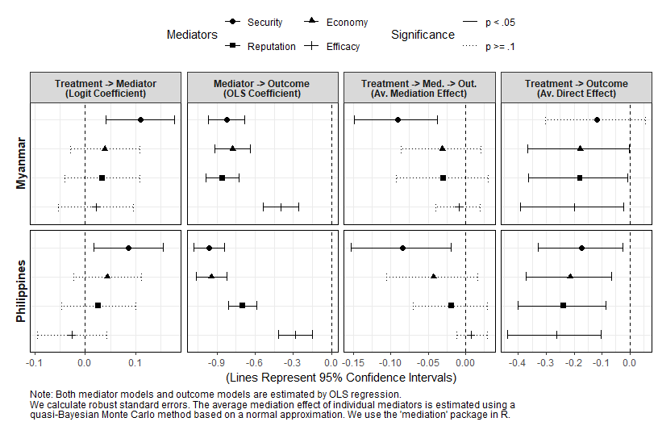

Analysis 3: Causal Mediation Analysis
================
Gento Kato
April 12, 2019

-   [Preparation](#preparation)
-   [Modeling Strategy for Causal Mediation Analysis](#modeling-strategy-for-causal-mediation-analysis)
    -   [Simple Mediation with Binary Mediators (Mediation Model is Logit)](#simple-mediation-with-binary-mediators-mediation-model-is-logit)
    -   [Simple Mediation with 5-cat Mediators (Mediation Model is OLS)](#simple-mediation-with-5-cat-mediators-mediation-model-is-ols)
    -   [Moderated Mediation with Binary Mediators (Mediation Model is Logit) and Binary Moderator (China Threat)](#moderated-mediation-with-binary-mediators-mediation-model-is-logit-and-binary-moderator-china-threat)
    -   [Moderated Mediation with 5-cat Mediators (Mediation Model is OLS) and Binary Moderator (China Threat)](#moderated-mediation-with-5-cat-mediators-mediation-model-is-ols-and-binary-moderator-china-threat)
    -   [Moderated Mediation with Binary Mediators (Mediation Model is Logit) and 3-cat Moderator (China Threat)](#moderated-mediation-with-binary-mediators-mediation-model-is-logit-and-3-cat-moderator-china-threat)
    -   [Moderated Mediation with 5-cat Mediators (Mediation Model is OLS) and 3-cat Moderator (China Threat)](#moderated-mediation-with-5-cat-mediators-mediation-model-is-ols-and-3-cat-moderator-china-threat)
    -   [Visualizing Mediation Analysis Results](#visualizing-mediation-analysis-results)
        -   [Mediation Analysis (mediator model is Logit, outcome model is OLS)](#mediation-analysis-mediator-model-is-logit-outcome-model-is-ols)
        -   [Mediation Analysis (mediator model is OLS, outcome model is OLS)](#mediation-analysis-mediator-model-is-ols-outcome-model-is-ols)
-   [Moderated Mediation](#moderated-mediation)
    -   [2p Moderator with 2p Mediator (Logit) and 9p Outcome (OLS)](#p-moderator-with-2p-mediator-logit-and-9p-outcome-ols)
        -   [Only Showing National Security Moderator in Plot](#only-showing-national-security-moderator-in-plot)
    -   [2p Moderator with 5p Mediator (OLS) and 9p Outcome (OLS)](#p-moderator-with-5p-mediator-ols-and-9p-outcome-ols)
        -   [Only Showing National Security Moderator in Plot](#only-showing-national-security-moderator-in-plot-1)
    -   [3p Moderator with 2p Mediator (Logit) and 9p Outcome (OLS)](#p-moderator-with-2p-mediator-logit-and-9p-outcome-ols-1)
        -   [Only Showing National Security Moderator in Plot](#only-showing-national-security-moderator-in-plot-2)
    -   [3p Moderator with 5p Mediator (OLS) and 9p Outcome (OLS)](#p-moderator-with-5p-mediator-ols-and-9p-outcome-ols-1)
        -   [Only Showing National Security Moderator in Plot](#only-showing-national-security-moderator-in-plot-3)

Preparation
===========

``` r
## Clear Workspace
rm(list = ls())

## Set Working Directory (Automatically) ##
require(rprojroot); require(rstudioapi)
if (rstudioapi::isAvailable()==TRUE) {
  setwd(dirname(rstudioapi::getActiveDocumentContext()$path)); 
} 
projdir <- find_root(has_file("thisishome.txt"))
#cat(paste("Working Directory Set to:\n",projdir))
setwd(projdir)

## Required Functions & Packages
source("src/analysis0_functions.R")
source("src/cl.mlogit.R")

## Load Data
do <- readRDS("data/donorexp.rds")
d <- do[do$comply==1,] # only compliers

## Subset Data
# MMR
d.MMR <- d[d$treatment %in% c(1,2),]
d.MMR$threat <- d.MMR$threat.MMR
d.MMR$imp <- d.MMR$imp.MMR
d.MMR$potential <- d.MMR$potential.MMR
# PHL
d.PHL <- d[d$treatment %in% c(3,5),]
d.PHL$threat <- d.PHL$threat.PHL
d.PHL$imp <- d.PHL$imp.PHL
d.PHL$potential <- d.PHL$potential.PHL
```

Modeling Strategy for Causal Mediation Analysis
===============================================

Add following covariates to the original model to reduce variance and justify the assumption that there are no unmeasured pre-treatment confounders that potentially causes both mediator and outcome. Additionally, the following analysis assume that there are no post-treatment confounders (no causal relationships between mediators).

-   Threat from MMR/PHL
-   Importance of MMR/PHL
-   Potential of MMR/PHL
-   International Issue Interests
-   ODA Importance
-   Gender
-   Age
-   Ideology

Estimated Models

-   Logit (Mediator/2cats) + OLS (Outcome/9cats)
-   OLS (Mediator/5cats) + OLS (Outcome/9cats)

Simple Mediation with Binary Mediators (Mediation Model is Logit)
-----------------------------------------------------------------

``` r
med.out.MMR.main <- gen.med.out(d.MMR,"cancel_aid",1000,
                                "src/processing/med.out.MMR.main.RData",
                                models=c("logit","gaussian"),
                                medcats=2)
med.out.PHL.main <- gen.med.out(d.PHL,"cancel_aid",1000,
                                "src/processing/med.out.PHL.main.RData",
                                models=c("logit","gaussian"),
                                medcats=2)
```

Simple Mediation with 5-cat Mediators (Mediation Model is OLS)
--------------------------------------------------------------

``` r
med.out.MMR.sub <- gen.med.out(d.MMR,"cancel_aid",1000,
                              "src/processing/med.out.MMR.sub.RData",
                              models=c("gaussian","gaussian"))
med.out.PHL.sub <- gen.med.out(d.PHL,"cancel_aid",1000,
                              "src/processing/med.out.PHL.sub.RData",
                              models=c("gaussian","gaussian"))
```

Moderated Mediation with Binary Mediators (Mediation Model is Logit) and Binary Moderator (China Threat)
--------------------------------------------------------------------------------------------------------

``` r
# When Moderator = 0
med.mod0.out.MMR.main.1 <- gen.med.out(d.MMR,"cancel_aid",1000,
                                     "src/processing/med.mod0.out.MMR.main.1.RData",
                                     models=c("logit","gaussian"),
                                     medcats = 2,
                                     moderated=TRUE,
                                     modvar="threat.CHN",
                                     modfix=0)
med.mod0.out.PHL.main.1 <- gen.med.out(d.PHL,"cancel_aid",1000,
                                       "src/processing/med.mod0.out.PHL.main.1.RData",
                                       models=c("logit","gaussian"),
                                       medcats = 2,
                                       moderated=TRUE, 
                                       modvar="threat.CHN",
                                       modfix=0)

# When Moderator = 1
med.mod1.out.MMR.main.1 <- gen.med.out(d.MMR,"cancel_aid",1000,
                                     "src/processing/med.mod1.out.MMR.main.1.RData",
                                     models=c("logit","gaussian"),
                                     medcats = 2,
                                     moderated=TRUE,
                                     modvar="threat.CHN",
                                     modfix=1)
med.mod1.out.PHL.main.1 <- gen.med.out(d.PHL,"cancel_aid",1000,
                                     "src/processing/med.mod1.out.PHL.main.1.RData",
                                     models=c("logit","gaussian"),
                                     medcats = 2,
                                     moderated=TRUE, 
                                     modvar="threat.CHN",
                                     modfix=1)
```

Moderated Mediation with 5-cat Mediators (Mediation Model is OLS) and Binary Moderator (China Threat)
-----------------------------------------------------------------------------------------------------

``` r
# When Moderator = 0
med.mod0.out.MMR.sub.1 <- gen.med.out(d.MMR,"cancel_aid",1000,
                              "src/processing/med.mod0.out.MMR.sub.1.RData",
                              models=c("gaussian","gaussian"),
                              moderated=TRUE, 
                              modvar="threat.CHN",
                              modfix=0)
med.mod0.out.PHL.sub.1 <- gen.med.out(d.PHL,"cancel_aid",1000,
                                      "src/processing/med.mod0.out.PHL.sub.1.RData",
                                      models=c("gaussian","gaussian"),
                                      moderated=TRUE, 
                                      modvar="threat.CHN",
                                      modfix=0)
# When Moderator = 1
med.mod1.out.MMR.sub.1 <- gen.med.out(d.MMR,"cancel_aid",1000,
                                  "src/processing/med.mod1.out.MMR.sub.1.RData",
                                  models=c("gaussian","gaussian"),
                                  moderated=TRUE, 
                                  modvar="threat.CHN",
                                  modfix=1)
med.mod1.out.PHL.sub.1 <- gen.med.out(d.PHL,"cancel_aid",1000,
                                   "src/processing/med.mod1.out.PHL.sub.1.RData",
                                   models=c("gaussian","gaussian"),
                                   moderated=TRUE, 
                                   modvar="threat.CHN",
                                   modfix=1)
```

Moderated Mediation with Binary Mediators (Mediation Model is Logit) and 3-cat Moderator (China Threat)
-------------------------------------------------------------------------------------------------------

``` r
# Moderator = 0
med.mod0.out.MMR.main.3 <- gen.med.out(d.MMR,"cancel_aid",1000,
                                       "src/processing/med.mod0.out.MMR.main.3.RData",
                                       models=c("logit","gaussian"),
                                       medcats = 2,
                                       moderated=TRUE,
                                       modvar="threat.CHN.3cat",
                                       modfix=0)
med.mod0.out.PHL.main.3 <- gen.med.out(d.PHL,"cancel_aid",1000,
                                       "src/processing/med.mod0.out.PHL.main.3.RData",
                                       models=c("logit","gaussian"),
                                       medcats = 2,
                                       moderated=TRUE, 
                                       modvar="threat.CHN.3cat",
                                       modfix=0)
# Moderator = 1
med.mod1.out.MMR.main.3 <- gen.med.out(d.MMR,"cancel_aid",1000,
                                       "src/processing/med.mod1.out.MMR.main.3.RData",
                                       models=c("logit","gaussian"),
                                       medcats = 2,
                                       moderated=TRUE,
                                       modvar="threat.CHN.3cat",
                                       modfix=1)
med.mod1.out.PHL.main.3 <- gen.med.out(d.PHL,"cancel_aid",1000,
                                       "src/processing/med.mod1.out.PHL.main.3.RData",
                                       models=c("logit","gaussian"),
                                       medcats = 2,
                                       moderated=TRUE, 
                                       modvar="threat.CHN.3cat",
                                       modfix=1)
# Moderator = 2
med.mod2.out.MMR.main.3 <- gen.med.out(d.MMR,"cancel_aid",1000,
                                       "src/processing/med.mod2.out.MMR.main.3.RData",
                                       models=c("logit","gaussian"),
                                       medcats = 2,
                                       moderated=TRUE,
                                       modvar="threat.CHN.3cat",
                                       modfix=2)
med.mod2.out.PHL.main.3 <- gen.med.out(d.PHL,"cancel_aid",1000,
                                       "src/processing/med.mod2.out.PHL.main.3.RData",
                                       models=c("logit","gaussian"),
                                       medcats = 2,
                                       moderated=TRUE, 
                                       modvar="threat.CHN.3cat",
                                       modfix=2)
```

Moderated Mediation with 5-cat Mediators (Mediation Model is OLS) and 3-cat Moderator (China Threat)
----------------------------------------------------------------------------------------------------

``` r
# Moderator = 0
med.mod0.out.MMR.sub.3 <- gen.med.out(d.MMR,"cancel_aid",1000,
                                      "src/processing/med.mod0.out.MMR.sub.3.RData",
                                      models=c("gaussian","gaussian"),
                                      moderated=TRUE, 
                                      modvar="threat.CHN.3cat",
                                      modfix=0)
med.mod0.out.PHL.sub.3 <- gen.med.out(d.PHL,"cancel_aid",1000,
                                      "src/processing/med.mod0.out.PHL.sub.3.RData",
                                      models=c("gaussian","gaussian"),
                                      moderated=TRUE, 
                                      modvar="threat.CHN.3cat",
                                      modfix=0)
# Moderator = 1
med.mod1.out.MMR.sub.3 <- gen.med.out(d.MMR,"cancel_aid",1000,
                                      "src/processing/med.mod1.out.MMR.sub.3.RData",
                                      models=c("gaussian","gaussian"),
                                      moderated=TRUE, 
                                      modvar="threat.CHN.3cat",
                                      modfix=1)
med.mod1.out.PHL.sub.3 <- gen.med.out(d.PHL,"cancel_aid",1000,
                                      "src/processing/med.mod1.out.PHL.sub.3.RData",
                                      models=c("gaussian","gaussian"),
                                      moderated=TRUE, 
                                      modvar="threat.CHN.3cat",
                                      modfix=1)
# Moderator = 2
med.mod2.out.MMR.sub.3 <- gen.med.out(d.MMR,"cancel_aid",1000,
                                      "src/processing/med.mod2.out.MMR.sub.3.RData",
                                      models=c("gaussian","gaussian"),
                                      moderated=TRUE, 
                                      modvar="threat.CHN.3cat",
                                      modfix=2)
med.mod2.out.PHL.sub.3 <- gen.med.out(d.PHL,"cancel_aid",1000,
                                      "src/processing/med.mod2.out.PHL.sub.3.RData",
                                      models=c("gaussian","gaussian"),
                                      moderated=TRUE, 
                                      modvar="threat.CHN.3cat",
                                      modfix=2)
```

Visualizing Mediation Analysis Results
--------------------------------------

### Mediation Analysis (mediator model is Logit, outcome model is OLS)

``` r
med.out.main.data <- gendata(med.out.MMR.main,med.out.PHL.main)
med.out.main.plot <- genplot(med.out.main.data,
                             "[Logit (Med/2cat) + OLS (Out/9cat)]")
```

``` r
med.out.main.plot
```


``` r
med.out.main.plot2 <- genplot(med.out.main.data,
                              "[Logit (Med/2cat) + OLS (Out/9cat)]",
                              include.eff = c("Mediated","Direct"))
p <- med.out.main.plot2 + 
  theme(strip.text = element_text(size=12,face="bold"),
        axis.text.x = element_text(size=11,face="bold"),
        axis.title.x = element_text(vjust=-0.5)) + 
  ggtitle(NULL) + xlab("The Decomposition of Total Effect")
p <- plot_footnote(p, "Note: Lines represent 95% confidence intervals estimated from quasi-Bayesian Monte Carlo method based \n         on normal approximation using robust standard errors. The mediator model is estimated by Logistic \n         regression and the outcome model is estimated by OLS regression.",
                   bottom.expand.rate = 11, align="left", caption=FALSE, show.plot = FALSE)
```

``` r
grid.draw(p)
```


``` r
png_save(p, w=850, h=500, file=c("out/med.out.main.plot.png"))
```

### Mediation Analysis (mediator model is OLS, outcome model is OLS)

``` r
med.out.sub.data <- gendata(med.out.MMR.sub,med.out.PHL.sub)
med.out.sub.plot <- genplot(med.out.sub.data,
                            "[OLS (Med/5cat) + OLS (Out/9cat)]")
```

``` r
med.out.sub.plot
```


``` r
med.out.sub.plot2 <- genplot(med.out.sub.data,
                              "[Logit (Med/2cat) + OLS (Out/9cat)]",
                              include.eff = c("Mediated","Direct"))
p <- med.out.sub.plot2 + 
  theme(strip.text = element_text(size=12,face="bold"),
        axis.text.x = element_text(size=11,face="bold"),
        axis.title.x = element_text(vjust=-0.5)) + 
  ggtitle(NULL) + xlab("The Decomposition of Total Effect")
p <- plot_footnote(p, "Note: Lines represent 95% confidence intervals estimated from quasi-Bayesian Monte Carlo method based \n         on normal approximation using robust standard errors. The mediator model is estimated by OLS \n         regression and the outcome model is estimated by OLS regression.",
                   bottom.expand.rate = 11, align="left", caption=FALSE, show.plot = FALSE)
```

``` r
grid.draw(p)
```


``` r
png_save(p, w=850, h=500, file=c("out/med.out.sub.plot.png"))
```

Moderated Mediation
===================

Assess moderation by threat perception to China

2p Moderator with 2p Mediator (Logit) and 9p Outcome (OLS)
----------------------------------------------------------

``` r
# Prepare Data
med.mod1.out.main.1.data <- gendata(med.mod1.out.MMR.main.1,med.mod1.out.PHL.main.1)
med.mod1.out.main.1.data$tcond <- "Threatened by China"
med.mod0.out.main.1.data <- gendata(med.mod0.out.MMR.main.1,med.mod0.out.PHL.main.1)
med.mod0.out.main.1.data$tcond <- "Not Threatened"
med.mod.out.main.1.data <- rbind(med.mod1.out.main.1.data,med.mod0.out.main.1.data)
med.mod.out.main.1.data$tcond <- factor(med.mod.out.main.1.data$tcond, 
                                        levels=unique(med.mod.out.main.1.data$tcond))

# Plot
med.mod.out.main.1.plot <- genplot(med.mod.out.main.1.data,
                                   "[Logit (Med/2cat) + OLS (Out/9cat)]",
                                   interact=TRUE)
p <- med.mod.out.main.1.plot + 
  theme(strip.text = element_text(size=12,face="bold"),
        axis.text.x = element_text(size=11,face="bold"),
        axis.title.x = element_text(vjust=-0.5)) + 
  ggtitle(NULL) + xlab("The Decomposition of Total Effect")
p <- plot_footnote(p, "Note: Lines represent 95% confidence intervals estimated from quasi-Bayesian Monte Carlo method based \n         on normal approximation using robust standard errors. The mediator model is estimated by Logistic \n         regression and the outcome model is estimated by OLS regression.",
                   bottom.expand.rate = 11, align="left", caption=FALSE, show.plot = FALSE)
```

``` r
grid.draw(p)
```


``` r
png_save(p, w=850, h=650, file=c("out/med.mod.out.main.1.plot.png"))
```

### Only Showing National Security Moderator in Plot

``` r
# Record N in Each Moderator Group
(N.MMR.1 <- sum(med.mod1.out.MMR.main.1[[2]]$model.y$model$mod==1))
```

    ## [1] 1285

``` r
(N.MMR.0 <- sum(med.mod1.out.MMR.main.1[[2]]$model.y$model$mod==0))
```

    ## [1] 280

``` r
(N.PHL.1 <- sum(med.mod1.out.PHL.main.1[[2]]$model.y$model$mod==1))
```

    ## [1] 1283

``` r
(N.PHL.0 <- sum(med.mod1.out.PHL.main.1[[2]]$model.y$model$mod==0))
```

    ## [1] 331

``` r
# Prepare Data 
med.mod1.out.main.1.data <- gendata(med.mod1.out.MMR.main.1,med.mod1.out.PHL.main.1)
med.mod1.out.main.1.data$tcond <- paste("Threatened \n  (N=", N.MMR.1, " for Myanmar) \n  (N=", N.PHL.1, " for Philippines)",sep="")
med.mod0.out.main.1.data <- gendata(med.mod0.out.MMR.main.1,med.mod0.out.PHL.main.1)
med.mod0.out.main.1.data$tcond <- paste("\nNot Threatened \n  (N=", N.MMR.0, " for Myanmar) \n  (N=", N.PHL.0, " for Philippines)",sep="")
med.mod.out.main.1.data <- rbind(med.mod1.out.main.1.data,med.mod0.out.main.1.data)
med.mod.out.main.1.data <- med.mod.out.main.1.data[med.mod.out.main.1.data=="Security",]
med.mod.out.main.1.data$tcond <- factor(med.mod.out.main.1.data$tcond, 
                                        levels=unique(med.mod.out.main.1.data$tcond))

# Plot (with Total Effect)
med.mod.out.main.1.plot <- genplot2(med.mod.out.main.1.data,
                                   "(Mediator: Security Interests)",
                                   interact=TRUE)
p <- med.mod.out.main.1.plot + 
  theme(strip.text = element_text(size=12,face="bold"),
        axis.text.x = element_text(size=11,face="bold"),
        axis.title.x = element_text(vjust=-0.5)) + 
  ggtitle(NULL) + xlab("The Decomposition of Total Effect")
p <- plot_footnote(p, "Note: Lines represent 95% confidence intervals estimated from quasi-Bayesian Monte Carlo method based \n         on normal approximation using robust standard errors. The mediator model is estimated by Logistic \n         regression and the outcome model is estimated by OLS regression.",
                   bottom.expand.rate = 11, align="left", caption=FALSE, show.plot = FALSE)
```

``` r
grid.draw(p)
```



``` r
png_save(p, w=850, h=500, dpi=300, file=c("out/med.mod.out.main.1.secu.wtotal.plot.png"))
```

``` r
# Plot (without Total Effect)
med.mod.out.main.1.plot2 <- genplot2(med.mod.out.main.1.data,
                                    "(Mediator: Security Interests)",
                                    interact=TRUE,
                                    include.eff = c("Mediated","Direct"))
p <- med.mod.out.main.1.plot2 + 
  theme(strip.text = element_text(size=12,face="bold"),
        axis.text.x = element_text(size=11,face="bold"),
        axis.title.x = element_text(vjust=-0.5)) + 
  ggtitle(NULL) + xlab("The Decomposition of Total Effect")
p <- plot_footnote(p, "Note: Lines represent 95% confidence intervals estimated from quasi-Bayesian Monte Carlo method based \n         on normal approximation using robust standard errors. The mediator model is estimated by Logistic \n         regression and the outcome model is estimated by OLS regression.",
                   bottom.expand.rate = 11, align="left", caption=FALSE, show.plot = FALSE)
```

``` r
grid.draw(p)
```


``` r
png_save(p, w=850, h=500, dpi=300, file=c("out/med.mod.out.main.1.secu.wototal.plot.png"))
```

2p Moderator with 5p Mediator (OLS) and 9p Outcome (OLS)
--------------------------------------------------------

``` r
# Prepare Data
med.mod1.out.sub.1.data <- gendata(med.mod1.out.MMR.sub.1,med.mod1.out.PHL.sub.1)
med.mod1.out.sub.1.data$tcond <- "Threatened by China"
med.mod0.out.sub.1.data <- gendata(med.mod0.out.MMR.sub.1,med.mod0.out.PHL.sub.1)
med.mod0.out.sub.1.data$tcond <- "Not Threatened"
med.mod.out.sub.1.data <- rbind(med.mod1.out.sub.1.data,med.mod0.out.sub.1.data)
med.mod.out.sub.1.data$tcond <- factor(med.mod.out.sub.1.data$tcond, 
                                       levels=unique(med.mod.out.sub.1.data$tcond))

# Plot
med.mod.out.sub.1.plot <- genplot(med.mod.out.sub.1.data,
                                  "[OLS (Med/5cat) + OLS (Out/9cat)]",
                                  interact=TRUE)
p <- med.mod.out.sub.1.plot + 
  theme(strip.text = element_text(size=12,face="bold"),
        axis.text.x = element_text(size=11,face="bold"),
        axis.title.x = element_text(vjust=-0.5)) + 
  ggtitle(NULL) + xlab("The Decomposition of Total Effect")
p <- plot_footnote(p, "Note: Lines represent 95% confidence intervals estimated from quasi-Bayesian Monte Carlo method based \n         on normal approximation using robust standard errors. The mediator model is estimated by OLS \n         regression and the outcome model is estimated by OLS regression.",
                   bottom.expand.rate = 11, align="left", caption=FALSE, show.plot = FALSE)
```

``` r
grid.draw(p)
```


``` r
png_save(p, w=850, h=650, file=c("out/med.mod.out.sub.1.plot.png"))
```

### Only Showing National Security Moderator in Plot

``` r
# Record N in Each Moderator Group
(N.MMR.1 <- sum(med.mod1.out.MMR.sub.1[[2]]$model.y$model$mod==1))
```

    ## [1] 1285

``` r
(N.MMR.0 <- sum(med.mod1.out.MMR.sub.1[[2]]$model.y$model$mod==0))
```

    ## [1] 280

``` r
(N.PHL.1 <- sum(med.mod1.out.PHL.sub.1[[2]]$model.y$model$mod==1))
```

    ## [1] 1283

``` r
(N.PHL.0 <- sum(med.mod1.out.PHL.sub.1[[2]]$model.y$model$mod==0))
```

    ## [1] 331

``` r
# Prepare Data 
med.mod1.out.sub.1.data <- gendata(med.mod1.out.MMR.sub.1,med.mod1.out.PHL.sub.1)
med.mod1.out.sub.1.data$tcond <- paste("Threatened \n  (N=", N.MMR.1, " for Myanmar) \n  (N=", N.PHL.1, " for Philippines)",sep="")
med.mod0.out.sub.1.data <- gendata(med.mod0.out.MMR.sub.1,med.mod0.out.PHL.sub.1)
med.mod0.out.sub.1.data$tcond <- paste("\nNot Threatened \n  (N=", N.MMR.0, " for Myanmar) \n  (N=", N.PHL.0, " for Philippines)",sep="")
med.mod.out.sub.1.data <- rbind(med.mod1.out.sub.1.data,med.mod0.out.sub.1.data)
med.mod.out.sub.1.data <- med.mod.out.sub.1.data[med.mod.out.sub.1.data=="Security",]
med.mod.out.sub.1.data$tcond <- factor(med.mod.out.sub.1.data$tcond, 
                                        levels=unique(med.mod.out.sub.1.data$tcond))

# Plot (with Total Effect)
med.mod.out.sub.1.plot <- genplot2(med.mod.out.sub.1.data,
                                    "(Mediator: Security Interests)",
                                    interact=TRUE)
p <- med.mod.out.sub.1.plot + 
  theme(strip.text = element_text(size=12,face="bold"),
        axis.text.x = element_text(size=11,face="bold"),
        axis.title.x = element_text(vjust=-0.5)) + 
  ggtitle(NULL) + xlab("The Decomposition of Total Effect")
p <- plot_footnote(p, "Note: Lines represent 95% confidence intervals estimated from quasi-Bayesian Monte Carlo method based \n         on normal approximation using robust standard errors. The mediator model is estimated by OLS \n         regression and the outcome model is estimated by OLS regression.",
                   bottom.expand.rate = 11, align="left", caption=FALSE, show.plot = FALSE)
```

``` r
grid.draw(p)
```


``` r
png_save(p, w=850, h=500, dpi=300, file=c("out/med.mod.out.sub.1.secu.wtotal.plot.png"))
```

``` r
# Plot (without Total Effect)
med.mod.out.sub.1.plot2 <- genplot2(med.mod.out.sub.1.data,
                                     "(Mediator: Security Interests)",
                                     interact=TRUE,
                                     include.eff = c("Mediated","Direct"))
p <- med.mod.out.sub.1.plot2 + 
  theme(strip.text = element_text(size=12,face="bold"),
        axis.text.x = element_text(size=11,face="bold"),
        axis.title.x = element_text(vjust=-0.5)) + 
  ggtitle(NULL) + xlab("The Decomposition of Total Effect")
p <- plot_footnote(p, "Note: Lines represent 95% confidence intervals estimated from quasi-Bayesian Monte Carlo method based \n         on normal approximation using robust standard errors. The mediator model is estimated by OLS \n         regression and the outcome model is estimated by OLS regression.",
                   bottom.expand.rate = 11, align="left", caption=FALSE, show.plot = FALSE)
```

``` r
grid.draw(p)
```


``` r
png_save(p, w=850, h=500, dpi=300, file=c("out/med.mod.out.sub.1.secu.wototal.plot.png"))
```

3p Moderator with 2p Mediator (Logit) and 9p Outcome (OLS)
----------------------------------------------------------

``` r
# Prepare Data
med.mod2.out.main.3.data <- gendata(med.mod2.out.MMR.main.3,med.mod2.out.PHL.main.3)
med.mod2.out.main.3.data$tcond <- "Highly Threatened \nby China"
med.mod1.out.main.3.data <- gendata(med.mod1.out.MMR.main.3,med.mod1.out.PHL.main.3)
med.mod1.out.main.3.data$tcond <- "Moderately Threatened \nby China"
med.mod0.out.main.3.data <- gendata(med.mod0.out.MMR.main.3,med.mod0.out.PHL.main.3)
med.mod0.out.main.3.data$tcond <- "Weakly Threatened \nby China"
med.mod.out.main.3.data <- rbind(med.mod2.out.main.3.data,
                                 med.mod1.out.main.3.data,
                                 med.mod0.out.main.3.data)
med.mod.out.main.3.data$tcond <- factor(med.mod.out.main.3.data$tcond, 
                                        levels=unique(med.mod.out.main.3.data$tcond))

# Plot
med.mod.out.main.3.plot <- genplot(med.mod.out.main.3.data,
                                   "[Logit (Med/2cat) + OLS (Out/9cat)]",
                                   interact=TRUE)
p <- med.mod.out.main.3.plot + 
  theme(strip.text = element_text(size=12,face="bold"),
        axis.text.x = element_text(size=11,face="bold"),
        axis.title.x = element_text(vjust=-0.5)) + 
  ggtitle(NULL) + xlab("The Decomposition of Total Effect")
p <- plot_footnote(p, "Note: Lines represent 95% confidence intervals estimated from quasi-Bayesian Monte Carlo method based \n         on normal approximation using robust standard errors. The mediator model is estimated by Logistic \n         regression and the outcome model is estimated by OLS regression.",
                   bottom.expand.rate = 11, align="left", caption=FALSE, show.plot = FALSE)
```

``` r
grid.draw(p)
```


``` r
png_save(p, w=850, h=1000, file=c("out/med.mod.out.main.3.plot.png"))
```

### Only Showing National Security Moderator in Plot

``` r
# Record N in Each Moderator Group
(N.MMR.2 <- sum(med.mod1.out.MMR.main.3[[2]]$model.y$model$mod==2))
```

    ## [1] 789

``` r
(N.MMR.1 <- sum(med.mod1.out.MMR.main.3[[2]]$model.y$model$mod==1))
```

    ## [1] 496

``` r
(N.MMR.0 <- sum(med.mod1.out.MMR.main.3[[2]]$model.y$model$mod==0))
```

    ## [1] 280

``` r
(N.PHL.2 <- sum(med.mod1.out.PHL.main.3[[2]]$model.y$model$mod==2))
```

    ## [1] 749

``` r
(N.PHL.1 <- sum(med.mod1.out.PHL.main.3[[2]]$model.y$model$mod==1))
```

    ## [1] 534

``` r
(N.PHL.0 <- sum(med.mod1.out.PHL.main.3[[2]]$model.y$model$mod==0))
```

    ## [1] 331

``` r
# Prepare Data
med.mod2.out.main.3.data <- gendata(med.mod2.out.MMR.main.3,med.mod2.out.PHL.main.3)
med.mod2.out.main.3.data$tcond <- paste("High \n  (N=", N.MMR.2, " for Myanmar) \n  (N=", N.PHL.2, " for Philippines)",sep="")
med.mod1.out.main.3.data <- gendata(med.mod1.out.MMR.main.3,med.mod1.out.PHL.main.3)
med.mod1.out.main.3.data$tcond <- paste("\nModerate \n  (N=", N.MMR.1, " for Myanmar) \n  (N=", N.PHL.1, " for Philippines)",sep="")
med.mod0.out.main.3.data <- gendata(med.mod0.out.MMR.main.3,med.mod0.out.PHL.main.3)
med.mod0.out.main.3.data$tcond <- paste("\nLow/None \n  (N=", N.MMR.0, " for Myanmar) \n  (N=", N.PHL.0, " for Philippines)",sep="")
med.mod.out.main.3.data <- rbind(med.mod2.out.main.3.data,
                                 med.mod1.out.main.3.data,
                                 med.mod0.out.main.3.data)
med.mod.out.main.3.data <- med.mod.out.main.3.data[med.mod.out.main.3.data=="Security",]
med.mod.out.main.3.data$tcond <- factor(med.mod.out.main.3.data$tcond, 
                                        levels=unique(med.mod.out.main.3.data$tcond))

# Plot (with Total Effect)
med.mod.out.main.3.plot <- genplot2(med.mod.out.main.3.data,
                                   "(Mediator: Security Interests)",
                                   interact=TRUE)
p <- med.mod.out.main.3.plot + 
  theme(strip.text = element_text(size=12,face="bold"),
        axis.text.x = element_text(size=11,face="bold"),
        axis.title.x = element_text(vjust=-0.5)) + 
  ggtitle(NULL) + xlab("The Decomposition of Total Effect")
p <- plot_footnote(p, "Note: Lines represent 95% confidence intervals estimated from quasi-Bayesian Monte Carlo method based \n         on normal approximation using robust standard errors. The mediator model is estimated by Logistic \n         regression and the outcome model is estimated by OLS regression.",
                   bottom.expand.rate = 11, align="left", caption=FALSE, show.plot = FALSE)
```

``` r
grid.draw(p)
```


``` r
png_save(p, w=850, h=500, dpi=300, file=c("out/med.mod.out.main.3.secu.wtotal.plot.png"))
```

``` r
# Plot (without Total Effect)
med.mod.out.main.3.plot2 <- genplot2(med.mod.out.main.3.data,
                                    "(Mediator: Security Interests)",
                                    interact=TRUE,
                                    include.eff = c("Mediated","Direct"))
p <- med.mod.out.main.3.plot2 + 
  theme(strip.text = element_text(size=12,face="bold"),
        axis.text.x = element_text(size=11,face="bold"),
        axis.title.x = element_text(vjust=-0.5)) + 
  ggtitle(NULL) + xlab("The Decomposition of Total Effect")
p <- plot_footnote(p, "Note: Lines represent 95% confidence intervals estimated from quasi-Bayesian Monte Carlo method based \n         on normal approximation using robust standard errors. The mediator model is estimated by Logistic \n         regression and the outcome model is estimated by OLS regression.",
                   bottom.expand.rate = 11, align="left", caption=FALSE, show.plot = FALSE)
```

``` r
grid.draw(p)
```


``` r
png_save(p, w=850, h=500, dpi=300, file=c("out/med.mod.out.main.3.secu.wototal.plot.png"))
```

3p Moderator with 5p Mediator (OLS) and 9p Outcome (OLS)
--------------------------------------------------------

``` r
# Prepare Data
med.mod2.out.sub.3.data <- gendata(med.mod2.out.MMR.sub.3,med.mod2.out.PHL.sub.3)
med.mod2.out.sub.3.data$tcond <- "Highly Threatened \nby China"
med.mod1.out.sub.3.data <- gendata(med.mod1.out.MMR.sub.3,med.mod1.out.PHL.sub.3)
med.mod1.out.sub.3.data$tcond <- "Moderately Threatened \nby China"
med.mod0.out.sub.3.data <- gendata(med.mod0.out.MMR.sub.3,med.mod0.out.PHL.sub.3)
med.mod0.out.sub.3.data$tcond <- "Weakly Threatened \nby China"
med.mod.out.sub.3.data <- rbind(med.mod2.out.sub.3.data,
                                med.mod1.out.sub.3.data,
                                med.mod0.out.sub.3.data)
med.mod.out.sub.3.data$tcond <- factor(med.mod.out.sub.3.data$tcond, 
                                       levels=unique(med.mod.out.sub.3.data$tcond))

# Plot
med.mod.out.sub.3.plot <- genplot(med.mod.out.sub.3.data,
                                  "[OLS (Med/5cat) + OLS (Out/9cat)]",
                                  interact=TRUE)
p <- med.mod.out.sub.3.plot + 
  theme(strip.text = element_text(size=12,face="bold"),
        axis.text.x = element_text(size=11,face="bold"),
        axis.title.x = element_text(vjust=-0.5)) + 
  ggtitle(NULL) + xlab("The Decomposition of Total Effect")
p <- plot_footnote(p, "Note: Lines represent 95% confidence intervals estimated from quasi-Bayesian Monte Carlo method based \n         on normal approximation using robust standard errors. The mediator model is estimated by OLS \n         regression and the outcome model is estimated by OLS regression.",
                   bottom.expand.rate = 11, align="left", caption=FALSE, show.plot = FALSE)
```

``` r
grid.draw(p)
```


``` r
png_save(p, w=850, h=1000, file=c("out/med.mod.out.sub.3.plot.png"))
```

### Only Showing National Security Moderator in Plot

``` r
# Record N in Each Moderator Group
(N.MMR.2 <- sum(med.mod1.out.MMR.sub.3[[2]]$model.y$model$mod==2))
```

    ## [1] 789

``` r
(N.MMR.1 <- sum(med.mod1.out.MMR.sub.3[[2]]$model.y$model$mod==1))
```

    ## [1] 496

``` r
(N.MMR.0 <- sum(med.mod1.out.MMR.sub.3[[2]]$model.y$model$mod==0))
```

    ## [1] 280

``` r
(N.PHL.2 <- sum(med.mod1.out.PHL.sub.3[[2]]$model.y$model$mod==2))
```

    ## [1] 749

``` r
(N.PHL.1 <- sum(med.mod1.out.PHL.sub.3[[2]]$model.y$model$mod==1))
```

    ## [1] 534

``` r
(N.PHL.0 <- sum(med.mod1.out.PHL.sub.3[[2]]$model.y$model$mod==0))
```

    ## [1] 331

``` r
# Prepare Data
med.mod2.out.sub.3.data <- gendata(med.mod2.out.MMR.sub.3,med.mod2.out.PHL.sub.3)
med.mod2.out.sub.3.data$tcond <- paste("High \n  (N=", N.MMR.2, " for Myanmar) \n  (N=", N.PHL.2, " for Philippines)",sep="")
med.mod1.out.sub.3.data <- gendata(med.mod1.out.MMR.sub.3,med.mod1.out.PHL.sub.3)
med.mod1.out.sub.3.data$tcond <- paste("\nModerate \n  (N=", N.MMR.1, " for Myanmar) \n  (N=", N.PHL.1, " for Philippines)",sep="")
med.mod0.out.sub.3.data <- gendata(med.mod0.out.MMR.sub.3,med.mod0.out.PHL.sub.3)
med.mod0.out.sub.3.data$tcond <- paste("\nLow/None \n  (N=", N.MMR.0, " for Myanmar) \n  (N=", N.PHL.0, " for Philippines)",sep="")
med.mod.out.sub.3.data <- rbind(med.mod2.out.sub.3.data,
                                 med.mod1.out.sub.3.data,
                                 med.mod0.out.sub.3.data)
med.mod.out.sub.3.data <- med.mod.out.sub.3.data[med.mod.out.sub.3.data=="Security",]
med.mod.out.sub.3.data$tcond <- factor(med.mod.out.sub.3.data$tcond, 
                                        levels=unique(med.mod.out.sub.3.data$tcond))

# Plot (with Total Effect)
med.mod.out.sub.3.plot <- genplot2(med.mod.out.sub.3.data,
                                    "(Mediator: Security Interests)",
                                    interact=TRUE)
p <- med.mod.out.sub.3.plot + 
  theme(strip.text = element_text(size=12,face="bold"),
        axis.text.x = element_text(size=11,face="bold"),
        axis.title.x = element_text(vjust=-0.5)) + 
  ggtitle(NULL) + xlab("The Decomposition of Total Effect")
p <- plot_footnote(p, "Note: Lines represent 95% confidence intervals estimated from quasi-Bayesian Monte Carlo method based \n         on normal approximation using robust standard errors. The mediator model is estimated by OLS \n         regression and the outcome model is estimated by OLS regression.",
                   bottom.expand.rate = 11, align="left", caption=FALSE, show.plot = FALSE)
```

``` r
grid.draw(p)
```


``` r
png_save(p, w=850, h=500, dpi=300, file=c("out/med.mod.out.sub.3.secu.wtotal.plot.png"))
```

``` r
# Plot (without Total Effect)
med.mod.out.sub.3.plot2 <- genplot2(med.mod.out.sub.3.data,
                                     "(Mediator: Security Interests)",
                                     interact=TRUE,
                                     include.eff = c("Mediated","Direct"))
p <- med.mod.out.sub.3.plot2 + 
  theme(strip.text = element_text(size=12,face="bold"),
        axis.text.x = element_text(size=11,face="bold"),
        axis.title.x = element_text(vjust=-0.5)) + 
  ggtitle(NULL) + xlab("The Decomposition of Total Effect")
p <- plot_footnote(p, "Note: Lines represent 95% confidence intervals estimated from quasi-Bayesian Monte Carlo method based \n         on normal approximation using robust standard errors. The mediator model is estimated by OLS \n         regression and the outcome model is estimated by OLS regression.",
                   bottom.expand.rate = 11, align="left", caption=FALSE, show.plot = FALSE)
```

``` r
grid.draw(p)
```


``` r
png_save(p, w=850, h=500, dpi=300, file=c("out/med.mod.out.sub.3.secu.wototal.plot.png"))
```
