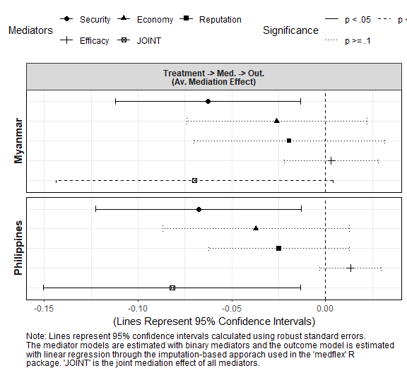

Analysis 4: Joint Causal Mediation Analysis Using medflex Package
================
Gento Kato
April 13, 2019

-   [Preparation](#preparation)
-   [Joint Causal Mediation Analysis](#joint-causal-mediation-analysis)
    -   [Check Single Mediators](#check-single-mediators)
        -   [Myanmar](#myanmar)
        -   [Philippines](#philippines)
    -   [Joint Causal Mediation Analysis](#joint-causal-mediation-analysis-1)
    -   [Plotting Mediation Analysis Results](#plotting-mediation-analysis-results)
    -   [Moderated Mediation of Security Mediator](#moderated-mediation-of-security-mediator)
        -   [2p Moderator, 2p Mediator and 9p Outcome](#p-moderator-2p-mediator-and-9p-outcome)
        -   [3p Moderator, 2p Mediator and 9p Outcome](#p-moderator-2p-mediator-and-9p-outcome-1)
        -   [2p Moderator, 5p Mediator and 9p Outcome](#p-moderator-5p-mediator-and-9p-outcome)
        -   [3p Moderator, 5p Mediator and 9p Outcome](#p-moderator-5p-mediator-and-9p-outcome-1)

Preparation
===========

``` r
## Clear Workspace
rm(list = ls())

## Set Working Directory (Automatically) ##
require(rprojroot); require(rstudioapi)
if (rstudioapi::isAvailable()==TRUE) {
  setwd(dirname(rstudioapi::getActiveDocumentContext()$path)); 
} 
projdir <- find_root(has_file("thisishome.txt"))
#cat(paste("Working Directory Set to:\n",projdir))
setwd(projdir)

## Required Functions & Packages
source("src/analysis0_functions.R")
source("src/cl.mlogit.R")

## Load Data
do <- readRDS("data/donorexp.rds")
d <- do[do$comply==1,] # only compliers

d$cancel_aid <- as.numeric(d$cancel_aid)
d$med_econ <- as.numeric(d$med_econ)
d$med_secu <- as.numeric(d$med_secu)
d$med_repu <- as.numeric(d$med_repu)
d$med_effi <- as.numeric(d$med_effi)
d$med_econ_2cat <- ifelse(d$med_econ>3,1,0)
d$med_secu_2cat <- ifelse(d$med_secu>3,1,0)
d$med_repu_2cat <- ifelse(d$med_repu>3,1,0)
d$med_effi_2cat <- ifelse(d$med_effi>3,1,0)

## Subset Data
# MMR
d.MMR <- d[d$treatment %in% c(1,2),]
d.MMR$threat <- d.MMR$threat.MMR
d.MMR$imp <- d.MMR$imp.MMR
d.MMR$potential <- d.MMR$potential.MMR
# PHL
d.PHL <- d[d$treatment %in% c(3,5),]
d.PHL$threat <- d.PHL$threat.PHL
d.PHL$imp <- d.PHL$imp.PHL
d.PHL$potential <- d.PHL$potential.PHL

# Drop Cases with Missing Values in Relevant Variables
vars <- c("cancel_aid","treat_China","threat","imp","potential",  
          "issint","odaimp","fem","age","ide3",
          "med_econ","med_secu","med_repu","med_effi",
          "med_econ_2cat","med_secu_2cat","med_repu_2cat","med_effi_2cat")
d.MMR.sub <- na.omit(d.MMR[,vars])
d.PHL.sub <- na.omit(d.PHL[,vars])
```

Joint Causal Mediation Analysis
===============================

This analysis is based on VanderWeele and Vansteelandt (2013) which discusses the estimation of "joint" mediation effect under potential outcome framework. <code>mediation</code> package does not provide this functionality, thus <code>medflex</code> packages is used here.

``` r
library(medflex)
```

Check Single Mediators
----------------------

Check if the one-by-one mediation analysis looks the same with the results from <code>mediation</code> package (it is!).

### Myanmar

``` r
# (secu)
# 2 cat mediator
di.MMR.main.secu <- neImpute(update(cancel_aid ~ treat_China + med_secu_2cat, fcv),
               family = "gaussian", nMed = 1, data = d.MMR.sub)
m.MMR.main.secu <- neModel(update(cancel_aid ~ treat_China0 + treat_China1, fcv), 
             family = "gaussian", expData = di.MMR.main.secu, se = "robust")
# 5 cat mediator
di.MMR.sub.secu <- neImpute(update(cancel_aid ~ treat_China + med_secu, fcv),
                         family = "gaussian", nMed = 1, data = d.MMR.sub)
m.MMR.sub.secu <- neModel(update(cancel_aid ~ treat_China0 + treat_China1, fcv), 
                       family = "gaussian", expData = di.MMR.sub.secu, se = "robust")

# (econ)
# 2 cat mediator
di.MMR.main.econ <- neImpute(update(cancel_aid ~ treat_China + med_econ_2cat, fcv),
                         family = "gaussian", nMed = 1, data = d.MMR.sub)
m.MMR.main.econ <- neModel(update(cancel_aid ~ treat_China0 + treat_China1, fcv), 
                       family = "gaussian", expData = di.MMR.main.econ, se = "robust")
# 5 cat mediator
di.MMR.sub.econ <- neImpute(update(cancel_aid ~ treat_China + med_econ, fcv),
                        family = "gaussian", nMed = 1, data = d.MMR.sub)
m.MMR.sub.econ <- neModel(update(cancel_aid ~ treat_China0 + treat_China1, fcv), 
                      family = "gaussian", expData = di.MMR.sub.econ, se = "robust")

# (repu)
# 2 cat mediator
di.MMR.main.repu <- neImpute(update(cancel_aid ~ treat_China + med_repu_2cat, fcv),
                         family = "gaussian", nMed = 1, data = d.MMR.sub)
m.MMR.main.repu <- neModel(update(cancel_aid ~ treat_China0 + treat_China1, fcv), 
                       family = "gaussian", expData = di.MMR.main.repu, se = "robust")
# 5 cat mediator
di.MMR.sub.repu <- neImpute(update(cancel_aid ~ treat_China + med_repu, fcv),
                        family = "gaussian", nMed = 1, data = d.MMR.sub)
m.MMR.sub.repu <- neModel(update(cancel_aid ~ treat_China0 + treat_China1, fcv), 
                      family = "gaussian", expData = di.MMR.sub.repu, se = "robust")

# (effi)
# 2 cat mediator
di.MMR.main.effi <- neImpute(update(cancel_aid ~ treat_China + med_effi_2cat, fcv),
                         family = "gaussian", nMed = 1, data = d.MMR.sub)
m.MMR.main.effi <- neModel(update(cancel_aid ~ treat_China0 + treat_China1, fcv), 
                       family = "gaussian", expData = di.MMR.main.effi, se = "robust")
# 5 cat mediator
di.MMR.sub.effi <- neImpute(update(cancel_aid ~ treat_China + med_effi, fcv),
                        family = "gaussian", nMed = 1, data = d.MMR.sub)
m.MMR.sub.effi <- neModel(update(cancel_aid ~ treat_China0 + treat_China1, fcv), 
                      family = "gaussian", expData = di.MMR.sub.effi, se = "robust")
```

### Philippines

``` r
# (secu)
# 2 cat mediator
di.PHL.main.secu <- neImpute(update(cancel_aid ~ treat_China + med_secu_2cat, fcv),
                             family = "gaussian", nMed = 1, data = d.PHL.sub)
m.PHL.main.secu <- neModel(update(cancel_aid ~ treat_China0 + treat_China1, fcv), 
                           family = "gaussian", expData = di.PHL.main.secu, se = "robust")
# 5 cat mediator
di.PHL.sub.secu <- neImpute(update(cancel_aid ~ treat_China + med_secu, fcv),
                            family = "gaussian", nMed = 1, data = d.PHL.sub)
m.PHL.sub.secu <- neModel(update(cancel_aid ~ treat_China0 + treat_China1, fcv), 
                          family = "gaussian", expData = di.PHL.sub.secu, se = "robust")

# (econ)
# 2 cat mediator
di.PHL.main.econ <- neImpute(update(cancel_aid ~ treat_China + med_econ_2cat, fcv),
                             family = "gaussian", nMed = 1, data = d.PHL.sub)
m.PHL.main.econ <- neModel(update(cancel_aid ~ treat_China0 + treat_China1, fcv), 
                           family = "gaussian", expData = di.PHL.main.econ, se = "robust")
# 5 cat mediator
di.PHL.sub.econ <- neImpute(update(cancel_aid ~ treat_China + med_econ, fcv),
                            family = "gaussian", nMed = 1, data = d.PHL.sub)
m.PHL.sub.econ <- neModel(update(cancel_aid ~ treat_China0 + treat_China1, fcv), 
                          family = "gaussian", expData = di.PHL.sub.econ, se = "robust")

# (repu)
# 2 cat mediator
di.PHL.main.repu <- neImpute(update(cancel_aid ~ treat_China + med_repu_2cat, fcv),
                             family = "gaussian", nMed = 1, data = d.PHL.sub)
m.PHL.main.repu <- neModel(update(cancel_aid ~ treat_China0 + treat_China1, fcv), 
                           family = "gaussian", expData = di.PHL.main.repu, se = "robust")
# 5 cat mediator
di.PHL.sub.repu <- neImpute(update(cancel_aid ~ treat_China + med_repu, fcv),
                            family = "gaussian", nMed = 1, data = d.PHL.sub)
m.PHL.sub.repu <- neModel(update(cancel_aid ~ treat_China0 + treat_China1, fcv), 
                          family = "gaussian", expData = di.PHL.sub.repu, se = "robust")

# (effi)
# 2 cat mediator
di.PHL.main.effi <- neImpute(update(cancel_aid ~ treat_China + med_effi_2cat, fcv),
                             family = "gaussian", nMed = 1, data = d.PHL.sub)
m.PHL.main.effi <- neModel(update(cancel_aid ~ treat_China0 + treat_China1, fcv), 
                           family = "gaussian", expData = di.PHL.main.effi, se = "robust")
# 5 cat mediator
di.PHL.sub.effi <- neImpute(update(cancel_aid ~ treat_China + med_effi, fcv),
                            family = "gaussian", nMed = 1, data = d.PHL.sub)
m.PHL.sub.effi <- neModel(update(cancel_aid ~ treat_China0 + treat_China1, fcv), 
                          family = "gaussian", expData = di.PHL.sub.effi, se = "robust")
```

Joint Causal Mediation Analysis
-------------------------------

``` r
# 2p Mediator and 9p Outcome
di.MMR.main <- neImpute(update(cancel_aid ~ treat_China + med_secu_2cat * med_econ_2cat * med_repu_2cat * med_effi_2cat, fcv),
               family = "gaussian", nMed = 4, data = d.MMR.sub)
m.MMR.main <- neModel(update(cancel_aid ~ treat_China0 + treat_China1, fcv), 
             family = "gaussian", expData = di.MMR.main, se = "robust")
summary(m.MMR.main)
```

    ## Natural effect model
    ## with robust standard errors based on the sandwich estimator
    ## ---
    ## Exposure: treat_China 
    ## Mediator(s): med_secu_2cat, med_econ_2cat, med_repu_2cat, med_effi_2cat 
    ## ---
    ## Parameter estimates:
    ##               Estimate Std. Error z value Pr(>|z|)    
    ## (Intercept)   6.152765   0.262325  23.455  < 2e-16 ***
    ## treat_China0 -0.135989   0.086944  -1.564 0.117796    
    ## treat_China1 -0.069861   0.037646  -1.856 0.063492 .  
    ## threat1       0.212244   0.110901   1.914 0.055644 .  
    ## threat2       0.773750   0.238740   3.241 0.001191 ** 
    ## imp1          0.024301   0.164059   0.148 0.882246    
    ## imp2         -0.075785   0.168267  -0.450 0.652430    
    ## potential1   -0.461288   0.134787  -3.422 0.000621 ***
    ## potential2   -0.870683   0.151896  -5.732 9.92e-09 ***
    ## issint1       0.297408   0.114528   2.597 0.009409 ** 
    ## issint2       0.225472   0.147374   1.530 0.126033    
    ## odaimp       -1.551608   0.128434 -12.081  < 2e-16 ***
    ## fem           0.192450   0.094792   2.030 0.042333 *  
    ## age          -0.002140   0.003582  -0.597 0.550185    
    ## ide31         0.042923   0.126122   0.340 0.733611    
    ## ide32        -0.011803   0.122375  -0.096 0.923162    
    ## ---
    ## Signif. codes:  0 '***' 0.001 '**' 0.01 '*' 0.05 '.' 0.1 ' ' 1

``` r
di.PHL.main <- neImpute(update(cancel_aid ~ treat_China + med_secu_2cat * med_econ_2cat * med_repu_2cat * med_effi_2cat, fcv),
                        family = "gaussian", nMed = 4, data = d.PHL.sub)
m.PHL.main <- neModel(update(cancel_aid ~ treat_China0 + treat_China1, fcv), 
                      family = "gaussian", expData = di.PHL.main, se = "robust")
summary(m.PHL.main)
```

    ## Natural effect model
    ## with robust standard errors based on the sandwich estimator
    ## ---
    ## Exposure: treat_China 
    ## Mediator(s): med_secu_2cat, med_econ_2cat, med_repu_2cat, med_effi_2cat 
    ## ---
    ## Parameter estimates:
    ##                Estimate Std. Error z value Pr(>|z|)    
    ## (Intercept)   6.9637357  0.2605957  26.722  < 2e-16 ***
    ## treat_China0 -0.1713836  0.0760625  -2.253  0.02425 *  
    ## treat_China1 -0.0817775  0.0350074  -2.336  0.01949 *  
    ## threat1       0.0845391  0.0914884   0.924  0.35546    
    ## threat2       0.3788588  0.2035054   1.862  0.06265 .  
    ## imp1         -0.5248020  0.1641095  -3.198  0.00138 ** 
    ## imp2         -0.7454103  0.1653875  -4.507 6.57e-06 ***
    ## potential1   -0.2507919  0.1228637  -2.041  0.04123 *  
    ## potential2   -0.7251806  0.1382005  -5.247 1.54e-07 ***
    ## issint1       0.0442658  0.1100714   0.402  0.68757    
    ## issint2      -0.2777884  0.1353675  -2.052  0.04016 *  
    ## odaimp       -1.9379068  0.1205487 -16.076  < 2e-16 ***
    ## fem           0.3668479  0.0835904   4.389 1.14e-05 ***
    ## age          -0.0001221  0.0031429  -0.039  0.96901    
    ## ide31        -0.0498186  0.1149400  -0.433  0.66470    
    ## ide32        -0.3353907  0.1164616  -2.880  0.00398 ** 
    ## ---
    ## Signif. codes:  0 '***' 0.001 '**' 0.01 '*' 0.05 '.' 0.1 ' ' 1

``` r
# 5p Mediator and 9p Outcome
di.MMR.sub <- neImpute(update(cancel_aid ~ treat_China + med_secu * med_econ * med_repu * med_effi, fcv),
                        family = "gaussian", nMed = 4, data = d.MMR.sub)
m.MMR.sub <- neModel(update(cancel_aid ~ treat_China0 + treat_China1, fcv), 
                      family = "gaussian", expData = di.MMR.sub, se = "robust")
summary(m.MMR.sub)
```

    ## Natural effect model
    ## with robust standard errors based on the sandwich estimator
    ## ---
    ## Exposure: treat_China 
    ## Mediator(s): med_secu, med_econ, med_repu, med_effi 
    ## ---
    ## Parameter estimates:
    ##               Estimate Std. Error z value Pr(>|z|)    
    ## (Intercept)   6.152765   0.262325  23.455  < 2e-16 ***
    ## treat_China0 -0.094787   0.082852  -1.144 0.252600    
    ## treat_China1 -0.111063   0.044423  -2.500 0.012414 *  
    ## threat1       0.212244   0.110901   1.914 0.055644 .  
    ## threat2       0.773750   0.238740   3.241 0.001191 ** 
    ## imp1          0.024301   0.164059   0.148 0.882246    
    ## imp2         -0.075785   0.168267  -0.450 0.652430    
    ## potential1   -0.461288   0.134787  -3.422 0.000621 ***
    ## potential2   -0.870683   0.151896  -5.732 9.92e-09 ***
    ## issint1       0.297408   0.114528   2.597 0.009409 ** 
    ## issint2       0.225472   0.147374   1.530 0.126033    
    ## odaimp       -1.551608   0.128434 -12.081  < 2e-16 ***
    ## fem           0.192450   0.094792   2.030 0.042333 *  
    ## age          -0.002140   0.003582  -0.597 0.550185    
    ## ide31         0.042923   0.126122   0.340 0.733611    
    ## ide32        -0.011803   0.122375  -0.096 0.923162    
    ## ---
    ## Signif. codes:  0 '***' 0.001 '**' 0.01 '*' 0.05 '.' 0.1 ' ' 1

``` r
di.PHL.sub <- neImpute(update(cancel_aid ~ treat_China + med_secu * med_econ * med_repu * med_effi, fcv),
                        family = "gaussian", nMed = 4, data = d.PHL.sub)
m.PHL.sub <- neModel(update(cancel_aid ~ treat_China0 + treat_China1, fcv), 
                      family = "gaussian", expData = di.PHL.sub, se = "robust")
summary(m.PHL.sub)
```

    ## Natural effect model
    ## with robust standard errors based on the sandwich estimator
    ## ---
    ## Exposure: treat_China 
    ## Mediator(s): med_secu, med_econ, med_repu, med_effi 
    ## ---
    ## Parameter estimates:
    ##                Estimate Std. Error z value Pr(>|z|)    
    ## (Intercept)   6.9637357  0.2605957  26.722  < 2e-16 ***
    ## treat_China0 -0.1643270  0.0716798  -2.293  0.02188 *  
    ## treat_China1 -0.0888342  0.0432986  -2.052  0.04020 *  
    ## threat1       0.0845391  0.0914884   0.924  0.35546    
    ## threat2       0.3788588  0.2035054   1.862  0.06265 .  
    ## imp1         -0.5248020  0.1641095  -3.198  0.00138 ** 
    ## imp2         -0.7454103  0.1653875  -4.507 6.57e-06 ***
    ## potential1   -0.2507919  0.1228637  -2.041  0.04123 *  
    ## potential2   -0.7251806  0.1382005  -5.247 1.54e-07 ***
    ## issint1       0.0442658  0.1100714   0.402  0.68757    
    ## issint2      -0.2777884  0.1353675  -2.052  0.04016 *  
    ## odaimp       -1.9379068  0.1205487 -16.076  < 2e-16 ***
    ## fem           0.3668479  0.0835904   4.389 1.14e-05 ***
    ## age          -0.0001221  0.0031429  -0.039  0.96901    
    ## ide31        -0.0498186  0.1149400  -0.433  0.66470    
    ## ide32        -0.3353907  0.1164616  -2.880  0.00398 ** 
    ## ---
    ## Signif. codes:  0 '***' 0.001 '**' 0.01 '*' 0.05 '.' 0.1 ' ' 1

Plotting Mediation Analysis Results
-----------------------------------

``` r
# 2p Mediator and 9p Outcome
mainls <- list(m.MMR.main.secu,m.MMR.main.econ,m.MMR.main.repu,m.MMR.main.effi,m.MMR.main,
               m.PHL.main.secu,m.PHL.main.econ,m.PHL.main.repu,m.PHL.main.effi,m.PHL.main)
dmain0 <- as.data.frame(t(sapply(mainls, estrow2, at=2)))
dmain1 <- as.data.frame(t(sapply(mainls, estrow2, at=3)))
dmain <- rbind(dmain0,dmain1)
dmain$pcat <- ifelse(dmain$p10==0,"p >= .1", ifelse(dmain$p05==0,"p < .1","p < .05"))
dmain$pcat <- factor(dmain$pcat,levels=c("p < .05","p < .1", "p >= .1"))
dmain$med <- rep(c("Security","Economy","Reputation","Efficacy","JOINT"),4)
dmain$med <- factor(dmain$med, levels=unique(dmain$med))
dmain$eff <- rep(c("Direct","Mediated"), each = 10)
dmain$eff <- factor(dmain$eff, levels=c("Mediated","Direct","Total"))
dmain$country <- rep(rep(c("Myanmar","Philippines"), each=5),2)

p <- genplot(dmain, "", include.eff = c("Mediated","Direct")) + 
  theme(strip.text = element_text(size=12,face="bold"),
        axis.text.x = element_text(size=11,face="bold"),
        axis.title.x = element_text(vjust=-0.5)) + 
  ggtitle(NULL) + xlab("The Decomposition of Total Effect")
p <- plot_footnote(p, "Note: Lines represent 95% confidence intervals calculated using robust standard errors. The mediator model\n         are estimated with binary mediators and the outcome model is estimated with linear regression through\n         imputation-based apporach in 'medflex' R package. 'JOINT' is the joint mediation effect of all mediators.",
                   bottom.expand.rate = 11, align="left", caption=FALSE, show.plot = FALSE)
```

``` r
grid.draw(p)
```



``` r
png_save(p, w=850, h=500, file=c("out/medflex.med.out.main.plot.png"))
```

``` r
# 5p Mediator and 9p Outcome
subls <- list(m.MMR.sub.secu,m.MMR.sub.econ,m.MMR.sub.repu,m.MMR.sub.effi,m.MMR.sub,
               m.PHL.sub.secu,m.PHL.sub.econ,m.PHL.sub.repu,m.PHL.sub.effi,m.PHL.sub)
dsub0 <- as.data.frame(t(sapply(subls, estrow2, at=2)))
dsub1 <- as.data.frame(t(sapply(subls, estrow2, at=3)))
dsub <- rbind(dsub0,dsub1)
dsub$pcat <- ifelse(dsub$p10==0,"p >= .1", ifelse(dsub$p05==0,"p < .1","p < .05"))
dsub$pcat <- factor(dsub$pcat,levels=c("p < .05","p < .1", "p >= .1"))
dsub$med <- rep(c("Security","Economy","Reputation","Efficacy","JOINT"),4)
dsub$med <- factor(dsub$med, levels=unique(dsub$med))
dsub$eff <- rep(c("Direct","Mediated"), each = 10)
dsub$eff <- factor(dsub$eff, levels=c("Mediated","Direct","Total"))
dsub$country <- rep(rep(c("Myanmar","Philippines"), each=5),2)

p <- genplot(dsub, "", include.eff = c("Mediated","Direct")) + 
  theme(strip.text = element_text(size=12,face="bold"),
        axis.text.x = element_text(size=11,face="bold"),
        axis.title.x = element_text(vjust=-0.5)) + 
  ggtitle(NULL) + xlab("The Decomposition of Total Effect")
p <- plot_footnote(p, "Note: Lines represent 95% confidence intervals calculated using robust standard errors. The mediator model\n         are estimated with 5p mediators and the outcome model is estimated with linear regression through\n         imputation-based apporach in 'medflex' R package. 'JOINT' is the joint mediation effect of all mediators.",
                   bottom.expand.rate = 11, align="left", caption=FALSE, show.plot = FALSE)
```

``` r
grid.draw(p)
```


``` r
png_save(p, w=850, h=500, file=c("out/medflex.med.out.sub.plot.png"))
```

Moderated Mediation of Security Mediator
----------------------------------------

``` r
# Drop Cases with Missing Values in Relevant Variables
vars <- c("cancel_aid","treat_China","threat","imp","potential",  
          "issint","odaimp","fem","age","ide3",
          "threat.CHN","threat.CHN.3cat",
          "med_econ","med_secu","med_repu","med_effi",
          "med_econ_2cat","med_secu_2cat","med_repu_2cat","med_effi_2cat")
d.MMR.sub <- na.omit(d.MMR[,vars])
d.PHL.sub <- na.omit(d.PHL[,vars])
```

### 2p Moderator, 2p Mediator and 9p Outcome

``` r
di.MMR.main <- neImpute(update(cancel_aid ~ treat_China + med_secu_2cat + treat_China:threat.CHN + med_secu_2cat:threat.CHN, fcv),
                        family = "gaussian", nMed = 1, data = d.MMR.sub)
m.MMR.main <- neModel(update(cancel_aid ~ treat_China0 + treat_China1 + treat_China0:threat.CHN + treat_China1:threat.CHN, fcv), 
                      family = "gaussian", expData = di.MMR.main, se = "robust")
di.PHL.main <- neImpute(update(cancel_aid ~ treat_China + med_secu_2cat + treat_China:threat.CHN + med_secu_2cat:threat.CHN, fcv),
                        family = "gaussian", nMed = 1, data = d.PHL.sub)
m.PHL.main <- neModel(update(cancel_aid ~ treat_China0 + treat_China1 + treat_China0:threat.CHN + treat_China1:threat.CHN, fcv), 
                      family = "gaussian", expData = di.PHL.main, se = "robust")

# Data
de.main <- rbind(modex(m.MMR.main, "Myanmar", v=1),
                 modex(m.PHL.main, "Philippines", v=1))

# Plot (with Total Effect)
p <- genplot2(de.main,"(Mediator: Security Interests)",interact=TRUE) + 
  theme(strip.text = element_text(size=12,face="bold"),
        axis.text.x = element_text(size=11,face="bold"),
        axis.title.x = element_text(vjust=-0.5)) + 
  ggtitle(NULL) + xlab("The Decomposition of Total Effect")
p <- plot_footnote(p, "Note: Lines represent 95% confidence intervals calculated using robust standard errors. The mediator model\n         are estimated with binary mediator and the outcome model is estimated with linear regression through\n         imputation-based apporach in 'medflex' R package.",
                   bottom.expand.rate = 11, align="left", caption=FALSE, show.plot = FALSE)
```

``` r
grid.draw(p)
```


``` r
png_save(p, w=850, h=500, dpi=300, file=c("out/medflex.med.mod.out.main.1.secu.wtotal.plot.png"))
```

``` r
# Data
de.main.wototal <- de.main[de.main$eff != "Total",]

# Plot (without Total Effect)
p <- genplot2(de.main.wototal,"(Mediator: Security Interests)",interact=TRUE) + 
  theme(strip.text = element_text(size=12,face="bold"),
        axis.text.x = element_text(size=11,face="bold"),
        axis.title.x = element_text(vjust=-0.5)) + 
  ggtitle(NULL) + xlab("The Decomposition of Total Effect")
p <- plot_footnote(p, "Note: Lines represent 95% confidence intervals calculated using robust standard errors. The mediator model\n         are estimated with binary mediator and the outcome model is estimated with linear regression through\n         imputation-based apporach in 'medflex' R package.",
                   bottom.expand.rate = 11, align="left", caption=FALSE, show.plot = FALSE)
```

``` r
grid.draw(p)
```


``` r
png_save(p, w=850, h=500, dpi=300, file=c("out/medflex.med.mod.out.main.1.secu.wototal.plot.png"))
```

### 3p Moderator, 2p Mediator and 9p Outcome

``` r
di.MMR.main2 <- neImpute(update(cancel_aid ~ treat_China + med_secu_2cat + treat_China:threat.CHN.3cat + med_secu_2cat:threat.CHN.3cat, fcv),
                        family = "gaussian", nMed = 1, data = d.MMR.sub)
m.MMR.main2 <- neModel(update(cancel_aid ~ treat_China0 + treat_China1 + treat_China0:threat.CHN.3cat + treat_China1:threat.CHN.3cat, fcv), 
                      family = "gaussian", expData = di.MMR.main2, se = "robust")
di.PHL.main2 <- neImpute(update(cancel_aid ~ treat_China + med_secu_2cat + treat_China:threat.CHN.3cat + med_secu_2cat:threat.CHN.3cat, fcv),
                        family = "gaussian", nMed = 1, data = d.PHL.sub)
m.PHL.main2 <- neModel(update(cancel_aid ~ treat_China0 + treat_China1 + treat_China0:threat.CHN.3cat + treat_China1:threat.CHN.3cat, fcv), 
                      family = "gaussian", expData = di.PHL.main2, se = "robust")

# Data
de.main2 <- rbind(modex(m.MMR.main2, "Myanmar", v=2),
                 modex(m.PHL.main2, "Philippines", v=2))

# Plot (with Total Effect)
p <- genplot2(de.main2,"(Mediator: Security Interests)",interact=TRUE) + 
  theme(strip.text = element_text(size=12,face="bold"),
        axis.text.x = element_text(size=11,face="bold"),
        axis.title.x = element_text(vjust=-0.5)) + 
  ggtitle(NULL) + xlab("The Decomposition of Total Effect")
p <- plot_footnote(p, "Note: Lines represent 95% confidence intervals calculated using robust standard errors. The mediator model\n         are estimated with binary mediator and the outcome model is estimated with linear regression through\n         imputation-based apporach in 'medflex' R package.",
                   bottom.expand.rate = 11, align="left", caption=FALSE, show.plot = FALSE)
```

``` r
grid.draw(p)
```


``` r
png_save(p, w=850, h=500, dpi=300, file=c("out/medflex.med.mod.out.main.3.secu.wtotal.plot.png"))
```

``` r
# Data
de.main2.wototal <- de.main2[de.main2$eff != "Total",]

# Plot (without Total Effect)
p <- genplot2(de.main2.wototal,"(Mediator: Security Interests)",interact=TRUE) + 
  theme(strip.text = element_text(size=12,face="bold"),
        axis.text.x = element_text(size=11,face="bold"),
        axis.title.x = element_text(vjust=-0.5)) + 
  ggtitle(NULL) + xlab("The Decomposition of Total Effect")
p <- plot_footnote(p, "Note: Lines represent 95% confidence intervals calculated using robust standard errors. The mediator model\n         are estimated with binary mediator and the outcome model is estimated with linear regression through\n         imputation-based apporach in 'medflex' R package.",
                   bottom.expand.rate = 11, align="left", caption=FALSE, show.plot = FALSE)
```

``` r
grid.draw(p)
```


``` r
png_save(p, w=850, h=500, dpi=300, file=c("out/medflex.med.mod.out.main.3.secu.wototal.plot.png"))
```

### 2p Moderator, 5p Mediator and 9p Outcome

``` r
di.MMR.sub <- neImpute(update(cancel_aid ~ treat_China + med_secu + treat_China:threat.CHN + med_secu:threat.CHN, fcv),
                        family = "gaussian", nMed = 1, data = d.MMR.sub)
m.MMR.sub <- neModel(update(cancel_aid ~ treat_China0 + treat_China1 + treat_China0:threat.CHN + treat_China1:threat.CHN, fcv), 
                      family = "gaussian", expData = di.MMR.sub, se = "robust")
di.PHL.sub <- neImpute(update(cancel_aid ~ treat_China + med_secu + treat_China:threat.CHN + med_secu:threat.CHN, fcv),
                        family = "gaussian", nMed = 1, data = d.PHL.sub)
m.PHL.sub <- neModel(update(cancel_aid ~ treat_China0 + treat_China1 + treat_China0:threat.CHN + treat_China1:threat.CHN, fcv), 
                      family = "gaussian", expData = di.PHL.sub, se = "robust")

# Data
de.sub <- rbind(modex(m.MMR.sub, "Myanmar", v=1),
                 modex(m.PHL.sub, "Philippines", v=1))

# Plot (with Total Effect)
p <- genplot2(de.sub,"(Mediator: Security Interests)",interact=TRUE) + 
  theme(strip.text = element_text(size=12,face="bold"),
        axis.text.x = element_text(size=11,face="bold"),
        axis.title.x = element_text(vjust=-0.5)) + 
  ggtitle(NULL) + xlab("The Decomposition of Total Effect")
p <- plot_footnote(p, "Note: Lines represent 95% confidence intervals calculated using robust standard errors. The mediator model\n         are estimated with 5p mediators and the outcome model is estimated with linear regression through\n         imputation-based apporach in 'medflex' R package.",
                   bottom.expand.rate = 11, align="left", caption=FALSE, show.plot = FALSE)
```

``` r
grid.draw(p)
```


``` r
png_save(p, w=850, h=500, dpi=300, file=c("out/medflex.med.mod.out.sub.1.secu.wtotal.plot.png"))
```

``` r
# Data
de.sub.wototal <- de.sub[de.sub$eff != "Total",]

# Plot (without Total Effect)
p <- genplot2(de.sub.wototal,"(Mediator: Security Interests)",interact=TRUE) + 
  theme(strip.text = element_text(size=12,face="bold"),
        axis.text.x = element_text(size=11,face="bold"),
        axis.title.x = element_text(vjust=-0.5)) + 
  ggtitle(NULL) + xlab("The Decomposition of Total Effect")
p <- plot_footnote(p, "Note: Lines represent 95% confidence intervals calculated using robust standard errors. The mediator model\n         are estimated with 5p mediators and the outcome model is estimated with linear regression through\n         imputation-based apporach in 'medflex' R package.",
                   bottom.expand.rate = 11, align="left", caption=FALSE, show.plot = FALSE)
```

``` r
grid.draw(p)
```


``` r
png_save(p, w=850, h=500, dpi=300, file=c("out/medflex.med.mod.out.sub.1.secu.wototal.plot.png"))
```

### 3p Moderator, 5p Mediator and 9p Outcome

``` r
di.MMR.sub2 <- neImpute(update(cancel_aid ~ treat_China + med_secu + treat_China:threat.CHN.3cat + med_secu:threat.CHN.3cat, fcv),
                         family = "gaussian", nMed = 1, data = d.MMR.sub)
m.MMR.sub2 <- neModel(update(cancel_aid ~ treat_China0 + treat_China1 + treat_China0:threat.CHN.3cat + treat_China1:threat.CHN.3cat, fcv), 
                       family = "gaussian", expData = di.MMR.sub2, se = "robust")
di.PHL.sub2 <- neImpute(update(cancel_aid ~ treat_China + med_secu + treat_China:threat.CHN.3cat + med_secu:threat.CHN.3cat, fcv),
                         family = "gaussian", nMed = 1, data = d.PHL.sub)
m.PHL.sub2 <- neModel(update(cancel_aid ~ treat_China0 + treat_China1 + treat_China0:threat.CHN.3cat + treat_China1:threat.CHN.3cat, fcv), 
                       family = "gaussian", expData = di.PHL.sub2, se = "robust")

# Data
de.sub2 <- rbind(modex(m.MMR.sub2, "Myanmar", v=2),
                  modex(m.PHL.sub2, "Philippines", v=2))

# Plot (with Total Effect)
p <- genplot2(de.sub2,"(Mediator: Security Interests)",interact=TRUE) + 
  theme(strip.text = element_text(size=12,face="bold"),
        axis.text.x = element_text(size=11,face="bold"),
        axis.title.x = element_text(vjust=-0.5)) + 
  ggtitle(NULL) + xlab("The Decomposition of Total Effect")
p <- plot_footnote(p, "Note: Lines represent 95% confidence intervals calculated using robust standard errors. The mediator model\n         are estimated with 5p mediators and the outcome model is estimated with linear regression through\n         imputation-based apporach in 'medflex' R package.",
                   bottom.expand.rate = 11, align="left", caption=FALSE, show.plot = FALSE)
```

``` r
grid.draw(p)
```


``` r
png_save(p, w=850, h=500, dpi=300, file=c("out/medflex.med.mod.out.sub.3.secu.wtotal.plot.png"))
```

``` r
# Data
de.sub2.wototal <- de.sub2[de.sub2$eff != "Total",]

# Plot (without Total Effect)
p <- genplot2(de.sub2.wototal,"(Mediator: Security Interests)",interact=TRUE) + 
  theme(strip.text = element_text(size=12,face="bold"),
        axis.text.x = element_text(size=11,face="bold"),
        axis.title.x = element_text(vjust=-0.5)) + 
  ggtitle(NULL) + xlab("The Decomposition of Total Effect")
p <- plot_footnote(p, "Note: Lines represent 95% confidence intervals calculated using robust standard errors. The mediator model\n         are estimated with 5p mediators and the outcome model is estimated with linear regression through\n         imputation-based apporach in 'medflex' R package.",
                   bottom.expand.rate = 11, align="left", caption=FALSE, show.plot = FALSE)
```

``` r
grid.draw(p)
```


``` r
png_save(p, w=850, h=500, dpi=300, file=c("out/medflex.med.mod.out.sub.3.secu.wototal.plot.png"))
```
