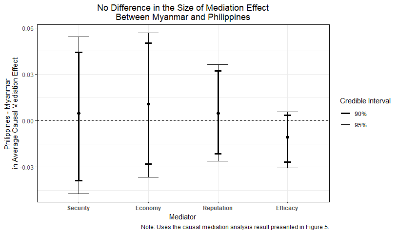
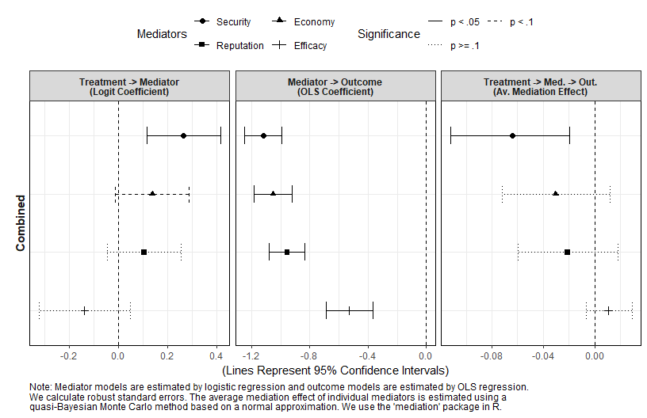
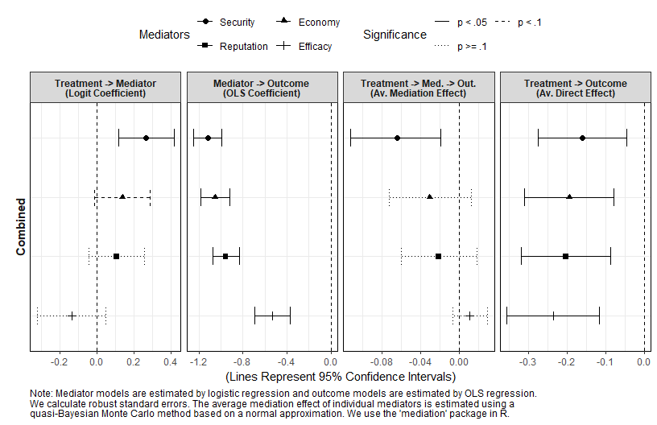
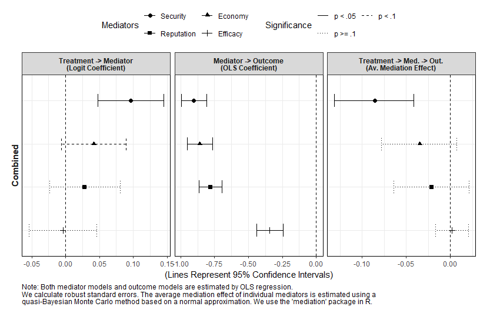
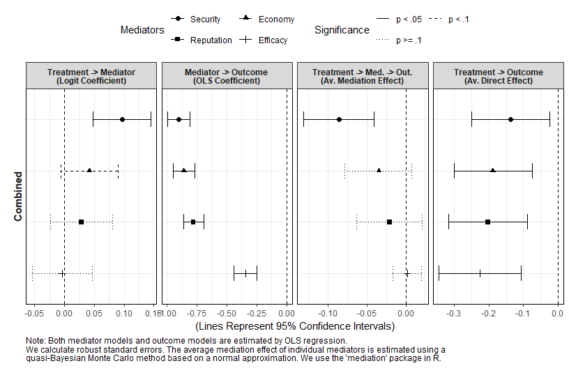

Analysis 5: Additional Checks
================
Gento Kato
November 20, 2019

-   [Preparation](#preparation)
-   [Testing the difference between Myanmar and Philippines (Appendix V)](#testing-the-difference-between-myanmar-and-philippines-appendix-v)
-   [Mediation Analysis with Myanmar and Philippines Conditions Combined (Appendix VI)](#mediation-analysis-with-myanmar-and-philippines-conditions-combined-appendix-vi)
    -   [Simple Mediation with Binary Mediators (Mediation Model is Logit)](#simple-mediation-with-binary-mediators-mediation-model-is-logit)
    -   [Simple Mediation with 5-cat Mediators (Mediation Model is OLS)](#simple-mediation-with-5-cat-mediators-mediation-model-is-ols)
    -   [Mediation Analysis (mediator model is Logit, outcome model is OLS)](#mediation-analysis-mediator-model-is-logit-outcome-model-is-ols)
    -   [Mediation Analysis (mediator model is OLS, outcome model is OLS)](#mediation-analysis-mediator-model-is-ols-outcome-model-is-ols)

Preparation
===========

``` r
## Clear Workspace
rm(list = ls())

## Set Working Directory (Automatically) ##
require(rprojroot); require(rstudioapi)
if (rstudioapi::isAvailable()==TRUE) {
  setwd(dirname(rstudioapi::getActiveDocumentContext()$path)); 
} 
projdir <- find_root(has_file("thisishome.txt"))
#cat(paste("Working Directory Set to:\n",projdir))
setwd(projdir)

## Required Functions & Packages
source("src/analysis0_functions.R", encoding = "CP932")
source("src/cl.mlogit.R")

## Load Data
do <- readRDS("data/donorexp.rds")
d <- do[do$comply==1,] # only compliers

## Subset Data
# MMR
d.MMR <- d[d$treatment %in% c(1,2),]
d.MMR$threat <- d.MMR$threat.MMR
d.MMR$imp <- d.MMR$imp.MMR
d.MMR$potential <- d.MMR$potential.MMR
# PHL
d.PHL <- d[d$treatment %in% c(3,5),]
d.PHL$threat <- d.PHL$threat.PHL
d.PHL$imp <- d.PHL$imp.PHL
d.PHL$potential <- d.PHL$potential.PHL

## All Data
d.ALL <- rbind(d.MMR,d.PHL)
# Make sure that the data is combined correctly
table(d.ALL$treat_MMR,d.ALL$treat_PHL)
```

    ##    
    ##        0    1
    ##   0    0 1876
    ##   1 1833    0

``` r
nrow(d.MMR)
```

    ## [1] 1833

``` r
nrow(d.PHL)
```

    ## [1] 1876

Testing the difference between Myanmar and Philippines (Appendix V)
===================================================================

Load Mediation analysis results (Generated in Analysis 3 Codes)

``` r
load(paste0(projdir,"/src/processing/analysis3_mediation_results.RData"))
```

Confidence Intervals of difference between two countries

``` r
## Security
a <- as.numeric(med.out.MMR.main$med.out[[2]]$d1.sims) - 
  as.numeric(med.out.PHL.main$med.out[[2]]$d1.sims)
dif_secu <- c(mean(a),quantile(a, probs=c(0.025,0.05,0.50,0.95,0.975)))

## Economy
a <- as.numeric(med.out.MMR.main$med.out[[1]]$d1.sims) - 
  as.numeric(med.out.PHL.main$med.out[[1]]$d1.sims)
dif_econ <- c(mean(a),quantile(a, probs=c(0.025,0.05,0.50,0.95,0.975)))

## Reputation
a <- as.numeric(med.out.MMR.main$med.out[[3]]$d1.sims) - 
  as.numeric(med.out.PHL.main$med.out[[3]]$d1.sims)
dif_repu <- c(mean(a),quantile(a, probs=c(0.025,0.05,0.50,0.95,0.975)))

## Efficacy
a <- as.numeric(med.out.MMR.main$med.out[[4]]$d1.sims) - 
  as.numeric(med.out.PHL.main$med.out[[4]]$d1.sims)
dif_effi <- c(mean(a),quantile(a, probs=c(0.025,0.05,0.50,0.95,0.975)))

## Combine them into a dataset
dif_dat <- as.data.frame(rbind(dif_secu,dif_econ,dif_repu,dif_effi))
names(dif_dat) <- c("mean","lo95","lo90","median","up90","up95")
dif_dat$cat <- c("Security","Economy","Reputation","Efficacy")
dif_dat$cat <- factor(dif_dat$cat, levels=unique(dif_dat$cat))

## Plotting Result
p <- ggplot(dif_dat, aes(x=cat,y=mean)) + 
  geom_hline(aes(yintercept=0), linetype=2) + 
  geom_point(size=2) + 
  geom_errorbar(aes(ymin=lo95,ymax=up95,size="95%"), width=0.3) + 
  geom_errorbar(aes(ymin=lo90,ymax=up90,size="90%"), width=0.1) + 
  scale_size_manual(name="Credible Interval",
                    values = c(1.2,0.5)) + 
  xlab("Mediator") + ylab("Philippines - Myanmar \nin Average Causal Mediation Effect") + 
  ggtitle("No Difference in the Size of Mediation Effect\nBetween Myanmar and Philippines") + 
  labs(caption="Note: Uses the causal mediation analysis result presented in Figure 5.") + 
  theme_bw() + 
  theme(plot.title = element_text(hjust = 0.5),
        axis.text.x = element_text(face="bold"),
        panel.border = element_rect(color="black"),
        plot.caption = element_text(hjust=1))
```

``` r
grid.draw(p)
```



``` r
png_save(p,w=850,h=500,file="out/nodifacme.png")
```

Mediation Analysis with Myanmar and Philippines Conditions Combined (Appendix VI)
=================================================================================

``` r
# Update Control Variable Formula to Include Target Country
fcv <- formula(. ~ . + threat + imp + potential + issint + odaimp + 
                 fem + age + ide3 + treat_PHL)
```

Simple Mediation with Binary Mediators (Mediation Model is Logit)
-----------------------------------------------------------------

``` r
med.out.ALL.main <- gen.med.out(d.ALL,"cancel_aid",1000,
                                "src/processing/med.out.ALL.main.RData",
                                models=c("logit","gaussian"),
                                medcats=2)
```

Simple Mediation with 5-cat Mediators (Mediation Model is OLS)
--------------------------------------------------------------

``` r
med.out.ALL.sub <- gen.med.out(d.ALL,"cancel_aid",1000,
                               "src/processing/med.out.ALL.sub.RData",
                               models=c("gaussian","gaussian"))
```

Mediation Analysis (mediator model is Logit, outcome model is OLS)
------------------------------------------------------------------

``` r
# Plotting Data (Slightly tricky, since using the pre-made function)
med.out.main.data <- gendata(med.out.ALL.main,med.out.PHL.main,mod=FALSE)
med.out.main.data <- med.out.main.data[med.out.main.data$country=="Myanmar",]
med.out.main.data$country <- as.factor(rep("Combined",nrow(med.out.main.data)))

# Prepare Caption
captiontxt <- 
  "Note: Mediator models are estimated by logistic regression and outcome models are estimated by OLS regression.
We calculate robust standard errors. The average mediation effect of individual mediators is estimated using a 
quasi-Bayesian Monte Carlo method based on a normal approximation. We use the 'mediation' package in R."

# W/O Direct Effect
p <- genplot(med.out.main.data,
             captiontxt=captiontxt,
             include.eff = c("Treatment -> Mediator",
                             "Mediator -> Outcome",
                             "Treatment -> Med. -> Out."),
             est.type = c("Logit Coefficient",
                          "OLS Coefficient",
                          "Av. Mediation Effect")) 
```

``` r
p
```



``` r
png_save(p, w=850, h=550, file=c("out/med.out.ALL.main.plot.woDE.png"))
```

``` r
# W/ Direct Effect
p <- genplot(med.out.main.data,
             captiontxt=captiontxt,
             include.eff = c("Treatment -> Mediator",
                             "Mediator -> Outcome",
                             "Treatment -> Med. -> Out.",
                             "Treatment -> Outcome"),
             est.type = c("Logit Coefficient",
                          "OLS Coefficient",
                          "Av. Mediation Effect",
                          "Av. Direct Effect")) 
```

``` r
p
```



``` r
png_save(p, w=850, h=550, file=c("out/med.out.ALL.main.plot.wDE.png"))
```

Mediation Analysis (mediator model is OLS, outcome model is OLS)
----------------------------------------------------------------

``` r
# Plotting Data (Slightly tricky, since using the pre-made function)
med.out.sub.data <- gendata(med.out.ALL.sub,med.out.PHL.sub,mod=FALSE)
med.out.sub.data <- med.out.sub.data[med.out.sub.data$country=="Myanmar",]
med.out.sub.data$country <- as.factor(rep("Combined",nrow(med.out.sub.data)))

# Prepare Caption
captiontxt <- 
  "Note: Both mediator models and outcome models are estimated by OLS regression. 
We calculate robust standard errors. The average mediation effect of individual mediators is estimated using a 
quasi-Bayesian Monte Carlo method based on a normal approximation. We use the 'mediation' package in R."

# W/O Direct Effect
p <- genplot(med.out.sub.data,
             captiontxt=captiontxt,
             include.eff = c("Treatment -> Mediator",
                             "Mediator -> Outcome",
                             "Treatment -> Med. -> Out."),
             est.type = c("Logit Coefficient",
                          "OLS Coefficient",
                          "Av. Mediation Effect")) 
```

``` r
p
```



``` r
png_save(p, w=850, h=550, file=c("out/med.out.ALL.sub.plot.woDE.png"))
```

``` r
# W/ Direct Effect
p <- genplot(med.out.sub.data,
             captiontxt=captiontxt,
             include.eff = c("Treatment -> Mediator",
                             "Mediator -> Outcome",
                             "Treatment -> Med. -> Out.",
                             "Treatment -> Outcome"),
             est.type = c("Logit Coefficient",
                          "OLS Coefficient",
                          "Av. Mediation Effect",
                          "Av. Direct Effect")) 
```

``` r
p
```



``` r
png_save(p, w=850, h=550, file=c("out/med.out.ALL.sub.plot.wDE.png"))
```
